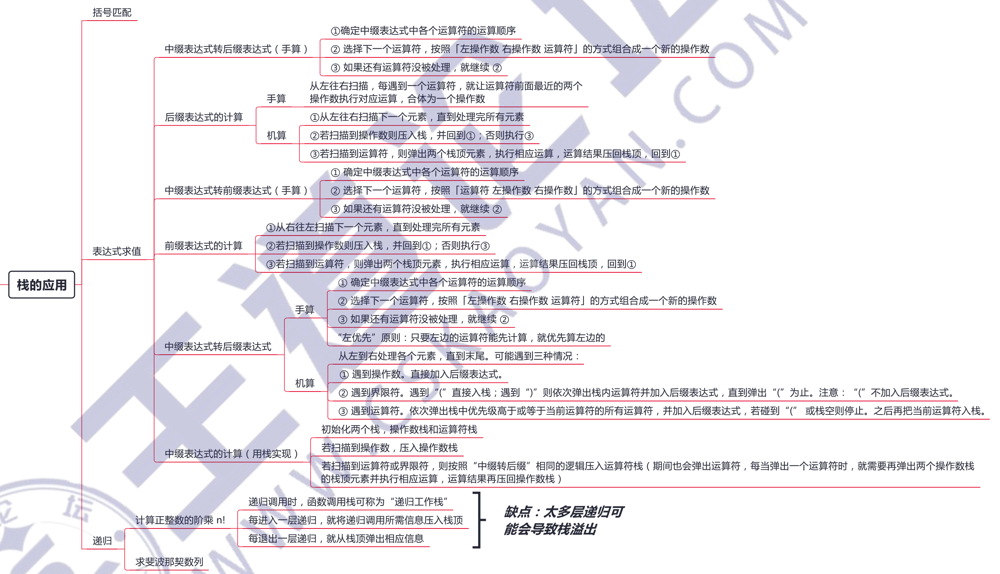
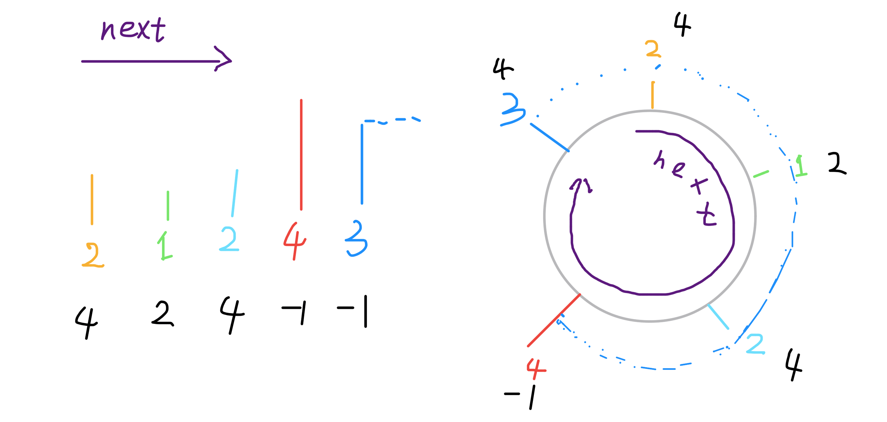
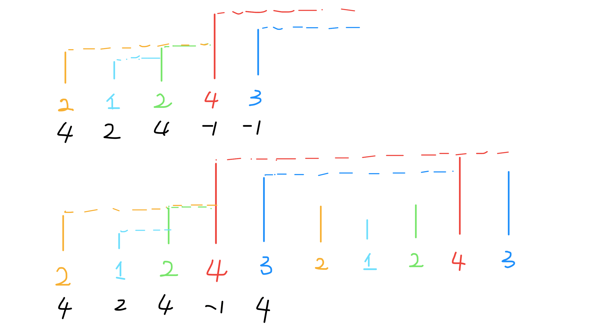

# 栈（stack）

## 一、概念


栈中存储的元素满足“后进先出（简称LIFO）”的准则。

stack 每次只能访问适配器中位于最顶端的元素，也只有移除 stack 顶部的元素之后，才能访问位于栈中的元素。



### 应用

#### 1、括号匹配

假设表达式中允许包含两种括号：圆括号和方括号，其嵌套的顺序任意即(()[])或[([])]等均为正确的格式，([)]或([())或(()]均为不正确的格式。

**算法的思想**:

- 初始设置一个空栈，顺序读入括号
- 若是右括号，使置于栈顶的最急迫期待得以消解，或者是不合法的情况（括号序列不匹配），退出程序
- 若是左括号，则作为一个新的更急迫的期待压入栈中，自然使原有的在栈中的所有末消解的期待的急迫性降了一级。
- 算法结束时，栈为空，否则括号序列不匹配。

#### 2、表达式求值

表达式求值是程序设计语言编译中一个最基本的问题，它的实现是栈应用的一个典型范例。

中缀表达式不仅依赖运算符的优先级，而且还要处理括号。

后缀表达式的运算符在操作数后面，在后缀表达式中己考虑了运算符的优先级，没有括号，只有操作数和运算符。

中缀表达式 `A + B * (C - D) - E / F` 所对应的后级表达式为 `ABCD-*+EF/-`


#### 3、栈在递归中的应用

递归是一种重要的程序设计方法。简单地说，若在一个函数、过程或数据结构的定义中又应用了它自身，则这个函数、过程或数据结构称为是递归定义的，简称递归。

它通常把一个大型的复杂问题层层转化为一个与原问题相似的规模较小的问题来求解，递归策略只需少量的代码就可以描述出解题过程所需要的多次重复计算，**大大减少了程序的代码量**。但在通常情况下，它的**效率并不是太高**。

其必须满足下面的两个条件：

- 递归表达式（递归体）
- 边界条件（递归出口）

**递归的精髓在于能否将原始问题转换为属性相同但规模较小的问题**

在递归调用的过程中，**系统为每一层的返回点、局部变量、传入实参等开辟了递归工作栈来进行数据存储**，递归次数过多容易造成栈滥出等。而其效率不高的原因是递归调用过程中**包含很多重复的计算**。

## 二、单调栈

参考：[单调栈和应用实践](https://www.jianshu.com/p/6bbd3653a57f)

单调栈分为「单调递增栈」和「单调递减栈」，特性是栈内的顺序与原数组的顺序一样

单增、单减描述的是从「栈顶至栈底」的大小变化，例如 [1,2,3,4,5] 为单调递减栈，[5,4,3,2,1] 为单调递增栈

如下图，分别插入6,10,3,7,4,12的时候，单调递增栈和单调递减栈的情况分别是样子的


应用：

- 单调递增栈：表示如栈元素左边第一个比它「大」的元素
- 单调递减栈：表示如栈元素左边第一个比它「小」的元素

以单调递减栈为例（栈内元素从左到右是）：

- 如果新的元素比栈顶元素大，就入栈
- 如果新的元素较小，那就一直把栈内元素弹出来，直到栈顶比新元素小，然后新元素入栈

**模版**

```cpp
stack<int> st;
for(int i = 0; i < nums.size(); i++)
{
	while(!st.empty() && nums[i] < st.top())
	{
		st.pop();
	}
	st.push(nums[i]);
}
```

一般会使用加入前后哨兵的模版，有几个细节

- 在缓存数据的时候，是从左向右缓存的，
- 计算出一个结果的顺序是从右向左的（while中），并且计算完成以后我们就不再需要了，符合后进先出的特点

```cpp
nums.insert(nums.begin(), 0);  // 第一个元素为添0，可以避免栈为空的情况，下面的while不用判断 !st.empty()，0可看作是所有元素中最小的值
nums.push_back(0);             // 最后一个元素添0，是为了触发最后一个单调栈开始收缩
vector<int> st = {0};          // 第一个元素0，先入栈，是为了while里面的 st.back() 第一次能取到值
for (int i = 1; i < nums.size(); i++) {
    // 此时i指向新元素，当新元素小于此时的栈顶（i-1）时，单调栈开始收缩，
    // 第一个老栈顶肯定为i-1，也是最初栈里面的最高点，否则不符合逻辑
    while (nums[i] < nums[st.back()]) {
        int curHeight = nums[st.back()];
        st.pop_back();
    }
    st.push_back(i);
}

```

### 1、移除问题-单调栈

移出 k 个元素，使剩下的数组最大/最小

核心思路是：对于两个数 `1 2 3 a _ _ _` 和 `1 2 3 b _ _ _`

- 如果 a > b， 那么 `123a___` 大于 `123b___`
- 否则，那么 `123a___` 小于等于 `123b___`

**两个「相同位数」的数字大小关系取决于「第一个不同」的数的大小**

[402. 移掉 K 位数字](https://leetcode-cn.com/problems/remove-k-digits/) (中等)

[321. 拼接最大数](https://leetcode-cn.com/problems/create-maximum-number/) (困难)

[316. 去除重复字母](https://leetcode-cn.com/problems/remove-duplicate-letters/) (困难)

[1081. 不同字符的最小子序列](https://leetcode-cn.com/problems/smallest-subsequence-of-distinct-characters/) （中等）

### 2、Next Greater Number 一类问题

来源：[单调栈解决 Next Greater Number 一类问题 - 下一个更大元素 I - 力扣（LeetCode）](https://leetcode.cn/problems/next-greater-element-i/solution/dan-diao-zhan-jie-jue-next-greater-number-yi-lei-w/)

[496.下一个更大元素I](https://leetcode-cn.com/problems/next-greater-element-i)

[503.下一个更大元素II](https://leetcode-cn.com/problems/next-greater-element-ii)

[1118.一月有多少天](https://leetcode-cn.com/problems/number-of-days-in-a-month)

栈（stack）是很简单的一种数据结构，先进后出的逻辑顺序，符合某些问题的特点，比如说函数调用栈。

单调栈实际上就是栈，只是利用了一些巧妙的逻辑，使得每次新元素入栈后，栈内的元素都保持有序（单调递增或单调递减）。

听起来有点像堆（heap）？不是的，单调栈用途不太广泛，只处理一种典型的问题，叫做 Next Greater Element。本文用讲解单调队列的算法模版解决这类问题，并且探讨处理「循环数组」的策略。

#### 1）Next Greater Number 原始问题（栈存值）

首先，讲解 Next Greater Number 的原始问题：给你一个数组，返回一个等长的数组，对应索引存储着下一个更大元素，如果没有更大的元素，就存 -1。不好用语言解释清楚，直接上一个例子：

给你一个数组 [2,1,2,4,3]，你返回数组 [4,2,4,-1,-1]。

解释：第一个 2 后面比 2 大的数是 4; 1 后面比 1 大的数是 2；第二个 2 后面比 2 大的数是 4; 4 后面没有比 4 大的数，填 -1；3 后面没有比 3 大的数，填 -1。

这道题的暴力解法很好想到，就是对每个元素后面都进行扫描，找到第一个更大的元素就行了。但是暴力解法的时间复杂度是 O(n^2)。

这个问题可以这样抽象思考：把数组的元素想象成并列站立的人，元素大小想象成人的身高。这些人面对你站成一列，如何求元素「2」的 Next Greater Number 呢？很简单，如果能够看到元素「2」，那么他后面可见的第一个人就是「2」的 Next Greater Number，因为比「2」小的元素身高不够，都被「2」挡住了，第一个露出来的就是答案。


这个情景很好理解吧？带着这个抽象的情景，先来看下代码。

```cpp
vector<int> nextGreaterElement(vector<int>& nums) {
    vector<int> ans(nums.size()); // 存放答案的数组
    stack<int> s;
    for (int i = nums.size() - 1; i >= 0; i--) { // 倒着往栈里放
        while (!s.empty() && s.top() <= nums[i]) { // 判定个子高矮
            s.pop(); // 矮个起开，反正也被挡着了。。。
        }
        ans[i] = s.empty() ? -1 : s.top(); // 这个元素身后的第一个高个
        s.push(nums[i]); // 进队，接受之后的身高判定吧！
    }
    return ans;
}
```

这就是单调队列解决问题的模板。for 循环要从后往前扫描元素，因为我们借助的是栈的结构，倒着入栈，其实是正着出栈。while 循环是把两个“高个”元素之间的元素排除，因为他们的存在没有意义，前面挡着个“更高”的元素，所以他们不可能被作为后续进来的元素的 Next Great Number 了。

这个算法的时间复杂度不是那么直观，如果你看到 for 循环嵌套 while 循环，可能认为这个算法的复杂度也是 O(n^2)，但是实际上这个算法的复杂度只有 O(n)。

分析它的时间复杂度，要从整体来看：总共有 n 个元素，每个元素都被 push 入栈了一次，而最多会被 pop 一次，没有任何冗余操作。所以总的计算规模是和元素规模 n 成正比的，也就是 O(n) 的复杂度。

#### 2）Next Greater Number 的距离（栈存索引）

现在，你已经掌握了单调栈的使用技巧，来一个简单的变形来加深一下理解。

给你一个数组 T = [73, 74, 75, 71, 69, 72, 76, 73]，这个数组存放的是近几天的天气气温（这气温是铁板烧？不是的，这里用的华氏度）。你返回一个数组，计算：对于每一天，你还要至少等多少天才能等到一个更暖和的气温；如果等不到那一天，填 0 。

举例：给你 T = [73, 74, 75, 71, 69, 72, 76, 73]，你返回 [1, 1, 4, 2, 1, 1, 0, 0]。

解释：第一天 73 华氏度，第二天 74 华氏度，比 73 大，所以对于第一天，只要等一天就能等到一个更暖和的气温。后面的同理。

你已经对 Next Greater Number 类型问题有些敏感了，这个问题本质上也是找 Next Greater Number，只不过现在不是问你 Next Greater Number 是多少，而是问你当前距离 Next Greater Number 的距离而已。

相同类型的问题，相同的思路，直接调用单调栈的算法模板，稍作改动就可以啦，直接上代码把。

```cpp
vector<int> dailyTemperatures(vector<int>& T) {
    vector<int> ans(T.size());
    stack<int> s; // 这里放元素索引，而不是元素
    for (int i = T.size() - 1; i >= 0; i--) {
        while (!s.empty() && T[s.top()] <= T[i]) {
            s.pop();
        }
        ans[i] = s.empty() ? 0 : (s.top() - i); // 得到索引间距
        s.push(i); // 加入索引，而不是元素
    }
    return ans;
}
```

#### 3）处理「循环数组」

单调栈讲解完毕。下面开始另一个重点：如何处理「循环数组」。

同样是 Next Greater Number，现在假设给你的数组是个环形的，如何处理？

给你一个数组 [2,1,2,4,3]，你返回数组 [4,2,4,-1,4]。拥有了环形属性，最后一个元素 3 绕了一圈后找到了比自己大的元素 4 。



首先，计算机的内存都是线性的，没有真正意义上的环形数组，但是我们可以模拟出环形数组的效果，一般是通过 % 运算符求模（余数），获得环形特效：

```cpp
int[] arr = {1,2,3,4,5};
int n = arr.length, index = 0;
while (true) {
    print(arr[index % n]);
    index++;
}
```

回到 Next Greater Number 的问题，增加了环形属性后，问题的难点在于：这个 Next 的意义不仅仅是当前元素的右边了，有可能出现在当前元素的左边（如上例）。

明确问题，问题就已经解决了一半了。我们可以考虑这样的思路：将原始数组“翻倍”，就是在后面再接一个原始数组，这样的话，按照之前“比身高”的流程，每个元素不仅可以比较自己右边的元素，而且也可以和左边的元素比较了。



怎么实现呢？你当然可以把这个双倍长度的数组构造出来，然后套用算法模板。但是，我们可以不用构造新数组，而是利用循环数组的技巧来模拟。直接看代码吧：

```cpp
vector<int> nextGreaterElements(vector<int>& nums) {
    int n = nums.size();
    vector<int> res(n); // 存放结果
    stack<int> s;
    // 假装这个数组长度翻倍了
    for (int i = 2 * n - 1; i >= 0; i--) {
        while (!s.empty() && s.top() <= nums[i % n])
            s.pop();
        res[i % n] = s.empty() ? -1 : s.top();
        s.push(nums[i % n]);
    }
    return res;
}
```
