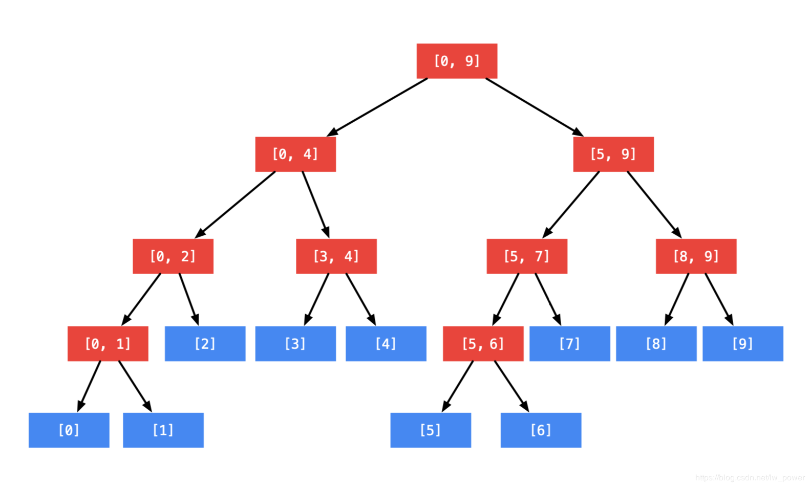
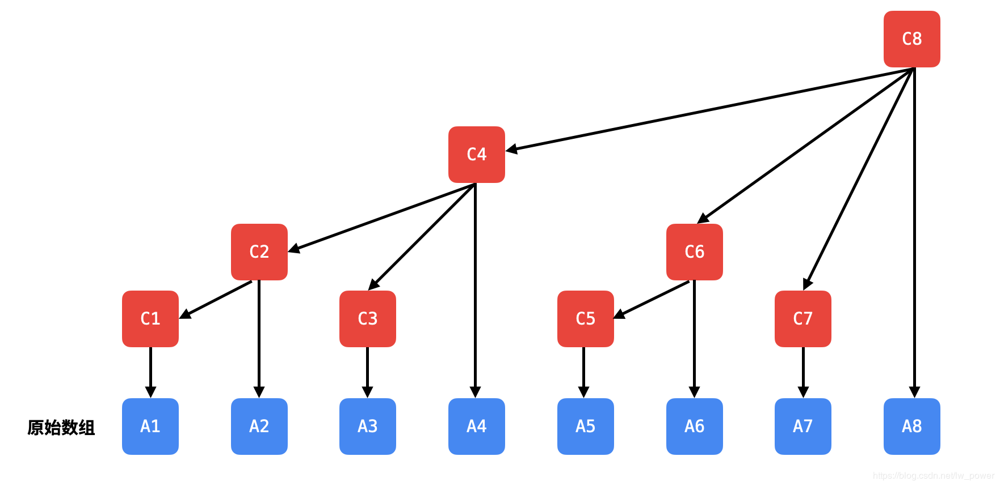
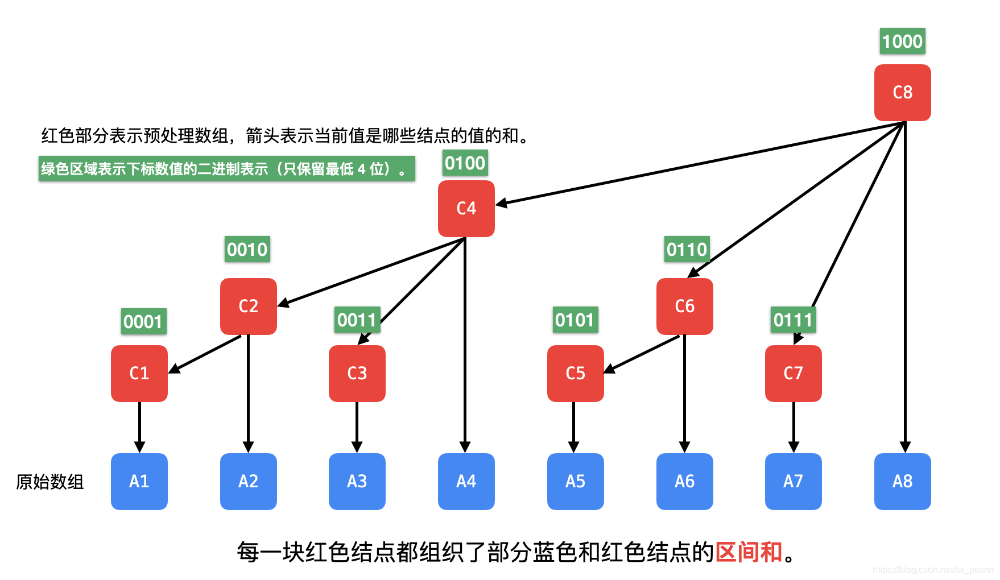

# 树状数组

来源1：https://leetcode-cn.com/problems/count-of-smaller-numbers-after-self/solution/shu-zhuang-shu-zu-by-liweiwei1419/

来源2：https://leetcode-cn.com/problems/range-sum-query-mutable/solution/guan-yu-ge-lei-qu-jian-he-wen-ti-ru-he-x-41hv/

来源3：https://oi-wiki.org/ds/fenwick/

来源4：https://oi-wiki.org/ds/seg/

**树状数组**或**二叉索引树**（英语：Binary Indexed Tree），又以其发明者命名为Fenwick树，最早由Peter M. Fenwick于1994年以A New Data Structure for Cumulative Frequency Tables为题发表在SOFTWARE PRACTICE AND EXPERIENCE。其初衷是解决数据压缩里的累积频率（Cumulative Frequency）的计算问题，现多用于高效计算数列的前缀和， 区间和。

## 一、概述

### 1、概念

**维护 区间信息 的数据结构有：前缀和、差分数组、树状数组、线段数**

我们知道前缀和就可以求区间和，这是因为不同规模的区间和有重复的部分，相减以后就得到了区间和。

「前缀和」数组的思路是：将原始数组进行预处理，将来需要查询数据的时候，只需要查询预处理数组的某些值即可。

要优化「修改操作」造成的线性时间复杂度，**预处理数据组织成线性结构（前缀和数组）肯定是不行的**，因此一种方案是把预处理的数据组织成「树形结构」，有两种数据结构：

- 线段树：高效处理单点修改、区间修改、区间查询（区间求和，求区间最大值，求区间最小值）等操作
- 树状数组：高效处理「前缀和」查询，单点修改。

**「线段树」和「树状数组」一样，都是对原始输入数组进行了预处理，使得在真正需要查询数据的时候，我们只需要看「预处理数组」的部分信息即可，由于组织成树形结构，「修改」和「查询」的时间复杂度都是 O(logN)**

注意：「线段树」和「树状数组」不能处理输入数组的长度有增加或者减少的情况。

| 数据结构 \ 操作 | 单点修改 | 区间查询 |
| --------------- | -------- | -------- |
| 前缀和          | O(n)     | O(1)     |
| 树状数组        | O(logn)  | O(logn)  |
| 线段数          | O(logn)  | O(logn)  |

### 2、选择方案

| 题目                                 | 优先方案                         | 可用方案                 |
| ------------------------------------ | -------------------------------- | ------------------------ |
| 数组不变，求区间和                   | 前缀和                           | 前缀和、树状数组、线段树 |
| 多次修改某个数，求区间和             | 树状数组                         | 树状数组、线段树         |
| 多次整体修改某个区间，求区间和       | 树状数组（看修改区间的数据范围） | 线段树、树状数组         |
| 多次将某个区间变成同一个数，求区间和 | 线段树                           | 线段树、树状数组         |
| 区间的变化相同的量                   | 差分数组                         | 差分数组                 |

「线段树」代码很长，而且常数很大，实际表现不算很好。只有在不得不用的时候才考虑「线段树」

「树状数组」的代码要比「线段树」短，思维更清晰，速度也更快，在解决一些单点修改的问题时，「树状数组」是不二之选

### 3、树形结构

- 线段树是一棵二叉树

红色部分表示预处理数组，蓝色部分是原始输入数组，箭头表示当前值是哪些结点的值的和。



- 树状数组是多叉树

红色部分表示预处理数组，蓝色部分是原始输入数组，箭头表示当前值是哪些结点的值的和。



## 二、树状数组

「树状数组」也叫 Binary Indexed Tree，二进制索引树，很好地表示了「树状数组」处理数据的思路：「树状数组」里某个元素管理了原始输入数组多少数据是由下标决定的。

**用于：高效地解决「前缀和查询」与「单点更新」问题**

思想：空间换时间

### 1、如何组织原始输入数据的结构？

和「堆」一样，树状数组的 0 号下标不放置元素，**从 1 号下标开始使用**。从上图可以观察到，与数组 C 的某个结点有关的数组 A 的某些结点，它们的下标之间有如下关系。

| 数组 `C` 的值由数组 `A` 的哪些元素而来 | 数组 `A` 的元素个数 |
| -------------------------------------------------- | ------------------------- |
| C[1] = A[1] | 1 |
| C[2] = A[1] + A[2] | 2 |
| C[3] = A[3] | 1 |
| C[4] = A[1] + A[2] + A[3] + A[4] | 4 |
| C[5] = A[5] | 1 |
| C[6] = A[5] + A[6] | 2 |
| C[7] = A[7] | 1 |
| C[8] = A[1] + A[2] + A[3] + A[4] + A[5] + A[6] + A[7] + A[8] | 8 |

这件事情是由下标数值的二进制决定的，把下标写成二进制的形式，**最低位的 1 以及后面的 0 表示了预处理数组 C 管理了多少输入数组 A 的元素**。我们看一下下面的图：



例如：6 的二进制表示为 0110，这里只保留最低 4 位。将 6 进行二级制分解得到：
$$
6 = 1 \times 2^2 + 1 \times 2^1
$$
**最后的这部分 `2^1` 决定了 C[6] 管理了多少个输入数组 A 的数据，因为最后面的 1 后面有 1 个 0**，算下来是 2 个，即从下标 6 开始（包括 6）向前数 2 个数，因此 C[6] = A[5] +A[6]，其它同理。

这就是开头所说的：「树状数组」里某个元素管理了原始输入数组多少数据是由下标决定的。

我们看到：

- 「树状数组」组织成的树是有层级的，**下标的二进制表示的最低位 1 后面的 0 的个数决定了，当前结点在第几层**；
- 这样组织数据，**从叶子结点到父结点是可以通过一个叫做 lowbit 的函数计算出来，并且可以知道小于等于当前下标的同一层结点的所有结点**

### 2、lowbit 函数

这样命名的含义是截取一个正整数的二进制表示里的最低位的 1 和它后面的所有的 0。

返回的值可用作，若当前下标为 i 

- C[i] 由 lowbit(i) 个 A 中元素组成
- C[i] 的父亲为 C[i+lowbit(i)]

lowbit 的定义如下：
$$
lowbit(x) = x \ \& \ (-x)
$$

```cpp
int lowbit(int idx) {
    // idx 为树状数组下标
    return idx & (-idx);
}
```

说明：

- 这里 x 一定是正整数，即 x >= 1；
- 这里 & 表示按位与运算；
- -x 也可以写成 (~x + 1) ，这里 ~ 表示「按位取反」。这是负数的定义，负数用补码表示，它的值等于这个负数的绝对值按位取反以后再加 1

```
lowbit(x) = x & (~x + 1)
```

lowbit 运算解释：

- 先「按位取反」正好让最低位的 1 变成 0，最低位的 1 后面的 0 变成 1，最低位的 1 前面的 1 变成 0，0 变成 1；
- 再加 1 使得低位的 1 全变成 0，原来变成 0 的 1 由于进位又变回了 1；
- 再与原二进制按位与运算，正好就留下了一个 1。

例1：计算下标是 8，返回 8

| 步骤                                      | 二进制表示                            |
| ----------------------------------------- | ------------------------------------- |
| 第 1 步：写出 8 的二进制表示；            | `00000000 00000000 00000000 00001000` |
| 第 2 步：将 8 的二进制表示按位取反；      | `11111111 11111111 11111111 11110111` |
| 第 3 步：再加 1                           | `11111111 11111111 11111111 11111000` |
| 第 4 步：第一步和第三部的二进制按位与运算 | `00000000 00000000 00000000 00001000` |

例2：计算下标是 6，返回 2

| 步骤                                      | 二进制表示                            |
| ----------------------------------------- | ------------------------------------- |
| 第 1 步：写出 6 的二进制表示；            | `00000000 00000000 00000000 00000110` |
| 第 2 步：将 6 的二进制表示按位取反；      | `11111111 11111111 11111111 11111001` |
| 第 3 步：再加 1                           | `11111111 11111111 11111111 11111010` |
| 第 4 步：第一步和第三部的二进制按位与运算 | `00000000 00000000 00000000 00000010` |

#### 负数和补码的相关知识

若计算机底层存储整数使用 32 位；最高位表示符号位：1 表示负数， 0 表示正数；负数使用补码表示

**「补码」按照如下规则定义**

- 正数的补码是它自己；
- 负数的补码是它对应正整数按位取反以后再加 1

这样设计的好处是：**符号位参与计算，并且保证了结果正确**

例1：计算 -5 的二进制表示

| 步骤                                 | 二进制表示                            |
| ------------------------------------ | ------------------------------------- |
| 第 1 步：写出 5 的二进制表示；       | `00000000 00000000 00000000 00000101` |
| 第 2 步：将 5 的二进制表示按位取反； | `11111111 11111111 11111111 11111010` |
| 第 3 步：在第 2 步的基础上再加 1。   | `11111111 11111111 11111111 11111011` |

例 2：计算 16 - 8

计算 16 - 8，直接加，高位溢出，但不影响结果

| 步骤                            | 二进制表示                            |
| ------------------------------- | ------------------------------------- |
| 第 1 步：写出 16 的二进制表示； | `00000000 00000000 00000000 00010000` |
| 第 2 步：写出 -8 的二进制表示； | `11111111 11111111 11111111 11111000` |
| 第 3 步：计算 16 - 8 = 8        | `00000000 00000000 00000000 00001000` |

### 3、单点更新

若对原始数组进行单点更新，arr[idx] += delta;

则对树状数组的相应位置进行更新，tree[idx+1] += delta;

- 「单点更新」从孩子结点到父亲结点，沿途所有的结点都需要更新；
- **从孩子结点到父亲结点，就是不断加上当前下标的 `lowbit` 值，产生进位**。

```java
/**
 * 单点更新
 *
 * @param i     原始数组索引 i
 * @param delta 变化值 = 更新以后的值 - 原始值
 */
public void update(int i, int delta) {
    // 从下到上更新，注意，预处理数组，比原始数组的 len 大 1，故 预处理索引的最大值为 len
    while (i <= len) {
        tree[i] += delta;
        i += lowbit(i);
    }
}

public static int lowbit(int x) {
    return x & (-x);
}
```

例如：更新原始数组中下标为 i=6 的元素 A6

tree[6] += delta， 树状数组 C6 加上变化量

6 + lowbit(6)，i 更新为 8（6+2）

tree[8] += delta， 树状数组 C8 加上变化量

8 + lowbit(8)，i 更新为 16（8+8），跳出循环

### 4、前缀和查询

我们使用记号 preSum[7] 表示查询 A[1] + A[2] + ... + A[7]，7 的二进制为 0111
$$
7 = 1\times2^2 \ + \ 1\times2^1 \ + \ 1\times2^0
$$
可以看成 0100（4）、0010（2）、0001（1） 这 3 部分之和，分别表示 4 个元素 + 2 个元素 + 1 个元素，正好是 lowbit 值一直减，减到 00 为止，**每减去一个 lowbit 值，消去一个 1**。

sum += tree[7]，sum 加上 C[7]

7 - lowbit(7)，i 更新为 6（7-1）

sum += tree[6]，sum 加上 C[6]

6 - lowbit(6)，i 更新为 4（6-2）

sum += tree[4]，sum 加上 C[4]

4 - lowbit(4)，i 更新为 0（4-4），跳出循环

此时：

sum = C[7] + C[6] + C[4] = A[7] + A[6] + A[5] + A[4] + A[3] + A[2] + A[1]

```java
/**
 * 查询前缀和
 *
 * @param i 前缀的最大索引，即查询区间 [0, i] 的所有元素之和
 */
public int query(int i) {
    // 从右到左查询
    int sum = 0;
    while (i > 0) {
        sum += tree[i];
        i -= lowbit(i);
    }
    return sum;
}
```

### 5、树状数组的初始化

初始化前缀和数组应该交给调用者来决定。下面是一种初始化的方式。

树状数组的初始化可以通过「单点更新」来实现，因为最开始的时候，数组的每个元素的值都为 0，每个都对应地加上原始数组的值，就完成了预处理数组 C 的创建。

这里要特别注意，update 操作的第 2 个参数是一个变化值，而不是变化以后的值。因为我们的操作是逐层向上汇报，汇报变更值会让我们的操作更加简单。

```java
public FenwickTree(int[] nums) {
    this.len = nums.length + 1;
    tree = new int[this.len + 1];
    for (int i = 1; i <= len; i++) {
        update(i, nums[i]);
    }
}
```

## 三、树状数组模版

n 为原始数组的元素个数

idx 为从 1 开始计，0 号下标不用

### c++

```cpp
class FenwickTree {
public:
    int size;
    vector<int> tree;

    FenwickTree(int n) {
        size = n;
        tree.resize(size + 1, 0);
    }
    int lowbit(int idx) {
        // idx 为树状数组下标
        return idx & (-idx);
    }
    void add(int idx, int delta) {
        // 单点更新，从前往后，idx 为树状数组下标
        // delta 为变化量，如果已知需要变化的值val，传入 val - 原始数组[idx-1]
        while (idx < size + 1) {
            tree[idx] += delta;
            idx += lowbit(idx);
        }
    }
    int query(int idx) {
        // 查询前缀和，从后往前，idx 为树状数组下标
        int sum = 0;
        while (idx > 0) {
            sum += tree[idx];
            idx -= lowbit(idx);
        }
        return sum;
    }
    int sumRange(int left, int right) {
        // left, right 为树状数组下标
        int preLeft = query(left - 1);
        int preRight = query(right);
        return preRight - preLeft;
    }
};
```

### python

```python
class FenwickTree:
    def __init__(self, n):
        self.size = n
        self.tree = [0 for _ in range(n + 1)]

    def __lowbit(self, idx):
        return idx & (-idx)

    # 单点更新：从下到上，最多到 size，可以取等
    def add(self, idx, delta):
        while idx <= self.size:
            self.tree[idx] += delta
            idx += self.__lowbit(idx)

    # 区间查询：从上到下，最少到 1，可以取等
    def query(self, idx):
        res = 0
        while idx > 0:
            res += self.tree[idx]
            idx -= self.__lowbit(idx)
        return res
```

### java

```java
public class FenwickTree {

    /**
     * 预处理数组
     */
    private int[] tree;
    private int len;

    public FenwickTree(int n) {
        this.len = n;
        tree = new int[n + 1];
    }

    /**
     * 单点更新
     *
     * @param i     原始数组索引 i
     * @param delta 变化值 = 更新以后的值 - 原始值
     */
    public void update(int i, int delta) {
        // 从下到上更新，注意，预处理数组，比原始数组的 len 大 1，故 预处理索引的最大值为 len
        while (i <= len) {
            tree[i] += delta;
            i += lowbit(i);
        }
    }

    /**
     * 查询前缀和
     *
     * @param i 前缀的最大索引，即查询区间 [0, i] 的所有元素之和
     */
    public int query(int i) {
        // 从右到左查询
        int sum = 0;
        while (i > 0) {
            sum += tree[i];
            i -= lowbit(i);
        }
        return sum;
    }

    public static int lowbit(int x) {
        return x & (-x);
    }
}
```

