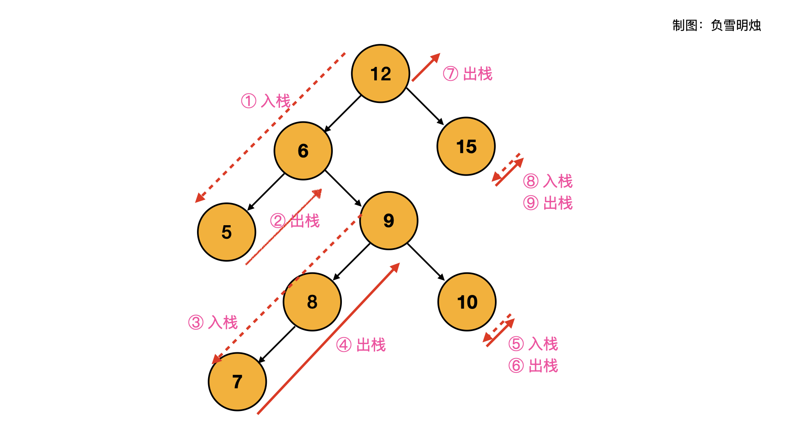

题目：[173. 二叉搜索树迭代器](https://leetcode.cn/problems/binary-search-tree-iterator/)

实现一个二叉搜索树迭代器类`BSTIterator` ，表示一个按中序遍历二叉搜索树（BST）的迭代器：

- `BSTIterator(TreeNode root)` 初始化 `BSTIterator` 类的一个对象。BST 的根节点`root` 会作为构造函数的一部分给出。指针应初始化为一个不存在于 BST 中的数字，且该数字小于 BST 中的任何元素。
- `boolean hasNext()` 如果向指针右侧遍历存在数字，则返回 `true` ；否则返回 `false` 。
- `int next()`将指针向右移动，然后返回指针处的数字。

注意，指针初始化为一个不存在于 BST 中的数字，所以对 `next()` 的首次调用将返回 BST 中的最小元素。

你可以假设 `next()` 调用总是有效的，也就是说，当调用 `next()` 时，BST 的中序遍历中至少存在一个下一个数字。

**示例：**


```
输入
["BSTIterator", "next", "next", "hasNext", "next", "hasNext", "next", "hasNext", "next", "hasNext"]
[[[7, 3, 15, null, null, 9, 20]], [], [], [], [], [], [], [], [], []]
输出
[null, 3, 7, true, 9, true, 15, true, 20, false]

解释
BSTIterator bSTIterator = new BSTIterator([7, 3, 15, null, null, 9, 20]);
bSTIterator.next();    // 返回 3
bSTIterator.next();    // 返回 7
bSTIterator.hasNext(); // 返回 True
bSTIterator.next();    // 返回 9
bSTIterator.hasNext(); // 返回 True
bSTIterator.next();    // 返回 15
bSTIterator.hasNext(); // 返回 True
bSTIterator.next();    // 返回 20
bSTIterator.hasNext(); // 返回 False
```

**提示：**

- 树中节点的数目在范围 `[1, 105]` 内
- `0 <= Node.val <= 106`
- 最多调用 `105` 次 `hasNext` 和 `next` 操作

## 方法一：提前保存全部节点

这个方法比较简单，提前把 BST 的中序遍历结果保存到一个**队列**里面，当调用 `next()` 方法的时候，就从**队列**头部弹出一个元素。

树的中序中序遍历应该是基础知识，我就不讲了。

```cpp
/**
 * Definition for a binary tree node.
 * struct TreeNode {
 *     int val;
 *     TreeNode *left;
 *     TreeNode *right;
 *     TreeNode() : val(0), left(nullptr), right(nullptr) {}
 *     TreeNode(int x) : val(x), left(nullptr), right(nullptr) {}
 *     TreeNode(int x, TreeNode *left, TreeNode *right) : val(x), left(left), right(right) {}
 * };
 */
class BSTIterator {
public:
    vector<int> arr;
    int idx = 0;
    void dfs(TreeNode *node) {
        if (node == nullptr) return;
        dfs(node->left);
        arr.push_back(node->val);
        dfs(node->right);
    }
    BSTIterator(TreeNode* root) {
        dfs(root);
    }
    
    int next() {
        int res = arr[idx];
        idx++;
        return res;
    }
    
    bool hasNext() {
        return idx < arr.size();
    }
};

/**
 * Your BSTIterator object will be instantiated and called as such:
 * BSTIterator* obj = new BSTIterator(root);
 * int param_1 = obj->next();
 * bool param_2 = obj->hasNext();
 */
```

- 时间复杂度：构造函数是 O(N)；调用 `next()` 方法的时间复杂度是 O(1)。
- 空间复杂度：O(N)，使用了队列保存了所有元素。

## 方法二：迭代时计算 `next` 节点

在前几天的设计迭代器的每日一题中，我说过提前把所有的值遍历并且保存起来的做法并不好，不是面试官想要的。举个场景：想通过 BST 的迭代器，判断 BST 中有没有 数值x。此时哪怕 数值x 是 BST 迭代器的第一个元素，上面的方法也会先把所有的值都遍历出来，时间复杂度到了O(N)。

所以，设计迭代器的时候，应避免提前把所有的值都遍历出来；最好能设计成遍历过程中求 `next` 节点。那就需要用迭代方法了。

- 把**递归**转成**迭代**，基本想法就是用**栈。**
- 迭代总体思路是：**栈中只保留左节点**。

思路必须从递归的访问顺序说起：中序遍历的访问顺序是 `左子树 -> 根节点 -> 右子树` 的顺序，并且对 `左子树` 和 `右子树` 也进行递归。

结合下图，实际访问节点的顺序是：

1. 从 `根节点12` 开始一路到底遍历到所有左节点，路径保存到栈中；此时栈为 `[12, 6, 5]`。
2. 弹出栈顶节点，即 `叶子节点5` ；
3. 下一个栈顶元素是 该叶子节点 的 `根节点6`；
4. 然后把 `该新的根节点的右子树9` 一路到底遍历其所有左节点；栈为 `[12, 9, 8, 7]`。
5. 继续运行下去，直到栈为空。

中序遍历流程如下图所示：



**发现了没有？这就是一个「单调栈」啊！**

根据上面的遍历顺序，我们得出迭代的思路：

- 构造方法：一路到底，把根节点和它的所有左节点放到栈中；
- 调用 `next()` 方法：弹出栈顶的节点；
  - 如果它有右子树，则对右子树一路到底，把它和它的所有左节点放到栈中。

```cpp
class BSTIterator {
public:
    vector<TreeNode*> stack;
    BSTIterator(TreeNode* root) {
        while (root) {
            stack.push_back(root);
            root = root->left;
        }
    }
    
    int next() {
        TreeNode *cur = *stack.rbegin();
        stack.pop_back();
        TreeNode *node = cur->right;
        while (node) {
            stack.push_back(node);
            node = node->left;
        }
        return cur->val;
    }
    
    bool hasNext() {
        return stack.size() > 0;
    }
};
```

- 时间复杂度：均摊复杂度是 O(1)，调用 `next()` 方法的时候，如果栈顶元素有右子树，则把所有右边节点即其所有左孩子全部放到了栈中，下次调用 `next()` 的时候，直接访问栈顶就可以了，均摊之后时间复杂度是 O(1)。

- 空间复杂度：O(h)，h 为数的高度，因为栈中只保留了左节点，栈中元素最多的时候，就是树的高度。