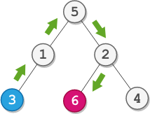

题目：[2096. 从二叉树一个节点到另一个节点每一步的方向](https://leetcode-cn.com/problems/step-by-step-directions-from-a-binary-tree-node-to-another/)

给你一棵 二叉树 的根节点 root ，这棵二叉树总共有 n 个节点。每个节点的值为 1 到 n 中的一个整数，且互不相同。给你一个整数 startValue ，表示起点节点 s 的值，和另一个不同的整数 destValue ，表示终点节点 t 的值。

请找到从节点 `s` 到节点 `t` 的 **最短路径** ，并以字符串的形式返回每一步的方向。每一步用 **大写** 字母 `'L'` ，`'R'` 和 `'U'` 分别表示一种方向：

- `'L'` 表示从一个节点前往它的 **左孩子** 节点。
- `'R'` 表示从一个节点前往它的 **右孩子** 节点。
- `'U'` 表示从一个节点前往它的 **父** 节点。

请你返回从 `s` 到 `t` **最短路径** 每一步的方向。

**示例 1：**



输入：root = [5,1,2,3,null,6,4], startValue = 3, destValue = 6
输出："UURL"
解释：最短路径为：3 → 1 → 5 → 2 → 6 。

**示例 2：**


```
输入：root = [2,1], startValue = 2, destValue = 1
输出："L"
解释：最短路径为：2 → 1 。
```

提示：

树中节点数目为 n 。
2 <= n <= 105
1 <= Node.val <= n
树中所有节点的值 互不相同 。
1 <= startValue, destValue <= n
startValue != destValue

## 方法一：最近公共祖先

按照 236. 二叉树的最近公共祖先 给出的方法，**我们可以从起点出发，找到到起点和终点的路径，然后去掉前缀相同的部分。剩下即为从起点和终点的最近公共祖先出发，到起点和终点的路径**

我们要找的最短路径即为：起点 => 起点和终点的最近公共祖先 => 终点。

答案为：起点 => 公共祖先的路全部转为"U"，加上最近公共祖先 => 终点的路径

```python
# Definition for a binary tree node.
# class TreeNode:
#     def __init__(self, val=0, left=None, right=None):
#         self.val = val
#         self.left = left
#         self.right = right
class Solution:
    def getDirections(self, root: Optional[TreeNode], startValue: int, destValue: int) -> str:
        def dfs(node, path, end):
            if node.val == end:
                return True
            if node.left:
                path.append("L")
                if dfs(node.left, path, end):
                    return True
                path.pop()
            if node.right:
                path.append("R")
                if dfs(node.right, path, end):
                    return True
                path.pop()
            return False

        startPath = []
        destPath = []
        dfs(root, startPath, startValue)
        dfs(root, destPath, destValue)
        # print(startPath, destPath)

        point = 0
        while point < min(len(startPath), len(destPath)):
            if startPath[point] != destPath[point]:
                break
            point += 1
        # print(point)
        return "U" * (len(startPath)-point) + "".join(destPath[point:])

```

## 方法二：dfs建图，bfs找到路径，比赛时的做法，待高人优化

```python
# Definition for a binary tree node.
# class TreeNode:
#     def __init__(self, val=0, left=None, right=None):
#         self.val = val
#         self.left = left
#         self.right = right
class Solution:
    def getDirections(self, root: Optional[TreeNode], startValue: int, destValue: int) -> str:
        tree = []
        adj = collections.defaultdict()
        adj[root.val] = collections.defaultdict(int)
        def dfs(node):
            tree.append(node.val)
            
            if node.left:
                adj[node.val]["L"] = node.left.val
                adj[node.left.val] = collections.defaultdict(int)
                adj[node.left.val]["U"] = node.val
                dfs(node.left)
            if node.right:
                adj[node.val]["R"] = node.right.val
                adj[node.right.val] = collections.defaultdict(int)
                adj[node.right.val]["U"] = node.val
                dfs(node.right)
        dfs(root)
        # print(tree)
        # print(adj)
        
        queue = collections.deque()
        queue.append((startValue, ""))
        visited = set()
        visited.add(startValue)
        while queue:
            cur, path = queue.popleft()
            if cur == destValue:
                return path
            for d in adj[cur]:
                if adj[cur][d] not in visited:
                    queue.append((adj[cur][d], path + d))
                    visited.add(adj[cur][d])

```
