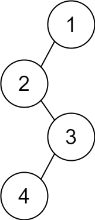

[2196. 根据描述创建二叉树](https://leetcode-cn.com/problems/create-binary-tree-from-descriptions/)

给你一个二维整数数组 `descriptions` ，其中 `descriptions[i] = [parenti, childi, isLefti]` 表示 `parenti` 是 `childi` 在 **二叉树** 中的 **父节点**，二叉树中各节点的值 **互不相同** 。此外：

- 如果 `isLefti == 1` ，那么 `childi` 就是 `parenti` 的左子节点。
- 如果 `isLefti == 0` ，那么 `childi` 就是 `parenti` 的右子节点。

请你根据 `descriptions` 的描述来构造二叉树并返回其 **根节点** 。

测试用例会保证可以构造出 **有效** 的二叉树。

**示例 1：**


输入：descriptions = [[20,15,1],[20,17,0],[50,20,1],[50,80,0],[80,19,1]]
输出：[50,20,80,15,17,19]
解释：根节点是值为 50 的节点，因为它没有父节点。
结果二叉树如上图所示。

**示例 2：**



输入：descriptions = [[1,2,1],[2,3,0],[3,4,1]]
输出：[1,2,null,null,3,4]
解释：根节点是值为 1 的节点，因为它没有父节点。 
结果二叉树如上图所示。 

提示：

1 <= descriptions.length <= 104
descriptions[i].length == 3
1 <= parenti, childi <= 105
0 <= isLefti <= 1
descriptions 所描述的二叉树是一棵有效二叉树

## 方法：利用哈希表建树

```cpp
class Solution {
public:
    TreeNode* createBinaryTree(vector<vector<int>>& descriptions) {
        unordered_map<int, TreeNode*> tree_map;
        unordered_map<int, bool> is_root;
        for (auto des : descriptions) {
            tree_map[des[0]] = new TreeNode(des[0]);
            tree_map[des[1]] = new TreeNode(des[1]);
            is_root[des[0]] = true;
            is_root[des[1]] = true;
        }

        for (auto des : descriptions) {
            is_root[des[1]] = false;
            if (des[2] == 1) { // 左节点
                tree_map[des[0]]->left = tree_map[des[1]];
            } else {
                tree_map[des[0]]->right = tree_map[des[1]];
            }
        }

        for (auto it = is_root.begin(); it != is_root.end(); it++) {
            if (it->second == true) {
                return tree_map[it->first];
            }
        }
        return new(TreeNode);
    }
};
```