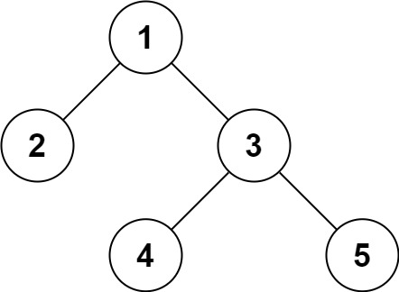

题目：[297. 二叉树的序列化与反序列化](https://leetcode-cn.com/problems/serialize-and-deserialize-binary-tree/)

序列化是将一个数据结构或者对象转换为连续的比特位的操作，进而可以将转换后的数据存储在一个文件或者内存中，同时也可以通过网络传输到另一个计算机环境，采取相反方式重构得到原数据。

请设计一个算法来实现二叉树的序列化与反序列化。这里不限定你的序列 / 反序列化算法执行逻辑，你只需要保证一个二叉树可以被序列化为一个字符串并且将这个字符串反序列化为原始的树结构。

**提示:** 输入输出格式与 LeetCode 目前使用的方式一致，详情请参阅 [LeetCode 序列化二叉树的格式](https://leetcode.cn/faq/#binary-tree)。

你并非必须采取这种方式，你也可以采用其他的方法解决这个问题。

**示例 1：**



```
输入：root = [1,2,3,null,null,4,5]
输出：[1,2,3,null,null,4,5]
```

**提示：**

- 树中结点数在范围 `[0, 104]` 内
- `-1000 <= Node.val <= 1000`

**原理：可以在输入中通过 None 来标记没有节点了，那么就可以通过一个前序（或者中序、或者后序）就能恢复**

## dfs

dfs 用同样的方法攻破 104 ms 19.6 MB 时间复杂度为 O(n) 空间复杂度为 O(n)

```python
class Codec:

    def serialize(self, root):
        """Encodes a tree to a single string.
        
        :type root: TreeNode
        :rtype: str
        """
        def dfs(node):
            if not node:
                inOrder.append("None")
                return 
            inOrder.append(str(node.val))
            dfs(node.left)
            dfs(node.right)

        inOrder = collections.deque()
        dfs(root)
        return ",".join(inOrder)

    def deserialize(self, data):
        """Decodes your encoded data to tree.
        
        :type data: str
        :rtype: TreeNode
        """
        if data == "":
            return None
        
        def dfs():
            node_val = inOrder.popleft()
            if node_val == "None":
                return
            node = TreeNode(node_val)
            node.left = dfs()
            node.right = dfs()
            return node

        inOrder = collections.deque([i for i in data.split(",")])
        return dfs()
```

## bfs

bfs: 100 ms 19.7 MB 时间复杂度为 O(n) 空间复杂度为 O(n)

```cpp
class Codec {
public:

    // Encodes a tree to a single string.
    string serialize(TreeNode* root) {
        if ( root == nullptr ) return "";
        ostringstream output;
        queue<TreeNode*> que;
        que.push(root);
        while ( !que.empty() ) {
            TreeNode* node = que.front();
            que.pop();
            if ( node == nullptr ) output << "# ";
            else {
                output << node->val << ' ';
                que.push(node->left);
                que.push(node->right);
            }
        }
        return output.str();
    }

    // Decodes your encoded data to tree.
    TreeNode* deserialize(string data) {
        if ( data.empty() ) return nullptr;
        vector<TreeNode*> nodes;
        string val;
        istringstream input(data);
        while ( input >> val ) {
            if ( val == "#" ) nodes.push_back(nullptr);
            else nodes.push_back(new TreeNode(stoi(val)));
        };
        int pos = 1;
        for ( int i = 0; i < nodes.size(); ++i ) {
            if ( nodes[i] == nullptr ) continue;
            nodes[i]->left = nodes[pos++];
            nodes[i]->right = nodes[pos++];
        }
        return nodes[0];
    }
};
```


```python
class Codec:

    def serialize(self, root):
        """Encodes a tree to a single string.
        
        :type root: TreeNode
        :rtype: str
        """
        if not root:
            return ""
        layerOrder = []
        queue = collections.deque()
        queue.append(root)

        while queue:
            node = queue.popleft()
            if node:
                queue.append(node.left)
                queue.append(node.right)
                layerOrder.append(str(node.val))
            else:
                layerOrder.append("None")
        print(",".join(layerOrder))
        return ",".join(layerOrder)
        
    def deserialize(self, data):
        """Decodes your encoded data to tree.
        
        :type data: str
        :rtype: TreeNode
        """
        if data == "":
            return None
            
        layerOrder = [i for i in data.split(",")]
        queue = collections.deque()

        root = TreeNode(layerOrder[0])
        queue.append(root)
        idx = 1
        while queue:
            node = queue.popleft()
            if layerOrder[idx] != "None":
                node.left = TreeNode(int(layerOrder[idx]))
                queue.append(node.left)
            idx += 1
            if layerOrder[idx] != "None":
                node.right = TreeNode(int(layerOrder[idx]))
                queue.append(node.right)
            idx += 1
        return root
```

### 