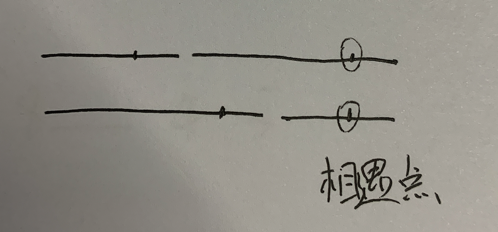

[160. 相交链表](https://leetcode-cn.com/problems/intersection-of-two-linked-lists/)

题解：https://leetcode-cn.com/problems/intersection-of-two-linked-lists/solution/xiang-jiao-lian-biao-by-leetcode-solutio-a8jn/

给你两个单链表的头节点 `headA` 和 `headB` ，请你找出并返回两个单链表相交的起始节点。如果两个链表不存在相交节点，返回 `null` 。

图示两个链表在节点 `c1` 开始相交**：**

[](https://assets.leetcode-cn.com/aliyun-lc-upload/uploads/2018/12/14/160_statement.png)

题目数据 **保证** 整个链式结构中不存在环。

**注意**，函数返回结果后，链表必须 **保持其原始结构** 。

**自定义评测：**

评测系统 的输入如下（你设计的程序 不适用 此输入）：

intersectVal - 相交的起始节点的值。如果不存在相交节点，这一值为 0
listA - 第一个链表
listB - 第二个链表
skipA - 在 listA 中（从头节点开始）跳到交叉节点的节点数
skipB - 在 listB 中（从头节点开始）跳到交叉节点的节点数

评测系统将根据这些输入创建链式数据结构，并将两个头节点 headA 和 headB 传递给你的程序。如果程序能够正确返回相交节点，那么你的解决方案将被 视作正确答案 。

**示例 1：**


```
输入：intersectVal = 8, listA = [4,1,8,4,5], listB = [5,6,1,8,4,5], skipA = 2, skipB = 3
输出：Intersected at '8'
解释：相交节点的值为 8 （注意，如果两个链表相交则不能为 0）。
从各自的表头开始算起，链表 A 为 [4,1,8,4,5]，链表 B 为 [5,6,1,8,4,5]。
在 A 中，相交节点前有 2 个节点；在 B 中，相交节点前有 3 个节点。
— 请注意相交节点的值不为 1，因为在链表 A 和链表 B 之中值为 1 的节点 (A 中第二个节点和 B 中第三个节点) 是不同的节点。换句话说，它们在内存中指向两个不同的位置，而链表 A 和链表 B 中值为 8 的节点 (A 中第三个节点，B 中第四个节点) 在内存中指向相同的位置。
```

**示例 2：**


```
输入：intersectVal = 2, listA = [1,9,1,2,4], listB = [3,2,4], skipA = 3, skipB = 1
输出：Intersected at '2'
解释：相交节点的值为 2 （注意，如果两个链表相交则不能为 0）。
从各自的表头开始算起，链表 A 为 [1,9,1,2,4]，链表 B 为 [3,2,4]。
在 A 中，相交节点前有 3 个节点；在 B 中，相交节点前有 1 个节点。
```

**示例 3：**


```
输入：intersectVal = 0, listA = [2,6,4], listB = [1,5], skipA = 3, skipB = 2
输出：null
解释：从各自的表头开始算起，链表 A 为 [2,6,4]，链表 B 为 [1,5]。
由于这两个链表不相交，所以 intersectVal 必须为 0，而 skipA 和 skipB 可以是任意值。
这两个链表不相交，因此返回 null 。
```

提示：

listA 中节点数目为 m
listB 中节点数目为 n
1 <= m, n <= 3 * 104
1 <= Node.val <= 105
0 <= skipA <= m
0 <= skipB <= n
如果 listA 和 listB 没有交点，intersectVal 为 0
如果 listA 和 listB 有交点，intersectVal == listA[skipA] == listB[skipB]


进阶：你能否设计一个时间复杂度 O(m + n) 、仅用 O(1) 内存的解决方案？

## 方法一：哈希表

首先遍历链表 headA，并将链表 headA 中的每个节点加入哈希集合中。

然后遍历链表 headB，对于遍历到的每个节点，判断该节点是否在哈希集合中

时间复杂度：`O(m+n)`

空间复杂度：`O(m)`

## 方法二：交叉遍历双指针

当链表 headA 和 headB 都不为空时，创建两个指针 pA 和 pB，初始时分别指向两个链表的头节点 headA 和 headB，然后将两个指针依次遍历两个链表的每个节点。具体做法如下：

- 每步操作需要同时更新指针 pA 和 pB
- 如果指针 pA 不为空，则将指针 pA 移到下一个节点；如果指针 pB 不为空，则将指针 pB 移到下一个节点
- 如果指针 pA 为空，则将指针 pA 移到链表 headB 的头节点；如果指针 pB 为空，则将指针 pB 移到链表 headA 的头节点
- 当指针 pA 和 pB 相遇时返回该节点。都为空时，返回 null



时间复杂度：`O(m+n)`

空间复杂度：`O(1)`

```c++
class Solution {
public:
    ListNode *getIntersectionNode(ListNode *headA, ListNode *headB) {
        if (headA == nullptr || headB == nullptr) {
            return nullptr;
        }
        ListNode *pA = headA, *pB = headB;
        while (pA != pB) {
            pA = pA == nullptr ? headB : pA->next;
            pB = pB == nullptr ? headA : pB->next;
        }
        return pA;
    }
};
```

len(A) == len(B) 没有相交点，同时为nullptr时，跳出循环，不交叉遍历，ptrA为nullptr

len(A) == len(B) 有相交点，找到相交点，跳出循环，不交叉遍历，ptrA为相交点

len(A) != len(B) 没有相交点，交叉遍历, 最后同时为null时，跳出循环，ptrA为nullptr

len(A) ！= len(B) 有相交点，交叉遍历，找到相交点，跳出循环，ptrA为相交点
