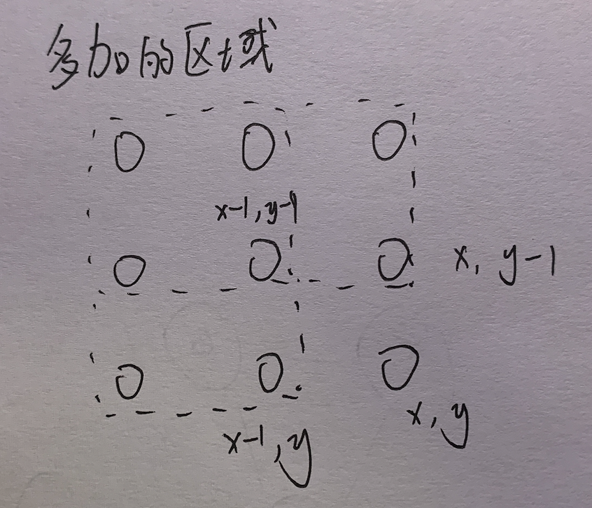
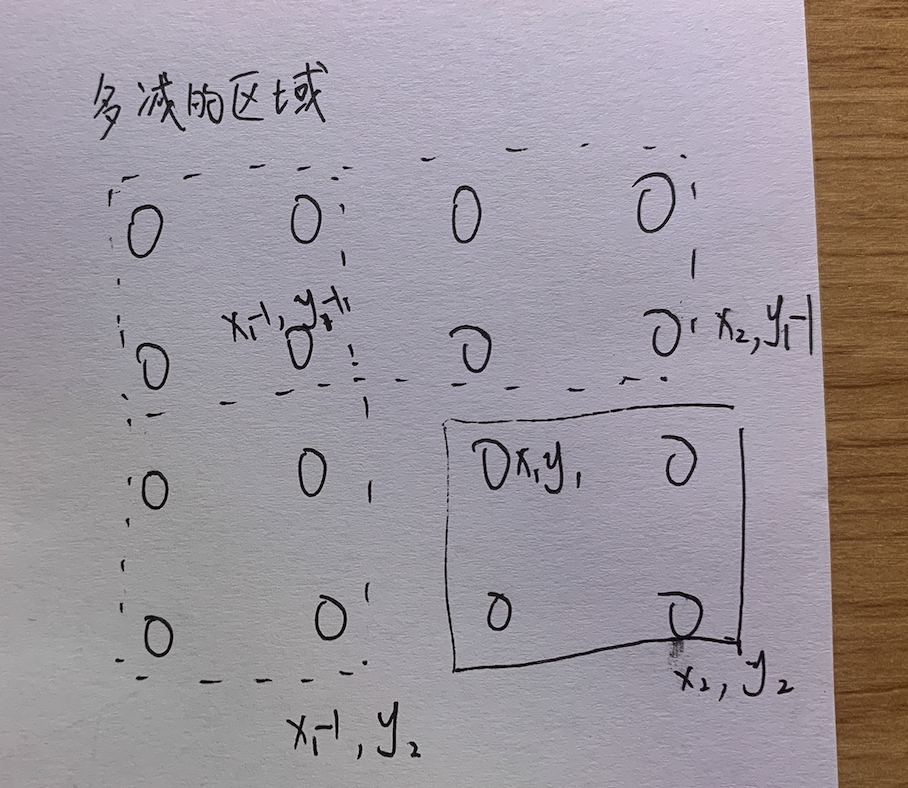

# 前缀和

参考：[https://oi-wiki.org/basic/prefix-sum](https://oi-wiki.org/basic/prefix-sum)

前缀和是一种重要的预处理，能大大降低查询的时间复杂度。可以简单理解为 **数列的前n项的和**。

实际中，真正用的是「前缀和思想」

- **但前/后缀和不一定要记录和，还可以记录 i 点前/后满足条件的个数，记录i 点前/后任何可以贡献的数据**

- **「前缀和+哈希表」：经常会用哈希表保存计算过的前缀和，方便用O(1)的时间去查找计算过的值，多用于子数组问题**

## 一维前缀和

有 n 个的正整数放到数组 A 里，现在要求一个新的数组 pre_sum，新数组的第 i 个数pre_sum[i] 是原数组 A 第 0 到第 i 个数的和

```
pre_sum[0] = A[0]，对于i>0 则 pre_sum[i] = pre_sum[i-1] + A[i]
```

```python
n = 5
A = [i for i in range(n)]
# A: [0, 1, 2, 3, 4]

# 计算一维前缀和
pre_sum = [0 for _ in range(n)]
pre_sum[0] = A[0]
for i in range(1, n):
    pre_sum[i] = pre_sum[i-1] + A[i]
# pre_sum: [0, 1, 3, 6, 10]

# 更常用的方法，之后用pre_sum的时候，方便处理 pre_sum[i] - pre_sum[i-1]
pre_sum = [0 for _ in range(n+1)]
for i in range(n):
    pre_sum[i+1] = pre_sum[i] + A[i]
# pre_sum: [0, 0, 1, 3, 6, 10]
```

## 后缀和

- 后缀和中的每个元素相当于以该元素下标为起点到结尾的累积和
- 后缀和数组的最后一个数与前缀和数组的最后一个数一样

```
nums = [-3, 2, -3, 4, 2]
suf_sum = [2, 5, 3, 6, 2]
以 0 位置为起点计算累积和为：2
以 1 位置为起点计算累积和为：5
以 2 位置为起点计算累积和为：3
以 3 位置为起点计算累积和为：6
以 4 位置为起点计算累积和为：2
```

## 二维前缀和

比如我们有这样一个矩阵 $$a$$，可以视为二维数组：

```
1 2 4 3
5 1 2 4
6 3 5 9
```

再定义一个矩阵$$sum$$，使$$sum_{x,y} = \sum\limits_{i=1}^{x} \sum\limits_{i=1}^{y} a_{x,y}$$ 那么这个矩阵长这样：

```
1  3  7  10
6  9  15 22
12 18 29 45
```

递推求矩阵$$sum$$，：

$$
sum_{x,y} = sum_{x-1,y} + sum_{x,y-1} - sum_{x-1,y-1} + a_{x,y}
$$



求$$(x_1,y_1)-(x_2,y_2)$$子矩阵的和：
$$
sub = sum_{x_2,y_2} - sum_{x_1-1,y_2} - sum_{x_2,y_1-1} + sum_{x_1-1,y_1-1}
$$



**例题**

例1：[1074-[二维前缀和+优化枚举+哈希表]-元素和为目标值的子矩阵数量](./例题/1074-[二维前缀和+优化枚举+哈希表]-元素和为目标值的子矩阵数量.md)

- 通过「点」来确定一个子矩阵，右下角和左上角，时间复杂度 `O(n^4)`

- 通过「边」来确定一个子矩阵，时间复杂度 `O(n^3)`


例2：[304. 二维区域和检索 - 矩阵不可变](https://leetcode-cn.com/problems/range-sum-query-2d-immutable/)

**注：上边界和左边届用0填充，是为了防止之后取值的时候越界**

```python
class NumMatrix:

    def __init__(self, matrix: List[List[int]]):
        rows = len(matrix)
        cols = len(matrix[0])
        self.pre_sum = [[0 for _ in range(cols+1)] for _ in range(rows+1)]
        # 计算二维前缀和
        for r in range(rows):
            for c in range(cols):
                self.pre_sum[r+1][c+1] = self.pre_sum[r+1][c] + self.pre_sum[r][c+1] - self.pre_sum[r][c] + matrix[r][c]

    def sumRegion(self, row1: int, col1: int, row2: int, col2: int) -> int:
        return self.pre_sum[row2+1][col2+1] - self.pre_sum[row2+1][col1] - self.pre_sum[row1][col2+1] + self.pre_sum[row1][col1]
```


例3：在一个 rows x cols 的只包含 0 和 1 的矩阵 a 里找出一个不包含 0 的最大正方形，输出边长。

```python
b = [[0 for _ in range(cols)] for _ in range(rows)]
b[0][0] = a[0][0]

# 初始化上边界
for c in range(1, cols):
    b[0][c] = b[0][c-1] + a[0][c]
# 初始化左边届
for r in range(1, rows):
    b[r][0] = b[r-1][0] + a[r][0]

# 计算二维前缀和
for r in range(1, rows):
    for c in range(1, cols):
        b[r][c] = b[r][c-1] + b[r-1][c] - b[r-1][c-1] + a[r][c]

ans = float("-inf")
side = 2   # 边长
while side < min(n, m):
    # 当变长为side时搜索所有可能，搜索范围在side<=r<rows, side<=c<cols的区域
    for r in range(side, rows):
        for c in range(side, cols):
            # 子矩阵右下角的点为[r][c]，左上角的点为[r-side+1][c-side+1]
            # 子矩阵内1的和 等于 边长的平方时 为正方形
            if b[r][c] - b[r-side][c] - b[r][c-side] + b[r-side][c-side] == side*side:
                ans = max(ans, side)
    side += 1
print(ans)
```

## 基于 DP 计算高维前缀和

还没看懂

https://oi-wiki.org/basic/prefix-sum/

## 前缀和+哈希表

不少题都需要用hashmap做记录

## 例题

[2121-[非常规前、后缀和]-相同元素的间隔之和](../../周赛/第 273 场周赛/2121-[非常规前、后缀和]-相同元素的间隔之和.md)

