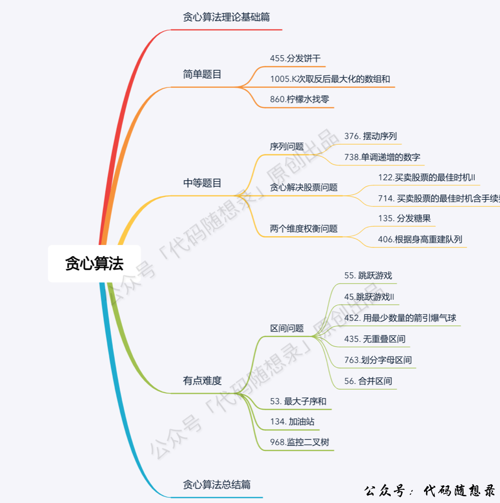
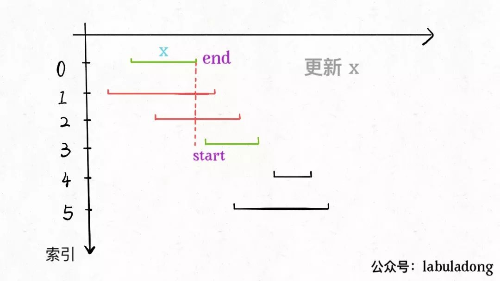

# 贪心

什么是贪心算法呢？贪心算法可以认为是动态规划算法的一个特例，相比动态规划，使用贪心算法需要满足更多的条件（贪心选择性质），但是效率比动态规划要高。

比如说一个算法问题使用暴力解法需要指数级时间，如果能使用动态规划消除重叠子问题，就可以降到多项式级别的时间，如果满足贪心选择性质，那么可以进一步降低时间复杂度，达到线性级别的。

什么是贪心选择性质呢，简单说就是：**每一步都做出一个局部最优的选择，最终的结果就是全局最优**。注意哦，这是一种特殊性质，其实**只有一小部分问题拥有这个性质**。

比如你面前放着 100 张人民币，你只能拿十张，怎么才能拿最多的面额？显然每次选择剩下钞票中面值最大的一张，最后你的选择一定是最优的。

然而，大部分问题都明显不具有贪心选择性质。比如打斗地主，对手出对儿三，按照贪心策略，你应该出尽可能小的牌刚好压制住对方，但现实情况我们甚至可能会出王炸。这种情况就不能用贪心算法，而得使用动态规划解决，参见前文 [动态规划解决博弈问题](http://mp.weixin.qq.com/s?__biz=MzU0MDg5OTYyOQ==&mid=2247484266&idx=1&sn=72bc8c3e4b026e2f08905e139a245c53&chksm=fb336328cc44ea3e77b4ad0bd36d4a0d2e7009f9c3597f38b6ba93620a98b302524be4e87d08&scene=21#wechat_redirect)。

## 一、场景



### 0、排序预处理

通过排序，将优先选择的元素放到前面

数组中的元素为数对，还涉及排序的，有下面的场景

- 以末尾边界作为高优先级排序
- 第一个元素正向排序，根据第二个元素反向排序
- 第一个元素反向排序，根据第二个元素正向排序

### 1、区间调度问题（排序+贪心）

一个很经典的贪心算法问题 Interval Scheduling（区间调度问题）

给你很多形如`[start,end]`的闭区间，请你设计一个算法，**算出这些区间中「最多」有几个互不相交的区间**。

举个例子，`intvs=[[1,3],[2,4],[3,6]]`，这些区间最多有两个区间互不相交，即`[[1,3],[3,6]]`

这个问题在生活中的应用广泛，比如你今天有好几个活动，每个活动都可以用区间`[start,end]`表示开始和结束的时间，请问你今天「最多」能参加几个活动呢？

**思路**:

1. 从区间集合 intvs 中选择一个区间 x，这个 x 是在当前所有区间中**结束最早的**（end 最小）。
2. 把所有与 x 区间相交的区间从区间集合 intvs 中删除。
3. 重复步骤 1 和 2，直到 intvs 为空为止。之前选出的那些 x 就是最大不相交子集。

**算法实现**:



1. 预先**按照 end 排序**，方便选取最小的 end
2. 当前 end 与 下一个 start 比较，**选出第一个「大于等于」end 的 start**
3. 记录答案，并**将 end 更新为选出 start 区间的那个 end**

```cpp
#include <algorithm>  // sort()
#include <iostream>
#include <vector>
using namespace std;

int main() {
    vector<vector<int>> intervals = {{1, 3}, {3, 6}, {2, 4}};
    auto cmp = [&](const vector<int> &a, const vector<int> &b) -> bool {
        return a[1] < b[1];
    };
    sort(intervals.begin(), intervals.end(), cmp);

    int cnt = 1;                // 默认有第一个区间
    int end = intervals[0][1];  // 默认第一个区间的end
    for (vector<int> intv : intervals) {
        if (intv[0] >= end) {
            cnt++;
            end = intv[1];
        }
    }
    cout << cnt << endl;  // 2
    return 0;
}
```

### 2、跳跃问题

[55. 跳跃游戏](https://leetcode-cn.com/problems/jump-game/)

给定一个非负整数数组 `nums` ，你最初位于数组的 **第一个下标** 。数组中的每个元素代表你在该位置可以跳跃的最大长度。

判断你是否能够到达最后一个下标

```
输入：nums = [2,3,1,1,4]
输出：true
解释：可以先跳 1 步，从下标 0 到达下标 1, 然后再从下标 1 跳 3 步到达最后一个下标。
```

**算法步骤**：

1. 最初位于数组的 **第一个下标** ，**当前最远可走的位置max_bound 初始化为 0**
2. 遍历数组，遍历范围[0,n-1)
   - 更新当前能达到的最远位置max_bound=max(max_bound,nums[i]+i)
   - 如果当前位置 cur 大于等于当前能达到的最远位置 max_bound，返回 false

**注意事项：**

- **等于也返回失败**，是因为最远到达的位置是本身说明在原地踏步
- **不要去遍历最后一个位置**，因为当 i == end == n-1 时，说明已经可以走到 n-1位置了，如果这个时候站在 n-1 位置再往后跳，就跳出去了。如果遍历了，就多加了个 1

```cpp
class Solution {
public:
    bool canJump(vector<int>& nums) {
        int n = nums.size();
        int max_bound = 0;
        for (int cur = 0; cur < n - 1; cur++) {
            max_bound = max(max_bound, cur + nums[cur]);
            if (cur >= max_bound) {
                return false;
            }
        }
        return true;
    }
};
```

[45. 跳跃游戏 II](https://leetcode-cn.com/problems/jump-game-ii/)

给你一个非负整数数组 nums ，你最初位于数组的第一个位置。数组中的每个元素代表你在该位置可以跳跃的最大长度。

你的目标是使用最少的跳跃次数到达数组的最后一个位置。假设你总是可以到达数组的最后一个位置。

```
输入: nums = [2,3,1,1,4]
输出: 2
解释: 跳到最后一个位置的最小跳跃数是 2。
     从下标为 0 跳到下标为 1 的位置，跳 1 步，然后跳 3 步到达数组的最后一个位置。
```

目的：使用最少的步数到达最后一个位置

**贪心策略：第 i 步位置为「第 i-1 步前」的点中所能达到的「最远位置」**，通过每一步的最优解，更新全局最优解，这就是贪心

算法步骤：

1. 定义步数step=0，能达到的最远位置max_bound=0，和上一步到达的边界pre_end=0
2. 遍历数组，遍历范围[0,n-1)
   - 更新当前能达到的最远位置max_bound=max(max_bound,nums[i]+i)
   - 如果索引i 到达了上一步的边界pre_end即i==pre_end，则
     - 更新边界pre_end，令 pre_end 等于新的最远边界max_bound
     - 令步数 step 加一

**注意：不要去遍历最后一个位置**

因为当 i == pre_end == n-1 时，说明已经可以走到 n-1位置了。如果这个时候站在 n-1 位置再往后跳，就跳出去了

```cpp
class Solution {
public:
    int jump(vector<int>& nums) {
        int n = nums.size();
        int max_bound = 0;  // 当前能达到的最远位置
        int pre_end = 0;    // 上一步到达的边界
        int step = 0;       // 跳跃次数

        for (int cur = 0; cur < n - 1; cur++) {
            max_bound = max(max_bound, cur + nums[cur]);
            if (cur == pre_end) {
                pre_end = max_bound;  // 重新起跳，这一次跳的最远边界为 max_bound
                step++;
            }
        }
        return step;
    }
};
```

### 3、环形贪心

详细证明看例题题解：134-[环形贪心-环状数组]-加油站

**结论**：

- 如果从起点 start 累加 gas[i]-cost[i] 到 k 点后，小于 0。那么从起点 start 到 k 点都不会为真正的起点
- 如果总加油量 sum(gas) >= 总耗油量 sum(cost) ，问题一定有解

```cpp
class Solution {
public:
    int canCompleteCircuit(vector<int>& gas, vector<int>& cost) {
        int start = 0;
        int residual = 0;  // 整体
        int run_cost = 0;  // 从 start 开始记
        for (int i = 0; i < gas.size(); i++) {
            residual += gas[i] - cost[i];
            run_cost += gas[i] - cost[i];
            if (run_cost < 0) {
                start = i + 1;
                run_cost = 0;
            }
        }
        if (residual >= 0) {
            return start;
        }
        return -1;
    }
};
```

### 4、经常会与优先队列结合

例如 1005、1405、1705

注意：**从优先队列中取出数据，用完后，要还回去**

### 5、移除问题

移出 k 个元素，使剩下的数组最大/最小

核心思路是：对于两个数 `1 2 3 a _ _ _` 和 `1 2 3 b _ _ _`

- 如果 a > b， 那么 `123a___` 大于 `123b___`
- 否则，那么 `123a___` 小于等于 `123b___`

**两个「相同位数」的数字大小关系取决于「第一个不同」的数的大小**

[402. 移掉 K 位数字](https://leetcode-cn.com/problems/remove-k-digits/) (中等)

[316. 去除重复字母](https://leetcode-cn.com/problems/remove-duplicate-letters/) (困难)

[321. 拼接最大数](https://leetcode-cn.com/problems/create-maximum-number/) (困难)

[1081. 不同字符的最小子序列](https://leetcode-cn.com/problems/smallest-subsequence-of-distinct-characters/) （中等）
