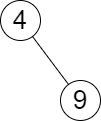

题目：[2476. 二叉搜索树最近节点查询](https://leetcode.cn/problems/closest-nodes-queries-in-a-binary-search-tree/)

给你一个 **二叉搜索树** 的根节点 `root` ，和一个由正整数组成、长度为 `n` 的数组 `queries` 。

请你找出一个长度为 `n` 的 **二维** 答案数组 `answer` ，其中 `answer[i] = [mini, maxi]` ：

- `mini` 是树中小于等于 `queries[i]` 的 **最大值** 。如果不存在这样的值，则使用 `-1` 代替。
- `maxi` 是树中大于等于 `queries[i]` 的 **最小值** 。如果不存在这样的值，则使用 `-1` 代替。

返回数组 `answer` 。

**示例 1 ：**


```
输入：root = [6,2,13,1,4,9,15,null,null,null,null,null,null,14], queries = [2,5,16]
输出：[[2,2],[4,6],[15,-1]]
解释：按下面的描述找出并返回查询的答案：
- 树中小于等于 2 的最大值是 2 ，且大于等于 2 的最小值也是 2 。所以第一个查询的答案是 [2,2] 。
- 树中小于等于 5 的最大值是 4 ，且大于等于 5 的最小值是 6 。所以第二个查询的答案是 [4,6] 。
- 树中小于等于 16 的最大值是 15 ，且大于等于 16 的最小值不存在。所以第三个查询的答案是 [15,-1] 。
```

**示例 2 ：**



```
输入：root = [4,null,9], queries = [3]
输出：[[-1,4]]
解释：树中不存在小于等于 3 的最大值，且大于等于 3 的最小值是 4 。所以查询的答案是 [-1,4] 。
```

提示：

树中节点的数目在范围 [2, 105] 内
1 <= Node.val <= 106
n == queries.length
1 <= n <= 105
1 <= queries[i] <= 106

---

首先，题目没说二叉搜索树是**平衡**的，最坏情况下二叉搜索树是一条链。

因此需要通过一次 [94. 二叉树的中序遍历](https://leetcode.cn/problems/binary-tree-inorder-traversal/) 得到有一个有序数组，再在数组上做二分查找。

在有序数组中求大于等于和小于等于，和 [34. 在排序数组中查找元素的第一个和最后一个位置](https://leetcode.cn/problems/find-first-and-last-position-of-element-in-sorted-array/) 是一样的。

我在 [二分查找又死循环了？一个视频讲透二分本质！【基础算法精讲 04】](https://leetcode.cn/link/?target=https://www.bilibili.com/video/BV1AP41137w7/) 这期视频中详细讲解了二分查找，欢迎观看。

```python
class Solution:
    def closestNodes(self, root: Optional[TreeNode], queries: List[int]) -> List[List[int]]:
        a = []
        def dfs(o: Optional[TreeNode]) -> None:
            if o is None: return
            dfs(o.left)
            a.append(o.val)
            dfs(o.right)
        dfs(root)

        ans = []
        for q in queries:
            j = bisect_right(a, q)
            min = a[j - 1] if j else -1
            j = bisect_left(a, q)
            max = a[j] if j < len(a) else -1
            ans.append([min, max])
        return ans
```

