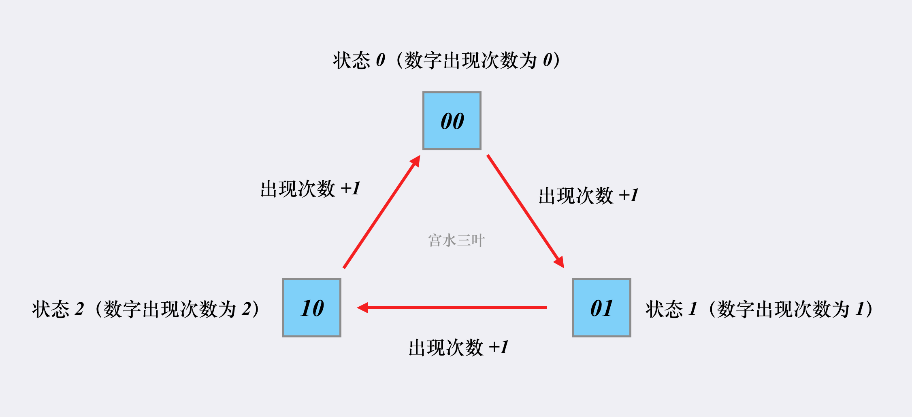

题目：[剑指 Offer II 004. 只出现一次的数字 ](https://leetcode.cn/problems/WGki4K/)

题解：[【宫水三叶】一题三解：「哈希表」&「位数统计」&「DFA」 - 只出现一次的数字 - 力扣（LeetCode）](https://leetcode.cn/problems/WGki4K/solution/by-ac_oier-npwu/)

给你一个整数数组 `nums` ，除某个元素仅出现 **一次** 外，其余每个元素都恰出现 **三次 。**请你找出并返回那个只出现了一次的元素。

**示例 1：**

```
输入：nums = [2,2,3,2]
输出：3
```

**示例 2：**

```
输入：nums = [0,1,0,1,0,1,100]
输出：100
```

提示：

1 <= nums.length <= 3 * 104
-231 <= nums[i] <= 231 - 1
nums 中，除某个元素仅出现 一次 外，其余每个元素都恰出现 三次

进阶：你的算法应该具有线性时间复杂度。 你可以不使用额外空间来实现吗？

 

注意：本题与主站 137 题相同：https://leetcode-cn.com/problems/single-number-ii/

## 方法一：位数统计

哈希表解法的空间复杂度是 O(n) 的，而题目的【进阶】部分提到应当使用常数空间来做。

其中一个比较容易想到的做法，是利用 int 类型固定为 32 位。

使用一个长度为 32 的数组 cnt[] 记录下所有数值的每一位共出现了多少次 1，再对 cnt[] 数组的每一位进行 mod 3 操作，重新拼凑出只出现一次的数值。

举个 🌰，考虑样例 [1,1,1,3]，1 和 3 对应的二进制表示分别是 00..001 和 00..011，存入 cnt[] 数组后得到 [0,0,...,0,1,4]。进行 mod 3 操作后得到 [0,0,...,0,1,1]，再转为十进制数字即可得「只出现一次」的答案 3。

- 时间复杂度：O(n)
- 空间复杂度：O(1)

```cpp
class Solution {
public:
    int singleNumber(vector<int>& nums) {
        int cnt[32];
        memset(cnt, 0, sizeof(cnt));
        // 统计每个位上 1 的个数
        for (int x : nums) {
            for (int i = 0; i < 32; i++) {
                if (((x >> i) & 1) == 1) {
                    cnt[i]++;
                }
            }
        }
        // 从二进制表示恢复成十进制
        int ans = 0;
        for (int i = 0; i < 32; i++) {
            if ((cnt[i] % 3 & 1) == 1) {
                ans += (1 << i);
            }
        }
        return ans;
    }
};
```

## 方法二：DFA

如果我们考虑「除了某个元素只出现一次以外，其余每个元素均出现两次」的情况，那么可以使用「异或」运算。

利用相同数异或为 0 的性质，可以帮助我们很好实现状态切换：


本题是考虑「除了某个元素只出现一次以外，其余每个元素均出现三次」的情况，那么对应了「出现 0 次」、「出现 1 次」和「出现 2 次」三种状态，意味着至少需要两位进行记录，且状态转换关系为：



那么如何将上述 DFA 用表达式表示出来呢？有以下几种方法：

- 用「真值表」写出「逻辑函数表达式」可参考 [这里](https://leetcode.cn/link/?target=https://wenku.baidu.com/view/e9460ad96729647d27284b73f242336c1eb930f0.html)，化简过程可以参考 [卡诺图化简法](https://leetcode.cn/link/?target=https://baike.baidu.com/item/卡诺图化简法) 。
- 把结论记住（这是一道经典的 DFA 入门题）。
- 硬做，位运算也就那几种，不会「数字电路」也记不住「结论」，砸时间看着真值表不断调逻辑也是可以写出来的。


时间复杂度：O(n)

空间复杂度：O(1)

```cpp
class Solution {
public:
    int singleNumber(vector<int>& nums) {
        int one = 0, two = 0;
        for (int x : nums) {
            one = one ^ x & ~two;
            two = two ^ x & ~one;
        }
        return one;
    }
};
```