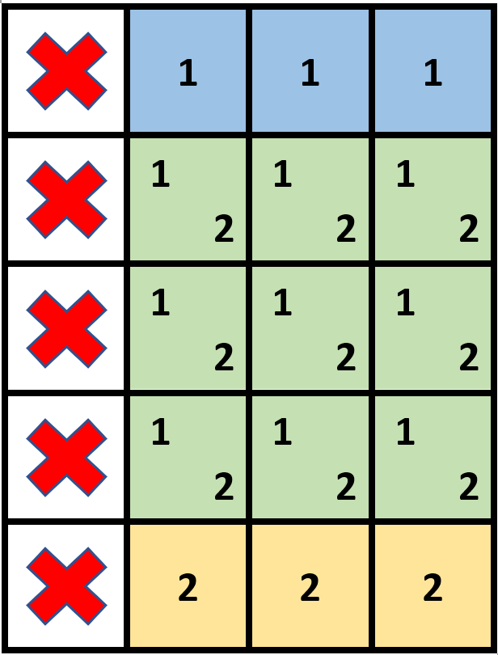

[2132. 用邮票贴满网格图](https://leetcode-cn.com/problems/stamping-the-grid/)

给你一个 `m x n` 的二进制矩阵 `grid` ，每个格子要么为 `0` （空）要么为 `1` （被占据）。

给你邮票的尺寸为 `stampHeight x stampWidth` 。我们想将邮票贴进二进制矩阵中，且满足以下 **限制** 和 **要求** ：

1. 覆盖所有 **空** 格子。
2. 不覆盖任何 **被占据** 的格子。
3. 我们可以放入任意数目的邮票。
4. 邮票可以相互有 **重叠** 部分。
5. 邮票不允许 **旋转** 。
6. 邮票必须完全在矩阵 **内** 。

如果在满足上述要求的前提下，可以放入邮票，请返回 `true` ，否则返回 `false` 。

**示例 1：**



```
输入：grid = [[1,0,0,0],[1,0,0,0],[1,0,0,0],[1,0,0,0],[1,0,0,0]], stampHeight = 4, stampWidth = 3
输出：true
解释：我们放入两个有重叠部分的邮票（图中标号为 1 和 2），它们能覆盖所有与空格子。
```

**示例 2：**


```
输入：grid = [[1,0,0,0],[0,1,0,0],[0,0,1,0],[0,0,0,1]], stampHeight = 2, stampWidth = 2 
输出：false 
解释：没办法放入邮票覆盖所有的空格子，且邮票不超出网格图以外。
```

提示：

m == grid.length
n == grid[r].length
1 <= m, n <= 105
1 <= m * n <= 2 * 105
`grid[r][c] 要么是 0 ，要么是 1 。`
1 <= stampHeight, stampWidth <= 105

## 方法：二维差分+二维前缀和

找出所有的可以放置邮票的区域，并 **标记** 这些区域。如果最终仍然存在 **未被标记** 的点，则不能铺满。

1. 用 **二维差分** 标记放置邮票的区域
2. 用 **二维前缀和** 检查某区域是否可以放置邮票
3. 检查 **累积计数矩阵** 中是否存在累积次数不为 0 且没被占据

时间复杂度：`O(n*n)`

空间复杂度：`O(n*n)`

执行用时：1684 ms, 在所有 Python3 提交中击败了34.25%的用户

内存消耗：62.3 MB, 在所有 Python3 提交中击败了12.33%的用户

```python
class Solution:
    def possibleToStamp(self, grid: List[List[int]], stampHeight: int, stampWidth: int) -> bool:
        rows = len(grid)
        cols = len(grid[0])
        preSum = [[0] * (cols + 1) for _ in range(rows + 1)]
        diff = [[0] * (cols + 1) for _ in range(rows + 1)]
        
        # 先算出二维前缀和，方便下面用O(1)的时间复杂度算出，区间内有没有被占据的格子
        for r in range(rows):
            for c in range(cols):
                preSum[r+1][c+1] = preSum[r][c+1] + preSum[r+1][c] - preSum[r][c] + grid[r][c]
        
        # 算出二维差分数组，用O(1)的时间复杂度标记，区间内覆盖的格子
        # 用的是原数组中的坐标
        for r in range(rows):
            for c in range(cols):
                if grid[r][c] == 0: # 遍历所有的空位，尝试以该空位为左上角放置邮票
                    x, y = r+stampHeight-1, c+stampWidth-1 # 原数组中，区间右下角横纵坐标
                    if x < rows and y < cols: # 区间完全在grid中
                        if preSum[x+1][y+1] - preSum[x+1][c] - preSum[r][y+1] + preSum[r][c] == 0:
                            # 区间内有没有被占据的格子，在前缀和数组中判断，注意坐标+1
                            diff[r][c] += 1
                            diff[r][y+1] -= 1
                            diff[x+1][c] -= 1
                            diff[x+1][y+1] += 1
        # print(diff)

        # 还原二维差分矩阵对应的累积计数矩阵（也是种前缀和）
        cntMatrix = [[0 for _ in range(cols+1)] for _ in range(rows+1)]
        for r in range(rows):
            for c in range(cols):
                cntMatrix[r+1][c+1] = cntMatrix[r][c+1] + cntMatrix[r+1][c] - cntMatrix[r][c] + diff[r][c]
        # print(cntMatrix)

        for r in range(rows):
            for c in range(cols):
                if cntMatrix[r+1][c+1] == 0 and grid[r][c] == 0:
                    # 累积计数为0的地方，如果没被占据，那就是没覆盖到
                    return False
        return True
```

