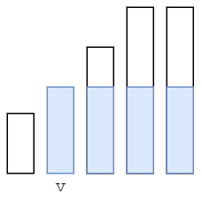

[2171. 拿出最少数目的魔法豆](https://leetcode-cn.com/problems/removing-minimum-number-of-magic-beans/)

给你一个 **正** 整数数组 `beans` ，其中每个整数表示一个袋子里装的魔法豆的数目。

请你从每个袋子中 **拿出** 一些豆子（也可以 **不拿出**），使得剩下的 **非空** 袋子中（即 **至少** 还有 **一颗** 魔法豆的袋子）魔法豆的数目 **相等** 。一旦魔法豆从袋子中取出，你不能将它放到任何其他的袋子中。

请你返回你需要拿出魔法豆的 **最少数目**。

```
示例 1：

输入：beans = [4,1,6,5]
输出：4
解释：
- 我们从有 1 个魔法豆的袋子中拿出 1 颗魔法豆。
  剩下袋子中魔法豆的数目为：[4,0,6,5]
- 然后我们从有 6 个魔法豆的袋子中拿出 2 个魔法豆。
  剩下袋子中魔法豆的数目为：[4,0,4,5]
- 然后我们从有 5 个魔法豆的袋子中拿出 1 个魔法豆。
  剩下袋子中魔法豆的数目为：[4,0,4,4]
总共拿出了 1 + 2 + 1 = 4 个魔法豆，剩下非空袋子中魔法豆的数目相等。
没有比取出 4 个魔法豆更少的方案。

示例 2：

输入：beans = [2,10,3,2]
输出：7
解释：
- 我们从有 2 个魔法豆的其中一个袋子中拿出 2 个魔法豆。
  剩下袋子中魔法豆的数目为：[0,10,3,2]
- 然后我们从另一个有 2 个魔法豆的袋子中拿出 2 个魔法豆。
  剩下袋子中魔法豆的数目为：[0,10,3,0]
- 然后我们从有 3 个魔法豆的袋子中拿出 3 个魔法豆。
  剩下袋子中魔法豆的数目为：[0,10,0,0]
总共拿出了 2 + 2 + 3 = 7 个魔法豆，剩下非空袋子中魔法豆的数目相等。
没有比取出 7 个魔法豆更少的方案。

```

 

**提示：**

- `1 <= beans.length <= 105`
- `1 <= beans[i] <= 105`

## 方法：排序+贪心

我们可以将 beans 从小到大排序后，枚举最终非空袋子中魔法豆的数目 v，将小于 v 的魔法豆全部清空，大于 v 的魔法豆减少至 v，这样所有非空袋子中的魔法豆就均相等了。

由于拿出魔法豆 + 剩余魔法豆 = 初始魔法豆之和，我们可以考虑最多能剩下多少个魔法豆，从而计算出最少能拿出多少个魔法豆。



如上图所示，可以保留蓝色矩形区域内的魔法豆。设数组 beans 的长度为 n，对于第 i 个袋子，我们可以至多保留 `(n - i) * beans[i]` 个豆子

**最小变动数量 = 总数 - 保留的最大数量**

**注意：一定要排序，才能算出后面的面积**

```cpp
class Solution {
public:
    long long minimumRemoval(vector<int>& beans) {
        long long sum = 0;
        long long remain = 0;
        int n = beans.size();
        sort(beans.begin(), beans.end());
        for (int i = 0; i < n; i++) {
            sum += beans[i];
            remain = max(remain, (long long)(n - i) * beans[i]);
        }
        return sum - remain;
    }
};
```

