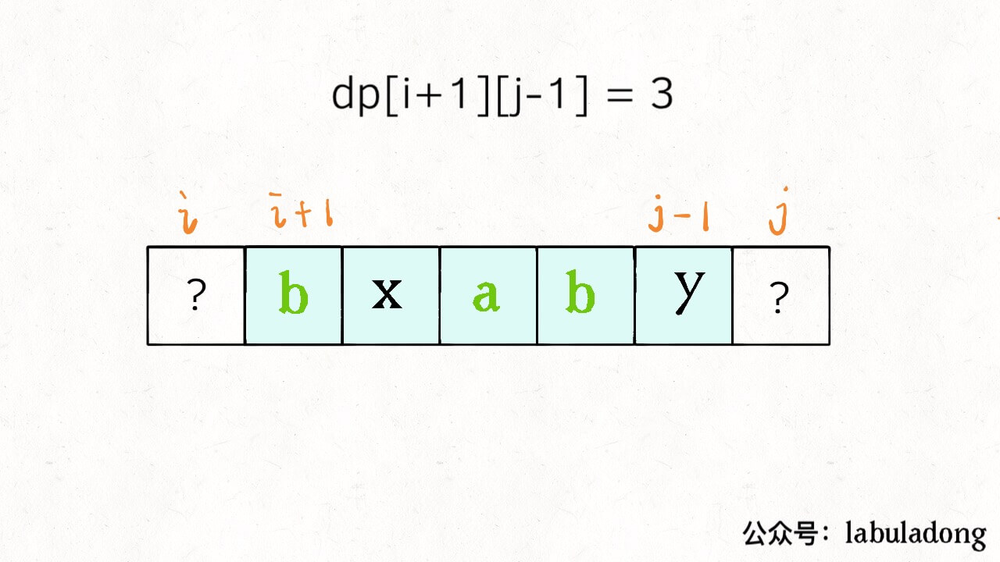
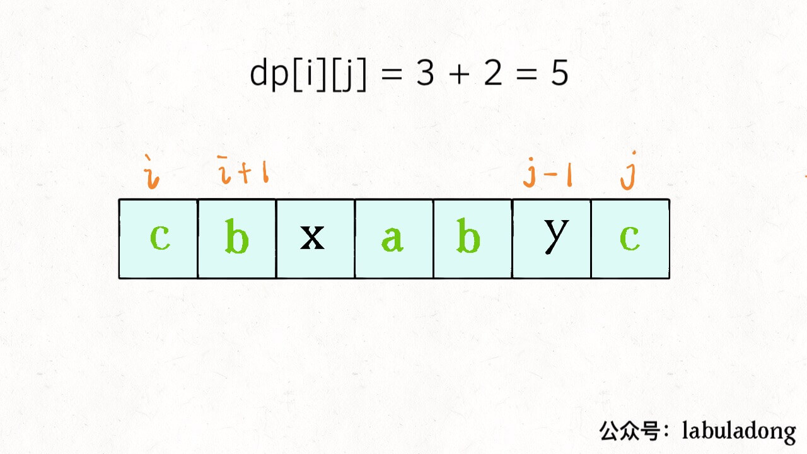
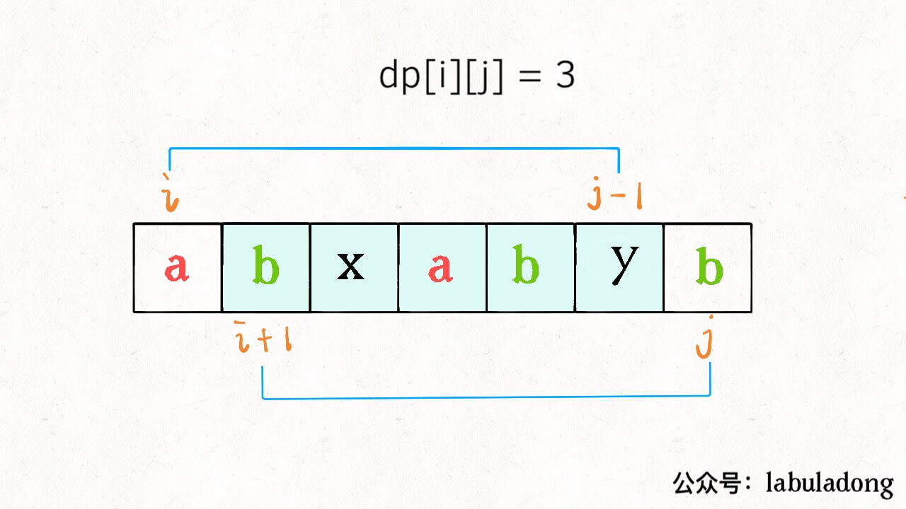

# 区间DP

参考 1：[oi-wiki 区间 DP](https://oi-wiki.org/dp/interval/)

参考 2：[既是经典区间 DP，也是经典博弈论](https://mp.weixin.qq.com/s?__biz=MzU4NDE3MTEyMA==&mid=2247489400&idx=1&sn=0b629d3669329a6bf4f6ec71c2571ce7&chksm=fd9cbc67caeb357132fe0a1ca6240e2183748d94039100f539193d3eeb1dc223e0ddd4aa9584&token=2094656911&lang=zh_CN#rd)

参考 3：[石子游戏：对于先手玩家，有两种拿法](https://leetcode-cn.com/problems/stone-game/solution/shi-zi-you-xi-dong-tai-gui-hua-qu-jian-d-5ra8/)

## 概念

区间类动态规划是线性动态规划的扩展，它在分阶段地划分问题时，与阶段中元素出现的顺序和由前一阶段的哪些元素合并而来有很大的关系。

令状态 f(left, right) 表示将下标位置 left 到 right 的所有元素合并能获得的价值的最大值，cost 为将这两组元素合并起来的代价，那么
$$
f(left, right) = max(f(left, k),f(k+1,right)) + cost \ \ \ \ \ \ k\in[left,right]
$$
区间 DP 的特点：

**合并**：即将两个或多个部分进行整合，当然也可以反过来；

**特征**：能将问题分解为能两两合并的形式；

**求解**：对整个问题设最优值，**枚举合并点，将问题分解为左右两个部分**，最后合并两个部分的最优值得到原问题的最优值。

**返回**：通常返回整个区间的解 `dp[0][n-1]`

### 1、经典遍历方法

**如何遍历「一定要会」**：对于区间 `dp[left][right]` 来说，将 `left` 从 `n - 1` 往前遍历到 `0`，而 `right` 从 `left` 位置往后遍历到 `n-1`，这样能够方便 `left < right`，将大区间划分成小区间。从小区间开始判断，不断的扩大我们的判断范围看会不会赢

### 2、经典初始化方法

`dp[left][right]` ，left 等于 right 时每个值默认为 1，为自身

### 3、经典返回方法

`dp[0][n - 1]` 描述了整个区间的结果，将其返回

## 一、猜数字大小

题目：[375. 猜数字大小 II](https://leetcode-cn.com/problems/guess-number-higher-or-lower-ii/)

通过「记忆化搜索」的递归过程，我们发现，在求解 [i, j] 的最小成本时，需要依赖于 [i, k - 1] 和 [k + 1, j] 这样的比 [i, j] 更小的区间。

这引导我们使用「区间 DP」进行求解

**定义状态数组和状态**：`dp[i][j]` 为区间 [i, j] 内进行猜数的最小成本

**状态方程**：结合【确保你获胜的最小现金数】这个条件
$$
f(i,j) = \min\limits_{i<=k<=j}\{max(f(i,k-1),f(k+1,j)+k)\}
$$
最终的 `dp[i][j]` 为所有可选的数值 `k` 中的最小值

时间复杂度：`O(n^3)`

空间复杂度：`O(n^2)`

```cpp
class Solution {
public:
    int getMoneyAmount(int n) {
        // 初始化动态数组
        vector<vector<int>> dp(n + 2, vector<int>(n + 2));

        // 区间dp的常用遍历方法，可确保left<right
        for (int left = n - 1; left >= 1; left--) {
            for (int right = left + 1; right <= n; right++) {
                int tmp = INT_MAX;
                for (int k = left; k <= right; k++) {
                    tmp = min(tmp, max(dp[left][k - 1], dp[k + 1][right]) + k);
                }
                dp[left][right] = tmp;
            }
        }
        return dp[1][n];
    }
};
```

```
问：为什么在循环中 int left = n - 1、int right = left + 1？
答：注意，right不可与left重合，因为重合时left=right=k，dp[k][k]将会等于k，而dp[k][k]根据题意初始时为0，且之后状态不会刷新

问：动态数组的size为n+2？
答：首先+1是因为，我们使用数组的范围是[1,n]，因此申请n+1个位置
再+1是因为，在第三个循环会使 k=right，而且需要使用dp[k+1]，right所使用的范围是[1,n]，那么 k+1=right+1 所使用的范围是[1,n+1]
因此，需要动态数组的size为n+2
```

## 二、石子游戏

题目：[877. 石子游戏](https://leetcode-cn.com/problems/stone-game/)

亚历克斯和李用几堆石子在做游戏。偶数堆石子排成一行，每堆都有正整数颗石子 piles[i] 。

游戏以谁手中的石子最多来决出胜负。石子的总数是奇数，所以没有平局。

亚历克斯和李轮流进行，亚历克斯先开始。 每回合，玩家从行的开始或结束处取走整堆石头。 这种情况一直持续到没有更多的石子堆为止，此时手中石子最多的玩家获胜。

假设亚历克斯和李都发挥出最佳水平，当亚历克斯赢得比赛时返回 true ，当李赢得比赛时返回 false 。

```
输入：piles = [5,3,4,5]
输出：true
解释：
Alice 先开始，只能拿前 5 颗或后 5 颗石子 。
假设他取了前 5 颗，这一行就变成了 [3,4,5] 。
如果 Bob 拿走前 3 颗，那么剩下的是 [4,5]，Alice 拿走后 5 颗赢得 10 分。
如果 Bob 拿走后 5 颗，那么剩下的是 [3,4]，Alice 拿走后 4 颗赢得 9 分。
这表明，取前 5 颗石子对 Alice 来说是一个胜利的举动，所以返回 true 。
```

提示：

- 2 <= piles.length <= 500
- piles.length 是偶数。
- 1 <= piles[i] <= 500
- sum(piles) 是奇数。

**解题步骤**:

**定义 `dp[left][right]` 为考虑区间 [left, right] ，在双方都做最好选择的情况下，先手与后手的最大得分差值为多少。**

那么 `dp[0][n-1]` 为考虑所有石子，先手与后手的得分差值：

- `dp[0][n-1]` > 0，则先手必胜，返回 `True`
- `dp[0][n-1]` < 0，则先手必败，返回 `False`

不失一般性的考虑 `dp[left][right]` 如何转移。根据题意，只能从两端取石子，共两种情况：

- 从左端取石子，价值为 `piles[left]`；先手取完石子后，**会导致下次变为后手**，由先后变成后手损失的值就是「先手与后手的最大得分差值」`dp[left+1][right]`。**因此本次先手从左端点取石子的话，双方差值为**：

$$
a = piles[left] - dp[left+1][right]
$$

- 从右端取石子，价值为 `piles[right]`；同理由先后变成后手损失的值为 `dp[left][right-1]`。**因此本次先手从右端点取石子的话，双方差值为**：

$$
b = piles[right] - dp[left][right-1]
$$

双方都想赢，都会做最优决策（即使自己与对方分差最大）。因此 `dp[left][right]` 为**上述两种情况中的最大值**
$$
dp[left][right] = max(a,b)
$$
根据状态转移方程，我们发现大区间的状态值依赖于小区间的状态值，典型的区间 DP 问题。

**初始化**：当只有一个数时 `dp[i][i]`，此时先手的必赢，所以 `dp[i][i] = piles[i]`

**如何遍历「经典写法，一定要会」**：对于区间 `dp[left][right]` 来说，将 `left` 从 `n - 1` 往前遍历到 `0`，而 `right` 从 `left` 位置往后遍历到 `n-1`，这样能够方便 `left < right`，将大区间划分成小区间。从小区间开始判断，不断的扩大我们的判断范围看会不会赢

时间复杂度：`O(n^2)`

空间复杂度：`O(n^2)`

```cpp
class Solution {
public:
    bool stoneGame(vector<int>& piles) {
        int n = piles.size();
        vector<vector<int>> dp(n, vector<int>(n));

        // 初始化 dp 数组
        for (int i = 0; i < n; i++) {
            dp[i][i] = piles[i];
        }
        // 状态更新
        for (int left = n - 1; left >= 0; left--) {
            for (int right = left + 1; right < n; right++) {
                int a = piles[left] - dp[left + 1][right];
                int b = piles[right] - dp[left][right - 1];
                dp[left][right] = max(a, b);
            }
        }
        return dp[0][n - 1] > 0;
    }
};

```

此题还有「博弈论」的解法：先手的人必然获胜

## 三、最长回文子序列

题目：[516. 最长回文子序列](https://leetcode-cn.com/problems/longest-palindromic-subsequence/)

给你一个字符串 `s` ，找出其中最长的回文子序列，并返回该序列的长度。

- `1 <= s.length <= 1000`
- `s` 仅由小写英文字母组成

```
输入：s = "bbbab"
输出：4
解释：一个可能的最长回文子序列为 "bbbb" 。

输入：s = "cbbd"
输出：2
解释：一个可能的最长回文子序列为 "bb" 。
```

**1. 状态定义**

`dp[i][j]` 表示 `s` 的第 `i` 个字符到第 `j` 个字符组成的子串中，最长回文序列的长度

> 不可将状态定义：dp[i] 为 nums[i] 结尾的最长回文子序列，时间复杂度为 O(n^3)

**2. 状态转移方程**

如果求 `dp[i][j]`，假设知道了子问题 `dp[i+1][j-1]` 的结果（s[i+1..j-1] 中最长回文子序列的长度），是否能想办法算出 `dp[i][j]` 的值（s[i..j] 中，最长回文子序列的长度）呢？



可以！这取决于区间首尾 `s[i]` 和 `s[j]` 的字符

- **如果区间首尾相等，首尾「必然参与」构成当前的最长回文子序列**，那么它俩加上 `s[i+1..j-1]` 中的最长回文子序列就是 `s[i..j]` 的最长回文子序列：



- **如果区间首尾不相等，首尾「必然不同时参与」构成当前的最长回文子序列**，说明它俩不可能同时出现在 s[i..j] 的最长回文子序列中，那么把它俩分别加入 s[i+1..j-1] 中，看看哪个子串产生的回文子序列更长即可：



因此，写出状态转移方程：
$$
dp[i][j] = 
\begin{cases}
dp[i+1][j-1] + 2 & s[i] = s[j] \\ \\
max(dp[i+1][j], dp[i][j-1]) & s[i] \neq s[j]
\end{cases}
$$
对于区间 `dp[left][right]` 来说，将 `left` 从 `n - 1` 往前遍历到 `0`，而 `right` 从 `left` 位置往后遍历到 `n-1`，这样能够方便 `left < right`，将大区间划分成小区间。

**3. 初始化**

`dp[left][right]` ，left 等于 right 时每个值默认为 1，s 中单个元素可构成回文子序列

**4. 返回**

`dp[0][n - 1]` 整个 s 的最长回文子串长度

**复杂度分析**

时间复杂度：`O(n^2)`

空间复杂度：`O(n^2)`

```cpp
class Solution {
public:
    int longestPalindromeSubseq(string s) {
        int n = s.size();
        vector<vector<int>> dp(n, vector<int>(n, 0));
        for (int i = 0; i < n; i++) {
            dp[i][i] = 1;
        }

        for (int left = n - 1; left >= 0; left--) {
            for (int right = left + 1; right < n; right++) {
                if (s[left] == s[right]) {
                    dp[left][right] = dp[left + 1][right - 1] + 2;
                } else if (s[left] != s[right]) {
                    dp[left][right] = max(dp[left + 1][right], dp[left][right - 1]);
                }
            }
        }
        return dp[0][n - 1];
    }
};

```

## 四、最长回文子串

题目：[5. 最长回文子串](https://leetcode-cn.com/problems/longest-palindromic-substring/)

给你一个字符串 `s`，找到 `s` 中最长的回文子串。

- `1 <= s.length <= 1000`
- `s` 仅由数字和英文字母组成

注意：子串是连续的

```
输入：s = "babad"
输出："bab"
解释："aba" 同样是符合题意的答案。

输入：s = "cbbd"
输出："bb"
```

**1. 状态定义**

`dp[i][j]` 表示 `s` 的第 `i` 个字符到第 `j` 个字符组成的子串，是否可构成回文子串

> 其实也可以将子串的长度保存到 `dp[i][j]` 里面

- true 代表区间 [i,j] 为回文串
- false 代表区间 [i,j] 不为回文串

**2. 状态转移方程**

状态转移的分析过程与上题类似，但是要注意的是**子串是连续的**，所以 `d[i][j]` 能否构成回文子串，取决于两个因素

- 当前首位元素相同，`s[i] == s[j]`
- 前面的子串是回文的，`dp[i+1][j-1] == true`

可写出下面的转移过程：

```cpp
if (s[left] == s[right] && dp[left + 1][right - 1] == true) {
    dp[left][right] = true;
} else {
    dp[left][right] = false;
}
```

直到遇到上面第二个用例，s = "cbbd"，当 left = 1，right = 2 时，做的判断是：

```
s[1] == s[2] -> true
dp[2][1] -> false

从而导致 d[1][2] 错误的置为 false
```

错误的根源是，当「首尾元素紧挨着」的时候 left + 1 和 right - 1 引起的问题

因此，根据「**首尾元素是否紧挨着**」重新整理下状态转移方程

- 当首尾元素紧挨着，`right - left == 1`
  - 如果首尾元素相同，可构成回文串
  - 如果首尾元素不同，不构成回文串
- 当首尾元素中间有隔着的，`right - left > 1`
  - 当前首位元素相同 `s[i] == s[j]`，且前面的子串是回文的 `dp[i+1][j-1] == true`，可构成回文串
  - 当前首位元素不相同 或 前面的子串不回文，不构成回文串

**3. 初始化**

`dp[left][right]` ，left 等于 right 时每个值默认为 1，s 中单个元素可构成回文子串

**4. 返回**

在遍历的过程中，记录最长的子串出现的开始位置和长度

最后将这个最长的子串返回

**复杂度分析**

时间复杂度：`O(n^2)`

空间复杂度：`O(n^2)`

```cpp
class Solution {
public:
    string longestPalindrome(string s) {
        int n = s.size();
        vector<vector<bool>> dp(n, vector<bool>(n, false));
        // 初始化，单个元素为回文串
        for (int i = 0; i < n; i++) {
            dp[i][i] = true;
        }

        int begin = 0;
        int maxLen = 1;  // 初始相当于 1 个元素的长度
        for (int left = n - 1; left >= 0; left--) {
            for (int right = left + 1; right < n; right++) {
                if (right - left == 1) {  // 首尾紧挨着
                    if (s[left] == s[right]) {
                        dp[left][right] = true;
                    } else {
                        dp[left][right] = false;
                    }
                } else {  // 首尾中间有隔着的
                    if (s[left] == s[right] && dp[left + 1][right - 1] == true) {
                        dp[left][right] = true;
                    } else {
                        dp[left][right] = false;
                    }
                }

                // 记录答案
                if (dp[left][right] && right - left + 1 > maxLen) {
                    begin = left;
                    maxLen = right - left + 1;
                }
            }
        }
        return s.substr(begin, maxLen);
    }
};
```

