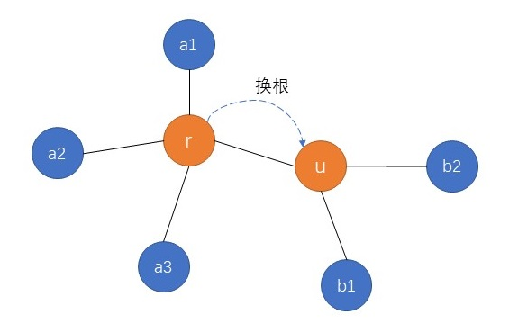

题目：[310. 最小高度树](https://leetcode.cn/problems/minimum-height-trees/)

树是一个无向图，其中任何两个顶点只通过一条路径连接。 换句话说，一个任何没有简单环路的连通图都是一棵树。

给你一棵包含 `n` 个节点的树，标记为 `0` 到 `n - 1` 。给定数字 `n` 和一个有 `n - 1` 条无向边的 `edges` 列表（每一个边都是一对标签），其中 `edges[i] = [ai, bi]` 表示树中节点 `ai` 和 `bi` 之间存在一条无向边。

可选择树中任何一个节点作为根。当选择节点 `x` 作为根节点时，设结果树的高度为 `h` 。在所有可能的树中，具有最小高度的树（即，`min(h)`）被称为 **最小高度树** 。

请你找到所有的 **最小高度树** 并按 **任意顺序** 返回它们的根节点标签列表。

树的 **高度** 是指根节点和叶子节点之间最长向下路径上边的数量。

**示例 1：**


```
输入：n = 4, edges = [[1,0],[1,2],[1,3]]
输出：[1]
解释：如图所示，当根是标签为 1 的节点时，树的高度是 1 ，这是唯一的最小高度树。
```

**示例 2：**


```
输入：n = 6, edges = [[3,0],[3,1],[3,2],[3,4],[5,4]]
输出：[3,4]
```

提示：

1 <= n <= 2 * 104
edges.length == n - 1
0 <= ai, bi < n
ai != bi
所有 (ai, bi) 互不相同
给定的输入 保证 是一棵树，并且 不会有重复的边

## 方法一：多源 bfs + 贪心

[题解来源](https://leetcode.cn/problems/minimum-height-trees/solution/zui-rong-yi-li-jie-de-bfsfen-xi-jian-dan-zhu-shi-x/)

根据题目的意思，就挨个节点遍历bfs，统计下每个节点的高度，然后用map存储起来，后面查询这个高度的集合里最小的就可以了。

但是这样会超时的。

于是我们看图分析一下，发现，**越是靠里面的节点越有可能是最小高度树**。

这里蕴含着「贪心」策略，**最小高度数的「根节点」一定是到最外层「叶节点」 1/2 距离的点**

所以，我们可以**倒着来**。

我们从边缘开始，先找到所有度为 1 的节点，然后把所有度为 1 的节点进队列，然后不断地 bfs，最后找到的就是两边同时向中间靠近的节点，那么这个中间节点就相当于把整个距离二分了，那么它当然就是到两边距离最小的点啦，也就是到其他叶子节点最近的节点了。

```c++
class Solution {
public:
    vector<int> findMinHeightTrees(int n, vector<vector<int>>& edges) {
        if (n == 1) return {0};

        // 临接表，度表
        vector<vector<int>> adj(n);
        vector<int> degree(n, 0);
        for (vector<int> edge : edges) {
            adj[edge[0]].push_back(edge[1]);
            adj[edge[1]].push_back(edge[0]);
            degree[edge[0]]++;
            degree[edge[1]]++;
        }

        // 度为 1 的「最外层页节点」入队列
        queue<int> q;
        for (int i = 0; i < n; i++) {
            if (degree[i] == 1) {
                q.push(i);
            }
        }

        vector<int> last_layer;  // 记录当前层，bfs结束后，保存了最后一层所有的节点
        while (!q.empty()) {
            int cnt = q.size();
            vector<int> layer;
            for (int i = 0; i < cnt; i++) {
                int cur = q.front();
                q.pop();

                layer.push_back(cur);  // 记录当前层的节点
                degree[cur]--;         // 当前节点的度减一，其实不要也行

                for (int next : adj[cur]) {
                    degree[next]--;  // 相邻节点的度减一
                    // 如果相邻节点成为叶子了，就放入队列，其实这里也内涵了不走回头路
                    if (degree[next] == 1) {
                        q.push(next);
                    }
                }
            }
            last_layer = layer;
        }
        return last_layer;
    }
};
```

## 方法二：树形dp（看不懂）

https://leetcode.cn/problems/minimum-height-trees/solution/by-ac_oier-7xio/


## 方法三：换根 dp（思路明白了，不会写）

这道题要求使得高度最小的树，一个直接的想法自然是尝试把每个点作为根节点，求出此时的树的高度，求出树的高度可以通过深度（广度）优先搜索解决。这个算法需要 n 次深度（广度）优先搜索求高度，每次深度（广度）优先搜索的复杂度为 O(n)，总的时间复杂度为 O(n^2)，在 10^4 量级的数据下会超时，因此需要优化。

观察上面的算法，可以发现，在一轮深度优先搜索中，其实不仅得到了「**以当前节点为根的树的高度**」，还得到了「**以每个节点为根的子树的高度**」，这些高度信息没有用到，被浪费掉了，**「换根动态规划」的思路就是利用这些信息来快速的计算出以其他节点为根时的树高**。

假设第一轮深度优先搜索中选择的根节点为 `r`。在以 `r` 为根的树中，设以节点 `u` 为根的子树的高度为 `height_r(u)`（注意这个是子树高度，下标 `r` 表示是以 `r` 为根的这颗大树的子树），以 `r` 为根的树高即为 `height_r(r)`，考虑通过子树高 `height_r` 来求解树高 `height`

首先考虑换根到与 `r` 相邻的节点。设某个与 `r` 相邻的节点为 `u`，与 `r` 相邻的节点中，除 `u` 外还有 `a_i,i=1,2,...`；与 `u` 相邻的节点中，除 `r` 还有 `b_i,i=1,2,...`



可以发现，在这种相邻的换根中，以 `a_i` 或 `b_i` 为根的子树高度是没有变化的，即 `height_r(a_i) == height_u(a_i)`、`height_r(b_i) == height_u(b_i)`，这意味着计算以 `u` 为根的树高时，大部分子树高没有变化，只需要重新计算以 r 为根的子树高，而这个子树高 height_u(r) 有
$$
height_u(r) = \max\{height_u(ai),... \} + 1 = max\{height_r(ai),... \} + 1
$$
也就是把与 `r` 相邻的节点中去掉 `u`，剩余节点的子树高的最大值，虽然在计算 `r` 向 `u` 换根时，这一步需要遍历 `r` 的所有相邻节点，但 `r` 对每个相邻节点换根时，所有的值可以在「一次遍历」中算出，可以使用  [238. 除自身以外数组的乘积](https://leetcode-cn.com/problems/product-of-array-except-self/)  中的技巧，也可以**直接记录最大值和次大值**，因为只去掉了一个节点，因此结果不是最大值就是次大值。

由于 `height_r(u)` 中已经包含了以节点 `b_i` 为根的子树高，换根到 `u` 之后，只是增加了以节点 `r` 为根的子树，因此
$$
height_u(u) = \max(height_r(u), \ height_u(r) + 1)
$$
这样就在 `O(1)` 时间内计算出了以 `u` 为根的树高

如果使用记录最大值和次大值的方法，也可以直接用最大值加一来计算出树高。

上述过程只是从 `r` 到其相邻节点 `u` 的换根，换根后，`u` 就成为了新的根，因此可以再从 `u` 向其相邻节点换根，最终扩散到所有节点，这个换根过程本身也是一次深度优先搜索。

上面这个算法中，每个节点都要向周围的相邻节点换一次根，这些换根的运算量与当前节点的度成正比，由树的性质可知，树的所有节点的度之和为 `2(n−1)`，因此这个算法是 `O(n)` 的。

换根动态规划在 [834. 树中距离之和](https://leetcode-cn.com/problems/sum-of-distances-in-tree/) 中也有应用

```c++
// height0 表示子树高
// height 表示树高

class Solution {
public:
    // dfs1 计算以 0 号节点为根的树中，以各个节点为根的子树高
    void dfs1(vector<vector<int>>& graph, vector<int>& height0, int u) {
        height0[u] = 1;  // // 设置个默认值，更重要的是做个标记表示来过
        int h = 0;
        for (int v : graph[u]) {
            if (height0[v] != 0) continue;  // 防止向上走
            dfs1(graph, height0, v);
            h = max(h, height0[v]);
        }
        height0[u] = h + 1;
    }

    // dfs2 进行换根动态规划，计算出所有的树高
    void dfs2(vector<vector<int>>& graph, vector<int>& height0, vector<int>& height, int u) {
        // 计算子树高的最大值和次大值
        int first = 0;
        int second = 0;
        for (int v : graph[u]) {
            if (height0[v] > first) {
                second = first;
                first = height0[v];
            } else if (height0[v] > second)
                second = height0[v];
        }
        height[u] = first + 1;
        for (int v : graph[u]) {
            // 树高已计算，跳过这个节点
            if (height[v] != 0) continue;
            // 更新以当前节点为根的子树高，换根到 v
            height0[u] = (height0[v] != first ? first : second) + 1;
            // 这句代码和前面的 height[u] = first + 1 保留一个即可
            // height[v] = max(height0[v], height0[u] + 1);
            // 递归进行换根动态规划
            dfs2(graph, height0, height, v);
        }
    }

    vector<int> findMinHeightTrees(int n, vector<vector<int>>& edges) {
        vector<vector<int>> graph(n);
        for (const auto& e : edges) {
            graph[e[0]].push_back(e[1]);
            graph[e[1]].push_back(e[0]);
        }
        vector<int> height0(n, 0);  // 保存以 0 号节点为根的树中，以各个节点为根的子树高
        vector<int> height(n, 0);
        dfs1(graph, height0, 0);
        dfs2(graph, height0, height, 0);
        vector<int> ans;
        int h = n;
        for (int i = 0; i < n; ++i) {
            if (height[i] < h) {
                h = height[i];
                ans.clear();
            }
            if (height[i] == h)
                ans.push_back(i);
        }
        return ans;
    }
};

```

