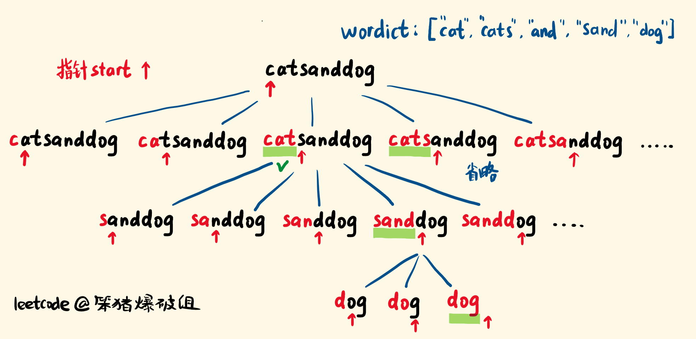

[140. 单词拆分 II](https://leetcode-cn.com/problems/word-break-ii/)

给定一个字符串 `s` 和一个字符串字典 `wordDict` ，在字符串 `s` 中增加空格来构建一个句子，使得句子中所有的单词都在词典中。**以任意顺序** 返回所有这些可能的句子。

**注意：**词典中的同一个单词可能在分段中被重复使用多次。

```
示例 1：

输入:s = "catsanddog", wordDict = ["cat","cats","and","sand","dog"]
输出:["cats and dog","cat sand dog"]

示例 2：

输入:s = "pineapplepenapple", wordDict = ["apple","pen","applepen","pine","pineapple"]
输出:["pine apple pen apple","pineapple pen apple","pine applepen apple"]
解释: 注意你可以重复使用字典中的单词。

示例 3：

输入:s = "catsandog", wordDict = ["cats","dog","sand","and","cat"]
输出:[]
```

提示：

1 <= s.length <= 20
1 <= wordDict.length <= 1000
1 <= wordDict[i].length <= 10
s 和 wordDict[i] 仅有小写英文字母组成
wordDict 中所有字符串都 不同

## 方法：记忆化搜索

观察「递归树」思考：

- 是否具备「最优子结构」，是
- 是否具备「重复子问题」，是



偷懒，没分析复杂度

```c++
class Solution {
public:
    int sz;
    vector<vector<string>> memo;
    unordered_set<string> wordSet;

    vector<string> dfs(int cur, string& s) {
        if (cur == sz) return {""};  // 达到结尾，返回空字符串
        if (memo[cur].size() != 0) return memo[cur];

        vector<string> res;
        for (int end = cur; end < sz; end++) {
            string sub = s.substr(cur, end - cur + 1);  // 获取下个可能的字符
            if (wordSet.count(sub)) {
                vector<string> right = dfs(end + 1, s);  // 当前字符后面的所有路径
                for (string path : right) {
                    if (path == "") {  // 如果这个路径是空，说明到底了
                        res.push_back(sub);
                    } else {  // 每个路径头上 加上 当前的字符
                        res.push_back(sub + " " + path);
                    }
                }
            }
        }
        memo[cur] = res;
        return res;
    }

    vector<string> wordBreak(string s, vector<string>& wordDict) {
        sz = s.size();
        for (string word : wordDict) {
            wordSet.insert(word);
        }
        // memo[i]表示，以s[i]结尾的所有可能
        for (int i = 0; i < sz; i++) {
            memo.push_back({});
        }
        return dfs(0, s);
    }
};
```

