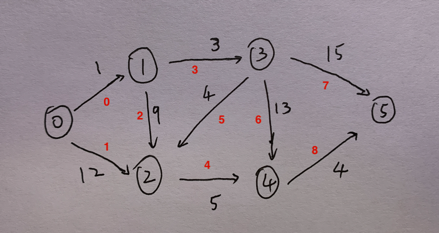

# 图的存储

在本文中，用 n 代指图的点数，用 m 代指图的边数，用 d(u) 代指点 的出度，即以 u 为出发点的边数。

下面的算法以这张图为例图


```python
# 原图以 [起点, 终点, 权值] 保存
graph = [
  [0, 1, 1], [0, 2, 12], 
  [1, 2, 9], [1, 3, 3], 
  [2, 4, 5], 
  [3, 2, 4], [3, 4, 13], [3, 5, 15], 
  [4, 5, 4]
]

n = 6
m = 9
```

## 一、邻接表

使用一个支持动态增加元素的数据结构构成的数组，其中`adj[u]` 存储的是点 的所有出边的相关信息（终点、边权等）。

```python
adj = collections.defaultdict(list)
for s, e, v in graph:
    adj[s].append((e, v))
"""
{
0: [(1, 1), (2, 12)], 1: [(2, 9), (3, 3)], 
2: [(4, 5)], 
3: [(2, 4), (4, 13), (5, 15)], 
4: [(5, 4)]
}
"""
```

### 应用

存各种图都很适合，除非有特殊需求（如需要快速查询一条边是否存在，且点数较少，可以使用邻接矩阵）。

尤其适用于需要对一个点的所有出边进行排序的场合。

### 复杂度

查询是否存在 u 到 v 的边：`O(d(u))` ,如果事先进行了排序就可以使用 [二分查找](https://oi-wiki.org/basic/binary/) 做到 `O(log(d(u)))`

遍历点 的所有出边：`O(d(u))`

遍历整张图：`O(n+m)`

空间复杂度：`O(m)`

## 二、邻接矩阵

```python
node_sz = 6
adj = [[float("inf") for _ in range(node_sz)] for _ in range(node_sz)]
for n in range(node_sz):
    adj[n][n] = 0
for s, e, v in graph:
    adj[s][e] = v
"""
[[0, 1, 12, inf, inf, inf], 
[inf, 0, 9, 3, inf, inf], 
[inf, inf, 0, inf, 5, inf], 
[inf, inf, 4, 0, 13, 15], 
[inf, inf, inf, inf, 0, 4], 
[inf, inf, inf, inf, inf, 0]]
"""
```

使用一个二维数组 `adj` 来存边，其中 `adj[u][v]` 为 u 到 v 的权值，正无穷表示不存在，自身设置为0。

这是一种使用二维矩阵来进行存图的方式。

适用于边数较多的**稠密图**使用，当边数量接近点的数量的平方，即 $m \approx n^2$ 时，可定义为稠密图。

### 应用

邻接矩阵只适用于没有重边（或重边可以忽略）的情况。

其最显著的优点是可以 `O(1)` 查询一条边是否存在。

由于邻接矩阵在稀疏图上效率很低（尤其是在点数较多的图上，空间无法承受），所以**一般只会在稠密图上使用邻接矩阵**。

### 复杂度

查询是否存在某条边：`O(1)`

遍历一个点的所有出边：`O(n)`

遍历整张图：`O(n^2)`

空间复杂度：`O(n^2)`

## 三、用类存边

这是一种最简单，但是相比上述两种存图方式，使用得较少的存图方式。

只有当我们需要确保某个操作复杂度严格为 `O(m)` 时，才会考虑使用。

```python
class Edge:
    def __init__(self, s, e, v):
        self.s = s
        self.e = e
        self.v = v

edges = []
for s, e, v in graph:
    edges.append(Edge(s, e, v))
```

## 四、一维数组

有些数据结构使用一维数组存储数据，比如：并查集

所以需要将二维的坐标转化为一维的数字

行数 * 总列数 + 列数

```c++
int rows = grid.size();
int cols = grid[0].size();
auto node = [&](int r, int c) {
    return r * cols + c;
};
```

恢复行和列时

```c++
int r = idx / cols;
int c = idx % cols;
```

## 五、前向星

前向星以储存边的方式来存储图，其通过读入每条边的信息，将边存放在数组中，把数组中的边按照起点顺序排序进行构造。

常用于具有多个点或两点间具有多条弧的情况，其缺点是不能直接用顶点进行定位。

```c++
int n,m;
vector<int> edge[N];
void init(){
    cin>>n>>m;
    for(int i=0;i<m;i++){
        int x,y;
        cin>>x>>y;//边所依附的两点编号
        edge[x].push_back(y);//添边x->y
        edge[y].push_back(x);//添边y->x
    }
}
```

由于前向星的效率并不高，因此可对其进行优化，在优化为链式前向星后，内存利用率极高，效率也得到了极大的提升，在图论题中，链式前向星可适用于所有的图。

## 六、链式前向星

这也是一种在图论中十分常见的存图方式，与**数组存储单链表**的实现一致（头插法）。

适用于边数较少的**稀疏图**使用，当边数量接近点的数量，可定义为**稀疏图**。

**本质上是用链表实现的邻接表**，核心代码如下：

```c++
// n 个节点，m 条边
vector<int> head(n, -1);
vector<int> edge(m);
vector<int> neighbor(m, -1);
vector<int> weight(m);
int idx = 0;

// 从 a 指向 b 权重是 c
void add(int a, int b, int c) {
    edge[idx] = b;            // 记录 idx 边指向 b 点
    neighbor[idx] = head[a];  // 记录 idx 边前面的那个边（同一源点）
    head[a] = idx;            // 记录 a 点的出边 idx
    weight[idx] = c;          // 记录 idx 边的权重为 c
    idx++;                    // 更新 idx 为下一条边
}
```

首先 `idx` 是用来对边进行编号的，然后对存图用到的几个数组作简单解释（解释挺费解的）：

- `head` 数组：存储是某个节点所对应的边的集合（链表）的头结点；
- `edge` 数组：由于访问某一条边指向的节点；
- `neighbor` 数组：由于是以链表的形式进行存边，该数组就是用于找到下一条边；
- `weight` 数组：用于记录某条边的权重为多少。

因此当我们想要遍历所有由 `a` 点发出的边时，可以使用如下方式：

```c++
for (int i = head[a]; i != -1; i = neighbor[i]) {
    int b = edge[i], c = weight[i]; // 存在由 a 指向 b 的边，权重为 c
}
```

例如：



```c++
#include <iostream>
#include <vector>
using namespace std;

vector<vector<int>> graph = {
  {0, 1, 1}, {0, 2, 12}, 
  {1, 2, 9}, {1, 3, 3}, 
  {2, 4, 5}, 
  {3, 2, 4}, {3, 4, 13}, {3, 5, 15}, 
  {4, 5, 4}
};

int n = 6;
int m = 9;
vector<int> head(n, -1);
vector<int> edge(m);
vector<int> neighbor(m, -1);
vector<int> weight(m);
int idx = 0;

// 从 a 指向 b 权重是 c
void add(int a, int b, int c) {
    edge[idx] = b;            // 记录 idx 边指向 b 点
    neighbor[idx] = head[a];  // 记录 idx 边前面的那个边（同一源点）
    head[a] = idx;            // 记录 a 点的出边 idx
    weight[idx] = c;          // 记录 idx 边的权重为 c
    idx++;                    // 更新 idx 为下一条边
}

int main() {
    for (vector<int> g : graph) {
        add(g[0], g[1], g[2]);
    }
    // head(点): 1 3 4 7 8 0
    // edge(边): 1 2 2 3 4 2 4 5 5
    // neighbor(边): -1 0 -1 2 -1 -1 5 6 -1 
    // weight(边): 1 12 9 3 5 4 13 15 4

    int a = 3;
    for (int i = head[a]; i != -1; i = neighbor[i]) {
        int b = edge[i], c = weight[i];  // 存在由 a 指向 b 的边，权重为 c
        cout << b << " " << c << endl;
    }
    // 5 15
    // 4 13
    // 2 4
    return 0;
}
```

