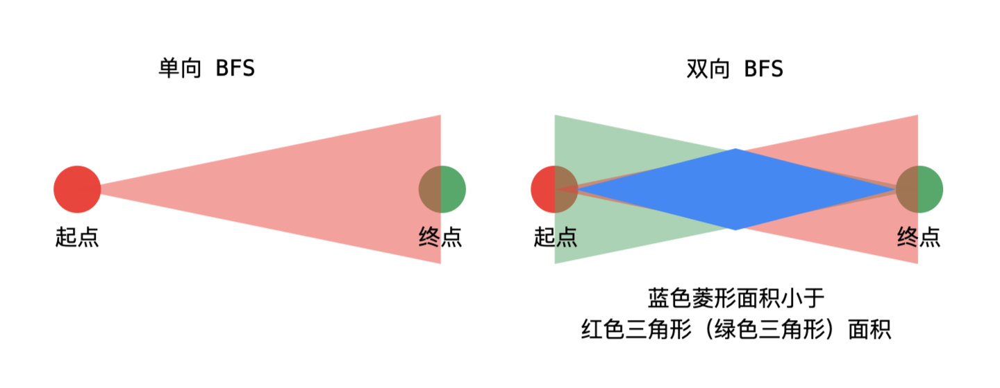

# BFS 广度优先搜索

Breath First Search

## 框架

### 1、逐个遍历

```cpp
bool bfs() {
    queue<int> q;
    vector<bool> vis(n);

    q.push(begin_node);
    vis[begin_node] = true;

    while (!q.empty()) {
        int cur = q.front();  // 弹出队头元素
        q.pop();

        if (cur == target) return ture;

        action(cur);  // 有些题目需要对当前元素做处理

        for (int x : cur.children) {
            if (!vis[x]) {
                q.push(x);
                vis[x] = true;
            }
        }
    }
    return false;
}
```

### 2、逐层遍历

```cpp
bool bfs() {
    // 初始化队列及标记数组，存入起点
    queue<int> q;
    vector<bool> vis(n);

    q.push(begin_node);  // 存入起点，标记
    vis[begin_node] = true;

    // 开始搜索
    while (!q.empty()) {
        int cnt = q.size();  // 本层需要扩展的节点个数

        // 本层循环
        for (int i = 0; i < n; i++) {
            int cur = q.front();  // 弹出队头元素
            q.pop();

            // 找到答案，退出搜索
            if (cur == target) return ture;

            action(cur);  //有些题目需要对当前元素做处理

            for (int x : cur.children) {
                if (!vis[x]) {
                    q.push(x);
                    vis[x] = true;
                }
            }
        }
    }
    return false;
}
```
### 3、最短路径

节点深度可以和节点值一起记录，当然也可以使用 tuple 记录更多的值

也可以在 visited 中记录节点深度

```python
int bfs() {
    // 1.初始化队列及标记数组，存入起点
    queue<pair<int, int>> q;
    vector<bool> vis(n);

    q.push({begin_node, 0});  // 存入起点，起始距离0，标记
    vis[begin_node] = true;

    // 2.开始搜索
    while (!q.empty()) {
        auto [cur, dist] = q.front();  // 弹出队头元素
        q.pop();

        // 找到答案，返回结果
        if (cur == target) return dist;

        action(cur);  //有些题目需要对当前元素做处理

        for (int x : cur.children) {
            if (!vis[x]) {
                q.push({x, dist + 1});
                vis[x] = true;
            }
        }
    }

    return -1;
}
```

### 4、双向 bfs

**起点和终点都明确的时候，可以用双向 bfs**

通常用来解决「搜索空间爆炸问题」



一定要注意：转向问题，即

**「从左往右」和「从右往左」遍历时候的「入队出队条件」可能会不一样**

```python
l_queue = [begin]
r_queue = [end]
l_visited = set([begin])
r_visited = set([end])
depth = 1

while l_queue and r_queue:

    if len(l_queue) > len(r_queue):
        # 每次都走短的一侧，能走最小的面积
        l_queue, r_queue = r_queue, l_queue
        l_visited, r_visited = r_visited, l_visited

    queue_sz = len(l_queue)
    for _ in range(queue_sz):   # 每层开始遍历
        cur = l_queue.pop(0)
        if cur in r_visited:    # 如果当前节点在另一侧走过，说明在这一层出现交点了
            return depth        # 找到相交时，两边合计做过的层数
        for cur 的所有相邻结点 next_node:
            if next_node not in l_visited:
                l_queue.append(n_node)
                l_visited.add(n_node)
    depth += 1
```

### 5、多源 bfs

- BFS 起点：最开始将每个起点都存入队列，遍历的时候就相当于多起点「并排」在往前走
- BFS 终点：并排往前走，有一个先达到终点，就返回答案

```cpp
bool bfs() {
    queue<int> q;
    vector<bool> vis(n);
	
    for (int start : start_list) {
        q.push(start);
        vis[start] = true;
    }

    while (!q.empty()) {
        int cur = q.front();  // 弹出队头元素
        q.pop();

        if (cur == target) return ture;

        action(cur);  // 有些题目需要对当前元素做处理

        for (int x : cur.children) {
            if (!vis[x]) {
                q.push(x);
                vis[x] = true;
            }
        }
    }
    return false;
}
```

