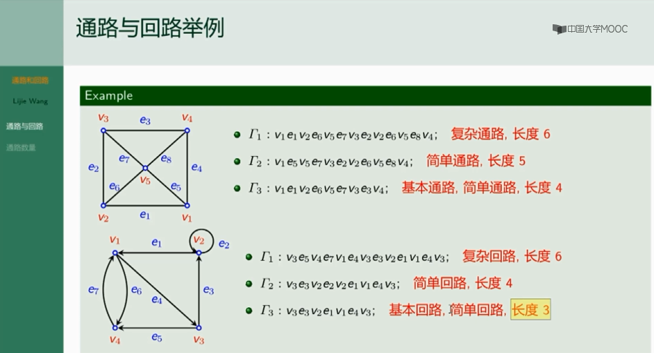

# 欧拉图

参考 1：[https://oi-wiki.org/graph/euler/](https://oi-wiki.org/graph/euler/)

参考 2：[图的连通性——通路和回路](https://blog.csdn.net/qq_21774161/article/details/103063860)

## 前置知识

### 通路和回路

图中的一条序列为：$$ v_0 v_1 v_2 ... v_k$$  v为节点

**v0 到 vk 为一条通路，若 v0 = vk 时，此通路为回路**。v0 和 vk 分别为起点和终点

基本通路：通路中的所有边和点不相同

简单通路：通路中的所有边不相同

复杂通路：通路中的部分边相同

基本回路：回路中除起点和终点外的所有点不相同，所有边不相同

简单回路：回路中的所有边不相同

复杂回路：回路中的部分边相同




## 应用场景

从一个点开始一笔画完整个图

## 概念

欧拉图就是从任意一个点开始都可以一笔画完整个图，半欧拉图必须从某个点开始才能一笔画完整个图。

欧拉通路：通过图中所有边恰好一次且行遍所有顶点的通路

欧拉回路：通过图中所有边恰好一次且行遍所有顶点的回路

欧拉图：**具有欧拉回路**的无向图或有向图

半欧拉图：**具有欧拉通路但不具有欧拉回路**的无向图或有向图

## 性质

对于无向图，欧拉图中所有顶点的度数都是偶数，因为每个点的入度和出度成对出现

对于有向图，欧拉图中所有节点的入度和出度都相等

有向图中存在欧拉通路的两种情况：

- 欧拉通路的**起点为入度比出度恰好少 1 的节点，终点为入度恰好比出度多 1 的节点**
- 所有节点的入度和出度都相等，那么从任意节点开始都存在欧拉通路，也就是欧拉回路

## 判别一个图是否为欧拉图

对于无向图， 当且仅当是连通图且没有奇度顶点时，为欧拉图

对于无向图 ，当且仅当是连通图且图中恰有0个或2个奇度顶点时，为半欧拉图

对于有向图 ，当且仅当所有顶点属于同一个强连通分量且每个顶点的入度和出度相同时，为欧拉图

对于有向图 ， 当且仅当满足下面条件时，为半欧拉图

- 如果将所有的有向边退化为无向边时，那么所有顶点属于同一个连通分量。
- 最多只有一个顶点的出度与入度差为 1。
- 最多只有一个顶点的入度与出度差为 1。
- 所有其他顶点的入度和出度相同。

## Hierholzer 算法求欧拉通路、回路(节点)或欧拉路径(边)

Hierholzer 算法流程如下：

- 从起点出发，进行深度优先搜索。
- **每次沿着某条边从某个顶点移动到另外一个顶点的时候，都需要删除这条边（灵魂）**
- 如果没有可移动的路径，则将所在节点加入到结果中，并返回。

当我们顺序地考虑该问题时，我们也许很难解决该问题，因为我们无法判断当前节点的哪一个分支是「死胡同」分支。

不妨倒过来思考。我们注意到只有那个入度与出度差为 1 的节点会导致死胡同。而该节点必然是最后一个遍历到的节点。我们可以改变记录的规则，当我们遍历完一个节点所连的所有节点后，我们才将该节点记录（即逆序）。

**对于当前节点而言，从它的每一个非「死胡同」分支出发进行深度优先搜索，都将会搜回到当前节点**

**而从它的「死胡同」分支出发进行深度优先搜索将不会搜回到当前节点**

**也就是说当前节点的死胡同分支将会优先于其他非「死胡同」分支记录**

这样就能保证我们可以「一笔画」地走完所有边，最终的记录结果逆序地保存了「一笔画」的结果。我们只要将结果中的内容反转，即可得到答案。

**模版有四步：**

1. 建邻接表、入度表、出度表
2. 根据是通路还是回路判断是否要找起点start
3. Hierholzer 算法找路
4. 最后将上一步找的路再逆回来

时间复杂度：O(n+m) n节点的数量，m边的数量

空间复杂度：O(n)

### 欧拉通路

```python
def func():
    # 1、建邻接表adj、入度表indeg、出度表outdeg，省略...

    # 2、求欧拉通路时，需要先找到起点
    start = tickets[0][0]
    for x in outdeg:
        # 如果有节点入度比出度恰好少1，那么只有它才能是起始节点
        if outdeg[x] == indeg[x] + 1:
            start = x
            break
    print(start)

    # 3、Hierholzer 算法，深度优先搜索求解欧拉通路
    ans = []
    def dfs(node):
        while adj[node]:
            # 平常我们都是直接顺序枚举每个点的邻居，但这里我们倒着枚举
            # 仅是为了方便删掉枚举过的点，不影响结果
            # 重点理解：DFS的调用其实是一个拆边的过程
            v = adj[node].pop()
            dfs(v)
        ans.append(node)
    dfs(start)
    
    # 4、最后再逆回来，这里的逆序是由于递归是从最底层往上返回引起的
    return ans[::-1]
```

### 欧拉回路

```python
def func():
    # 1、建邻接表adj、入度表indeg、出度表outdeg，省略...

    # 2、dfs求解欧拉回路，回路的起点start可以是任何一个点
    ans = []
    def dfs(node):
        while adj[node]:
            v = adj[node].pop()
            dfs(v)
        ans.append(node)
    dfs(start)

    # 3、最后再逆回来
    return ans[::-1]
```

### 欧拉路径，当用边来记录时

```python
def func():
    # 1、建邻接表adj、入度表indeg、出度表outdeg，省略...

    # 2、根据是通路还是回路判断是否要找起点start

    # 3、dfs求解欧拉路径
    ans = []
    def dfs(node):
        while adj[node]:
            v = adj[node].pop()
            dfs(v)
            ans.append([node, v]) # 循环里记录结果
    dfs(start)

    # 4、最后再逆回来
    return ans[::-1]
```


## 例题

[332. 重新安排行程](https://leetcode-cn.com/problems/reconstruct-itinerary/)

[753. 破解保险箱](https://leetcode-cn.com/problems/cracking-the-safe/)

第270场周赛第四题：[2097. 合法重新排列数对](https://leetcode-cn.com/problems/valid-arrangement-of-pairs/)

