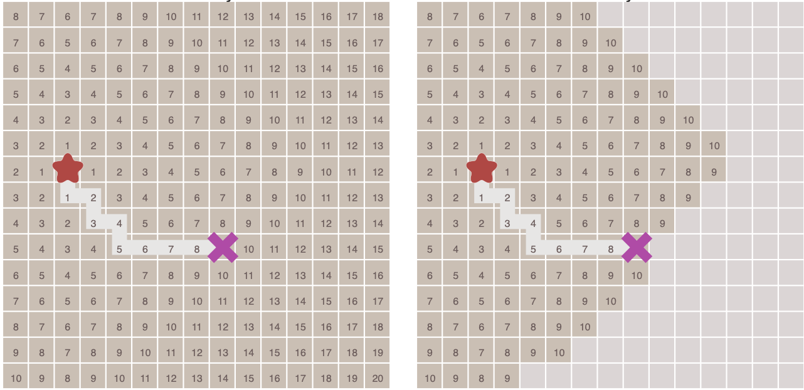
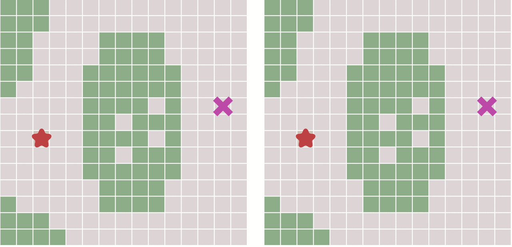
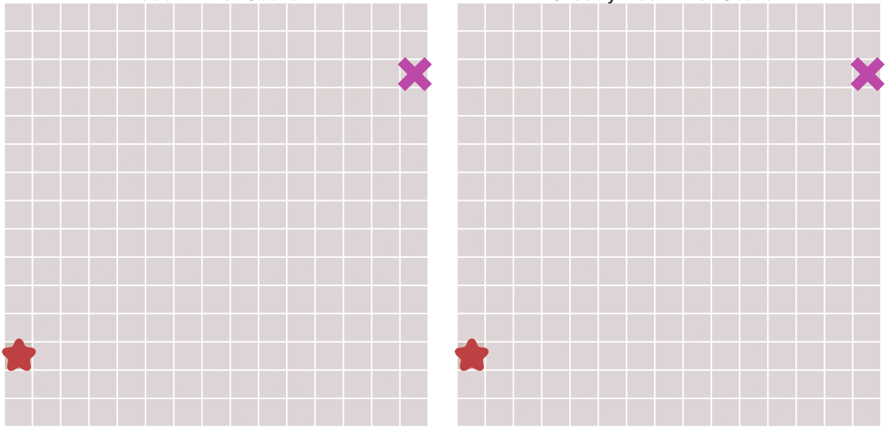
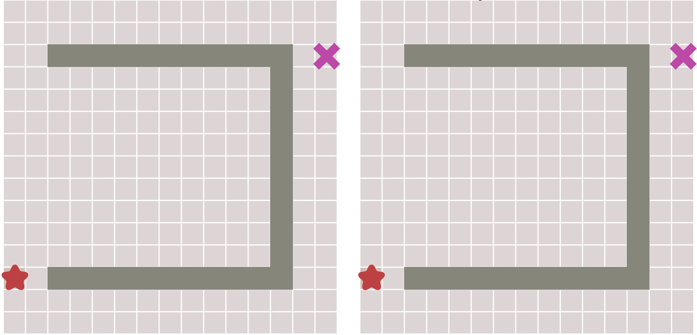
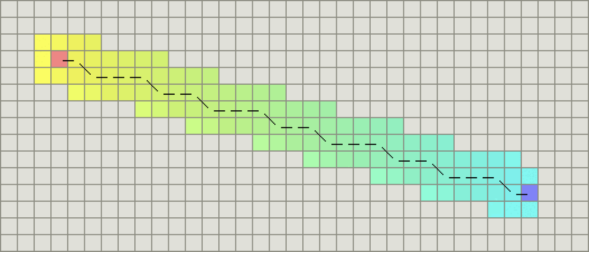

# A* 算法

参考1：[路径规划之 A* 算法](https://paul.pub/a-star-algorithm/?spm=a2c6h.12873639.article-detail.19.21834662UTcd0W#id-a%E7%AE%97%E6%B3%95)

参考2：[搜索算法(1)——启发式搜索1(GBFS) - 知乎 (zhihu.com)](https://zhuanlan.zhihu.com/p/110686645)

参考3：[搜索算法(1)——启发式搜索2(A*) - 知乎 (zhihu.com)](https://zhuanlan.zhihu.com/p/111350895)

参考4：[`A*`算法 和 `IDA*`算法_随心而动随意而行的博客](https://blog.csdn.net/u013009575/article/details/17140915)

参考5：[GitHub - zhm-real/PathPlanning: Common used path planning algorithms with animations.](https://github.com/zhm-real/PathPlanning)

又叫做有信息搜索(Informed Search)，该算法利用问题的启发信息(所求解问题相关的辅助信息)引导搜索过程，来减少搜索范围，降低问题复杂度。

## 一、算法介绍

A*（念做：A Star）算法是一种很常用的路径查找和图形遍历算法。它有较好的性能和准确度。本文在讲解算法的同时也会提供Python语言的代码实现，并会借助matplotlib库动态的展示算法的运算过程。

A*算法最初发表于1968年，由Stanford研究院的Peter Hart, Nils Nilsson以及Bertram Raphael发表。它可以被认为是Dijkstra算法的扩展。

由于借助启发函数的引导，A*算法通常拥有更好的性能。

## 二、广度优先搜索 bfs

为了更好的理解A*算法，我们首先从广度优先（Breadth First）算法讲起。

正如其名称所示，广度优先搜索以广度做为优先级进行搜索。

**从起点开始，首先遍历起点周围邻近的点，然后再遍历已经遍历过的点邻近的点，逐步的向外扩散，直到找到终点**。

这种算法就像洪水（Flood fill）一样向外扩张，算法的过程如下图所示：


在上面这幅动态图中，算法遍历了图中所有的点，这通常没有必要。对于有明确终点的问题来说，一旦到达终点便可以提前终止算法，下面这幅图对比了这种情况：



在执行算法的过程中，每个点需要记录达到该点的前一个点的位置 – 可以称之为父节点。这样做之后，一旦到达终点，便可以从终点开始，反过来顺着父节点的顺序找到起点，由此就构成了一条路径。

## 三、Dijkstra算法

Dijkstra算法是由计算机科学家[Edsger W. Dijkstra](https://en.wikipedia.org/wiki/Edsger_W._Dijkstra)在1956年提出的。

Dijkstra算法用来寻找图形中节点之间的最短路径。

考虑这样一种场景，在一些情况下，图形中相邻节点之间的移动代价并不相等。例如，游戏中的一幅图，既有平地也有山脉，那么游戏中的角色在平地和山脉中移动的速度通常是不相等的。

在Dijkstra算法中，需要计算每一个节点距离起点的总移动代价。同时，还需要一个优先队列结构。对于所有待遍历的节点，放入优先队列中会按照代价进行排序。

**在算法运行的过程中，每次都从优先队列中选出代价最小的作为下一个遍历的节点。直到到达终点为止**。

下面对比了不考虑节点移动代价差异的广度优先搜索与考虑移动代价的Dijkstra算法的运算结果：



> 当图形为网格图，并且每个节点之间的移动代价是相等的，那么Dijkstra算法将和广度优先算法变得一样。

## 四、最佳优先搜索 Best First

在一些情况下，如果我们可以预先计算出每个节点到终点的距离，则我们可以利用这个信息更快的到达终点。

其原理也很简单。**与Dijkstra算法类似，我们也使用一个优先队列，但此时以每个节点到达终点的距离作为优先级，每次始终选取到终点移动代价最小（离终点最近）的节点作为下一个遍历的节点**。这种算法称之为最佳优先（Best First）算法。

这样做可以大大加快路径的搜索速度，如下图所示：



但这种算法会不会有什么缺点呢？答案是肯定的。

因为，如果起点和终点之间存在障碍物，则**最佳优先算法找到的很可能不是最短路径**，下图描述了这种情况。



## 五、A*算法

对比了上面几种算法，最后终于可以讲解本文的重点：A*算法了。

下面的描述我们将看到，A*算法实际上是综合上面这些算法的特点于一身的。

A*算法通过下面这个函数来计算每个节点的优先级。
$$
f(n)=g(n)+h(n)
$$
其中：

- `f(n)` 是节点n的综合优先级。当我们选择下一个要遍历的节点时，我们总会选取综合优先级最高（值最小）的节点。
- `g(n)` 是节点n距离起点的代价。
- `h(n)` 是节点n距离终点的预计代价，这也就是A*算法的启发函数。关于启发函数我们在下面详细讲解。

A*算法在运算过程中，每次从优先队列中选取f(n)值最小（优先级最高）的节点作为下一个待遍历的节点。

另外，A*算法使用两个集合来表示待遍历的节点，与已经遍历过的节点，这通常称之为`open_set`和`close_set`。

完整的A*算法描述如下：

```
* 初始化open_set和close_set；
* 将起点加入open_set中，并设置优先级为0（优先级最高）；
* 如果open_set不为空，则从open_set中选取优先级最高的节点n：
    * 如果节点n为终点，则：
        * 从终点开始逐步追踪parent节点，一直达到起点；
        * 返回找到的结果路径，算法结束；
    * 如果节点n不是终点，则：
        * 将节点n从open_set中删除，并加入close_set中；
        * 遍历节点n所有的邻近节点：
            * 如果邻近节点m在close_set中，则：
                * 跳过，选取下一个邻近节点
            * 如果邻近节点m也不在open_set中，则：
                * 设置节点m的parent为节点n
                * 计算节点m的优先级
                * 将节点m加入open_set中
```

### 1、启发函数

上面已经提到，启发函数会影响A*算法的行为。

- 在极端情况下，当启发函数h(n)始终为0，则将由g(n)决定节点的优先级，此时算法就退化成了Dijkstra算法。
- 如果h(n)始终小于等于节点n到终点的代价，则A*算法保证一定能够找到最短路径。但是当h(n)的值越小，算法将遍历越多的节点，也就导致算法越慢。
- 如果h(n)完全等于节点n到终点的代价，则A*算法将找到最佳路径，并且速度很快。可惜的是，并非所有场景下都能做到这一点。因为在没有达到终点之前，我们很难确切算出距离终点还有多远。
- 如果h(n)的值比节点n到终点的代价要大，则A*算法不能保证找到最短路径，不过此时会很快。
- 在另外一个极端情况下，如果h(n)相较于g(n)大很多，则此时只有h(n)产生效果，这也就变成了最佳优先搜索。

由上面这些信息我们可以知道，通过调节启发函数我们可以控制算法的速度和精确度。因为在一些情况，我们可能未必需要最短路径，而是希望能够尽快找到一个路径即可。这也是A*算法比较灵活的地方。

对于网格形式的图，有以下这些启发函数可以使用：

- 如果图形中只允许朝上下左右四个方向移动，则可以使用曼哈顿距离（Manhattan distance）。
- 如果图形中允许朝八个方向移动，则可以使用对角距离。
- 如果图形中允许朝任何方向移动，则可以使用欧几里得距离（Euclidean distance）。

### 2、关于距离

#### 1）曼哈顿距离

如果图形中只允许朝上下左右四个方向移动，则启发函数可以使用曼哈顿距离，它的计算方法如下图所示：


计算曼哈顿距离的函数如下，这里的D是指两个相邻节点之间的移动代价，通常是一个固定的常数。

```
function heuristic(node) =
    dx = abs(node.x - goal.x)
    dy = abs(node.y - goal.y)
    return D * (dx + dy)
```

#### 2）对角距离

如果图形中允许斜着朝邻近的节点移动，则启发函数可以使用对角距离。它的计算方法如下：



计算对角距离的函数如下，这里的D2指的是两个斜着相邻节点之间的移动代价。如果所有节点都正方形，则其值就是 $\sqrt[]{2} * D$。

```
function heuristic(node) =
    dx = abs(node.x - goal.x)
    dy = abs(node.y - goal.y)
    return D * (dx + dy) + (D2 - 2 * D) * min(dx, dy)
```

#### 3）欧几里得距离

如果图形中允许朝任意方向移动，则可以使用欧几里得距离。

欧几里得距离是指两个节点之间的直线距离，因此其计算方法也是我们比较熟悉的：
$$
\sqrt{(x_2-x_1)^2 + (y_2-y_1)^2}
$$
其函数表示如下：

```
function heuristic(node) =
    dx = abs(node.x - goal.x)
    dy = abs(node.y - goal.y)
    return D * sqrt(dx * dx + dy * dy)
```

## 六、算法实现

虽然前面介绍了很多内容，但实际上A*算法并不复杂，实现起来也比较简单。

下面我们给出一个Python语言的代码示例。

之所以使用Python语言是因为我们可以借助matplotlib库很方便的将结果展示出来。在理解了算法之后，通过其他语言实现也并非难事。

> 算法的源码可以到我的github上下载：[paulQuei/a-star-algorithm](https://github.com/paulQuei/a-star-algorithm)。

我们的算法演示的是在一个二维的网格图形上从起点找寻终点的求解过程。

### 1、坐标点与地图

首先，我们创建一个非常简单的类来描述图中的点，相关代码如下：

```python
# point.py
import sys

class Point:
    def __init__(self, x, y):
        self.x = x
        self.y = y
        self.cost = sys.maxsize
```

接着，我们实现一个描述地图结构的类。为了简化算法的描述:

**我们选定左下角坐标[0, 0]的点是算法起点，右上角坐标[size - 1, size - 1]的点为要找的终点。**

为了让算法更有趣，我们在地图的中间设置了一个障碍，并且地图中还会包含一些随机的障碍。该类的代码如下：

```python
# random_map.py

import numpy as np

import point

class RandomMap:
    def __init__(self, size=50): ①
        self.size = size
        self.obstacle = size//8 ②
        self.GenerateObstacle() ③

    def GenerateObstacle(self):
        self.obstacle_point = []
        self.obstacle_point.append(point.Point(self.size//2, self.size//2))
        self.obstacle_point.append(point.Point(self.size//2, self.size//2-1))

        # Generate an obstacle in the middle
        for i in range(self.size//2-4, self.size//2): ④
            self.obstacle_point.append(point.Point(i, self.size-i))
            self.obstacle_point.append(point.Point(i, self.size-i-1))
            self.obstacle_point.append(point.Point(self.size-i, i))
            self.obstacle_point.append(point.Point(self.size-i, i-1))

        for i in range(self.obstacle-1): ⑤
            x = np.random.randint(0, self.size)
            y = np.random.randint(0, self.size)
            self.obstacle_point.append(point.Point(x, y))

            if (np.random.rand() > 0.5): # Random boolean ⑥
                for l in range(self.size//4):
                    self.obstacle_point.append(point.Point(x, y+l))
                    pass
            else:
                for l in range(self.size//4):
                    self.obstacle_point.append(point.Point(x+l, y))
                    pass

    def IsObstacle(self, i ,j): ⑦
        for p in self.obstacle_point:
            if i==p.x and j==p.y:
                return True
        return False
```

这段代码说明如下：

1. 构造函数，地图的默认大小是50x50；
2. 设置障碍物的数量为地图大小除以8；
3. 调用`GenerateObstacle`生成随机障碍物；
4. 在地图的中间生成一个斜着的障碍物；
5. 随机生成其他几个障碍物；
6. 障碍物的方向也是随机的；
7. 定义一个方法来判断某个节点是否是障碍物；

### 2、算法主体

有了基本的数据结构之后，我们就可以开始实现算法主体了。

这里我们通过一个类来封装我们的算法。

首先实现一些算法需要的基本函数，它们如下：

```python
# a_star.py

import sys
import time

import numpy as np

from matplotlib.patches import Rectangle

import point
import random_map

class AStar:
    def __init__(self, map):
        self.map=map
        self.open_set = []
        self.close_set = []

    def BaseCost(self, p):
        x_dis = p.x
        y_dis = p.y
        # Distance to start point
        return x_dis + y_dis + (np.sqrt(2) - 2) * min(x_dis, y_dis)

    def HeuristicCost(self, p):
        x_dis = self.map.size - 1 - p.x
        y_dis = self.map.size - 1 - p.y
        # Distance to end point
        return x_dis + y_dis + (np.sqrt(2) - 2) * min(x_dis, y_dis)

    def TotalCost(self, p):
        return self.BaseCost(p) + self.HeuristicCost(p)

    def IsValidPoint(self, x, y):
        if x < 0 or y < 0:
            return False
        if x >= self.map.size or y >= self.map.size:
            return False
        return not self.map.IsObstacle(x, y)

    def IsInPointList(self, p, point_list):
        for point in point_list:
            if point.x == p.x and point.y == p.y:
                return True
        return False

    def IsInOpenList(self, p):
        return self.IsInPointList(p, self.open_set)

    def IsInCloseList(self, p):
        return self.IsInPointList(p, self.close_set)

    def IsStartPoint(self, p):
        return p.x == 0 and p.y ==0

    def IsEndPoint(self, p):
        return p.x == self.map.size-1 and p.y == self.map.size-1
```

这里的函数说明如下：

- `__init__`：类的构造函数。
- `BaseCost`：节点到起点的移动代价，对应了上文的g(n)g(n)。
- `HeuristicCost`：节点到终点的启发函数，对应上文的h(n)h(n)。由于我们是基于网格的图形，所以这个函数和上一个函数用的是对角距离。
- `TotalCost`：代价总和，即对应上面提到的f(n)f(n)。
- `IsValidPoint`：判断点是否有效，不在地图内部或者障碍物所在点都是无效的。
- `IsInPointList`：判断点是否在某个集合中。
- `IsInOpenList`：判断点是否在open_set中。
- `IsInCloseList`：判断点是否在close_set中。
- `IsStartPoint`：判断点是否是起点。
- `IsEndPoint`：判断点是否是终点。

有了上面这些辅助函数，就可以开始实现算法主逻辑了，相关代码如下：

```python
# a_star.py
def RunAndSaveImage(self, ax, plt):
    start_time = time.time()

    start_point = point.Point(0, 0)
    start_point.cost = 0
    self.open_set.append(start_point)

    while True:
        index = self.SelectPointInOpenList()
        if index < 0:
            print('No path found, algorithm failed!!!')
            return
        p = self.open_set[index]
        rec = Rectangle((p.x, p.y), 1, 1, color='c')
        ax.add_patch(rec)
        self.SaveImage(plt)

        if self.IsEndPoint(p):
            return self.BuildPath(p, ax, plt, start_time)

        del self.open_set[index]
        self.close_set.append(p)

        # Process all neighbors
        x = p.x
        y = p.y
        self.ProcessPoint(x-1, y+1, p)
        self.ProcessPoint(x-1, y, p)
        self.ProcessPoint(x-1, y-1, p)
        self.ProcessPoint(x, y-1, p)
        self.ProcessPoint(x+1, y-1, p)
        self.ProcessPoint(x+1, y, p)
        self.ProcessPoint(x+1, y+1, p)
        self.ProcessPoint(x, y+1, p)
```

这段代码应该不需要太多解释了，它就是根据前面的算法逻辑进行实现。为了将结果展示出来，我们在算法进行的每一步，都会借助于matplotlib库将状态保存成图片。

上面这个函数调用了其他几个函数代码如下：

```python
# a_star.py
def SaveImage(self, plt):
    millis = int(round(time.time() * 1000))
    filename = './' + str(millis) + '.png'
    plt.savefig(filename)

def ProcessPoint(self, x, y, parent):
    if not self.IsValidPoint(x, y):
        return # Do nothing for invalid point
    p = point.Point(x, y)
    if self.IsInCloseList(p):
        return # Do nothing for visited point
    print('Process Point [', p.x, ',', p.y, ']', ', cost: ', p.cost)
    if not self.IsInOpenList(p):
        p.parent = parent
        p.cost = self.TotalCost(p)
        self.open_set.append(p)

def SelectPointInOpenList(self):
    index = 0
    selected_index = -1
    min_cost = sys.maxsize
    for p in self.open_set:
        cost = self.TotalCost(p)
        if cost < min_cost:
            min_cost = cost
            selected_index = index
        index += 1
    return selected_index

def BuildPath(self, p, ax, plt, start_time):
    path = []
    while True:
        path.insert(0, p) # Insert first
        if self.IsStartPoint(p):
            break
        else:
            p = p.parent
    for p in path:
        rec = Rectangle((p.x, p.y), 1, 1, color='g')
        ax.add_patch(rec)
        plt.draw()
        self.SaveImage(plt)
    end_time = time.time()
    print('===== Algorithm finish in', int(end_time-start_time), ' seconds')
```

这三个函数应该是比较容易理解的：

- `SaveImage`：将当前状态保存到图片中，图片以当前时间命名。
- `ProcessPoint`：针对每一个节点进行处理：如果是没有处理过的节点，则计算优先级设置父节点，并且添加到open_set中。
- `SelectPointInOpenList`：从open_set中找到优先级最高的节点，返回其索引。
- `BuildPath`：从终点往回沿着`parent`构造结果路径。然后从起点开始绘制结果，结果使用绿色方块，每次绘制一步便保存一个图片。

### 3、测试入口

最后是程序的入口逻辑，使用上面写的类来查找路径：

```python
# main.py

import numpy as np
import matplotlib.pyplot as plt

from matplotlib.patches import Rectangle

import random_map
import a_star

plt.figure(figsize=(5, 5))

map = random_map.RandomMap() ①

ax = plt.gca()
ax.set_xlim([0, map.size]) ②
ax.set_ylim([0, map.size])

for i in range(map.size): ③
    for j in range(map.size):
        if map.IsObstacle(i,j):
            rec = Rectangle((i, j), width=1, height=1, color='gray')
            ax.add_patch(rec)
        else:
            rec = Rectangle((i, j), width=1, height=1, edgecolor='gray', facecolor='w')
            ax.add_patch(rec)

rec = Rectangle((0, 0), width = 1, height = 1, facecolor='b')
ax.add_patch(rec) ④

rec = Rectangle((map.size-1, map.size-1), width = 1, height = 1, facecolor='r')
ax.add_patch(rec) ⑤

plt.axis('equal') ⑥
plt.axis('off')
plt.tight_layout()
#plt.show()

a_star = a_star.AStar(map)
a_star.RunAndSaveImage(ax, plt) ⑦
```

这段代码说明如下：

1. 创建一个随机地图；
2. 设置图像的内容与地图大小一致；
3. 绘制地图：对于障碍物绘制一个灰色的方块，其他区域绘制一个白色的的方块；
4. 绘制起点为蓝色方块；
5. 绘制终点为红色方块；
6. 设置图像的坐标轴比例相等并且隐藏坐标轴；
7. 调用算法来查找路径；

由于我们的地图是随机的，所以每次运行的结果可能会不一样，下面是我的电脑上某次运行的结果：


## 七、算法变种

A*算法有不少的变种，这里我们介绍最主要的几个。

更多的内容请以访问维基百科：[A* Variants](https://en.wikipedia.org/wiki/A*_search_algorithm#Variants)。

### ARA*

ARA* 全称是Anytime Repairing A*，也称为Anytime A*。

与其他Anytime算法一样，它具有灵活的时间成本，即使在它结束之前被中断，也可以返回路径查找或图形遍历问题的有效解决方案。方法是在逐步优化之前生成快速，非最优的结果。

在现实世界的规划问题中，问题的解决时间往往是有限的。与时间相关的规划者对这种情况都会比较熟悉：他们能够快速找到可行的解决方案，然后不断努力改进，直到时间用完为止。

启发式搜索ARA*算法，它根据可用的搜索时间调整其性能边界。它首先使用松散边界快速找到次优解，然后在时间允许的情况下逐渐收紧边界。如果有足够的时间，它会找到可证明的最佳解决方方案。在改进其约束的同时，ARA*重复使用以前的搜索工作，因此，比其他随时搜索方法更有效。

与A*算法不同，Anytime A*算法最重要的功能是，它们可以被停止，然后可以随时重启。该方法使用控制管理器类来处理时间限制以及停止和重新启动A*算法以找到初始的，可能是次优的解决方案，然后继续搜索改进的解决方案，直到达到可证明的最佳解决方案。

关于ARA*的更多内容可以阅读这篇论文：

- [ARA* - Anytime A* with Provable Bounds on Sub-Optimality](https://qiangbo-workspace.oss-cn-shanghai.aliyuncs.com/2019-02-05-a-star-algorithm/ARA*- Anytime A* with Provable Bounds on Sub-Optimality.pdf)。

### D*

D*是Dynamic A*的简写，其算法和A*类似，不同的是，其代价的计算在算法运行过程中可能会发生变化。

D*包含了下面三种增量搜索算法：

- 原始的D*由Anthony Stentz发表。
- Focussed D*由Anthony Stentz发表，是一个增量启发式搜索算法，结合了A*和原始D*的思想。
- D* Lite是由Sven Koenig和Maxim Likhachev基于LPA*构建的算法。

所有三种搜索算法都解决了相同的基于假设的路径规划问题，包括使用自由空间假设进行规划。在这些环境中，机器人必须导航到未知地形中的给定目标坐标。它假设地形的未知部分（例如：它不包含障碍物），并在这些假设下找到从当前坐标到目标坐标的最短路径。

然后机器人沿着路径行进。当它观察到新的地图信息（例如以前未知的障碍物）时，它会将信息添加到其地图中，并在必要时将新的最短路径从其当前坐标重新添加到给定的目标坐标。它会重复该过程，直到达到目标坐标或确定无法达到目标坐标。在穿越未知地形时，可能经常发现新的障碍，因此重新计划需要很快。增量（启发式）搜索算法通过使用先前问题的经验来加速搜索当前问题，从而加速搜索类似搜索问题的序列。假设目标坐标没有改变，则所有三种搜索算法都比重复的A*搜索更有效。

D*及其变体已广泛用于移动机器人和自动车辆导航。当前系统通常基于D* Lite而不是原始D*或Focussed D*。

关于D*的更多内容可以阅读这两篇文章：

- [Project “Fast Replanning （Incremental Heuristic Search）”](http://idm-lab.org/project-a.html)
- [Real-Time Replanning in Dynamic and Unknown Environments](http://www.frc.ri.cmu.edu/~axs/dynamic_plan.html)

### Field D*

Field D*扩展了D*和D* Lite，是一种基于插值（ interpolation-based ）的规划算法，它使用线性插值来有效地生成低成本路径，从而消除不必要的转向。

在给定线性插值假设的情况下，路径是最优的，并且在实践中非常有效。该算法目前被各种现场机器人系统使用。

关于Field D*的详细内容可以看下面这篇论文：

- [Field D*: An Interpolation-based Path Planner and Replanner](https://qiangbo-workspace.oss-cn-shanghai.aliyuncs.com/2019-02-05-a-star-algorithm/Field D*- An Interpolation-based Path Planner and Replanner.pdf)

### Block A*

Block A*扩展自A*，但它操作是一块（block）单元而不是单个单元。

其open_set中的每个条目都是已到达但尚未扩展的块，或者需要重新扩展的块。

open_set中块的优先级称为其堆值（heap value）。与A*类似，Block A*中的基本循环是删除具有最低堆值的条目并将其展开。在扩展期间使用LDDB来计算正在扩展的块中的边界单元的g值。

LDDB是一种新型数据库，它包含了本地邻域边界点之间的距离。

关于Block A*的更多内容可以看下面这篇论文：

- [Block A*: Database-Driven Search with Applications in Any-angle Path-Planning](https://qiangbo-workspace.oss-cn-shanghai.aliyuncs.com/2019-02-05-a-star-algorithm/Block A*- Database-Driven Search with Applications in Any-angle Path-Planning.pdf)

### A* 算法 和 IDA* 算法比较

**`A*`算法概述**：采用广度优先搜索策略，在搜索过程中使用启发函数，即有大致方向的向前进虽然目标有时候不是很明确。

**`A*`算法核心**：`A*`算法的关键在于启发函数，启发函数的优劣直接影响`A*`算法的效率。
$$
f(n)=g(n)+h(n);
$$
这个式子中：

- f(n)表示从初始状态到目标状态的估测代价。
- g(n)表示从初始状态到当前状态的代价（已经确定）。
- h(n)表示从当前状态到目标状态的估测代价(预测）。

其中：h(n)的好坏直接影响评估函数的好坏。一个好的f(n)总能明确指引算法前进的方向，可以迅速的到达目标状态。

$$
f^*(n)=g^*(n)+h^*(n);
$$

我们假设的从初始状态到目标状态的实际最小代价。这个式子中：

- f(n)表示从初始状态到目标状态的实际代价。
- `g*(n)`表示从初始状态到当前状态的代价（已经确定）`g*(n)`和`g(n)`是相等的。
- `h*(n)`表示从当前状态到目标状态的实际代价。

若`h(n)<=h*(n)`,则总能找到最优解。（当`h(n)<h*(n)`的时候，不可能找到一条从初始状态到达目标状态的路径。在搜索过程中使得h(n)逐渐接近`h*(n)`，最终找到最优路径。

**优点**：与广度优先搜索策略和深度优先搜索策略相比，A*算法不是盲目搜索，而是有提示的搜索。

**缺点**：该算法一般要使用大量的空间用于存储已搜索过的中间状态，防止重复搜索。

**用途**：

- 从初始状态出发  =>经过一系列中间状态 =>最终到达目标状态（或者无法到达）。
- 该算法用于经过中间状态时候的行进策略（其中的中间状态或者由题目给出，或者在前边已经推导得出）。

---

**`IDA*`算法**：迭代加深搜索算法，在搜索过程中采用估值函数，以减少不必要的搜索。

**`IDA*`算法核心**：

- 设置每次可达的最大深度depth，若没有到达目标状态则加深最大深度。
- 采用估值函数，剪掉f(n)大于depth的路径。

**优点**：使用回溯方法，不用保存中间状态，大大节省了空间。

**缺点**：重复搜索：回溯过程中每次depth变大都要再次从头搜索。

**用途**：和A*算法大致相同。


**实际上，估测函数f(n)也是剪枝的一种**


## 参考资料与推荐读物

- [Stanford: Introduction to A*](http://theory.stanford.edu/~amitp/GameProgramming/AStarComparison.html)
- [Wikipedia: A* search algorithm](https://en.wikipedia.org/wiki/A*_search_algorithm)
- [PythonRobotics: A* algorithm](https://github.com/AtsushiSakai/PythonRobotics#a-algorithm)
- [ARA* - Anytime A* with Provable Bounds on Sub-Optimality](https://qiangbo-workspace.oss-cn-shanghai.aliyuncs.com/2019-02-05-a-star-algorithm/ARA*- Anytime A* with Provable Bounds on Sub-Optimality.pdf)


## 启发式搜索

启发式搜索（英文：heuristic search）是一种改进的搜索算法。它在普通搜索算法的基础上引入了启发式函数，该函数的作用是基于已有的信息对搜索的每一个分支选择都做估价，进而选择分支。简单来说，启发式搜索就是对取和不取都做分析，从中选取更优解或删去无效解。

```c++
#include <algorithm>
#include <iostream>
// https://oi-wiki.org/search/heuristic/
// heuristic-search 启发式搜索
using namespace std;
const int N = 105;
int m, t, ans;
struct Node {
    int time, value;
    double f;
} node[N];

bool operator<(Node p, Node q) { return p.f > q.f; };

// f 估价函数 time限制下，不取idx,去i[dx+1,m]的剩余总价值，
int f(int idx, int time) {
    int tot = 0;
    for (int i = 1; idx + i <= m; i++)
        if (time >= node[idx + i].time) {
            time -= node[idx + i].time;
            tot += node[idx + i].value;
        } else
            return (int)(tot + time * node[idx + i].f);
    return tot;
}

void dfs(int idx, int time, int v) {
    ans = max(ans, v);
    if (idx > m) return;         // 可行性剪枝
    if (f(idx, time) + v > ans)  // 不取，最优性剪枝. 解释: 意味着我不取得情况下，后续能取最大价值能不能大于目前最大得价值!
        dfs(idx + 1, time, v);
    if (node[idx].time <= time)  // 可行性剪枝
        dfs(idx + 1, time - node[idx].time, v + node[idx].value);
}

int main() {
    cin >> t >> m;
    for (int i = 1; i <= m; i++) {
        cin >> node[i].time >> node[i].value;
        node[i].f = 1.0 * node[i].value / node[i].time;
    }
    sort(node + 1, node + m + 1);
    dfs(1, t, 0);
    cout << ans << endl;
    return 0;
}
```
