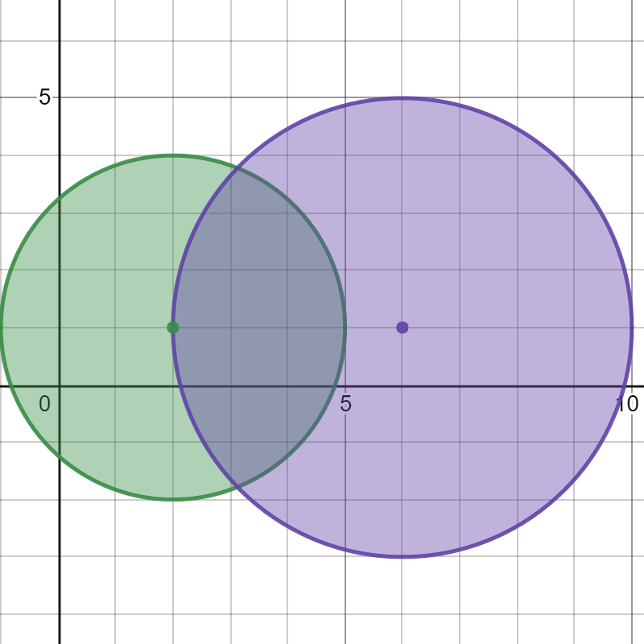

#### [2101. 引爆最多的炸弹](https://leetcode.cn/problems/detonate-the-maximum-bombs/)

给你一个炸弹列表。一个炸弹的 **爆炸范围** 定义为以炸弹为圆心的一个圆。

炸弹用一个下标从 **0** 开始的二维整数数组 `bombs` 表示，其中 `bombs[i] = [xi, yi, ri]` 。`xi`和 `yi` 表示第 `i` 个炸弹的 X 和 Y 坐标，`ri` 表示爆炸范围的 **半径** 。

你需要选择引爆 **一个** 炸弹。当这个炸弹被引爆时，**所有** 在它爆炸范围内的炸弹都会被引爆，这些炸弹会进一步将它们爆炸范围内的其他炸弹引爆。

给你数组 `bombs` ，请你返回在引爆 **一个** 炸弹的前提下，**最多** 能引爆的炸弹数目。

**示例 1：**



```
输入：bombs = [[2,1,3],[6,1,4]]
输出：2
解释：
上图展示了 2 个炸弹的位置和爆炸范围。
如果我们引爆左边的炸弹，右边的炸弹不会被影响。
但如果我们引爆右边的炸弹，两个炸弹都会爆炸。
所以最多能引爆的炸弹数目是 max(1, 2) = 2 。
```

**示例 2：**


```
输入：bombs = [[1,1,5],[10,10,5]]
输出：1
解释：
引爆任意一个炸弹都不会引爆另一个炸弹。所以最多能引爆的炸弹数目为 1 。
```

**示例 3：**


```
输入：bombs = [[1,2,3],[2,3,1],[3,4,2],[4,5,3],[5,6,4]]
输出：5
解释：
最佳引爆炸弹为炸弹 0 ，因为：
- 炸弹 0 引爆炸弹 1 和 2 。红色圆表示炸弹 0 的爆炸范围。
- 炸弹 2 引爆炸弹 3 。蓝色圆表示炸弹 2 的爆炸范围。
- 炸弹 3 引爆炸弹 4 。绿色圆表示炸弹 3 的爆炸范围。
所以总共有 5 个炸弹被引爆。
```

**提示：**

- `1 <= bombs.length <= 100`
- `bombs[i].length == 3`
- `1 <= xi, yi, ri <= 105`

---


i 炸弹引爆 j 炸弹的条件是，i 炸弹的爆炸半径 >= 两个炸弹之间的距离。

$$
r_i \ge \sqrt[2]{(x_i-x_j)^2+(y_i-y_j)^2}
$$

**方法一：bfs**

先建立邻接表，再bfs遍历每一个炸弹

时间复杂度：`O(n^3)`

空间复杂度：`O(n^2)`

```python
class Solution:
    def maximumDetonation(self, bombs: List[List[int]]) -> int:
        sz = len(bombs)

        # 建立邻接表
        adj = collections.defaultdict(list)
        for i in range(sz):
            for j in range(sz):
                if i == j:
                    continue
                d = ((bombs[i][0]-bombs[j][0])**2 + (bombs[i][1]-bombs[j][1])**2)**(1/2)
                if bombs[i][2] >= d:
                    adj[i].append(j)
        print(adj)

        # 用 bfs 统计每一个炸弹，取最大的visited
        ans = 0
        for i in range(sz):
            queue = collections.deque()
            visited = set()
            queue.append(i)
            visited.add(i)
            while queue:
                cur = queue.popleft()
                for n in adj[cur]:
                    if n not in visited:
                        queue.append(n)
                        visited.add(n)
            ans = max(ans, len(visited))
        return ans

```

**方法二：并查集**

利用并查集，统计每个连通分量的大小，但是用并查集不太方便统计每个连通分量的具体大小

但是如果题目问的是需要引爆几次才能将所有的炸弹炸开，用并查集会方便些

类似 [547. 省份数量](https://leetcode-cn.com/problems/number-of-provinces/)
