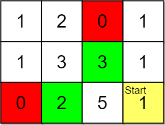

[2146. 价格范围内最高排名的 K 样物品](https://leetcode-cn.com/problems/k-highest-ranked-items-within-a-price-range/)

给你一个下标从 **0** 开始的二维整数数组 `grid` ，它的大小为 `m x n` ，表示一个商店中物品的分布图。数组中的整数含义为：

- `0` 表示无法穿越的一堵墙。
- `1` 表示可以自由通过的一个空格子。
- 所有其他正整数表示该格子内的一样物品的价格。你可以自由经过这些格子。

从一个格子走到上下左右相邻格子花费 `1` 步。

同时给你一个整数数组 `pricing` 和 `start` ，其中 `pricing = [low, high]` 且 `start = [row, col]` ，表示你开始位置为 `(row, col)` ，同时你只对物品价格在 **闭区间** `[low, high]` 之内的物品感兴趣。同时给你一个整数 `k` 。

你想知道给定范围 **内** 且 **排名最高** 的 `k` 件物品的 **位置** 。排名按照优先级从高到低的以下规则制定：

1. 距离：定义为从 `start` 到一件物品的最短路径需要的步数（**较近** 距离的排名更高）。
2. 价格：**较低** 价格的物品有更高优先级，但只考虑在给定范围之内的价格。
3. 行坐标：**较小** 行坐标的有更高优先级。
4. 列坐标：**较小** 列坐标的有更高优先级。

请你返回给定价格内排名最高的 `k` 件物品的坐标，将它们按照排名排序后返回。如果给定价格内少于 `k` 件物品，那么请将它们的坐标 **全部** 返回。

**示例 1：**


```
输入：grid = [[1,2,0,1],[1,3,0,1],[0,2,5,1]], pricing = [2,5], start = [0,0], k = 3
输出：[[0,1],[1,1],[2,1]]
解释：起点为 (0,0) 。
价格范围为 [2,5] ，我们可以选择的物品坐标为 (0,1)，(1,1)，(2,1) 和 (2,2) 。
这些物品的排名为：
- (0,1) 距离为 1
- (1,1) 距离为 2
- (2,1) 距离为 3
- (2,2) 距离为 4
所以，给定价格范围内排名最高的 3 件物品的坐标为 (0,1)，(1,1) 和 (2,1) 。
```

**示例 2：**



```
输入：grid = [[1,2,0,1],[1,3,3,1],[0,2,5,1]], pricing = [2,3], start = [2,3], k = 2
输出：[[2,1],[1,2]]
解释：起点为 (2,3) 。
价格范围为 [2,3] ，我们可以选择的物品坐标为 (0,1)，(1,1)，(1,2) 和 (2,1) 。
这些物品的排名为： 
- (2,1) 距离为 2 ，价格为 2
- (1,2) 距离为 2 ，价格为 3
- (1,1) 距离为 3
- (0,1) 距离为 4
所以，给定价格范围内排名最高的 2 件物品的坐标为 (2,1) 和 (1,2) 。
```

**示例 3：**


```
输入：grid = [[1,1,1],[0,0,1],[2,3,4]], pricing = [2,3], start = [0,0], k = 3
输出：[[2,1],[2,0]]
解释：起点为 (0,0) 。
价格范围为 [2,3] ，我们可以选择的物品坐标为 (2,0) 和 (2,1) 。
这些物品的排名为：
- (2,1) 距离为 5
- (2,0) 距离为 6
所以，给定价格范围内排名最高的 2 件物品的坐标为 (2,1) 和 (2,0) 。
注意，k = 3 但给定价格范围内只有 2 件物品。
```

提示：

m == grid.length
n == grid[i].length
1 <= m, n <= 105
1 <= m * n <= 105
`0 <= grid[i][j] <= 105`
pricing.length == 2
2 <= low <= high <= 105
start.length == 2
0 <= row <= m - 1
0 <= col <= n - 1
`grid[row][col] > 0`
1 <= k <= m * n

## 方法一：每层排序

学习下c++的自定义排序写法

```cpp
sort(q.begin(), q.end(), [&](auto &a, auto &b) {
    int pa = grid[a[0]][a[1]], pb = grid[b[0]][b[1]];
    if (pa != pb) return (pa < pb);
    if (a[0] != b[0]) return (a[0] < b[0]);
    return (a[1] < b[1]);
```


```cpp
class Solution {
public:
    int dirs[4][2] = {{-1, 0}, {1, 0}, {0, -1}, {0, 1}};
    vector<vector<int>> highestRankedKItems(vector<vector<int>> &grid, vector<int> &pricing, vector<int> &start, int k) {
        vector<vector<int>> ans;
        int rows = grid.size(), cols = grid[0].size();
        int low = pricing[0], hight = pricing[1];
        int sx = start[0], sy = start[1];
        vector<vector<int>> visited(rows, vector<int>(cols));
        visited[sx][sy] = 1;
        vector<vector<int>> q = {{sx, sy}};

        while (!q.empty()) {
            sort(q.begin(), q.end(), [&](auto &a, auto &b) {
                int pa = grid[a[0]][a[1]], pb = grid[b[0]][b[1]];
                if (pa != pb) return (pa < pb);
                if (a[0] != b[0]) return (a[0] < b[0]);
                return (a[1] < b[1]);
            });
            for (vector<int> &node : q) {  // 使用引用遍历会快一些
                if (low <= grid[node[0]][node[1]] && grid[node[0]][node[1]] <= hight) {
                    ans.push_back(node);  // push_back 感觉就不比 emplace_back 慢
                    if (ans.size() == k) return ans;
                }
            }
            vector<vector<int>> layer;
            for (vector<int> &node : q) {
                for (auto &d : dirs) {
                    int nr = node[0] + d[0], nc = node[1] + d[1];
                    if (0 <= nr && nr < rows && 0 <= nc && nc < cols && !visited[nr][nc] && grid[nr][nc]) {
                        vector<int> nn = {nr, nc};
                        layer.push_back(nn);
                        visited[nr][nc] = true;
                    }
                }
            }
            q = move(layer);  // q = layer 也行，但是慢一点
        }
        return ans;
    }
};
```

## 方法二：有序序列（红黑树）

时间复杂度：`O(nlogk)`，k为每层的数量

空间复杂度：`O(n)`

```python
from sortedcontainers import SortedList


class Solution:
    def highestRankedKItems(self, grid: List[List[int]], pricing: List[int], start: List[int], k: int) -> List[List[int]]:
        rows = len(grid)
        cols = len(grid[0])
        ans = []
        q = SortedList()
        q.add([grid[start[0]][start[1]], start[0], start[1]])
        visited = set()
        visited.add((start[0], start[1]))

        while q:
            layerSz = len(q)
            layer = SortedList()
            for _ in range(layerSz):
                _, row, col = q.pop(0)
                if pricing[0] <= grid[row][col] <= pricing[1]:
                    ans.append([row, col])
                if len(ans) == k:
                    return ans
                for dr, dc in ((0, 1), (1, 0), (0, -1), (-1, 0)):
                    nr = row + dr
                    nc = col + dc
                    if 0 <= nr < rows and 0 <= nc < cols and grid[row][col] != 0 and (nr, nc) not in visited:
                        layer.add([grid[nr][nc], nr, nc])
                        visited.add((nr, nc))
            q = layer
        return ans

```

