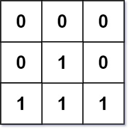

题目：[542. 01 矩阵](https://leetcode.cn/problems/01-matrix/)

给定一个由 `0` 和 `1` 组成的矩阵 `mat` ，请输出一个大小相同的矩阵，其中每一个格子是 `mat` 中对应位置元素到最近的 `0` 的距离。

两个相邻元素间的距离为 `1` 。

**示例 1：**


```
输入：mat = [[0,0,0],[0,1,0],[0,0,0]]
输出：[[0,0,0],[0,1,0],[0,0,0]]
```

**示例 2：**



```
输入：mat = [[0,0,0],[0,1,0],[1,1,1]]
输出：[[0,0,0],[0,1,0],[1,2,1]]
```

提示：

m == mat.length
n == mat[i].length
1 <= m, n <= 104
1 <= m * n <= 104
mat[i][j] is either 0 or 1.
mat 中至少有一个 0 


## 方法一：多源bfs

从 0 往 1 传播，第一次传播到 1 点的距离，就是 1 点到最近 0 点的距离

还有一种 BFS 的做法，就是先找出在 0 边上的所有的 1，然后把这些 1 放到队列里

时间复杂度：`O(n^2)`

空间复杂度：`O(n^2)`

执行用时：136 ms, 在所有 C++ 提交中击败了5.94%的用户

内存消耗：43.2 MB, 在所有 C++ 提交中击败了4.99%的用户

```cpp
class Solution {
public:
    int rows;
    int cols;
    vector<pair<int, int>> directions = {{0, 1}, {1, 0}, {-1, 0}, {0, -1}};

    int getIdx(int r, int c) {
        return r * cols + c;
    }

    vector<vector<int>> updateMatrix(vector<vector<int>>& mat) {
        rows = mat.size();
        cols = mat[0].size();
        vector<vector<int>> ans = mat;

        deque<pair<int, int>> que;
        unordered_map<int, int> visited;
        for (int r = 0; r < rows; r++) {
            for (int c = 0; c < cols; c++) {
                if (mat[r][c] == 0) {
                    que.push_back({r, c});
                    visited[getIdx(r, c)] = 0;
                }
            }
        }

        while (!que.empty()) {
            auto [cur_r, cur_c] = que.front();
            que.pop_front();
            int depth = visited[getIdx(cur_r, cur_c)];

            for (auto& [dr, dc] : directions) {
                int nr = cur_r + dr;
                int nc = cur_c + dc;
                int nidx = getIdx(nr, nc);

                if (nr < 0 || nr >= rows || nc < 0 || nc >= cols) continue;
                if (mat[nr][nc] != 1) continue;          // 只能往 1 传播
                if (visited.count(nidx) == 1) continue;  // 不能走已经走过的路，且第一次走到的就是最短的距离

                que.push_back({nr, nc});
                visited[nidx] = depth + 1;
                ans[nr][nc] = depth + 1;
            }
        }
        return ans;
    }
};
```

## 方法二：动态规划

用 `dp[i][j]` 来表示该位置距离最近的 0 的距离

`dp[i][j]` 是由其上下左右四个状态来决定，无法从一个方向开始递推！

- 距离 (i, j) 最近的 0 的位置，是在其 「左上，右上，左下，右下」4个方向之一；
- 因此我们分别从四个角开始递推，就分别得到了位于「左上方、右上方、左下方、右下方」距离 (i, j) 的最近的 0 的距离，取 min 即可；


```cpp
class Solution {
public:
    vector<vector<int>> updateMatrix(vector<vector<int>>& matrix) {
        int m = matrix.size(), n = matrix[0].size();
        // 初始化动态规划的数组，所有的距离值都设置为一个很大的数
        vector<vector<int>> dist(m, vector<int>(n, INT_MAX / 2));
        // 如果 (i, j) 的元素为 0，那么距离为 0
        for (int i = 0; i < m; ++i) {
            for (int j = 0; j < n; ++j) {
                if (matrix[i][j] == 0) {
                    dist[i][j] = 0;
                }
            }
        }
        // 只有 水平向左移动 和 竖直向上移动，注意动态规划的计算顺序
        for (int i = 0; i < m; ++i) {
            for (int j = 0; j < n; ++j) {
                if (i - 1 >= 0) {
                    dist[i][j] = min(dist[i][j], dist[i - 1][j] + 1);
                }
                if (j - 1 >= 0) {
                    dist[i][j] = min(dist[i][j], dist[i][j - 1] + 1);
                }
            }
        }
        // 只有 水平向左移动 和 竖直向下移动，注意动态规划的计算顺序
        for (int i = m - 1; i >= 0; --i) {
            for (int j = 0; j < n; ++j) {
                if (i + 1 < m) {
                    dist[i][j] = min(dist[i][j], dist[i + 1][j] + 1);
                }
                if (j - 1 >= 0) {
                    dist[i][j] = min(dist[i][j], dist[i][j - 1] + 1);
                }
            }
        }
        // 只有 水平向右移动 和 竖直向上移动，注意动态规划的计算顺序
        for (int i = 0; i < m; ++i) {
            for (int j = n - 1; j >= 0; --j) {
                if (i - 1 >= 0) {
                    dist[i][j] = min(dist[i][j], dist[i - 1][j] + 1);
                }
                if (j + 1 < n) {
                    dist[i][j] = min(dist[i][j], dist[i][j + 1] + 1);
                }
            }
        }
        // 只有 水平向右移动 和 竖直向下移动，注意动态规划的计算顺序
        for (int i = m - 1; i >= 0; --i) {
            for (int j = n - 1; j >= 0; --j) {
                if (i + 1 < m) {
                    dist[i][j] = min(dist[i][j], dist[i + 1][j] + 1);
                }
                if (j + 1 < n) {
                    dist[i][j] = min(dist[i][j], dist[i][j + 1] + 1);
                }
            }
        }
        return dist;
    }
};
```


任一组对角开始的 2 次递推写法

```java
class Solution {
  public int[][] updateMatrix(int[][] matrix) {
    int m = matrix.length, n = matrix[0].length;
    int[][] dp = new int[m][n];
    for (int i = 0; i < m; i++) {
      for (int j = 0; j < n; j++) {
        dp[i][j] = matrix[i][j] == 0 ? 0 : 10000;
      }
    }

    // 从左上角开始
    for (int i = 0; i < m; i++) {
      for (int j = 0; j < n; j++) {
        if (i - 1 >= 0) {
          dp[i][j] = Math.min(dp[i][j], dp[i - 1][j] + 1);
        }
        if (j - 1 >= 0) {
          dp[i][j] = Math.min(dp[i][j], dp[i][j - 1] + 1);
        }
      }
    }
    // 从右下角开始
    for (int i = m - 1; i >= 0; i--) {
      for (int j = n - 1; j >= 0; j--) {
        if (i + 1 < m) {
          dp[i][j] = Math.min(dp[i][j], dp[i + 1][j] + 1);
        }
        if (j + 1 < n) {
          dp[i][j] = Math.min(dp[i][j], dp[i][j + 1] + 1);
        }
      }
    }
    return dp;
  }
}
```

