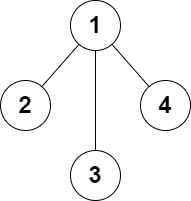

题目：[2508. 添加边使所有节点度数都为偶数](https://leetcode.cn/problems/add-edges-to-make-degrees-of-all-nodes-even/)

给你一个有 `n` 个节点的 **无向** 图，节点编号为 `1` 到 `n` 。再给你整数 `n` 和一个二维整数数组 `edges` ，其中 `edges[i] = [ai, bi]` 表示节点 `ai` 和 `bi` 之间有一条边。图不一定连通。

你可以给图中添加 **至多** 两条额外的边（也可以一条边都不添加），使得图中没有重边也没有自环。

如果添加额外的边后，可以使得图中所有点的度数都是偶数，返回 `true` ，否则返回 `false` 。

点的度数是连接一个点的边的数目。

**示例 1：**


```
输入：n = 5, edges = [[1,2],[2,3],[3,4],[4,2],[1,4],[2,5]]
输出：true
解释：上图展示了添加一条边的合法方案。
最终图中每个节点都连接偶数条边。
```

**示例 2：**


```
输入：n = 4, edges = [[1,2],[3,4]]
输出：true
解释：上图展示了添加两条边的合法方案。
```

**示例 3：**



```
输入：n = 4, edges = [[1,2],[1,3],[1,4]]
输出：false
解释：无法添加至多 2 条边得到一个符合要求的图。
```

提示：

3 <= n <= 105
2 <= edges.length <= 105
edges[i].length == 2
1 <= ai, bi <= n
ai != bi
图中不会有重边

---

## 分类讨论

把度数为奇数的节点记到 odd 中，记 m 为 odd 的长度，分类讨论：

- 如果 m=0，那么已经符合要求。
- 如果 m=2，记 x=odd[0],y=odd[1]：
  - 如果 x 和 y 之间没有边，那么连边之后就符合要求了。
  - 如果 x 和 y 之间有边，那么枚举 [1,n] 的所有不为 x 和 y 的点 i，由于 i 的度数一定是偶数，如果 i 和 x 以及 i 和 y 之间没有边，那么连边之后就符合要求了。
- 如果 m=4，记 a=odd[0],b=odd[1],c=odd[2],d=odd[3]：
  - 如果 a 和 b 以及 c 和 d 之间没有边，那么连边之后就符合要求了。
  - 如果 a 和 c 以及 b 和 d 之间没有边，那么连边之后就符合要求了。
  - 如果 a 和 d 以及 b 和 c 之间没有边，那么连边之后就符合要求了。


其余情况无法满足要求。

```python
class Solution:
    def isPossible(self, n: int, edges: List[List[int]]) -> bool:
        connect = collections.defaultdict(set)
        for i, j in edges:
            connect[i].add(j)
            connect[j].add(i)
        
        # 找到奇数的相连，如果他两之前没有链接过，就能相连
        nodes = []
        for k in connect:
            if len(connect[k]) % 2 == 1:
                nodes.append(k)
        
        # 给图中添加 至多 两条额外的边
        # 考虑 1 2 3 4 个节点的情况
        n = len(nodes)
        if n == 0: return True
        if n == 1: return False
        if n == 2:
            # 之前没链接过
            x, y = nodes
            if x not in connect[y]:
                return True
            for i in range(1, n+1):
                if i != x and i != y:
                    if i not in connect[x] and i not in connect[y]:
                        return True
            return False
        if n == 3:
            # 总会剩下个奇节点
            return False
        if n == 4:
            if nodes[0] not in connect[nodes[1]] and nodes[2] not in connect[nodes[3]]: return True
            if nodes[0] not in connect[nodes[2]] and nodes[1] not in connect[nodes[3]]: return True
            if nodes[0] not in connect[nodes[3]] and nodes[1] not in connect[nodes[2]]: return True
            return False
        if n > 4: return False
        
        return False
```

