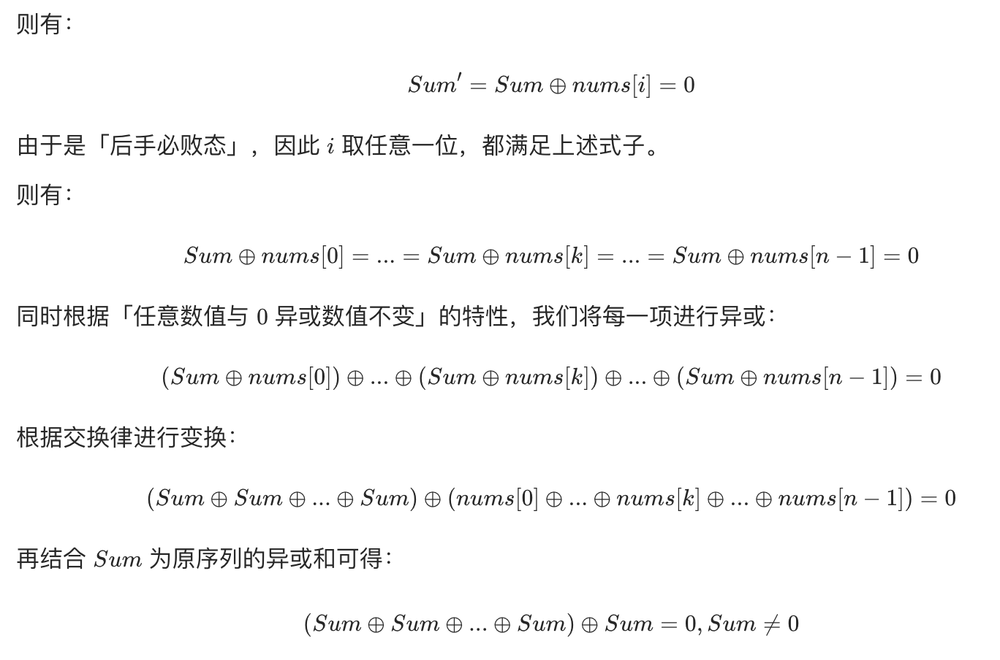

题目：[810. 黑板异或游戏](https://leetcode.cn/problems/chalkboard-xor-game/)

黑板上写着一个非负整数数组 `nums[i]` 。

Alice 和 Bob 轮流从黑板上擦掉一个数字，Alice 先手。如果擦除一个数字后，剩余的所有数字按位异或运算得出的结果等于 `0` 的话，当前玩家游戏失败。另外，如果只剩一个数字，按位异或运算得到它本身；如果无数字剩余，按位异或运算结果为 `0`。

并且，轮到某个玩家时，如果当前黑板上所有数字按位异或运算结果等于 `0` ，这个玩家获胜。

假设两个玩家每步都使用最优解，当且仅当 Alice 获胜时返回 `true`。

**示例 1：**

```
输入: nums = [1,1,2]
输出: false
解释: 
Alice 有两个选择: 擦掉数字 1 或 2。
如果擦掉 1, 数组变成 [1, 2]。剩余数字按位异或得到 1 XOR 2 = 3。那么 Bob 可以擦掉任意数字，因为 Alice 会成为擦掉最后一个数字的人，她总是会输。
如果 Alice 擦掉 2，那么数组变成[1, 1]。剩余数字按位异或得到 1 XOR 1 = 0。Alice 仍然会输掉游戏。
```

**示例 2:**

```
输入: nums = [0,1]
输出: true
```

**示例 3:**

```
输入: nums = [1,2,3]
输出: true
```

**提示：**

- `1 <= nums.length <= 1000`
- `0 <= nums[i] < 216`

---

题解：https://leetcode.cn/problems/chalkboard-xor-game/solution/gong-shui-san-xie-noxiang-xin-ke-xue-xi-ges7k/

## 基本分析

这是一道「博弈论」题。

如果没接触过博弈论，其实很难想到，特别是数据范围为 10^3，很具有迷惑性。

如果接触过博弈论，对于这种「判断先手后手的必胜必败」的题目，博弈论方向是一个优先考虑的方向。

根据题意，如果某位玩家在操作前所有数值异或和为 0，那么该玩家胜利。要我们判断给定序列时，先手是处于「必胜态」还是「必败态」，如果处于「必胜态」返回 `True`，否则返回 `False`。

对于博弈论的题目，通常有两类的思考方式：

1. 经验分析：见过类似的题目，猜一个性质，然后去证明该性质是否可推广。
2. 状态分析：根据题目给定的规则是判断「胜利」还是「失败」来决定优先分析「必胜态」还是「必败态」时具有何种性质，然后证明性质是否可推广。

## 博弈论

**对于本题，给定的是判断「胜利」的规则（在给定序列的情况下，如果所有数值异或和为 0 可立即判断胜利，其他情况无法立即判断胜负），那么我们应该优先判断何为「先手必胜态」，如果不好分析，才考虑分析后手的「必败态」。**

接下来是分情况讨论：

1. 如果给定的序列异或和为 0，游戏开始时，先手直接获胜：

由此推导出性质一：**给定序列 `nums` 的异或和为 0，先手处于「必胜态」，返回 `True`。**

2. 如果给定序列异或和不为 0，我们需要分析，先手获胜的话，序列会满足何种性质：

显然如果要先手获胜，则需要满足「**先手去掉一个数，剩余数值异或和必然不为 0；同时后手去掉一个数后，剩余数值异或和必然为 0**」。

换句话说，我们需要分析**什么情况下「经过一次后手操作」后，序列会以上述情况 1 的状态，回到先手的局面**。

也就是反过来分析想要出现「后手必败态」，序列会有何种性质。

假设后手操作前的异或和为 Sum（Sum \neq 0），「后手必败态」意味着去掉任意数字后异或和为 0。

同时根据「相同数值异或结果为 0」的特性，我们知道去掉某个数值，等价于在原有异或和的基础上异或上这个值。



至此，我们分析出当处于「后手必败态」时，去掉任意一个数值会满足上述式子。

根据「相同数值偶数次异或结果为 0」的特性，可推导出「后手必败态」会导致交回到先手的序列个数为偶数，由此推导后手操作前序列个数为奇数，后手操作前一个回合先手为偶数。

到这一步，我们推导出想要出现「后手必败态」，先手操作前的序列个数应当为偶数。

那么根据先手操作前序列个数为偶数（且异或和不为 0），是否能够推导出必然出现「后手必败态」呢？

**显然是可以的，因为如果不出现「后手必败态」，会与我们前面分析过程矛盾。**

假设先手操作前异或和为 Xor（序列数量为偶数，同时 Xor \neq 0），如果最终不出现「后手必败态」的话，也就是先手会输掉的话，那么意味着有 Xor ⊕ nums[i] = 0，其中 i 为序列的任意位置。利用此性质，像上述分析那样，将每一项进行展开异或，会得到奇数个 Xor 异或结果为 0，这与开始的 Xor \neq 0 矛盾。

由此推导出性质二：**只需要保证先手操作前序列个数为偶数时就会出现「后手必败态」，从而确保先手必胜。**

**综上，如果序列 `nums` 本身异或和为 0，天然符合「先手必胜态」的条件，答案返回 `True` ；如果序列 `nums` 异或和不为 0，但序列长度为偶数，那么最终会出现「后手必败态」，推导出先手必胜，答案返回 `True`。**

```python
class Solution:
    def xorGame(self, nums: List[int]) -> bool:
        return len(nums) % 2 == 0 or reduce(xor,nums) == 0
```

- 时间复杂度：O(n)
- 空间复杂度：O(1)

## 总结

事实上，在做题的时候，我也是采取「先假定奇偶性，再证明」的做法，因为这样比较快。

但「假定奇偶性」这一步是比较具有跳跃性的，这有点像我前面说到的「经验分析解法」，而本题解证明没有做任何的前置假定，单纯从「先手必胜态」和「后手必败态」进行推导，最终推导出「先手序列偶数必胜」的性质 ，更符合前面说到的「状态分析解法」。

两种做法殊途同归，在某些博弈论问题上，「经验分析解法」可以通过「归纳」&「反证」很好分析出来，但这要求选手本身具有一定的博弈论题量；而「状态分析解法」则对选手的题量要求低些，逻辑推理能力高些。

两种方法并无优劣之分，都是科学严谨的做法。

我十分建议大家将此题解与 [官方题解](https://leetcode-cn.com/problems/chalkboard-xor-game/solution/hei-ban-yi-huo-you-xi-by-leetcode-soluti-eb0c/) 一同阅读，体会两种分析方法的区别。
