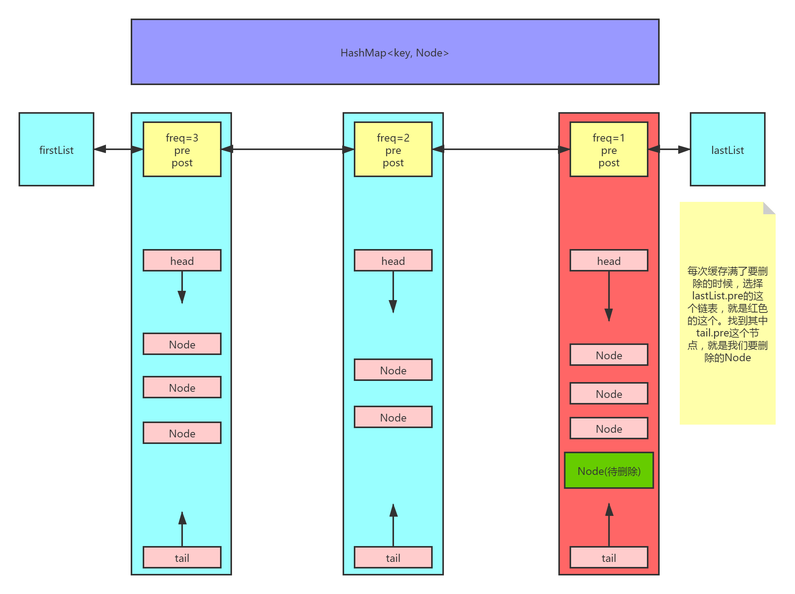

# LFU 缓存实现

题目：[460. LFU 缓存](https://leetcode.cn/problems/lfu-cache/)

参考：[Java 13ms 双100% 双向链表 多解法超全😂]([Java 13ms 双100% 双向链表 多解法超全😂 - LFU 缓存 - 力扣（LeetCode）](https://leetcode.cn/problems/lfu-cache/solution/java-13ms-shuang-100-shuang-xiang-lian-biao-duo-ji/))

LFU 简单理解则是指「移除使用次数最少的元素」，如果存在多个使用次数最小的元素，则移除「最近不被使用的那个」（LRU 规则）。同样的 get 和 put 都算作一次使用。

因此，我们需要记录下每个元素的使用次数，并且在 O(1) 的复杂度内「修改某个元素的使用次数」和「找到使用次数最小的元素」。

---

请你为 [最不经常使用（LFU）](https://baike.baidu.com/item/缓存算法)缓存算法设计并实现数据结构。

实现 `LFUCache` 类：

- `LFUCache(int capacity)` - 用数据结构的容量 `capacity` 初始化对象
- `int get(int key)` - 如果键 `key` 存在于缓存中，则获取键的值，否则返回 `-1` 。
- `void put(int key, int value)` - 如果键 `key` 已存在，则变更其值；如果键不存在，请插入键值对。当缓存达到其容量 `capacity` 时，则应该在插入新项之前，移除最不经常使用的项。在此问题中，当存在平局（即两个或更多个键具有相同使用频率）时，应该去除 最近最久未使用 的键。

为了确定最不常使用的键，可以为缓存中的每个键维护一个 **使用计数器** 。使用计数最小的键是最久未使用的键。

当一个键首次插入到缓存中时，它的使用计数器被设置为 `1` (由于 put 操作)。对缓存中的键执行 `get` 或 `put` 操作，使用计数器的值将会递增。

函数 `get` 和 `put` 必须以 `O(1)` 的平均时间复杂度运行。

 ```
输入：
["LFUCache", "put", "put", "get", "put", "get", "get", "put", "get", "get", "get"]
[[2], [1, 1], [2, 2], [1], [3, 3], [2], [3], [4, 4], [1], [3], [4]]
输出：
[null, null, null, 1, null, -1, 3, null, -1, 3, 4]

解释：
// cnt(x) = 键 x 的使用计数
// cache=[] 将显示最后一次使用的顺序（最左边的元素是最近的）
LFUCache lfu = new LFUCache(2);
lfu.put(1, 1);   // cache=[1,_], cnt(1)=1
lfu.put(2, 2);   // cache=[2,1], cnt(2)=1, cnt(1)=1
lfu.get(1);      // 返回 1
                 // cache=[1,2], cnt(2)=1, cnt(1)=2
lfu.put(3, 3);   // 去除键 2 ，因为 cnt(2)=1 ，使用计数最小
                 // cache=[3,1], cnt(3)=1, cnt(1)=2
lfu.get(2);      // 返回 -1（未找到）
lfu.get(3);      // 返回 3
                 // cache=[3,1], cnt(3)=2, cnt(1)=2
lfu.put(4, 4);   // 去除键 1 ，1 和 3 的 cnt 相同，但 1 最久未使用
                 // cache=[4,3], cnt(4)=1, cnt(3)=2
lfu.get(1);      // 返回 -1（未找到）
lfu.get(3);      // 返回 3
                 // cache=[3,4], cnt(4)=1, cnt(3)=3
lfu.get(4);      // 返回 4
                 // cache=[3,4], cnt(4)=2, cnt(3)=3
 ```

提示：

- 0 <= capacity <= 10^4
- 0 <= key <= 10^5
- 0 <= value <= 10^9
- 最多调用 2 * 10^5 次 get 和 put 方法

## 一、O(1) 解法



### 自定义多个双向链表

- 每个频率一个双向链表
- 在双向链表的头部添加节点，意味着尾部是最近没有使用的节点（之后优先删除）
- 对于cache里有的操作，记得更新 freqMap

```cpp
#include <iostream>
#include <unordered_map>

using namespace std;

class Node {
public:
    int key;
    int value;
    int freq = 1;
    Node *prev;
    Node *next;

    Node() {}
    Node(int k, int v) : key(k), value(v) {}
};

class DoublyLinkedList {
public:
    Node *head;
    Node *tail;

    DoublyLinkedList() {
        head = new Node();
        tail = new Node();
        head->next = tail;
        tail->prev = head;
    }

    void removeNode(Node *node) {
        node->prev->next = node->next;
        node->next->prev = node->prev;
    }

    // 在双向链表的头部添加节点
    // 意味着尾部是最近没有使用的节点（之后优先删除）
    void addNode(Node *node) {
        Node *one = head;
        Node *two = head->next;
        one->next = node;
        node->prev = one;
        node->next = two;
        two->prev = node;
    }
};

class LFUCache {
private:
    unordered_map<int, Node *> cache;                // 存储缓存的内容
    unordered_map<int, DoublyLinkedList *> freqMap;  // 存储每个频次对应的双向链表
    int cap;
    int min;  // 存储当前最小频次
public:
    LFUCache(int capacity) {
        cap = capacity;
    }

    int get(int key) {
        if (cache.count(key)) {
            Node *node = cache[key];
            freqInc(node);
            return node->value;
        }
        return -1;
    }

    void put(int key, int value) {
        if (cap == 0) return;
        if (cache.count(key)) {  // 已有则更新
            Node *node = cache[key];
            node->value = value;
            freqInc(node);
        } else {                        // 没有则添加
            if (cache.size() == cap) {  // cache 满了
                // 移除 freq 最小的，且最近没有使用过的
                DoublyLinkedList *minFreqLinkedList = freqMap[min];
                cache.erase(minFreqLinkedList->tail->prev->key);
                minFreqLinkedList->removeNode(minFreqLinkedList->tail->prev);
                // 这里不需要维护min, 因为下面add了newNode后min肯定是1
            }
            Node *newNode = new Node(key, value);
            cache[key] = newNode;
            if (!freqMap.count(1)) {
                freqMap[1] = new DoublyLinkedList();
            }
            freqMap[1]->addNode(newNode);
            min = 1;
        }
    }

    void freqInc(Node *node) {
        // 从原freq对应的链表里移除, 并更新min
        int freq = node->freq;
        DoublyLinkedList *linkedList = freqMap[freq];
        linkedList->removeNode(node);
        if (freq == min && linkedList->head->next == linkedList->tail) {
            // 如果 freq 是最小的，然后链表删除后，空了，才更新 min
            min = freq + 1;
        }
        // 加入新freq对应的链表
        freq++;
        node->freq = freq;

        if (!freqMap.count(freq)) {
            linkedList = new DoublyLinkedList();
            freqMap[freq] = linkedList;
        }
        freqMap[freq]->addNode(node);
    }
};
```

## 二、O(logN) 解法

使用小根堆找到 `freq` 最小

每次将访问频次 `freq` 最小的且最先访问的上浮到堆顶，下面用全局自增 `idx` 表示访问的先后

c++ 的 priority_queue 似乎不是很好实现，原因是无法直接删除掉小根堆中任意一个元素

## 三、O(N) 解法

### 一条双向链表 + 一个哈希表

使 `freq` 小的 `Node` 在链表的左边，`freq` 大的 `Node` 在链表的右边，`freq` 相等的话最久使用的`Node` 在左边、最近使用的 `Node` 在右边，因此满了之后删除 `head.post`，该 `Node` 即 `freq` 最小且最久访问的。

每次 `node` 的 `freq++` 后，从当前位置向后遍历链表，直到 `nextNode.freq > node.freq || nextNode== tail`，在 `nextNode` 之前插入该 `node`。

```cpp
class Node {
public:
    int key;
    int value;
    int freq = 1;
    Node *prev;
    Node *next;
    Node(int k, int v) : key(k), value(v) {}
};

class LFUCache {
private:
    Node *head;
    Node *tail;
    int cap;
    unordered_map<int, Node *> map;

    void moveToNewPosition(Node *node) {
        Node *nextNode = node->next;
        deleteNode(node);
        while (node->freq >= nextNode->freq && nextNode != tail) {
            // 节点的频率高于下个节点的话就移动
            // 等于也要移动，因为当前的node是最新使用的，尽量往后排
            nextNode = nextNode->next;
        }
        // 跳出循环时，nextNode 的频率一定大于node的，或是尾节点
        // 因此在 nextNode 的前面添加上node
        Node *one = nextNode->prev;
        Node *two = nextNode;
        one->next = node;
        node->prev = one;
        node->next = two;
        two->prev = node;
    }

    // 先在头部添加节点，再调整到正确位置
    void addNode(Node *node) {
        Node *one = head;
        Node *two = head->next;
        one->next = node;
        node->prev = one;
        node->next = two;
        two->prev = node;
        moveToNewPosition(node);
    }

    // 删除指定节点
    void deleteNode(Node *node) {
        node->prev->next = node->next;
        node->next->prev = node->prev;
    }

public:
    LFUCache(int capacity) {
        cap = capacity;
        head = new Node(-1, -1);
        tail = new Node(-1, -1);
        head->next = tail;
        tail->prev = head;
    }

    int get(int key) {
        if (map.count(key)) {
            Node *node = map[key];
            node->freq = node->freq + 1;
            moveToNewPosition(node);
            return node->value;
        }
        return -1;
    }

    void put(int key, int value) {
        if (cap == 0) return;
        if (map.count(key)) {
            // 之前有
            Node *node = map[key];
            node->value = value;
            node->freq++;
            moveToNewPosition(node);
        } else {
            // 之前没有
            if (map.size() == cap) {  // cache 容量满了
                map.erase(head->next->key);
                deleteNode(head->next);
            }
            Node *node = new Node(key, value);
            addNode(node);
            map[key] = node;
        }
    }
};
```
