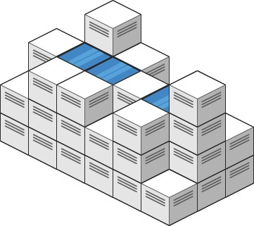

#### [407. 接雨水 II](https://leetcode.cn/problems/trapping-rain-water-ii/)

https://leetcode-cn.com/problems/trapping-rain-water-ii/solution/gong-shui-san-xie-jing-dian-dijkstra-yun-13ik/

给你一个 `m x n` 的矩阵，其中的值均为非负整数，代表二维高度图每个单元的高度，请计算图中形状最多能接多少体积的雨水。

**示例 1:**



```
输入: heightMap = [[1,4,3,1,3,2],[3,2,1,3,2,4],[2,3,3,2,3,1]]
输出: 4
解释: 下雨后，雨水将会被上图蓝色的方块中。总的接雨水量为1+2+1=4。
```

**示例 2:**


```
输入: heightMap = [[3,3,3,3,3],[3,2,2,2,3],[3,2,1,2,3],[3,2,2,2,3],[3,3,3,3,3]]
输出: 10
```

提示:

m == heightMap.length
n == heightMap[i].length
1 <= m, n <= 200
`0 <= heightMap[i][j] <= 2 * 104`

---


问题的本质是求「**从点 (x,y) 到边界的遇到的所有最高点中最小值为多少」，这个路径高度的最小值与 (x,y) 本身的高度 heightMap(x,y)之间的差值，即是该点能接到的雨水数量**。

本题求的是所有路径中，路径高度的最小值，需要对 Dijkstra 进行变形。

首先「从 (x,y) 出发到达边界的路径」也可看作「从边界到达点 (x,y) 的路径」，经过转换操作后，直接计算边界到点 (x,y) 的路径是一个多源点问题。

我们可以考虑引入「超级源点」进行简化：超级源点与所有的边界格子连有一条权值为 0 的边，从而进一步将问题转化为「**求从超级源点出发到达 (x,y) 的路径高度的最小值」**。与求最短路的 Dijkstra 类似，我们可以将「使用出队元素更新邻点的松弛操作」等价「使用出队元素更新相邻格子的雨水量」。

**如果我们能够保证被出队元素所更新的高度为最终高度（或者说出队元素的高度为最终高度），那么该做法的正确性就能被 Dijkstra 的正确性所保证**。

按照模版写的 616 ms 17.2 MB

个人觉得是因为把 `vis[r][c] = True`放到外面了，导致有些已经完成的还走了一遍while 

```python
class Solution:
    def trapRainWater(self, heightMap: List[List[int]]) -> int:
        rows = len(heightMap)
        cols = len(heightMap[0])
        vis = [[False for _ in range(cols)] for _ in range(rows)]
        # dis = [[] for _ in range(rows)] # 这题不需要，因为不用累计路上的权值，而是记录路上最高的一点

        priorityQueue = []
        for c in range(cols):
            # 上下两行入优先队列 本题的优先级用 从超级源点到各个点的途中的最高点表示，所有最高点中最低的那一个优先出列
            heapq.heappush(priorityQueue, (heightMap[0][c], (0, c))) # 左边是优先级, 右边是点
            heapq.heappush(priorityQueue, (heightMap[rows-1][c], (rows-1, c)))

        for r in range(rows):
            heapq.heappush(priorityQueue, (heightMap[r][0], (r, 0)))
            heapq.heappush(priorityQueue, (heightMap[r][cols-1], (r, cols-1)))

        ans = 0 
        while priorityQueue:
            # dijkstra中表示的是，从源点到目标点可能的最短距离
            # 这一题表示，从原点到目标点所有路上最高点中的最低一点
            priority, (r, c) = heapq.heappop(priorityQueue)
            if vis[r][c]:
                continue
            ans += priority - heightMap[r][c]
            vis[r][c] = True

            for dr, dc in ((0,1), (1,0), (-1,0), (0,-1)):
                nr = r + dr
                nc = c + dc
                if 0<=nr<rows and 0<=nc<cols:
                    # 记录路上最高的一点
                    heapq.heappush(priorityQueue, (max(heightMap[nr][nc], priority), (nr, nc)))
        return ans
```

按照题解写的 224 ms 16.7 MB

```python
class Solution:
    def trapRainWater(self, heightMap: List[List[int]]) -> int:

        rows = len(heightMap)
        cols = len(heightMap[0])
        vis = [[False for _ in range(cols)] for _ in range(rows)]

        priorityQueue = []
        for c in range(cols):
            heapq.heappush(priorityQueue, (heightMap[0][c], (0, c))) # 左边是优先级, 右边是点
            heapq.heappush(priorityQueue, (heightMap[rows-1][c], (rows-1, c)))
            vis[0][c] = True
            vis[rows-1][c] = True
        for r in range(rows):
            heapq.heappush(priorityQueue, (heightMap[r][0], (r, 0)))
            heapq.heappush(priorityQueue, (heightMap[r][cols-1], (r, cols-1)))
            vis[r][0] = True
            vis[r][cols-1] = True

        ans = 0 
        while priorityQueue:
            priority, (r, c) = heapq.heappop(priorityQueue)
            for dr, dc in ((0,1), (1,0), (-1,0), (0,-1)):
                nr = r + dr
                nc = c + dc
                if 0<=nr<rows and 0<=nc<cols:
                    if vis[nr][nc]:
                        continue
                    if priority > heightMap[nr][nc]:
                        ans += priority - heightMap[nr][nc]
                    heapq.heappush(priorityQueue, (max(priority, heightMap[nr][nc]), (nr, nc)))
                    vis[nr][nc] = True
        return ans

```

