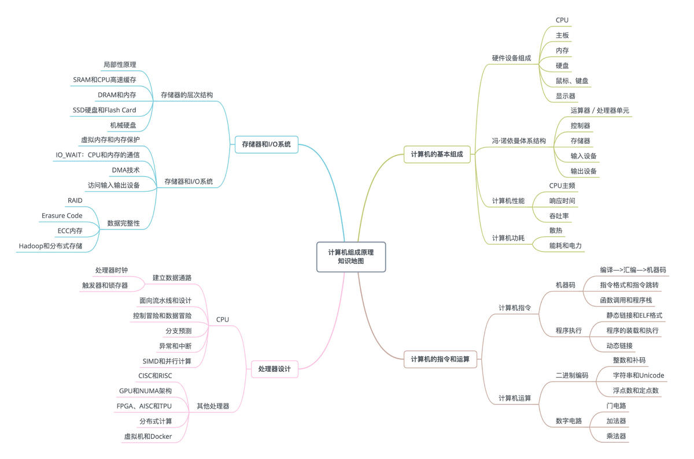

# 计算机组成-序

参考 1：[怎样学习和理解计算机组成原理？](https://www.zhihu.com/question/20706264)

参考 2：[计算机的组成及学习大纲](https://www.jianshu.com/p/14c800dffe18)

参考 3：[计算机组成](https://blog.csdn.net/cudaer/article/details/86535409)

## 一、大纲

**学习大纲**

- **计算机的基本组成**
  - 硬件设备组成：CPU、主板、内存、硬盘、显示器等；
  - 冯诺依曼体系结构的五大基本组件：**运算器、控制器、存储器、输入设备和输出设备**；
  - 计算机的两个核心指标：**性能和功耗**。
- **计算机的指令和计算**
  - 计算机指令：机器码（编译 -> 汇编 -> 机器码、指令格式和跳转、函数调用和程序栈）、程序的编译、链接、装载和执行；
  - 计算机运算：二进制编码（整数、[反码](https://www.zhihu.com/search?q=反码&search_source=Entity&hybrid_search_source=Entity&hybrid_search_extra={"sourceType"%3A"answer"%2C"sourceId"%3A2020100029})、补码、浮点数、定点数）、数字电路（门电路、加法器、乘法器）；
- **处理器设计**
  - CPU：为什么需要CPU时钟；寄存器和内存怎么组成的；整个计算机的数据通路是如何构造的；CPU的流水线设计；数据和控制冒险；分支预测；CPU的异常和中断机制；指令的并行执行；CPU怎么通过SIMD来支持并行计算。
- **存储器和 I/O 系统**
  - 存储器的层次结构：SRAM 存储技术、寄存器、CPU 高速缓存、内存、固态硬盘、机械硬盘；
  - 存储器和 I/O 系统：[虚拟内存](https://www.zhihu.com/search?q=虚拟内存&search_source=Entity&hybrid_search_source=Entity&hybrid_search_extra={"sourceType"%3A"answer"%2C"sourceId"%3A2020100029})、CPU和内存的通信、DMA技术、访问输入输出设备；
  - CPU 高速缓存：局部性原理、缓存一致性协议、伪共享问题、write through 和 write back；
  - 虚拟存储：缺页异常、TLB 加速地址转化、MMU 虚拟地址和物理地址转换；

## 二、学计组有什么用

学习计算机原理的时候，心里要带着一个核心的问题去学习：「**我们写的程序是如何在计算机里跑起来的？**」

