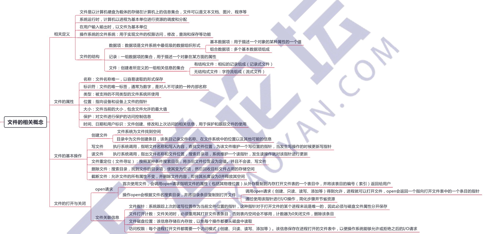
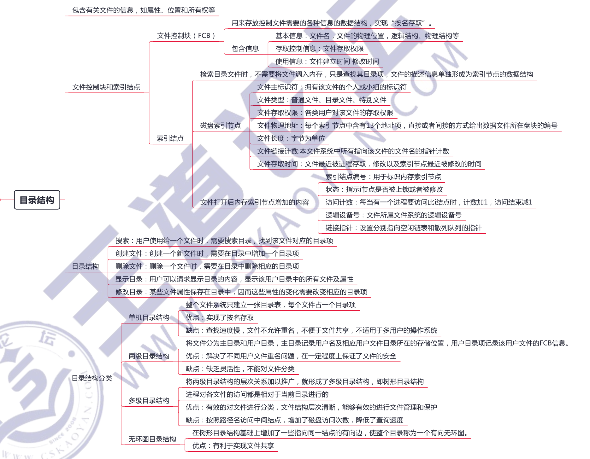
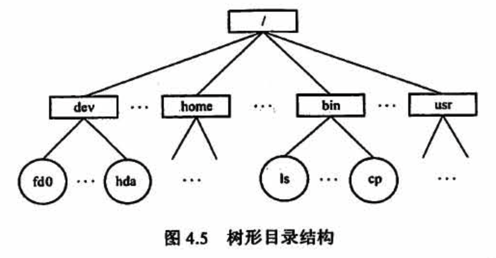
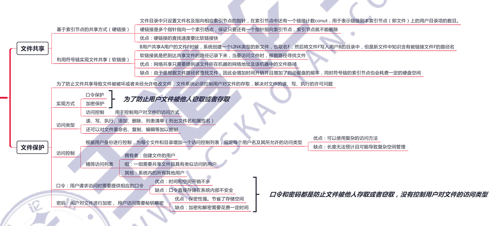
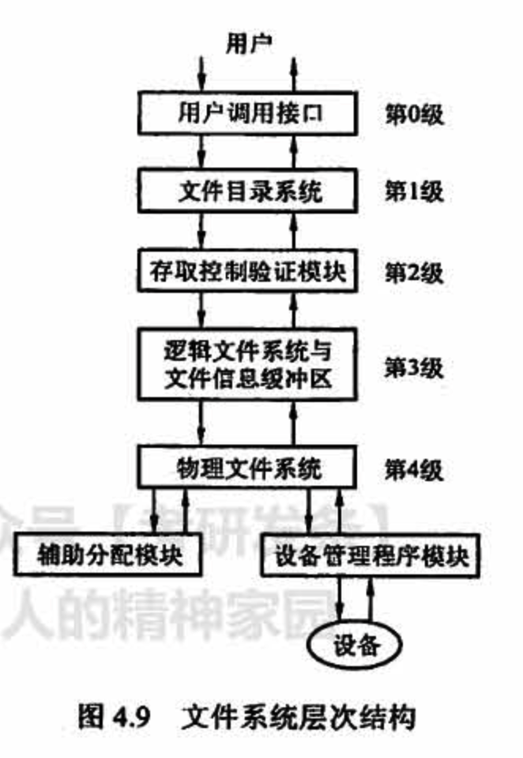
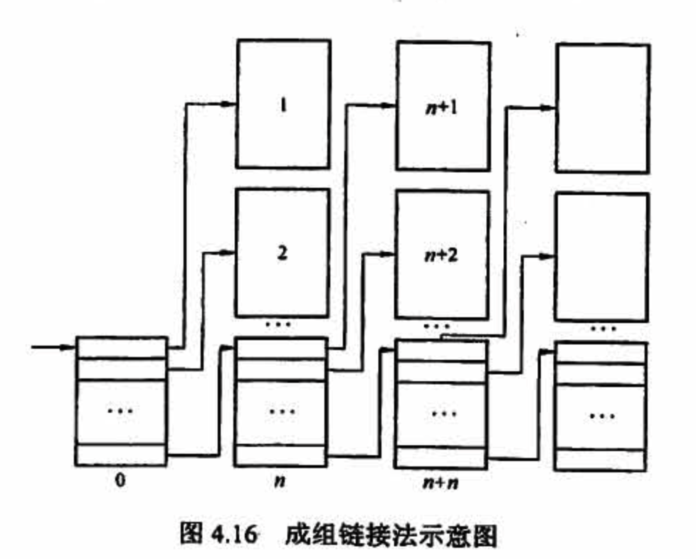
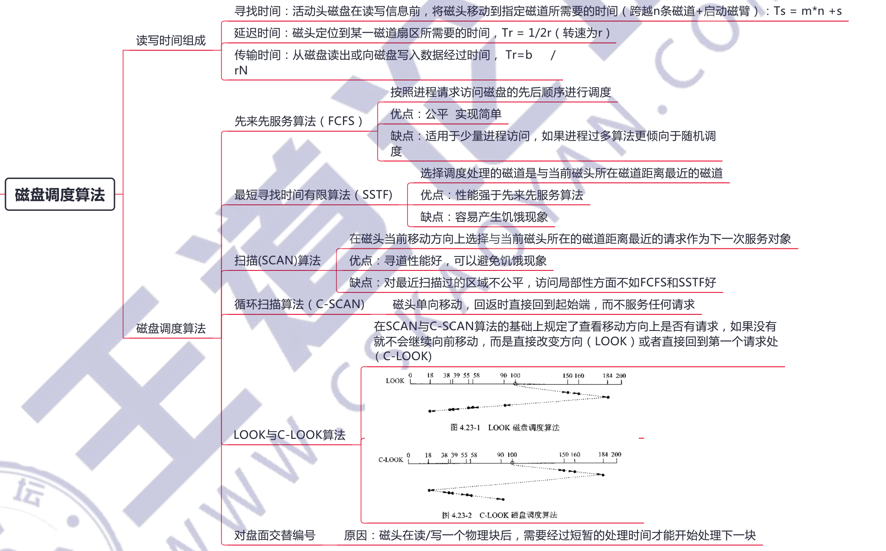
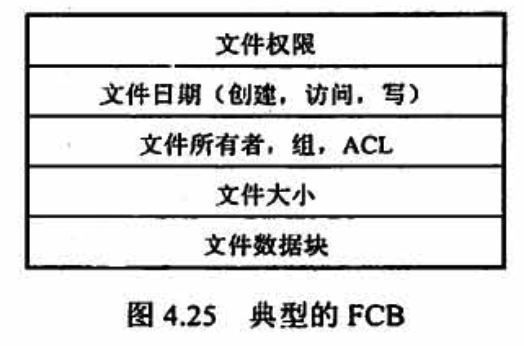
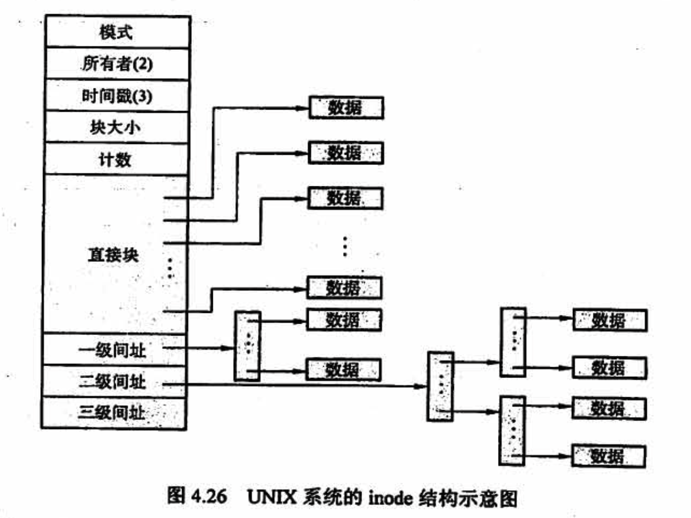

# 文件管理

本章内容较为具体，要注意对概念的理解。重点学握文件系统的结构及其实现、磁盘的相关知识点等。要学握文件系统的文件控制块、物理分配方法、索引结构，以及磁盘特性和结构、磁盘调度算法，能分析磁盘相关的性能等这些都是综合题易考查的内容。

## 4.1 文件系统基础

## 4.2 文件系统的实现

## 4.3 磁盘组织和管理

## 常见问题

### 1）什么是文件？什么是文件系统？

「文件」是以计算机硬盘为载体的存储在计算机上的信息集合，它的形式多样，可以是文本文档、图片、程序等。

操作系统中负责管理和存储文件信息的软件机构称为「文件管理系统」，简称文件系统。文件系统由三部分组成：与文件管理有关的软件、被管理文件及实施文件管理所需的数据结构。

### 2）文件系统要完成哪些功能？

对于用户而言，**文件系统最主要的功能是实现对文件的基本操作**，让用户可以技名存储和查找文件，组织成合适的结构，并应当具有基本的文件共享和文件保护功能。

对于操作系统本身而言，**文件系统还需要管理与磁盘的信息交换**，完成文件逻辑结构和物理结构上的变换，组织文件在磁盘上的存放，采取好的文件排放顺序和磁盘调度方法以握升整个系统的性能。

### 3）在目录中查找某个文件可以使用什么方法？

可以采用线性列表法或哈希表法。线性列表把文件名组织成一个线性表，查找时依次与线性表中的每个表项进行比较。若把文件名按序排列，则使用折半查找法可以降低平均的查找时间，但建立新文件时会增加维护线性表的开销。哈希表用文件名通过哈希函数得到一个指向文件的指针，这种方法非常迅速，但要注意避免冲突。

### 4）文件的逻辑结构和物理结构有何区别？单个文件的逻辑结构和物理结构之问是否存在着某些制約关系？

**文件的「逻辑结构」是「用户可见」的结构，即用户使用文件的结构。文件的「物理结构」是文件在「存储器」上的组织结构，它表示一个文件在辅存上安置、链接、编目的方法**。它和文件的存取方法以及辅存设备的特性等都有著密切的联系。单个文件的逻辑结构和物理结构之间虽无明显的制约或关联关系，但是如果物理结构选择不慎，也很难体现出逻輯结构的特点，**比如一个逻辑结构是顺序结构，而物理结构是隐式链接结构的文件**，即使理论上可以很快找出某条记录的地址，而实际找时仍然需要在磁盘上一块一块地找。

### 5）磁盘结构

引导控制块 (Boot Control Block） 包括系统从该分区引导操作系统所需要的信息。若磁盘没有操作系统，则这块的内容为空。它通常为分区的第一块。UFS 称为引导块 (Boot Block): NTFS称为分区引导扇区 (Partition Boot Sector )。

分区控制块 (Partition Control Block）包括分区详细信息，如分区的块数、块的大小、空闲块的数量和指针、空闲 FCB 的数量和指针等。UFS 称为超級块(Super Block)，而 NTFS 称为主控文件表 (Master File Table).

### 6）内存结构

内存分区表包含所有安装分区的信息。

内存目录结构用来保存近来访问过的目录信息。对安装分区的目录，可以包括一个指向分区表的指针。

单个进程的打开文件表，包括一个指向系统范围内已打开文件表中合适条目和其他信息的指针。

### 7）文件系统实现概述（新建和打开一个文件经历了什么）

为了创建一个文件，应用程序调用逻辑文件系统。逻辑文件系统知道目录结构形式，它将为文件分配一个新的 FCB，把相应目录读入内存，用新的文件名更新该目录和FCB，并将结果写回磁盘。图4.25 显示了个典型的 FCB.

一旦文件被创建，它就能用于 I/0，不过首先要打开文件。调用open 将文件名传给文件系统，文件系统根据给定文件名搜索目录结构。部分目录结构通常缓存在内存中以加快目录操作。找到文件后，其 FCB 复制到系统范围的打开文件表。该表不但存储 FCB，而且存储打开该文件的进程数量的条目。

然后，单个进程的打开文件表中会增加一个条目，井通过指针将系统范围的打开文件表的条目与其他域（文件当前位置的指针和文件打开模式等）相连。调用open 返回的是一个指向单个进程的打开文件表中合适条目的指针，所以文件操作都是通过该指针进行的。

文件名不必是打开文件表的一部分，因为一旦完成对 FCB 在磁盘上的定位，系统就不再使用文件名。对于访问打开文件表的索引，UNIX 称之为文件描述符 (File Descriptor)，而 Windows2000 称之为文件句柄（File Handle）。因此，只要文件未被关闭，所有文件操作就通过打开文件表来进行。

当一个进程关闭文件时，就会删除单个进程打开文件表中的一个相应条目，即目录项，系统范围内打开文件表的打开数也会递减。当打开文件的所有用户都关闭了一个文件时，更新的文件信息会复制到磁盘的目录结构中，系统范围的打开文件表的条目也将删除。

在实际中，系统调用 open 时会首先搜索系统范围的打开文件表，以确定某文件是否己被其他进程所使用。如果是，就在单个进程的打开文件表中创建一项，并指向现有系统范围的打开文件表的相应条目。该算法在文件己打开时，能节省大量开销

### 8）混合索引分配的实現

混合索引分配已在 UNIX 系统中采用。在 UNIX System V 的索引结点中，共设置了 13个地址项，即iadd(0)~iaddr(12)，如图4.26 所示。在BSD UNIX 的索引结点中，共设置了 13个地址项，它们都把所有的地址项分成两类，即直接地址和间接地址。

**直接地址**

为了提高对文件的检索速度，在索引结点中可设置 10个直接地址项，即用 iaddr(0)~iaddr(9)来存放直接地址。换言之，这里每项中所存放的是该文件数据所在盘块的盘块号。假如每个盘块的大小为 4KB，当文件不大于 40KB 时，便可直接从索引结点中读出该文件的全部盘块号。

**一次间接地址**

对于大、中型文件，只采用直接地址并不现实。可再利用索引结点中的地址项 iaddr(10)来提供一次间接地址。这种方式的实质就是一级索引分配方式。图中的一次间址块也就是索引块，系统将分配给文件的多个盘块号记入其中。在一次间址块中可存放 1024 个盘块号，因而允许文件长达 4MB。

**多级间接地址**

当文件长度大于 4MB +40KB（一次间接地址与 10个直接地址项）时，系统还须采用二次间接地址分配方式。这时，用地址项 iaddr(11)提供二次间接地址。该方式的实质是两级索引分配方式。系统此时在二次间接地址块中记入所有一次间接地址块的盘号。在采用二次间接地址方式时，文件的般大长度可达 4GB。同理，地址项 iaddr(12)作为三次间接地址，其允许的文件最大长度可达 4TB。