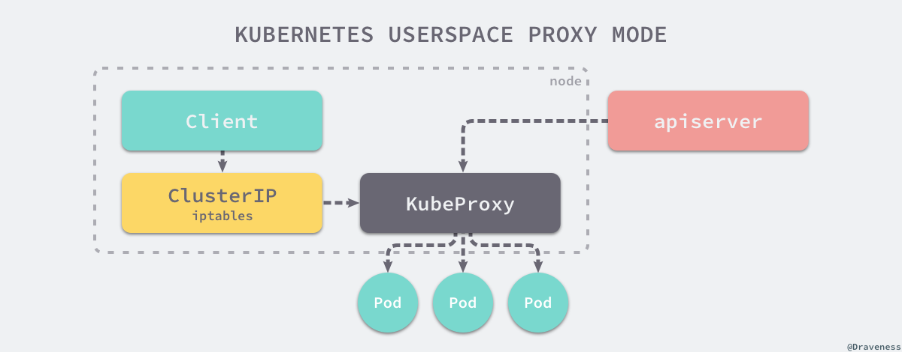
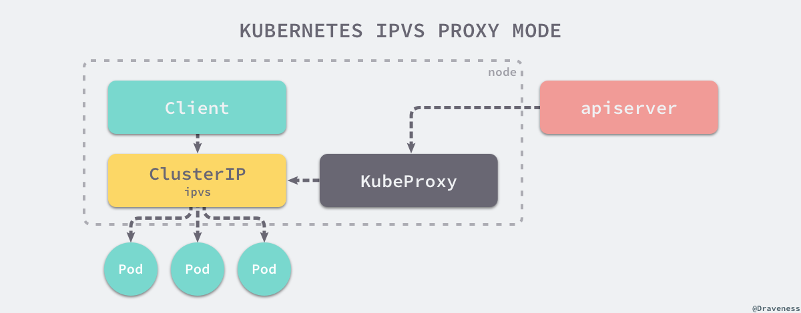

# 详解 Kubernetes Service 的实现原理

来源：[详解 Kubernetes Service 的实现原理](https://draveness.me/kubernetes-service/)

在上一篇文章中，我们介绍了 [Kubernetes 中 Pod 的实现原理](https://draveness.me/kubernetes-pod)，Pod 是 Kubernetes 中非常轻量的对象。

集群中的每一个 Pod 都可以通过 `podIP` 被直接访问的，但是正如我们所看到的，Kubernetes 中的 Pod 是有生命周期的对象，尤其是被 ReplicaSet、Deployment 等对象管理的 Pod，随时都有可能由于集群的状态变化被销毁和创建。

这也就造成了一个非常有意思的问题，当 Kubernetes 集群中的一些 Pod 需要为另外的一些 Pod 提供服务时，我们如何为提供同一功能服务的一组 Pod 建立一个抽象并追踪这组服务中节点的健康状态。

这一个抽象在 Kubernetes 中其实就是 Service，每一个 Kubernetes 的 Service 都是一组 Pod 的逻辑集合和访问方式的抽象，我也可以把 Service 加上的一组 Pod 称作是一个微服务。

在这篇文章中，我们将分两个部分介绍 Kubernetes 中 Service 的实现原理，在第一部分我们将介绍 Kubernetes 如何处理服务的创建，第二部分会介绍它是如何转发来自节点内部和外部的流量。

## 一、创建服务

在 Kubernetes 中创建一个新的 Service 对象需要两大模块同时协作，其中一个模块是控制器，它需要在每次客户端创建新的 Service 对象时，生成其他用于暴露一组 Pod 的 Kubernetes 对象，也就是 Endpoint 对象；另一个模块是 kube-proxy，它运行在 Kubernetes 集群中的每一个节点上，会根据 Service 和 Endpoint 的变动改变节点上 iptables 或者 ipvs 中保存的规则。

### 1、控制器

控制器模块其实总共有两个部分监听了 Service 变动的事件，其中一个是 `ServiceController`、另一个是 `EndpointController`，我们分别来看两者如何应对 Service 的变动。

#### 1）Service

我们可以先来看一下 `ServiceController` 在 Service 对象变动时发生了什么事情，每当有服务被创建或者销毁时，Informer 都会通知 `ServiceController`，它会将这些任务投入工作队列中并由其本身启动的 Worker 协程消费：

```mermaid
sequenceDiagram
    participant I as Informer
    participant SC as ServiceController
    participant Q as WorkQueue
    participant B as Balancer
    I->>+SC: Add/Update/DeleteService
    SC->>Q: Add
    Q-->>SC: return
    deactivate SC
    loop Worker
        SC->>+Q: Get
        Q-->>-SC: key
        SC->>SC: syncService
        SC->>+B: EnsureLoadBalancer
        B-->>-SC: LoadBalancerStatus
    end
```

不过 `ServiceController` 其实只处理了负载均衡类型的 Service 对象，它会调用云服务商的 API 接口，不同的云服务商会实现不同的适配器来创建 LoadBalancer 类型的资源。

我们以 GCE 为例简单介绍一下 Google Cloud 是如何实现负载均衡类型的 Service：

```go
func (g *Cloud) EnsureLoadBalancer(ctx context.Context, clusterName string, svc *v1.Service, nodes []*v1.Node) (*v1.LoadBalancerStatus, error) {
	loadBalancerName := g.GetLoadBalancerName(ctx, clusterName, svc)
	desiredScheme := getSvcScheme(svc)
	clusterID, _ := g.ClusterID.GetID()

	existingFwdRule, _ := g.GetRegionForwardingRule(loadBalancerName, g.region)

	if existingFwdRule != nil {
		existingScheme := cloud.LbScheme(strings.ToUpper(existingFwdRule.LoadBalancingScheme))
		if existingScheme != desiredScheme {
			switch existingScheme {
			case cloud.SchemeInternal:
				g.ensureInternalLoadBalancerDeleted(clusterName, clusterID, svc)
			default:
				g.ensureExternalLoadBalancerDeleted(clusterName, clusterID, svc)
			}
			existingFwdRule = nil
		}
	}

	var status *v1.LoadBalancerStatus
	switch desiredScheme {
	case cloud.SchemeInternal:
		status, err = g.ensureInternalLoadBalancer(clusterName, clusterID, svc, existingFwdRule, nodes)
	default:
		status, err = g.ensureExternalLoadBalancer(clusterName, clusterID, svc, existingFwdRule, nodes)
	}
	return status, err
}
```

上述代码会先判断是否应该先删除已经存在的负载均衡资源，随后会调用一个内部的方法 `ensureExternalLoadBalancer` 在 Google Cloud 上创建一个新的资源，这个方法的调用过程比较复杂：

1. 检查转发规则是否存在并获取它的 IP 地址；
2. 确定当前 LoadBalancer 使用的 IP 地址；
3. 处理防火墙的规则的创建和更新；
4. 创建和删除指定的健康检查；

想要了解 GCE 是如何对 LoadBalancer 进行支持的可以在 Kubernetes 中的 [gce](https://github.com/kubernetes/kubernetes/tree/master/pkg/cloudprovider/providers/gce) package 中阅读相关的代码，这里面就是 gce 对于云服务商特定资源的实现方式。

#### 2）Endpoint

`ServiceController` 主要处理的还是与 LoadBalancer 相关的逻辑，但是 `EndpointController` 的作用就没有这么简单了，我们在使用 Kubernetes 时虽然很少会直接与 Endpoint 资源打交道，但是它却是 Kubernetes 中非常重要的组成部分。

`EndpointController` 本身并没有通过 `Informer` 监听 Endpoint 资源的变动，但是它却同时订阅了 Service 和 Pod 资源的增删事件，对于 Service 资源来讲，`EndpointController` 会通过以下的方式进行处理：

```mermaid
sequenceDiagram
    participant I as Informer
    participant EC as EndpointController
    participant Q as WorkQueue
    participant PL as PodLister
    participant C as Client
    I->>+EC: Add/Update/DeleteService
    EC->>Q: Add
    Q-->>EC: return
    deactivate EC
    loop Worker
        EC->>+Q: Get
        Q-->>-EC: key
        EC->>+EC: syncService
        EC->>+PL: ListPod(service.Spec.Selector)
        PL-->>-EC: Pods
        loop Every Pod
            EC->>EC: addEndpointSubset
        end
        EC->>+C: Create/UpdateEndpoint
        C-->>-EC: result
    end
```

`EndpointController` 中的 `syncService` 方法是用于创建和删除 Endpoint 资源最重要的方法，在这个方法中我们会根据 Service 对象规格中的选择器 Selector 获取集群中存在的所有 Pod，并将 Service 和 Pod 上的端口进行映射生成一个 `EndpointPort` 结构体：

```go
func (e *EndpointController) syncService(key string) error {
	namespace, name, _ := cache.SplitMetaNamespaceKey(key)
	service, _ := e.serviceLister.Services(namespace).Get(name)
	pods, _ := e.podLister.Pods(service.Namespace).List(labels.Set(service.Spec.Selector).AsSelectorPreValidated())

	subsets := []v1.EndpointSubset{}
	for _, pod := range pods {
		epa := *podToEndpointAddress(pod)

		for i := range service.Spec.Ports {
			servicePort := &service.Spec.Ports[i]

			portName := servicePort.Name
			portProto := servicePort.Protocol
			portNum, _ := podutil.FindPort(pod, servicePort)

			epp := &v1.EndpointPort{Name: portName, Port: int32(portNum), Protocol: portProto}
			subsets, _, _ = addEndpointSubset(subsets, pod, epa, epp, tolerateUnreadyEndpoints)
		}
	}
	subsets = endpoints.RepackSubsets(subsets)

	currentEndpoints = &v1.Endpoints{
		ObjectMeta: metav1.ObjectMeta{
			Name:   service.Name,
			Labels: service.Labels,
		},
	}

	newEndpoints := currentEndpoints.DeepCopy()
	newEndpoints.Subsets = subsets
	newEndpoints.Labels = service.Labels
	e.client.CoreV1().Endpoints(service.Namespace).Create(newEndpoints)

	return nil
}
```

对于每一个 Pod 都会生成一个新的 `EndpointSubset`，其中包含了 Pod 的 IP 地址和端口和 Service 的规格中指定的输入端口和目标端口，在最后 `EndpointSubset` 的数据会被重新打包并通过客户端创建一个新的 Endpoint 资源。

在上面我们已经提到过，除了 Service 的变动会触发 Endpoint 的改变之外，Pod 对象的增删也会触发 `EndpointController` 中的回调函数。

```mermaid
sequenceDiagram
    participant I as Informer
    participant EC as EndpointController
    participant Q as WorkQueue
    participant SL as ServiceLister
    I->>+EC: Add/Update/DeletePod
    EC->>+SL: GetPodServices
    SL-->>-EC: []Service
    EC->>Q: Add
    Q-->>EC: return
    deactivate EC
```

`getPodServiceMemberships` 会获取跟当前 Pod 有关的 Service 对象并将所有的 Service 对象都转换成 `<namespace>/<name>` 的字符串：

```go
func (e *EndpointController) getPodServiceMemberships(pod *v1.Pod) (sets.String, error) {
	set := sets.String{}
	services, _ := e.serviceLister.GetPodServices(pod)

	for i := range services {
		key, _ := controller.KeyFunc(services[i])
		set.Insert(key)
	}
	return set, nil
}
```

这些服务最后会被加入 `EndpointController` 的队列中，等待它持有的几个 Worker 对 Service 进行同步。

这些其实就是 `EndpointController` 的作用，订阅 Pod 和 Service 对象的变更，并根据当前集群中的对象生成 Endpoint 对象将两者进行关联。

### 2、代理

在整个集群中另一个订阅 Service 对象变动的组件就是 kube-proxy 了，每当 kube-proxy 在新的节点上启动时都会初始化一个 `ServiceConfig` 对象，就像介绍 iptables 代理模式时提到的，这个对象会接受 Service 的变更事件：

```mermaid
sequenceDiagram
    participant SCT as ServiceChangeTracker
    participant SC as ServiceConfig
    participant P as Proxier
    participant EC as EndpointConfig
    participant ECT as EndpointChangeTracker
    participant SR as SyncRunner
    SC->>+P: OnServiceAdd/Update/Delete/Synced
    P->>SCT: Update
    SCT-->>P: Return ServiceMap
    deactivate P
    EC->>+P: OnEndpointsAdd/Update/Delete/Synced
    ECT-->>P: Return EndpointMap
    P->>ECT: Update
    deactivate P
    loop Every minSyncPeriod ~ syncPeriod
        SR->>P: syncProxyRules
    end
```

这些变更事件都会被订阅了集群中对象变动的 `ServiceConfig` 和 `EndpointConfig` 对象推送给启动的 `Proxier` 实例：

```go
func (c *ServiceConfig) handleAddService(obj interface{}) {
	service, ok := obj.(*v1.Service)
	if !ok {
		return
	}
	for i := range c.eventHandlers {
		c.eventHandlers[i].OnServiceAdd(service)
	}
}
```

收到事件变动的 `Proxier` 实例随后会根据启动时的配置更新 iptables 或者 ipvs 中的规则，这些应用最终会负责对进出的流量进行转发并完成一些负载均衡相关的任务。

## 二、代理模式

在 Kubernetes 集群中的每一个节点都运行着一个 kube-proxy 进程，这个进程会负责监听 Kubernetes 主节点中 Service 的增加和删除事件并修改运行代理的配置，为节点内的客户端提供流量的转发和负载均衡等功能，但是当前 kube-proxy 的代理模式目前来看有三种：

这三种代理模式中的第一种 userspace 其实就是运行在用户空间代理，所有的流量最终都会通过 kube-proxy 本身转发给其他的服务，后两种 iptable 和 ipvs 都运行在内核空间能够为 Kubernetes 集群提供更加强大的性能支持。

### 1、userspace

作为运行在用户空间的代理，对于每一个 Service 都会在当前的节点上开启一个端口，所有连接到当前代理端口的请求都会被转发到 Service 背后的一组 Pod 上，它其实会在节点上添加 iptables 规则，通过 iptables 将流量转发给 kube-proxy 处理。

如果当前节点上的 kube-proxy 在启动时选择了 userspace 模式，那么每当有新的 Service 被创建时，kube-proxy 就会增加一条 iptables 记录并启动一个 Goroutine，前者用于将节点中服务对外发出的流量转发给 kube-proxy，再由后者持有的一系列 Goroutine 将流量转发到目标的 Pod 上。



这一系列的工作大都是在 `OnServiceAdd` 被触发时中完成的，正如上面所说的，该方法会调用 `mergeService` 将传入服务 Service 的端口变成一条 iptables 的配置命令为当前节点增加一条规则，同时在 `addServiceOnPort` 方法中启动一个 TCP 或 UDP 的 Socket：

```go
func (proxier *Proxier) mergeService(service *v1.Service) sets.String {
	svcName := types.NamespacedName{Namespace: service.Namespace, Name: service.Name}
	existingPorts := sets.NewString()
	for i := range service.Spec.Ports {
		servicePort := &service.Spec.Ports[i]
		serviceName := proxy.ServicePortName{NamespacedName: svcName, Port: servicePort.Name}
		existingPorts.Insert(servicePort.Name)
		info, exists := proxier.getServiceInfo(serviceName)
		if exists {
			proxier.closePortal(serviceName, info)
			proxier.stopProxy(serviceName, info)
		}
		proxyPort,  := proxier.proxyPorts.AllocateNext()

		serviceIP := net.ParseIP(service.Spec.ClusterIP)
		info, _ = proxier.addServiceOnPort(serviceName, servicePort.Protocol, proxyPort, proxier.udpIdleTimeout)
		info.portal.ip = serviceIP
		info.portal.port = int(servicePort.Port)
		info.externalIPs = service.Spec.ExternalIPs
		info.loadBalancerStatus = *service.Status.LoadBalancer.DeepCopy()
		info.nodePort = int(servicePort.NodePort)
		info.sessionAffinityType = service.Spec.SessionAffinity

		proxier.openPortal(serviceName, info)
		proxier.loadBalancer.NewService(serviceName, info.sessionAffinityType, info.stickyMaxAgeSeconds)
	}

	return existingPorts
}
```

这个启动的进程会监听同一个节点上，转发自所有进程的 TCP 和 UDP 请求并将这些数据包发送给目标的 Pod 对象。

在用户空间模式中，如果一个连接被目标服务拒绝，我们的代理服务能够重新尝试连接其他的服务，除此之外用户空间模式并没有太多的优势。

### 2、iptables

另一种常见的代理模式就是直接使用 iptables 转发当前节点上的全部流量，这种脱离了用户空间在内核空间中实现转发的方式能够极大地提高 proxy 的效率，增加 kube-proxy 的吞吐量。


iptables 作为一种代理模式，它同样实现了 `OnServiceUpdate`、`OnEndpointsUpdate` 等方法，这两个方法会分别调用相应的变更追踪对象。

```mermaid
sequenceDiagram
    participant SC as ServiceConfig
    participant P as Proxier
    participant SCT as ServiceChangeTracker
    participant SR as SyncRunner
    participant I as iptable
    SC->>+P: OnServiceAdd
    P->>P: OnServiceUpdate
    P->>SCT: Update
    SCT-->>P: Return ServiceMap
    deactivate P
    loop Every minSyncPeriod ~ syncPeriod
        SR->>+P: syncProxyRules
        P->>I: UpdateChain
        P->>P: writeLine x N
        P->>I: RestoreAll
        deactivate P
    end
```

变更追踪对象会根据 `Service` 或 `Endpoint` 对象的前后变化改变 `ServiceChangeTracker` 本身的状态，这些变更会每隔一段时间通过一个 700 行的巨大方法 `syncProxyRules` 同步，在这里就不介绍这个方法的具体实现了，它的主要功能就是根据 `Service` 和 `Endpoint` 对象的变更生成一条一条的 iptables 规则，比较感兴趣的读者，可以点击 [proxier.go#L640-1379](https://sourcegraph.com/github.com/kubernetes/kubernetes@master/-/blob/pkg/proxy/iptables/proxier.go#L640-1379) 查看代码。

当我们使用 iptables 的方式启动节点上的代理时，所有的流量都会先经过 `PREROUTING` 或者 `OUTPUT` 链，随后进入 Kubernetes 自定义的链入口 KUBE-SERVICES、单个 Service 对应的链 `KUBE-SVC-XXXX` 以及每个 Pod 对应的链 `KUBE-SEP-XXXX`，经过这些链的处理，最终才能够访问当一个服务的真实 IP 地址。

虽然相比于用户空间来说，直接运行在内核态的 iptables 能够增加代理的吞吐量，但是当集群中的节点数量非常多时，iptables 并不能达到生产级别的可用性要求，每次对规则进行匹配时都会遍历 iptables 中的所有 Service 链。

规则的更新也不是增量式的，当集群中的 Service 达到 5,000 个，每增加一条规则都需要耗时 11min，当集群中的 Service 达到 20,000 个时，每增加一条规则都需要消耗 5h 的时间，这也就是告诉我们在大规模集群中使用 iptables 作为代理模式是完全不可用的。

### 3、ipvs

ipvs 就是用于解决在大量 Service 时，iptables 规则同步变得不可用的性能问题。与 iptables 比较像的是，ipvs 的实现虽然也基于 netfilter 的钩子函数，但是它却使用哈希表作为底层的数据结构并且工作在内核态，这也就是说 ipvs 在重定向流量和同步代理规则有着更好的性能。



在处理 Service 的变化时，ipvs 包和 iptables 其实就有非常相似了，它们都同样使用 `ServiceChangeTracker` 对象来追踪变更，只是两者对于同步变更的方法 `syncProxyRules` 实现上有一些不同。

```mermaid
sequenceDiagram
    participant P as Proxier
    participant SR as SyncRunner
    participant IP as ipvs
    participant I as iptable
    loop Every minSyncPeriod ~ syncPeriod
        SR->>+P: syncProxyRules
        P->>P: writeLine(iptable)
        P->>IP: Add/UpdateVirtualServer(syncService)
        IP-->>P: result
        P->>IP: AddRealServer(syncEndpoint)
        IP-->>P: result
        P->>I: RestoreAll
        deactivate P
    end
```

我们从 ipvs 的源代码和上述的时序图中可以看到，Kubernetes ipvs 的实现其实是依赖于 iptables 的，后者能够辅助它完成一些功能，使用 ipvs 相比 iptables 能够减少节点上的 iptables 规则数量，这也是因为 ipvs 接管了原来存储在 iptables 中的规则。

除了能够提升性能之外，ipvs 也提供了多种类型的负载均衡算法，除了最常见的 Round-Robin 之外，还支持最小连接、目标哈希、最小延迟等算法，能够很好地提升负载均衡的效率。

三种不同的代理模式其实是一个逐渐演化的过程，从最开始运行在用户空间需要『手动』监听端口并对数据包进行转发的用户空间模式，到之后使用运行在内核空间的 iptables 模式，再到 Kubernetes 1.9 版本中出现的 ipvs 模式，几种不同的模式在大量 Service 存在时有数量级别效率差异。

## 总结

Kubernetes 中的 Service 将一组 Pod 以统一的形式对外暴露成一个服务，它利用运行在内核空间的 iptables 或者 ipvs 高效地转发来自节点内部和外部的流量。除此之外，作为非常重要的 Kubernetes 对象，Service 不仅在逻辑上提供了微服务的概念，还引入 LoadBalancer 类型的 Service 无缝对接云服务商提供的复杂资源。

理解 Kubernetes 的 Service 对象能够帮助我们梳理集群内部的网络拓扑关系，也能让我们更清楚它是如何在集群内部实现服务发现、负载均衡等功能的，在后面的文章中我们会展开介绍 kube-proxy 的作用和实现。

## References

- [浅谈 kubernetes service 那些事（上篇）](https://sq.163yun.com/blog/article/174981072898940928)
- [Kubernetes Services and Ingress Under X-ray](http://containerops.org/2017/01/30/kubernetes-services-and-ingress-under-x-ray/)
- [Services - Kubernetes](https://kubernetes.io/docs/concepts/services-networking/service/)