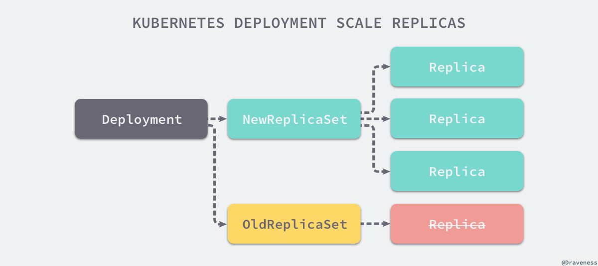
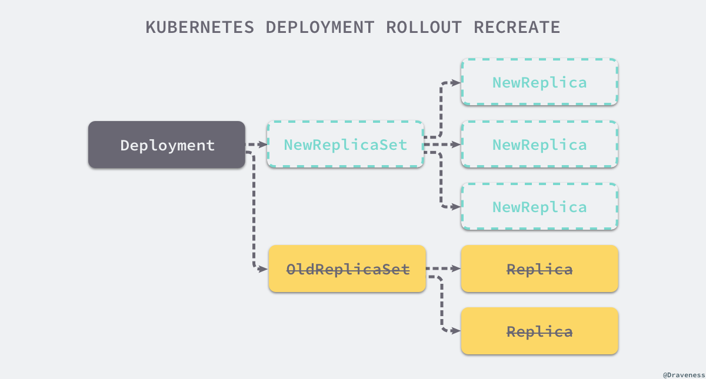
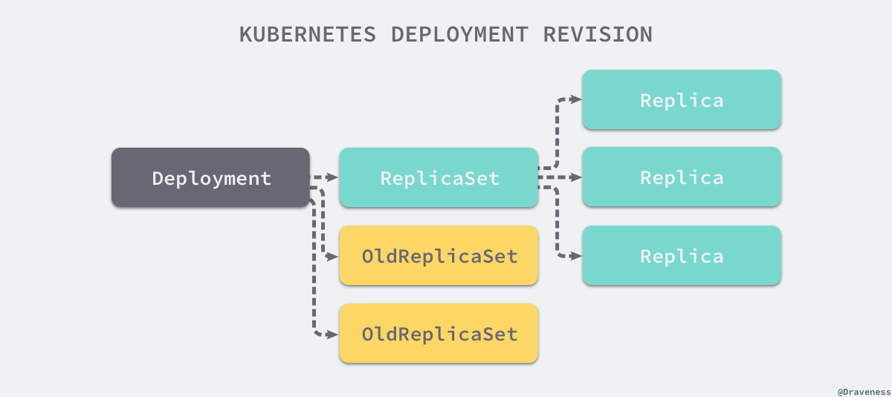

# 详解 Kubernetes Deployment 的实现原理

来源：[详解 Kubernetes Deployment 的实现原理](https://draveness.me/kubernetes-deployment/)

如果你在生产环境中使用过 Kubernetes，那么相信你对 Deployment 一定不会陌生，Deployment 提供了一种对 [Pod](https://draveness.me/kubernetes-pod) 和 [ReplicaSet](https://draveness.me/kubernetes-replicaset) 的管理方式，每一个 Deployment 都对应集群中的一次部署，是非常常见的 Kubernetes 对象。

我们在这篇文章中就会介绍 Deployment 的实现原理，包括它是如何处理 Pod 的滚动更新、回滚以及支持副本的水平扩容。

## 一、概述

作为最常用的 Kubernetes 对象，Deployment 经常会用来创建 [ReplicaSet](https://draveness.me/kubernetes-replicaset) 和 [Pod](https://draveness.me/kubernetes-pod)，我们往往不会直接在集群中使用 ReplicaSet 部署一个新的微服务，一方面是因为 ReplicaSet 的功能其实不够强大，一些常见的更新、扩容和缩容运维操作都不支持，Deployment 的引入就是为了就是为了支持这些复杂的操作。

```yaml
apiVersion: apps/v1
kind: Deployment
metadata:
  name: nginx-deployment
  labels:
    app: nginx
spec:
  replicas: 3
  selector:
    matchLabels:
      app: nginx
  template:
    metadata:
      labels:
        app: nginx
    spec:
      containers:
      - name: nginx
        image: nginx:1.7.9
        ports:
        - containerPort: 80
```

当我们在 Kubernetes 集群中创建上述 Deployment 对象时，它不只会创建 Deployment 资源，还会创建另外的 ReplicaSet 以及三个 Pod 对象：

```bash
$ kubectl get deployments.apps
NAME               READY     UP-TO-DATE   AVAILABLE   AGE
nginx-deployment   3/3       3            3           6m55s

$ kubectl get replicasets.apps
NAME                          DESIRED   CURRENT   READY     AGE
nginx-deployment-76bf4969df   3         3         3         7m27s

$ kubectl get pods
NAME                                READY     STATUS    RESTARTS   AGE
nginx-deployment-76bf4969df-58gxj   1/1       Running   0          7m42s
nginx-deployment-76bf4969df-9jgk9   1/1       Running   0          7m42s
nginx-deployment-76bf4969df-m4pkg   1/1       Running   0          7m43s
```

每一个 Deployment 都会和它的依赖组成以下的拓扑结构，在这个拓扑结构中的子节点都是『稳定』的，任意节点的删除都会被 Kubernetes 的控制器重启：

```mermaid
graph TD
    Deployment-.->ReplicaSet
    ReplicaSet-.->Pod1
    ReplicaSet-.->Pod2
    ReplicaSet-.->Pod3
```

所有的 Deployment 对象都是由 Kubernetes 集群中的 `DeploymentController` 进行管理

## 二、实现原理

`DeploymentController` 作为管理 Deployment 资源的控制器，会在启动时通过 `Informer` 监听三种不同资源的通知，Pod、ReplicaSet 和 Deployment，这三种资源的变动都会触发 `DeploymentController` 中的回调。

```mermaid
graph TD
    DI[DeploymentInformer]-. Add/Update/Delete .->DC[DeploymentController]
    ReplicaSetInformer-. Add/Update/Delete .->DC
    PodInformer-. Delete .->DC
```

不同的事件最终都会在被过滤后进入控制器持有的队列，等待工作进程的消费，下面的这些事件都会触发 Deployment 的同步：

1. Deployment 的变动；
2. Deployment 相关的 ReplicaSet 变动；
3. Deployment 相关的 Pod 数量为 0 时，Pod 的删除事件；

`DeploymentController` 会在调用 `Run` 方法时启动多个工作进程，这些工作进程会运行 `worker` 方法从队列中读取最新的 Deployment 对象进行同步。

### 1、同步

Deployment 对象的同步都是通过以下的 `syncDeployment` 方法进行的，该方法包含了同步、回滚以及更新的逻辑，是同步 Deployment 资源的唯一入口：

```go
func (dc *DeploymentController) syncDeployment(key string) error {
	namespace, name, _ := cache.SplitMetaNamespaceKey(key)
	deployment, _ := dc.dLister.Deployments(namespace).Get(name)

	d := deployment.DeepCopy()

	rsList, _ := dc.getReplicaSetsForDeployment(d)
	podMap, _ := dc.getPodMapForDeployment(d, rsList)

	dc.checkPausedConditions(d)

	if d.Spec.Paused {
		return dc.sync(d, rsList)
	}

	scalingEvent, _ := dc.isScalingEvent(d, rsList)
	if scalingEvent {
		return dc.sync(d, rsList)
	}

	switch d.Spec.Strategy.Type {
	case apps.RecreateDeploymentStrategyType:
		return dc.rolloutRecreate(d, rsList, podMap)
	case apps.RollingUpdateDeploymentStrategyType:
		return dc.rolloutRolling(d, rsList)
	}
	return fmt.Errorf("unexpected deployment strategy type: %s", d.Spec.Strategy.Type)
}
```

1. 根据传入的键获取 Deployment 资源；
2. 调用 `getReplicaSetsForDeployment` 获取集群中与 Deployment 相关的全部 ReplicaSet；
   1. 查找集群中的全部 ReplicaSet；
   2. 根据 Deployment 的选择器对 ReplicaSet 建立或者释放从属关系；
3. 调用 `getPodMapForDeployment` 获取当前 Deployment 对象相关的从 ReplicaSet 到 Pod 的映射；
   1. 根据选择器查找全部的 Pod；
   2. 根据 Pod 的控制器 ReplicaSet 对上述 Pod 进行分类；
4. 如果当前的 Deployment 处于暂停状态或者需要进行扩容，就会调用 `sync` 方法同步 Deployment;
5. 在正常情况下会根据规格中的策略对 Deployment 进行更新；
   1. `Recreate` 策略会调用 `rolloutRecreate` 方法，它会先杀掉所有存在的 Pod 后启动新的 Pod 副本；
   2. `RollingUpdate` 策略会调用 `rolloutRolling` 方法，根据 `maxSurge`和 `maxUnavailable` 配置对 Pod 进行滚动更新；

这就是 Deployment 资源同步的主要流程，我们在这里可以关注一下 `getReplicaSetsForDeployment` 方法：

```go
func (dc *DeploymentController) getReplicaSetsForDeployment(d *apps.Deployment) ([]*apps.ReplicaSet, error) {
	rsList, _ := dc.rsLister.ReplicaSets(d.Namespace).List(labels.Everything())
	deploymentSelector, _ := metav1.LabelSelectorAsSelector(d.Spec.Selector)
	canAdoptFunc := controller.RecheckDeletionTimestamp(func() (metav1.Object, error) {
		return dc.client.AppsV1().Deployments(d.Namespace).Get(d.Name, metav1.GetOptions{})
	})
	cm := controller.NewReplicaSetControllerRefManager(dc.rsControl, d, deploymentSelector, controllerKind, canAdoptFunc)
	return cm.ClaimReplicaSets(rsList)
}
```

该方法获取 Deployment 持有的 ReplicaSet 时会重新与集群中符合条件的 ReplicaSet 通过 `ownerReferences` 建立关系，执行的逻辑与 [ReplicaSet](https://draveness.me/kubernetes-replicaset) 调用 `AdoptPod/ReleasePod` 几乎完全相同。

#### 1）扩容

如果当前需要更新的 Deployment 经过 `isScalingEvent` 的检查发现更新事件实际上是一次扩容或者缩容，也就是 ReplicaSet 持有的 Pod 数量和规格中的 `Replicas` 字段并不一致，那么就会调用 `sync` 方法对 Deployment 进行同步：

```go
func (dc *DeploymentController) sync(d *apps.Deployment, rsList []*apps.ReplicaSet) error {
	newRS, oldRSs, _ := dc.getAllReplicaSetsAndSyncRevision(d, rsList, false)
	dc.scale(d, newRS, oldRSs)

	allRSs := append(oldRSs, newRS)
	return dc.syncDeploymentStatus(allRSs, newRS, d)
}
```

同步的过程其实比较简单，该方法会从 apiserver 中拿到当前 Deployment 对应的最新 ReplicaSet 和历史的 ReplicaSet 并调用 `scale` 方法开始扩容，`scale` 就是扩容需要执行的主要方法，我们将下面的方法分成几部分依次进行介绍：

```go
func (dc *DeploymentController) scale(deployment *apps.Deployment, newRS *apps.ReplicaSet, oldRSs []*apps.ReplicaSet) error {
	if activeOrLatest := deploymentutil.FindActiveOrLatest(newRS, oldRSs); activeOrLatest != nil {
		if *(activeOrLatest.Spec.Replicas) == *(deployment.Spec.Replicas) {
			return nil
		}
		dc.scaleReplicaSetAndRecordEvent(activeOrLatest, *(deployment.Spec.Replicas), deployment)
		return nil
	}

	if deploymentutil.IsSaturated(deployment, newRS) {
		for _, old := range controller.FilterActiveReplicaSets(oldRSs) {
			dc.scaleReplicaSetAndRecordEvent(old, 0, deployment)
		}
		return nil
	}
```

如果集群中只有一个活跃的 ReplicaSet，那么就会对该 ReplicaSet 进行扩缩容，但是如果不存在活跃的 ReplicaSet 对象，就会选择最新的 ReplicaSet 进行操作，这部分选择 ReplicaSet 的工作都是由 `FindActiveOrLatest` 和 `scaleReplicaSetAndRecordEvent` 共同完成的。

当调用 `IsSaturated` 方法发现当前的 Deployment 对应的副本数量已经饱和时就会删除所有历史版本 ReplicaSet 持有的 Pod 副本。



但是在 Deployment 使用滚动更新策略时，如果发现当前的 ReplicaSet 并没有饱和并且存在多个活跃的 ReplicaSet 对象就会按照比例分别对各个活跃的 ReplicaSet 进行扩容或者缩容：

```go
if deploymentutil.IsRollingUpdate(deployment) {
		allRSs := controller.FilterActiveReplicaSets(append(oldRSs, newRS))
		allRSsReplicas := deploymentutil.GetReplicaCountForReplicaSets(allRSs)

		allowedSize := int32(0)
		if *(deployment.Spec.Replicas) > 0 {
			allowedSize = *(deployment.Spec.Replicas) + deploymentutil.MaxSurge(*deployment)
		}

		deploymentReplicasToAdd := allowedSize - allRSsReplicas

		var scalingOperation string
		switch {
		case deploymentReplicasToAdd > 0:
			sort.Sort(controller.ReplicaSetsBySizeNewer(allRSs))
			scalingOperation = "up"

		case deploymentReplicasToAdd < 0:
			sort.Sort(controller.ReplicaSetsBySizeOlder(allRSs))
			scalingOperation = "down"
		}
```

1. 通过 `FilterActiveReplicaSets` 获取所有活跃的 ReplicaSet 对象；
2. 调用 `GetReplicaCountForReplicaSets` 计算当前 Deployment 对应 ReplicaSet 持有的全部 Pod 副本个数；
3. 根据 Deployment 对象配置的 `Replicas` 和最大额外可以存在的副本数 `maxSurge` 以计算 Deployment 允许创建的 Pod 数量；
4. 通过 `allowedSize` 和 `allRSsReplicas` 计算出需要增加或者删除的副本数；
5. 根据 `deploymentReplicasToAdd` 变量的符号对 ReplicaSet 数组进行排序并确定当前的操作时扩容还是缩容；
   1. 如果 `deploymentReplicasToAdd > 0`，ReplicaSet 将按照从新到旧的顺序依次进行扩容；
   2. 如果 `deploymentReplicasToAdd < 0`，ReplicaSet 将按照从旧到新的顺序依次进行缩容；

`maxSurge`、`maxUnavailable` 是两个处理滚动更新时需要关注的参数，我们会在滚动更新一节中具体介绍。

```go
		deploymentReplicasAdded := int32(0)
		nameToSize := make(map[string]int32)
		for i := range allRSs {
			rs := allRSs[i]

			if deploymentReplicasToAdd != 0 {
				proportion := deploymentutil.GetProportion(rs, *deployment, deploymentReplicasToAdd, deploymentReplicasAdded)

				nameToSize[rs.Name] = *(rs.Spec.Replicas) + proportion
				deploymentReplicasAdded += proportion
			} else {
				nameToSize[rs.Name] = *(rs.Spec.Replicas)
			}
		}
```

因为当前的 Deployment 持有了多个活跃的 ReplicaSet，所以在计算了需要增加或者删除的副本个数 `deploymentReplicasToAdd` 之后，就会为多个活跃的 ReplicaSet 分配每个 ReplicaSet 需要改变的副本数，`GetProportion` 会根据以下几个参数决定最后的结果:

1. Deployment 期望的 Pod 副本数量；
2. 需要新增或者减少的副本数量；
3. Deployment 当前通过 ReplicaSet 持有 Pod 的总数量；

Kubernetes 会在 `getReplicaSetFraction` 使用下面的公式计算每一个 ReplicaSet 在 Deployment 资源中的占比，最后会返回该 ReplicaSet 需要改变的副本数：
$$
replicaSet.Spec.Replicas*(\frac{deployment.Spec.Replicas+maxSurge(deployment)}{deployment.Status.Replicas}-1)
$$
该结果又会与目前期望的剩余变化量进行对比，保证变化的副本数量不会超过期望值。

```go
		for i := range allRSs {
			rs := allRSs[i]

			// ...

			dc.scaleReplicaSet(rs, nameToSize[rs.Name], deployment, scalingOperation)
		}
	}
	return nil
}
```

在 `scale` 方法的最后会直接调用 `scaleReplicaSet` 将每一个 ReplicaSet 都扩容或者缩容到我们期望的副本数：

```go
func (dc *DeploymentController) scaleReplicaSet(rs *apps.ReplicaSet, newScale int32, deployment *apps.Deployment, scalingOperation string) (bool, *apps.ReplicaSet, error) {
	sizeNeedsUpdate := *(rs.Spec.Replicas) != newScale

	annotationsNeedUpdate := deploymentutil.ReplicasAnnotationsNeedUpdate(rs, *(deployment.Spec.Replicas), *(deployment.Spec.Replicas)+deploymentutil.MaxSurge(*deployment))

	if sizeNeedsUpdate || annotationsNeedUpdate {
		rsCopy := rs.DeepCopy()
		*(rsCopy.Spec.Replicas) = newScale
		deploymentutil.SetReplicasAnnotations(rsCopy, *(deployment.Spec.Replicas), *(deployment.Spec.Replicas)+deploymentutil.MaxSurge(*deployment))
		rs, _ = dc.client.AppsV1().ReplicaSets(rsCopy.Namespace).Update(rsCopy)
	}
	return true, rs, err
}
```

这里会直接修改目标 ReplicaSet 规格中的 `Replicas` 参数和注解 `deployment.kubernetes.io/desired-replicas` 的值并通过 API 请求更新当前的 ReplicaSet 对象：

```bash
$ kubectl describe rs nginx-deployment-76bf4969df
Name:           nginx-deployment-76bf4969df
Namespace:      default
Selector:       app=nginx,pod-template-hash=76bf4969df
Labels:         app=nginx
                pod-template-hash=76bf4969df
Annotations:    deployment.kubernetes.io/desired-replicas=3
                deployment.kubernetes.io/max-replicas=4
...
```

我们可以通过 `describe` 命令查看 ReplicaSet 的注解，其实能够发现当前 ReplicaSet 的期待副本数和最大副本数，`deployment.kubernetes.io/desired-replicas` 注解就是在上述方法中被 Kubernetes 的 `DeploymentController` 更新的。

#### 2）重新创建

当 Deployment 使用的更新策略类型是 `Recreate` 时，`DeploymentController` 就会使用如下的 `rolloutRecreate` 方法对 Deployment 进行更新：

```go
func (dc *DeploymentController) rolloutRecreate(d *apps.Deployment, rsList []*apps.ReplicaSet, podMap map[types.UID]*v1.PodList) error {
	newRS, oldRSs, _ := dc.getAllReplicaSetsAndSyncRevision(d, rsList, false)
	allRSs := append(oldRSs, newRS)
	activeOldRSs := controller.FilterActiveReplicaSets(oldRSs)

	scaledDown, _ := dc.scaleDownOldReplicaSetsForRecreate(activeOldRSs, d)
	if scaledDown {
		return dc.syncRolloutStatus(allRSs, newRS, d)
	}

	if oldPodsRunning(newRS, oldRSs, podMap) {
		return dc.syncRolloutStatus(allRSs, newRS, d)
	}

	if newRS == nil {
		newRS, oldRSs, _ = dc.getAllReplicaSetsAndSyncRevision(d, rsList, true)
		allRSs = append(oldRSs, newRS)
	}

	dc.scaleUpNewReplicaSetForRecreate(newRS, d)

	if util.DeploymentComplete(d, &d.Status) {
		dc.cleanupDeployment(oldRSs, d)
	}

	return dc.syncRolloutStatus(allRSs, newRS, d)
}
```

1. 利用 `getAllReplicaSetsAndSyncRevision` 和 `FilterActiveReplicaSets` 两个方法获取 Deployment 中所有的 ReplicaSet 以及其中活跃的 ReplicaSet 对象；
2. 调用 `scaleDownOldReplicaSetsForRecreate` 方法将所有活跃的历史 ReplicaSet 持有的副本 Pod 数目降至 0；
3. 同步 Deployment 的最新状态并等待 Pod 的终止；
4. 在需要时通过 `getAllReplicaSetsAndSyncRevision` 方法创建新的 ReplicaSet 并调用 `scaleUpNewReplicaSetForRecreate` 函数对 ReplicaSet 进行扩容；
5. 更新完成之后会调用 `cleanupDeployment` 方法删除历史全部的 ReplicaSet 对象并更新 Deployment 的状态；



#### 3）滚动更新

Deployment 的另一个更新策略 `RollingUpdate` 其实更加常见，在具体介绍滚动更新的流程之前，我们首先需要了解滚动更新策略使用的两个参数 `maxUnavailable` 和 `maxSurge`：

- `maxUnavailable` 表示在更新过程中能够进入不可用状态的 Pod 的最大值；
- `maxSurge` 表示能够额外创建的 Pod 个数；

`maxUnavailable` 和 `maxSurge` 这两个滚动更新的配置都可以使用绝对值或者百分比表示，使用百分比时需要用 `Replicas * Strategy.RollingUpdate.MaxSurge` 公式计算相应的数值。


`rolloutRolling` 方法就是 `DeploymentController` 用于处理滚动更新的方法：

```go
func (dc *DeploymentController) rolloutRolling(d *apps.Deployment, rsList []*apps.ReplicaSet) error {
	newRS, oldRSs, _ := dc.getAllReplicaSetsAndSyncRevision(d, rsList, true)
	allRSs := append(oldRSs, newRS)

	scaledUp, _ := dc.reconcileNewReplicaSet(allRSs, newRS, d)
	if scaledUp {
		return dc.syncRolloutStatus(allRSs, newRS, d)
	}

	scaledDown, _ := dc.reconcileOldReplicaSets(allRSs, controller.FilterActiveReplicaSets(oldRSs), newRS, d)
	if scaledDown {
		return dc.syncRolloutStatus(allRSs, newRS, d)
	}

	if deploymentutil.DeploymentComplete(d, &d.Status) {
		dc.cleanupDeployment(oldRSs, d)
	}

	return dc.syncRolloutStatus(allRSs, newRS, d)
}
```

1. 首先获取 Deployment 对应的全部 ReplicaSet 资源；
2. 通过 `reconcileNewReplicaSet` 调解新 ReplicaSet 的副本数，创建新的 Pod 并保证额外的副本数量不超过 `maxSurge`；
3. 通过 `reconcileOldReplicaSets` 调解历史 ReplicaSet 的副本数，删除旧的 Pod 并保证不可用的部分数不会超过 `maxUnavailable`；
4. 最后删除无用的 ReplicaSet 并更新 Deployment 的状态；

需要注意的是，在滚动更新的过程中，Kubernetes 并不是一次性就切换到期望的状态，即『新 ReplicaSet 运行指定数量的副本』，而是会先启动新的 ReplicaSet 以及一定数量的 Pod 副本，然后删除历史 ReplicaSet 中的副本，再启动一些新 ReplicaSet 的副本，不断对新 ReplicaSet 进行扩容并对旧 ReplicaSet 进行缩容最终达到了集群期望的状态。

当我们使用如下的 `reconcileNewReplicaSet` 方法对新 ReplicaSet 进行调节时，我们会发现在新 ReplicaSet 中副本数量满足期望时会直接返回，在超过期望时会进行缩容：

```go
func (dc *DeploymentController) reconcileNewReplicaSet(allRSs []*apps.ReplicaSet, newRS *apps.ReplicaSet, deployment *apps.Deployment) (bool, error) {
	if *(newRS.Spec.Replicas) == *(deployment.Spec.Replicas) {
		return false, nil
	}
	if *(newRS.Spec.Replicas) > *(deployment.Spec.Replicas) {
		scaled, _, err := dc.scaleReplicaSetAndRecordEvent(newRS, *(deployment.Spec.Replicas), deployment)
		return scaled, err
	}
	newReplicasCount, _ := deploymentutil.NewRSNewReplicas(deployment, allRSs, newRS)
	scaled, _, err := dc.scaleReplicaSetAndRecordEvent(newRS, newReplicasCount, deployment)
	return scaled, err
}
```

如果 ReplicaSet 的数量不够就会调用 `NewRSNewReplicas` 函数计算新的副本个数，计算的过程使用了如下所示的公式：

```go
maxTotalPods = deployment.Spec.Replicas + 
currentPodCount = sum(deployement.ReplicaSets.Replicas)
scaleUpCount = maxTotalPods - currentPodCount
scaleUpCount = min(scaleUpCount, deployment.Spec.Replicas - newRS.Spec.Replicas))
newRSNewReplicas = newRS.Spec.Replicas + scaleUpCount
```

该过程总共需要考虑 Deployment 期望的副本数量、当前可用的副本数量以及新 ReplicaSet 持有的副本，还有一些最大值和最小值的限制，例如额外 Pod 数量不能超过 `maxSurge`、新 ReplicaSet 的 Pod 数量不能超过 Deployment 的期望数量，遵循这些规则我们就能计算出 `newRSNewReplicas`。

另一个滚动更新中使用的方法 `reconcileOldReplicaSets` 主要作用就是对历史 ReplicaSet 对象持有的副本数量进行缩容：

```go
func (dc *DeploymentController) reconcileOldReplicaSets(allRSs []*apps.ReplicaSet, oldRSs []*apps.ReplicaSet, newRS *apps.ReplicaSet, deployment *apps.Deployment) (bool, error) {
	oldPodsCount := deploymentutil.GetReplicaCountForReplicaSets(oldRSs)
	if oldPodsCount == 0 {
		return false, nil
	}

	allPodsCount := deploymentutil.GetReplicaCountForReplicaSets(allRSs)
	maxUnavailable := deploymentutil.MaxUnavailable(*deployment)

	minAvailable := *(deployment.Spec.Replicas) - maxUnavailable
	newRSUnavailablePodCount := *(newRS.Spec.Replicas) - newRS.Status.AvailableReplicas
	maxScaledDown := allPodsCount - minAvailable - newRSUnavailablePodCount
	if maxScaledDown <= 0 {
		return false, nil
	}

	oldRSs, cleanupCount, _ := dc.cleanupUnhealthyReplicas(oldRSs, deployment, maxScaledDown)

	allRSs = append(oldRSs, newRS)
	scaledDownCount, _ := dc.scaleDownOldReplicaSetsForRollingUpdate(allRSs, oldRSs, deployment)

	totalScaledDown := cleanupCount + scaledDownCount
	return totalScaledDown > 0, nil
}
```

1. 计算历史 ReplicaSet 持有的副本总数量；
2. 计算全部 ReplicaSet 持有的副本总数量；
3. 根据 Deployment 期望的副本数、最大不可用副本数以及新 ReplicaSet 中不可用的 Pod 数量计算最大缩容的副本个数；
4. 通过 `cleanupUnhealthyReplicas` 方法清理 ReplicaSet 中处于不健康状态的副本；
5. 调用 `scaleDownOldReplicaSetsForRollingUpdate` 方法对历史 ReplicaSet 中的副本进行缩容；

```go
minAvailable = deployment.Spec.Replicas - maxUnavailable(deployment)
maxScaledDown = allPodsCount - minAvailable - newReplicaSetPodsUnavailable
```

该方法会使用上述简化后的公式计算这次总共能够在历史 ReplicaSet 中删除的最大 Pod 数量，并调用 `cleanupUnhealthyReplicas` 和 `scaleDownOldReplicaSetsForRollingUpdate` 两个方法进行缩容，这两个方法的实现都相对简单，它们都对历史 ReplicaSet 按照创建时间进行排序依次对这些资源进行缩容，两者的区别在于前者主要用于删除不健康的副本。

### 2、回滚

Kubernetes 中的每一个 Deployment 资源都包含有 `revision` 这个概念，版本的引入可以让我们在更新发生问题时及时通过 Deployment 的版本对其进行回滚，当我们在更新 Deployment 时，之前 Deployment 持有的 ReplicaSet 其实会被 `cleanupDeployment` 方法清理：

```go
func (dc *DeploymentController) cleanupDeployment(oldRSs []*apps.ReplicaSet, deployment *apps.Deployment) error {
	aliveFilter := func(rs *apps.ReplicaSet) bool {
		return rs != nil && rs.ObjectMeta.DeletionTimestamp == nil
	}
	cleanableRSes := controller.FilterReplicaSets(oldRSs, aliveFilter)

	diff := int32(len(cleanableRSes)) - *deployment.Spec.RevisionHistoryLimit
	if diff <= 0 {
		return nil
	}
	sort.Sort(controller.ReplicaSetsByCreationTimestamp(cleanableRSes))

	for i := int32(0); i < diff; i++ {
		rs := cleanableRSes[i]
		if rs.Status.Replicas != 0 || *(rs.Spec.Replicas) != 0 || rs.Generation > rs.Status.ObservedGeneration || rs.DeletionTimestamp != nil {
			continue
		}
		dc.client.AppsV1().ReplicaSets(rs.Namespace).Delete(rs.Name, nil)
	}

	return nil
}
```

Deployment 资源在规格中由一个 `spec.revisionHistoryLimit` 的配置，这个配置决定了 Kubernetes 会保存多少个 ReplicaSet 的历史版本，这些历史上的 ReplicaSet 并不会被删除，它们只是不再持有任何的 Pod 副本了，假设我们有一个 `spec.revisionHistoryLimit=2` 的 Deployment 对象，那么当前资源最多持有两个历史的 ReplicaSet 版本：



这些资源的保留能够方便 Deployment 的回滚，而回滚其实是通过 kubectl 在客户端实现的，我们可以使用如下的命令将 Deployment 回滚到上一个版本：

```bash
$ kubectl rollout undo deployment.v1.apps/nginx-deployment
deployment.apps/nginx-deployment
```

上述 kubectl 命令没有指定回滚到的版本号，所以在默认情况下会回滚到上一个版本，在回滚时会直接根据传入的版本查找历史的 ReplicaSet 资源，拿到这个 ReplicaSet 对应的 Pod 模板后会触发一个资源更新的请求：

```go
func (r *DeploymentRollbacker) Rollback(obj runtime.Object, updatedAnnotations map[string]string, toRevision int64, dryRun bool) (string, error) {
	accessor, _ := meta.Accessor(obj)
	name := accessor.GetName()
	namespace := accessor.GetNamespace()

	deployment, _ := r.c.AppsV1().Deployments(namespace).Get(name, metav1.GetOptions{})
	rsForRevision, _ := deploymentRevision(deployment, r.c, toRevision)

	annotations := ...
	patchType, patch, _ := getDeploymentPatch(&rsForRevision.Spec.Template, annotations)

	r.c.AppsV1().Deployments(namespace).Patch(name, patchType, patch)
	return rollbackSuccess, nil
}
```

回滚对于 Kubernetes 服务端来说其实与其他的更新操作没有太多的区别，在每次更新时都会在 `FindNewReplicaSet` 函数中根据 Deployment 的 Pod 模板在历史 ReplicaSet 中查询是否有相同的 ReplicaSet 存在：

```go
func FindNewReplicaSet(deployment *apps.Deployment, rsList []*apps.ReplicaSet) *apps.ReplicaSet {
	sort.Sort(controller.ReplicaSetsByCreationTimestamp(rsList))
	for i := range rsList {
		if EqualIgnoreHash(&rsList[i].Spec.Template, &deployment.Spec.Template) {
			return rsList[i]
		}
	}
	return nil
}
```

如果存在规格完全相同的 ReplicaSet，就会保留这个 ReplicaSet 历史上使用的版本号并对该 ReplicaSet 重新进行扩容并对正在工作的 ReplicaSet 进行缩容以实现集群的期望状态。

```bash
$ kubectl describe deployments.apps nginx-deployment
Name:                   nginx-deployment
Namespace:              default
CreationTimestamp:      Thu, 21 Feb 2019 10:14:29 +0800
Labels:                 app=nginx
Annotations:            deployment.kubernetes.io/revision: 11
                        kubectl.kubernetes.io/last-applied-configuration:
                          {"apiVersion":"apps/v1","kind":"Deployment","metadata":{"annotations":{},"labels":{"app":"nginx"},"name":"nginx-deployment","namespace":"d...
Selector:               app=nginx
Replicas:               3 desired | 3 updated | 3 total | 3 available | 0 unavailable
StrategyType:           RollingUpdate
...
Events:
  Type    Reason              Age   From                   Message
  ----    ------              ----  ----                   -------
  Normal  ScalingReplicaSet   20s   deployment-controller  Scaled up replica set nginx-deployment-5cc74f885d to 1
  Normal  ScalingReplicaSet   19s   deployment-controller  Scaled down replica set nginx-deployment-7c6cf994f6 to 2
  Normal  ScalingReplicaSet   19s   deployment-controller  Scaled up replica set nginx-deployment-5cc74f885d to 2
  Normal  ScalingReplicaSet   17s   deployment-controller  Scaled down replica set nginx-deployment-7c6cf994f6 to 1
  Normal  ScalingReplicaSet   17s   deployment-controller  Scaled up replica set nginx-deployment-5cc74f885d to 3
  Normal  ScalingReplicaSet   14s   deployment-controller  Scaled down replica set nginx-deployment-7c6cf994f6 to 0
```

在之前的 Kubernetes 版本中，客户端还会使用注解来实现 Deployment 的回滚，但是在最新的 kubectl 版本中这种使用注解的方式已经被废弃了。

### 3、暂停和恢复

Deployment 中有一个不是特别常用的功能，也就是 Deployment 进行暂停，暂停之后的 Deployment 哪怕发生了改动也不会被 Kubernetes 更新，这时我们可以对 Deployment 资源进行更新或者修复，随后当重新恢复 Deployment 时，`DeploymentController` 才会重新对其进行滚动更新向期望状态迁移：

```go
func defaultObjectPauser(obj runtime.Object) ([]byte, error) {
	switch obj := obj.(type) {
	case *appsv1.Deployment:
		if obj.Spec.Paused {
			return nil, errors.New("is already paused")
		}
		obj.Spec.Paused = true
		return runtime.Encode(scheme.Codecs.LegacyCodec(appsv1.SchemeGroupVersion), obj)

	// ...
	default:
		return nil, fmt.Errorf("pausing is not supported")
	}
}
```

暂停和恢复也都是由 kubectl 在客户端实现的，其实就是通过更改 `spec.paused`属性，这里的更改会变成一个更新操作修改 Deployment 资源。

```bash
$ kubectl rollout pause deployment.v1.apps/nginx-deployment
deployment.apps/nginx-deployment paused

$ kubectl get deployments.apps nginx-deployment -o yaml
apiVersion: apps/v1
kind: Deployment
metadata:
  # ...
  name: nginx-deployment
  namespace: default
  selfLink: /apis/apps/v1/namespaces/default/deployments/nginx-deployment
  uid: 6b44965f-357e-11e9-af24-0800275e8310
spec:
  paused: true
  # ...
```

如果我们使用 YAML 文件和 `kubectl apply` 命令来更新整个 Deployment 资源，那么其实用不到暂停这一功能，我们只需要在文件里对资源进行修改并进行一次更新就可以了，但是我们可以在出现问题时，暂停一次正在进行的滚动更新以防止错误的扩散。

### 4、删除

如果我们在 Kubernetes 集群中删除了一个 Deployment 资源，那么 Deployment 持有的 ReplicaSet 以及 ReplicaSet 持有的副本都会被 Kubernetes 中的 [垃圾收集器](https://draveness.me/kubernetes-garbage-collector) 删除：

```shell
$ kubectl delete deployments.apps nginx-deployment
deployment.apps "nginx-deployment" deleted

$ kubectl get replicasets --watch
nginx-deployment-7c6cf994f6   0     0     0     2d1h
nginx-deployment-5cc74f885d   0     0     0     2d1h
nginx-deployment-c5d875444   3     3     3     30h

$ kubectl get pods --watch
nginx-deployment-c5d875444-6r4q6   1/1   Terminating   2     30h
nginx-deployment-c5d875444-7ssgj   1/1   Terminating   2     30h
nginx-deployment-c5d875444-4xvvz   1/1   Terminating   2     30h
```

由于与当前 Deployment 有关的 ReplicaSet 历史和最新版本都会被删除，所以对应的 Pod 副本也都会随之被删除，这些对象之间的关系都是通过 `metadata.ownerReference` 这一字段关联的，[垃圾收集器](https://draveness.me/kubernetes-garbage-collector) 一节详细介绍了它的实现原理。

## 总结

Deployment 是 Kubernetes 中常用的对象类型，它解决了 ReplicaSet 更新的诸多问题，通过对 ReplicaSet 和 Pod 进行组装支持了滚动更新、回滚以及扩容等高级功能，通过对 Deployment 的学习既能让我们了解整个常见资源的实现也能帮助我们理解如何将 Kubernetes 内置的对象组合成更复杂的自定义资源。

## Reference

- [Deployments · Kubernetes](https://kubernetes.io/docs/concepts/workloads/controllers/deployment/)