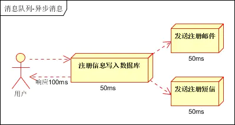
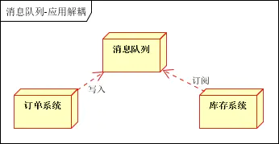
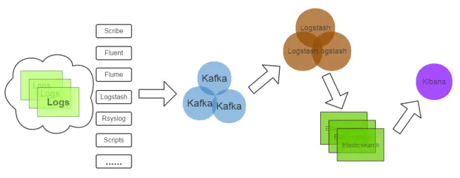
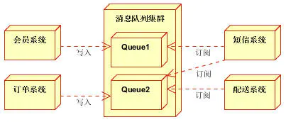
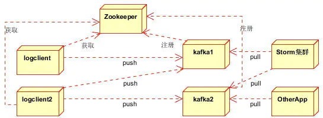

# 消息队列 Message queue

参考 1：[消息队列（mq）是什么？](https://www.zhihu.com/question/54152397?sort=created)

参考 2：[消息队列技术介绍](https://www.jianshu.com/p/689ce4205021)

参考 3：[消息队列：从选型到原理，一文带你全部掌握](https://mp.weixin.qq.com/s/Gb9k_LxQhOPDcMGxDJ9Jvw)

## 一、为什么开始用消息队列

面试官你好：我们公司本身的业务体量很小，所以直接**单机一把梭**啥都能搞定了，但是后面业务体量不断扩大，采用**微服务的设计思想**，**分布式的部署方式**，所以拆分了很多的服务，随着体量的增加以及业务场景越来越复杂了，很多场景单机的技术栈和中间件以及不够用了，而且对系统的友好性也下降了，最后做了很多技术选型的工作，我们决定引入**消息队列中间件**。

## 二、消息队列应用场景

**异步、削峰、解耦**，这三个场景是消息队列的最经典场景，要烂熟于心

除此之外还有，**日志处理、消息通讯**

### 1、异步处理

场景说明：用户注册后，需要发送注册邮件和发送注册信息，传统的做法有两种：串行方式、并行方式

**做法一：串行方式**

将注册信息写入数据库成功后，发送注册邮件，然后发送注册短信，而所有任务执行完成后，返回信息给客户端

**做法二：并行方式**

将注册信息写入数据库成功后，同时进行发送注册邮件和发送注册短信的操作。而所有任务执行完成后，返回信息给客户端。同串行方式相比，并行方式可以提高执行效率，减少执行时间。

上面的比较可以发现，假设三个操作均需要50ms的执行时间，排除网络因素，则最终执行完成，串行方式需要150ms，而并行方式需要100ms。

因为cpu在单位时间内处理的请求数量是一致的，假设：CPU每1秒吞吐量是100此，则串行方式1秒内可执行的请求量为1000/150，不到7次；并行方式1秒内可执行的请求量为1000/100，为10次。

**做法三：异步处理**

由上可以看出，传统串行和并行的方式会受到系统性能的局限，那么如何解决这个问题？

我们需要引入消息队列，将不是必须的业务逻辑，异步进行处理，由此改造出来的流程为

根据上述的流程，用户的响应时间基本相当于将用户数据写入数据库的时间，发送注册邮件、发送注册短信的消息在写入消息队列后，即可返回执行结果，写入消息队列的时间很快，几乎可以忽略，也有此可以将系统吞吐量提升至20QPS，比串行方式提升近3倍，比并行方式提升2倍。

### 2、应用解耦

场景说明：用户下单后，订单系统需要通知库存系统。

传统的做法为：订单系统调用库存系统的接口。如下图所示：

传统方式：调用库存接口

传统方式具有如下缺点：

1. 假设库存系统访问失败，则订单减少库存失败，导致订单创建失败
2. 订单系统同库存系统过度耦合

如何解决上述的缺点呢？需要引入消息队列，引入消息队列后的架构如下图所示：

- 订单系统：用户下单后，订单系统进行数据持久化处理，然后将消息写入消息队列，返回订单创建成功
- 库存系统：使用拉/推的方式，获取下单信息，库存系统根据订单信息，进行库存操作。

假如在下单时库存系统不能正常使用。也不影响正常下单，因为下单后，订单系统写入消息队列就不再关心其后续操作了。由此实现了订单系统与库存系统的应用解耦。

### 3、流量削锋

应用场景：秒杀活动，一般会因为流量过大，导致流量暴增，应用挂掉。为解决这个问题，一般需要在应用前端加入消息队列。

1. 可以控制参与活动的人数；
2. 可以缓解短时间内高流量对应用的巨大压力；

流量削锋处理方式系统图如下：

1. 服务器在接收到用户请求后，首先写入消息队列。这时如果消息队列中消息数量超过最大数量，则直接拒绝用户请求或返回跳转到错误页面；
2. 秒杀业务根据秒杀规则读取消息队列中的请求信息，进行后续处理。

### 4、日志处理

日志处理是指将消息队列用在日志处理中，比如Kafka的应用，解决大量日志传输的问题。架构简化如下：

消息队列应用于日志处理的架构

- 日志采集客户端：负责日志数据采集，定时写受写入Kafka队列；
- Kafka消息队列：负责日志数据的接收，存储和转发；
- 日志处理应用：订阅并消费kafka队列中的日志数据；

这种架构在实际开发中的应用，可以参照案例：[新浪技术分享：我们如何扛下32亿条实时日志的分析处理](https://link.jianshu.com?t=http://cloud.51cto.com/art/201507/484338.htm)

1. Kafka：接收用户日志的消息队列。
2. Logstash：做日志解析，统一成JSON输出给Elasticsearch。
3. Elasticsearch：实时日志分析服务的核心技术，一个schemaless，实时的数据存储服务，通过index组织数据，兼具强大的搜索和统计功能。
4. Kibana：基于Elasticsearch的数据可视化组件，超强的数据可视化能力是众多公司选择ELK stack的重要原因。

### 5、消息通讯

消息通讯是指，消息队列一般都内置了高效的通信机制，因此也可以用在纯的消息通讯。比如实现点对点消息队列、聊天室等。

**点对点通讯架构设计**

在点对点通讯架构设计中，客户端A和客户端B共用一个消息队列，即可实现消息通讯功能。

**聊天室通讯架构设计**

客户端A、客户端B、直至客户端N订阅同一消息队列，进行消息的发布与接收，即可实现聊天通讯方案架构设计。

## 三、消息队列的缺点

### 1、系统复杂性及可用性

本来蛮简单的一个系统，我代码随便写都没事，现在你凭空接入一个中间件在那，需要考虑去维护他，而且使用的过程中也需要考虑各种问题，比如消息**重复消费**、**消息丢失**、**消息的顺序消费**等等

同时，各个系统之间强依赖MQ，MQ的可用性就变得非常的关键，还要额外的去保证MQ的高可用，担心他会挂了

### 2、数据一致性

这个其实是分布式服务本身就存在的一个问题，**不仅仅是消息队列的问题**，但是放在这里说是因为用了消息队列这个问题会暴露得比较严重一点。

就像我开头说的，你下单的服务自己保证自己的逻辑成功处理了，你成功发了消息，但是优惠券系统，积分系统等等这么多系统，**他们成功还是失败你就不管了？**

我说了保证自己的业务数据对的就好了，其实还是比较不负责任的一种说法，这样就**像个渣男，没有格局**，**这样呀你的路会越走越窄的**。

**所有的服务都成功才能算这一次下单是成功的**，那怎么才能保证数据一致性呢？

**分布式事务**：把下单，优惠券，积分。。。都放在一个事务里面一样，要成功一起成功，要失败一起失败。

Tip:**分布式事务**在互联网公司里面实在常见，我也不在这里大篇幅介绍了，后面都会专门说的。

## 四、消息中间件示例

### 1、电商系统

电商系统架构示意图

消息队列采用高可用、可持久化的消息中间件。比如Active MQ，Rabbit MQ，Rocket MQ。

- 应用将主干逻辑处理完成后，写入消息队列。消息发送是否成功可以开启消息的确认模式。（消息队列返回消息接收成功状态后，应用再返回，这样保障消息的完整性）
- 扩展流程（发短信、配送处理）订阅队列消息。采用推或拉的方式获取消息并处理。
- 消息将应用解耦的同时，带来了数据一致性问题，可以采用最终一致性方式解决。比如主数据写入数据库，扩展应用根据消息队列，并结合数据库方式实现基于消息队列的后续处理。

### 2、日志收集系统

日志收集系统架构示意图

分为Zookeeper注册中心，日志收集客户端，Kafka集群和Storm集群（OtherApp）四部分组成。

- Zookeeper注册中心，提出负载均衡和地址查找服务；
- 日志收集客户端，用于采集应用系统的日志，并将数据推送到kafka队列；
- Kafka集群：接收，路由，存储，转发等消息处理；
- Storm集群：与OtherApp处于同一级别，采用拉的方式消费队列中的数据；

## 五、技术选型

### 1、消息队列模式

消息队列目前主要2种模式，分别为“点对点模式”和“发布/订阅模式”。

#### 1）点对点模式

**一个具体的消息只能由一个消费者消费**。多个生产者可以向同一个消息队列发送消息；但是，一个消息在被一个消息者处理的时候，这个消息在队列上会被锁住或者被移除并且其他消费者无法处理该消息。需要额外注意的是，如果消费者处理一个消息失败了，消息系统一般会把这个消息放回队列，这样其他消费者可以继续处理。

#### 2）发布/订阅模式

单个消息可以被多个订阅者并发的获取和处理。一般来说，订阅有两种类型：

- 临时（ephemeral）订阅，这种订阅只有在消费者启动并且运行的时候才存在。一旦消费者退出，相应的订阅以及尚未处理的消息就会丢失。
- 持久（durable）订阅，这种订阅会一直存在，除非主动去删除。消费者退出后，消息系统会继续维护该订阅，并且后续消息可以被继续处理。

### 2、衡量标准

对消息队列进行技术选型时，需要通过以下指标衡量你所选择的消息队列，是否可以满足你的需求：

- 消息顺序：发送到队列的消息，消费时是否可以保证消费的顺序，比如A先下单，B后下单，应该是A先去扣库存，B再去扣，顺序不能反。
- 消息路由：根据路由规则，只订阅匹配路由规则的消息，比如有A/B两者规则的消息，消费者可以只订阅A消息，B消息不会消费。
- 消息可靠性：是否会存在丢消息的情况，比如有A/B两个消息，最后只有B消息能消费，A消息丢失。
- 消息时序：主要包括“消息存活时间”和“延迟/预定的消息”，“消息存活时间”表示生产者可以对消息设置TTL，如果超过该TTL，消息会自动消失；“延迟/预定的消息”指的是可以延迟或者预订消费消息，比如延时5分钟，那么消息会5分钟后才能让消费者消费，时间未到的话，是不能消费的。
- 消息留存：消息消费成功后，是否还会继续保留在消息队列。
- 容错性：当一条消息消费失败后，是否有一些机制，保证这条消息是一种能成功，比如异步第三方退款消息，需要保证这条消息消费掉，才能确定给用户退款成功，所以必须保证这条消息消费成功的准确性。
- 伸缩：当消息队列性能有问题，比如消费太慢，是否可以快速支持库容；当消费队列过多，浪费系统资源，是否可以支持缩容。
- 吞吐量：支持的最高并发数。

### 3、消息队列比较

目前在市面上比较主流的消息队列中间件主要有，**Kafka、ActiveMQ、RabbitMQ、RocketMQ** 等这几种。

**ActiveMQ**和**RabbitMQ**这两着因为吞吐量还有**GitHub**的社区活跃度的原因，在各大互联网公司都已经基本上绝迹了，业务体量一般的公司会是有在用的，但是越来越多的公司更青睐**RocketMQ**这样的消息中间件了。

**Kafka**和**RocketMQ**一直在各自擅长的领域发光发亮，不过写这篇文章的时候我问了蚂蚁金服，字节跳动和美团的朋友，好像大家用的都有点不一样，应该都是各自的中间件，可能做过修改，也可能是**自研**的，大多**没有开源**。

对比图：

#### 1）Kafka

优点：

- **高吞吐、低延迟**：kakfa 最大的特点就是收发消息非常快，kafka 每秒可以处理几十万条消息，它的最低延迟只有几毫秒；
- 高伸缩性：每个主题(topic) 包含多个分区(partition)，主题中的分区可以分布在不同的主机(broker)中；
- 持久性、可靠性：Kafka 能够允许数据的持久化存储，消息被持久化到磁盘，并支持数据备份防止数据丢失，Kafka 底层的数据存储是基于 Zookeeper 存储的，Zookeeper 我们知道它的数据能够持久存储；
- 容错性：非常高，kafka是分布式的，一个数据多个副本，某个节点宕机，Kafka 集群能够正常工作；
- 消息有序：消费者采用Pull方式获取消息，消息有序，通过控制能够保证所有消息被消费且仅被消费一次；
- 有优秀的第三方Kafka Web管理界面Kafka-Manager，在日志领域比较成熟，被多家公司和多个开源项目使用；
- 功能支持：功能较为简单，主要支持简单的MQ功能，在大数据领域的实时计算以及日志采集被大规模使用。

缺点：

- Kafka单机超过64个队列/分区，Load会发生明显的飙高现象，队列越多，load越高，发送消息响应时间变长；
- 使用短轮询方式，实时性取决于轮询间隔时间；
- 消费失败不支持重试；
- 支持消息顺序，但是一台代理宕机后，就会产生消息乱序；
- 社区更新较慢。

总结：

- Kafka主要特点是基于Pull的模式来处理消息消费，追求高吞吐量，一开始的目的就是用于日志收集和传输，适合产生大量数据的互联网服务的数据收集业务。
- 大型公司建议可以选用，如果有日志采集功能，肯定是首选kafka。

#### 2）RabbitMQ

优点：

- 异步消息传递：支持多种消息协议，消息队列，传送确认，灵活的路由到队列，多种交换类型；
- 支持几乎所有最受欢迎的编程语言：Java，C，C ++，C＃，Ruby，Perl，Python，PHP等等；
- 可以部署为高可用性和吞吐量的集群;，跨多个可用区域和区域进行联合；
- 可插入的身份验证，授权，支持TLS和LDAP；
- 提供了许多插件，来从多方面进行扩展，也可以编写自己的插件；
- 提供了一个易用的用户界面，使得用户可以监控和管理消息Broker，社区活跃度高。

缺点：

- erlang开发，很难去看懂源码，基本职能依赖于开源社区的快速维护和修复bug，不利于做二次开发和维护；
- RabbitMQ确实吞吐量会低一些，这是因为他做的实现机制比较重；
- 需要学习比较复杂的接口和协议，学习和维护成本较高。

总结：

- 结合erlang语言本身的并发优势，性能较好，社区活跃度也比较高，但是不利于做二次开发和维护。不过RabbitMQ的社区十分活跃，可以解决开发过程中遇到的bug。
- 如果你的数据量没有那么大，小公司优先选择功能比较完备的RabbitMQ。

#### 3）RocketMQ

优点：

- 支持发布/订阅（Pub/Sub）和点对点（P2P）消息模型；
- 在一个队列中可靠的先进先出（FIFO）和严格的顺序传递；
- 支持拉（pull）和推（push）两种消息模式；
- 单一队列百万消息的堆积能力；
- 支持多种消息协议，如 JMS、MQTT 等；
- 可靠的FIFO和严格的有序消息传递在同一队列中；
- 灵活的分布式横向扩展部署架构，满足至少一次消息传递语义；
- 提供 docker 镜像用于隔离测试和云集群部署；
- 提供配置、指标和监控等功能丰富的 Dashboard。

缺点：

- 支持的客户端语言不多，目前是java及c++，其中c++不成熟
- 社区活跃度一般
- 没有在 mq 核心中去实现JMS等接口，有些系统要迁移需要修改大量代码

总结：

- 天生为**金融互联网领域**而生，对于可靠性要求很高的场景，尤其是电商里面的订单扣款，以及业务削峰，在大量交易涌入时，后端可能无法及时处理的情况。
- RoketMQ在稳定性上可能更值得信赖，这些业务场景在阿里双11已经经历了多次考验，如果你的业务有上述并发场景，建议可以选择RocketMQ。

#### 4）ActiveMQ

优点

- 支持来自Java，C，C ++，C＃，Ruby，Perl，Python，PHP的各种跨语言客户端和协议；
- 完全支持JMS客户端和Message Broker中的企业集成模式；
- 支持许多高级功能，如消息组，虚拟目标，通配符和复合目标；
- 完全支持JMS 1.1和J2EE 1.4，支持瞬态，持久，事务和XA消息；
- Spring支持，以便ActiveMQ可以轻松嵌入到Spring应用程序中，并使用Spring的XML配置机制进行配置；
- 专为高性能集群，客户端 - 服务器，基于对等的通信而设计；
- CXF和Axis支持，以便ActiveMQ可以轻松地放入这些Web服务堆栈中以提供可靠的消息传递；
- 可以用作内存JMS提供程序，非常适合单元测试JMS；
- 支持可插拔传输协议，例如in-VM，TCP，SSL，NIO，UDP，多播，JGroups和JXTA传输；
- 使用JDBC和高性能日志支持非常快速的持久性。

缺点:

- 官方社区现在对ActiveMQ 5.x维护越来越少，较少在大规模吞吐的场景中使用。