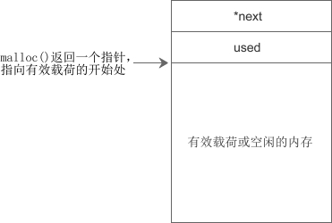

# 内存池

malloc函数背后的实现原理——内存池

相对于栈而言，堆这片内存面临着一个稍微复杂的行为模式：在任意时刻，程序可能发出请求，要么申请一段内存，要么释放一段已经申请过的内存，而且申请的大小从几个字节到几个GB都有可能，我们不能假设程序一次申请多少堆空间，因此，堆的管理显得较为复杂。

那么，使用 malloc() 在堆上分配内存到底是如何实现的呢？

一种做法是把 malloc() 的内存管理交给系统内核去做，既然内核管理着进程的地址空间，那么如果它提供一个系统调用，可以让 malloc() 使用这个系统调用去申请内存，不就可以了吗？当然这是一种理论上的做法，但实际上这样做的性能比较差，因为每次程序申请或者释放堆空间都要进行系统调用。我们知道系统调用的性能开销是比较大的，当程序对堆的操作比较频繁时，这样做的结果会严重影响程序的性能。

比较好的做法就是 **malloc() 向操作系统申请一块适当大小的堆空间，然后由 malloc() 自己管理这块空间**。

malloc() 相当于向操作系统“批发”了一块较大的内存空间，然后“零售”给程序用。当全部“售完”或程序有大量的内存需求时，再根据实际需求向操作系统“进货”。当然 malloc() 在向程序零售堆空间时，必须管理它批发来的堆空间，不能把同一块地址出售两次，导致地址的冲突。于是 malloc() 需要一个算法来管理堆空间，这个算法就是堆的分配算法。

## 一、malloc()和free()的分配算法

在程序运行过程中，堆内存从低地址向高地址连续分配，随着内存的释放，会出现不连续的空闲区域，如下图所示：

带阴影的方框是已被分配的内存，白色方框是空闲内存或已被释放的内存。程序需要内存时，malloc() 首先遍历空闲区域，看是否有大小合适的内存块，如果有，就分配，如果没有，就向操作系统申请（发生系统调用）。为了保证分配给程序的内存的连续性，malloc() 只会在一个空闲区域中分配，而不能将多个空闲区域联合起来。

内存块（包括已分配和空闲的）的结构类似于链表，它们之间通过指针连接在一起。在实际应用中，一个内存块的结构如下图所示：

next 是指针，指向下一个内存块，used 用来表示当前内存块是否已被使用。这样，整个堆区就会形成如下图所示的链表：

现在假设需要为程序分配100个字节的内存，当搜索到图中第一个空闲区域（大小为200个字节）时，发现满足条件，那么就在这里分配。这时候 malloc() 会把第一个空闲区域拆分成两部分，一部分交给程序使用，剩下的部分任然空闲，如下图所示：

仍然以图3为例，当程序释放掉第三个内存块时，就会形成新的空闲区域，free() 会将第二、三、四个连续的空闲区域合并为一个，如下图所示：

可以看到，malloc() 和 free() 所做的工作主要是对已有内存块的分拆和合并，并没有频繁地向操作系统申请内存，这大大提高了内存分配的效率。

另外，由于单向链表只能向一个方向搜索，在合并或拆分内存块时不方便，所以大部分 malloc() 实现都会在内存块中增加一个 pre 指针指向上一个内存块，构成「双向链表」，如下图所示：

**链表是一种经典的堆内存管理方式，**经常被用在教学中，很多C语言教程都会提到“栈内存的分配类似于数据结构中的栈，而堆内存的分配却类似于数据结构中的链表”就是源于此。

链表式内存管理虽然思路简单，容易理解，但存在很多问题，例如：

- 一旦链表中的 pre 或 next 指针被破坏，整个堆就无法工作，而这些数据恰恰很容易被越界读写所接触到。
- 小的空闲区域往往不容易再次分配，形成很多内存碎片。
- 经常分配和释放内存会造成链表过长，增加遍历的时间。

针对链表的缺点，后来人们提出了位图和对象池的管理方式，而现在的 malloc() 往往采用多种方式复合而成，不同大小的内存块往往采用不同的措施，以保证内存分配的安全和效率。

## 二、内存池

不管具体的分配算法是怎样的，为了减少系统调用，减少物理内存碎片，**malloc() 的整体思想是先向操作系统申请一块大小适当的内存，然后自己管理，这就是内存池（Memory Pool）**。

内存池的研究重点不是向操作系统申请内存，而是对已申请到的内存的管理，这涉及到非常复杂的算法，是一个永远也研究不完的课题，除了C标准库自带的 malloc()，还有一些第三方的实现，比如 Goolge 的 tcmalloc 和 jemalloc。

我们知道，**C/C++是编译型语言，没有内存回收机制，程序员需要自己释放不需要的内存，**这在给程序带来了很大灵活性的同时，也带来了不少风险，例如C/C++程序经常会发生内存泄露，程序刚开始运行时占用内存很少，随着时间的推移，内存使用不断增加，导致整个计算机运行缓慢。

内存泄露的问题往往难于调试和发现，或者只有在特定条件下才会复现，这给代码修改带来了不少障碍。为了提高程序的稳定性和健壮性，后来的 Java、Python、C#、JavaScript、PHP 等使用了虚拟机机制的非编译型语言都加入了垃圾内存自动回收机制，这样程序员就不需要管理内存了，系统会自动识别不再使用的内存并把它们释放掉，避免内存泄露。可以说，这些高级语言在底层都实现了自己的内存池，也即有自己的内存管理机制。

## 三、池化技术

在计算机中，有很多使用“池”这种技术的地方，除了内存池，还有连接池、线程池、对象池等。以服务器上的线程池为例，它的主要思想是：先启动若干数量的线程，让它们处于睡眠状态，当接收到客户端的请求时，唤醒池中某个睡眠的线程，让它来处理客户端的请求，当处理完这个请求，线程又进入睡眠状态。

**所谓“池化技术”，就是程序先向系统申请过量的资源，然后自己管理，以备不时之需。**之所以要申请过量的资源，是因为每次申请该资源都有较大的开销，不如提前申请好了，这样使用时就会变得非常快捷，大大提高程序运行效率。
