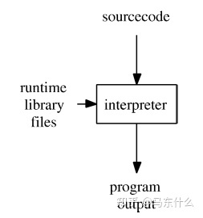
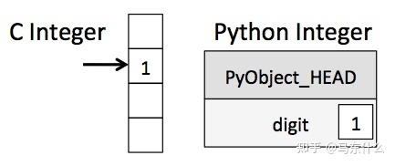

# python 为什么慢

参考 1：[为什么python这么慢？numba解决了什么问题？](https://zhuanlan.zhihu.com/p/348315009)

参考 2：[为什么 Python 这么慢？](https://zhuanlan.zhihu.com/p/47795989)

【这篇文章，总结的很不好，随便看看就行】

## 一、预备知识

### 1、层级


- hardware

这里回到大学的c语言程序设计的基础知识部分，最底层是硬件层，例如cpu、内存、gpu等一大堆晶体管、铁皮构成的硬件，当然我们不是做硬件工程师，很多概念泛泛地理解即可；

- Machine language

接下来是机器码，计算机直接使用的程序语言，其语句就是机器指令码，机器指令码是用于指挥计算机应做的操作和操作数地址的**一组二进制数**。

简单来说，比如我们要执行pd.read_csv，则到机器码层面，它会转化为“010101010”这样的形式供机器去执行，当然，这里也是够底层了，泛泛理解即可；

- Assembly language

这个计算机、通信专业的人应该会熟悉一些，即汇编语言，大学的单片机，跑马灯实验，就是在一堆复杂的线路上的一个小显示器上输入汇编语言来直接操纵灯亮起来的，大概长这样：

```
MOV A,Rn 寄存器内容送入累加器
MOV A,direct 直接地址单元中的数据送入累加器
MOV A,@Ri (i=0,1)间接RAM 中的数据送入累加器
MOV A,#data 立即数送入累加器
MOV Rn,A 累加器内容送入寄存器
```

- High-level languages

开发，算法，运维，高级语言基本上是互联网公司里最经常接触的概念了，c，c++，ruby，rust，python，java，php之类的都属于高级语言的范畴，高级语言诞生的主要原因就是即使是汇编语言也太非人类了；

然后我们需要了解高级语言是怎么操纵底层的硬件实现功能逻辑的，毕竟我们的read_csv，fit之类的最终都是在内存和cpu上完成处理的

### 2、高级语言划分

- c/c++


c语言经过编译成object file，然后通过linker转化为可执行的二进制文件，指示底层的hardware完成运算过程

对于已编译的语言，从源代码到机器可执行代码的转换是在程序运行之前进行的，也就是我们下次调用这个生成的可执行文件就不需要再编译，**而是可以直接指示hardware完成对应的功能**，这类在程序运行之前就已经完成编译的语言我们称之为编译型语言，但是这也造成了一些麻烦的问题，比如debug很麻烦，每次都是编译的时候保存，然后修改bug，重新编译，再报错。。。

- python



在python中，源代码，比如pd.read_csv，**直接通过一个解释器(interpreter)，转化为机器码，它并没有预编译的一个过程，而是通过解释器将整个过程打包到了一起，我们称这种语言为解释性语言**，解释性语言的处理结果可以很快的返回，debug非常方便，但是这也造成了效率上的降低：编译型语言，可以一次编译，下次使用直接运行，而python这种解释性语言，**每次运行的时候都要重新将源代码通过解释器转化为机器码**；

- java、虚拟机编程语言


**Java编译器（javac）将源代码转换为字节码。字节码是一种普通的机器语言。通过使用该平台的Java解释器（java），可以在任何操作系统上运行此字节码文件（.class文件）。解释器称为虚拟机**。因此，Java是虚拟机编程语言的示例。**创建虚拟机语言是为了在编译语言和解释语言之间进行折衷**。在理想条件下，虚拟机语言程序在运行速度上与已编译的语言程序更接近，但具有解释型语言程序的平台独立性。 虚拟机语言同时使用编译器和解释器。编译器将源代码转换为一种普通的机器语言。在Java中，这种“平均”性质的机器语言称为**字节码**。虚拟机语言的解释器是一个特殊程序，为给定操作系统提供运行时库**。这意味着所有受支持的操作系统都有一个不同的虚拟机解释器**。

虚拟机编程语言之所以能够获得接近编译语言速度的方式原因在于：**源代码通过编译器运行以创建字节码——该转换发生在程序运行之前，虚拟机语言获得其可移植性（平台独立性）的方式是为每个受支持的操作系统使用不同的解释器,该解释器为每个不同的操作系统绑定了正确的运行库**。编译后的字节码是一种普通的机器语言，无需更改该语言的任何虚拟机解释器，便可以正常工作。

接下来说明该过程: 我们有一个将源代码转换为字节码的编译器,源代码经过编译器之后创建了字节码，字节码可以在具有用于编程该语言的虚拟机解释器的任何操作系统上进行任何更改和编辑。请注意，每个虚拟机解释器都有不同的运行时库代码，因为每个操作系统都有不同的运行时库。这就是虚拟机语言如何解决平台依赖性问题的方法。

和java类似，python中的interpreter部分也叫python的虚拟机，所以python也使用到了字节码的概念，**字节码也是虚拟机（不是直接由CPU）执行的二进制表示形式，虚拟机（针对不同的机器编写的写法不同）将二进制指令转换为特定的机器指令。**

### 3、python 的解释器

- cpython

Python编程语言的默认实现是Cpython。顾名思义，Cpython是用C语言编写的。Cpython将python源代码编译为中间字节码，该字节码由Cpython虚拟机执行。CPython附带了一个大型标准库，该库使用C和Python混合编写。CPython提供了与Python包和C扩展模块的最高兼容性。由于CPython是参考实现，因此所有版本的Python语言都使用C语言实现。
注意，cpython和cython不是一个东西，cpython是python的一种解释器（python虚拟机），它是用c语言来实现的，而cython是结合了c和python的一种混编语言；

- Jython

Jython是可以在Java平台上运行的Python编程语言的实现。Jython程序使用Java类而不是Python模块.Jython将python源代码编译为Java字节码，然后可以由Java虚拟机运行。Jython支持使用Python程序中的Java类库函数。与Cpython相比，Jython速度较慢，并且与CPython库缺乏兼容性，许多常见的python库都无法在jython上运行。

- IronPython

一个用C＃编写的，面向Microsoft .NET框架的Python实现。与Jython相似，它使用.Net虚拟机，即Common Language Runtime。IronPython可以使用.NET Framework和Python库，而其他.NET语言可以非常有效地使用Python代码。IronPython具有JIT，并且还因为它没有Global Interpreter Lock(gil)，因此在使用线程或多核的Python程序中表现更好。

- pypy

PyPy是用Python编写的Python编程语言的实现。解释器使用RPython（Python的子集）编写。

目前我们接触的比较多的基本上是cpython，其它解释器的实现都存在着一些问题，这里也是路径依赖的问题，迁移很麻烦，而且某些Python模块（如）lxml，只有Cpython中具有必需的组件，它们在Jython中无法使用，因此cpython至少目前在机器学习领域的领袖地位还是难以取代的；

## 二、为什么python这么慢

### 1、动态变量

在c中我们编写一些功能性代码，需要严格定义变量的类型，比如进行加法计算，需要定义我们的数据是int、float还是其它类型，而python中则不需要，**这是我在实践中发现影响python运行速度最大的因素之一，具体的原因在于：**



在python中，所有的变量都是对象，例如：


我们可以看到一个简单的a中，有这么多的methods。。。python的变量定义的便利性也给python的效率带来了很大的问题，

Python等动态类型语言之所以慢，就是因为每一个简单的操作都需要大量的指令才能完成。他们的虚拟机拥有很强的优化器，却是为静态语言设计的。对Python几乎没有效果。举一个例子。对于整数加法，C语言很简单，只要一个机器指令ADD就可以了，最多不过再加一些内存读写。但是，对于Python来说，a+b这样的简单二元运算，可就真的很麻烦了。Python是动态语言，变量只是对象的引用，变量a和b本身都没有类型，而它们的值有类型。**所以，在相“加”之前，必须先判断类型。**

```
1. 判断a是否为整数，否则跳到第9步
2. 判断b是否为整数，否则跳到第9步
3. 将a指向的对象中的整数值读出来
4. 将b指向的对象中的整数值读出来
5. 进行整数相加
6. 生成一个新整数对象
7. 将运算结果存进去
8. 返回这个对象，完成！
9. 判断a是否为字符串，否则跳到第13步
10. 判断b是否为字符串，否则跳到第13步
11. 进行字符串串接操作，生成一个新字符串对象
12. 返回这个对象，完成！
13. 从a的字典里取出__add__方法
14. 调用这个方法，将a和b作为参数传入
15. 返回上述方法的返回值。
```

这还只是简化版的，实际中还要考虑溢出问题等。

### 2、解释型语言，大量重复的编译

前面提到过了，编译型语言，可以一次编译，下次使用直接运行，而python这种解释性语言，每次运行的时候都要重新将源代码通过解释器转化为机器码；

**是因为 Python 是解释型语言吗？**

我经常会听到这个说法，但是这过于粗陋地简化了 Python 所实际做的工作了。其实当终端上执行 `python myscript.py` 之后，CPython 会对代码进行一系列的读取、语法分析、解析、编译、解释和执行的操作。

`.pyc` 文件的创建是这个过程的重点。在代码编译阶段，Python 3 会将字节码序列写入 `__pycache__/`下的文件中，而 Python 2 则会将字节码序列写入当前目录的 `.pyc` 文件中。对于你编写的脚本、导入的所有代码以及第三方模块都是如此。

因此，绝大多数情况下（除非你的代码是一次性的……），Python 都会解释字节码并本地执行。与 Java、C#.NET 相比：Java 代码会被编译为“中间语言”，由 Java 虚拟机读取字节码，并将其即时编译为机器码。.NET CIL 也是如此，.NET CLR（Common-Language-Runtime）将字节码即时编译为机器码。

既然 Python 像 Java 和 C# 那样都使用虚拟机或某种字节码，为什么 Python 在基准测试中仍然比 Java 和 C# 慢得多呢？首要原因是，.NET 和 Java 都是 JIT 编译的。

*即时(Just-in-time)*（JIT）编译需要一种中间语言，以便将代码拆分为多个块（或多个帧）。而 *提前(ahead of time)*（AOT）编译器则需要确保 CPU 在任何交互发生之前理解每一行代码。

JIT 本身不会使执行速度加快，因为它执行的仍然是同样的字节码序列。但是 JIT 会允许在运行时进行优化。一个优秀的 JIT 优化器会分析出程序的哪些部分会被多次执行，这就是程序中的“热点”，然后优化器会将这些代码替换为更有效率的版本以实现优化。

这就意味着如果你的程序是多次重复相同的操作时，有可能会被优化器优化得更快。而且，Java 和 C# 是强类型语言，因此优化器对代码的判断可以更为准确。

PyPy 使用了明显快于 CPython 的 JIT。更详细的结果可以在这篇性能基准测试文章中看到：[哪一个 Python 版本最快?](https://link.zhihu.com/?target=https%3A//hackernoon.com/which-is-the-fastest-version-of-python-2ae7c61a6b2b)。

**那为什么 CPython 不使用 JIT 呢？**

JIT 也不是完美的，它的一个显著缺点就在于启动时间。 CPython 的启动时间已经相对比较慢，而 PyPy 比 CPython 启动还要慢 2 到 3 倍。Java 虚拟机启动速度也是出了名的慢。.NET CLR 则通过在系统启动时启动来优化体验，而 CLR 的开发者也是在 CLR 上开发该操作系统。

因此如果你有个长时间运行的单一 Python 进程，JIT 就比较有意义了，因为代码里有“热点”可以优化。

不过，CPython 是个通用的实现。设想如果使用 Python 开发命令行程序，但每次调用 CLI 时都必须等待 JIT 缓慢启动，这种体验就相当不好了。

CPython 试图用于各种使用情况。有可能实现[将 JIT 插入到 CPython 中](https://link.zhihu.com/?target=https%3A//www.slideshare.net/AnthonyShaw5/pyjion-a-jit-extension-system-for-cpython)，但这个改进工作的进度基本处于停滞不前的状态。

> 如果你想充分发挥 JIT 的优势，请使用 PyPy。

### 3、GIL 锁

[Python GIL全局解释器锁详解](http://c.biancheng.net/view/5537.html)

现在很多计算机都配备了具有多个核的 CPU ，有时甚至还会有多个处理器。为了更充分利用它们的处理能力，操作系统定义了一个称为线程的低级结构。某一个进程（例如 Chrome 浏览器）可以建立多个线程，在系统内执行不同的操作。在这种情况下，CPU 密集型进程就可以跨核心分担负载了，这样的做法可以大大提高应用程序的运行效率。

如果你还没有写过多线程执行的代码，你就需要了解一下线程锁的概念了。多线程进程比单线程进程更为复杂，是因为需要使用线程锁来确保同一个内存地址中的数据不会被多个线程同时访问或更改。

CPython 解释器在创建变量时，首先会分配内存，然后对该变量的引用进行计数，这称为 *引用计数(reference counting)*。如果变量的引用数变为 0，这个变量就会从内存中释放掉。这就是在 for 循环代码块内创建临时变量不会增加内存消耗的原因。

而当多个线程内共享一个变量时，CPython 锁定引用计数的关键就在于使用了 GIL，它会谨慎地控制线程的执行情况，无论同时存在多少个线程，解释器每次只允许一个线程进行操作。

**这会对 Python 程序的性能有什么影响？**

如果你的程序只有单线程、单进程，代码的速度和性能不会受到全局解释器锁的影响。

但如果你通过在单进程中使用多线程实现并发，并且是 IO 密集型（例如网络 IO 或磁盘 IO）的线程，GIL 竞争的效果就很明显了。

*由 David Beazley 提供的 GIL 竞争情况图[http://dabeaz.blogspot.com/201](https://link.zhihu.com/?target=http%3A//dabeaz.blogspot.com/2010/01/python-gil-visualized.html)*


对于一个 web 应用（例如 Django），同时还使用了 WSGI，那么对这个 web 应用的每一个请求都运行一个**单独**的 Python 解释器，而且每个请求只有一个锁。同时因为 Python 解释器的启动比较慢，某些 WSGI 实现还具有“守护进程模式”，[可以使 Python 进程一直就绪](https://link.zhihu.com/?target=https%3A//www.slideshare.net/GrahamDumpleton/secrets-of-a-wsgi-master)。