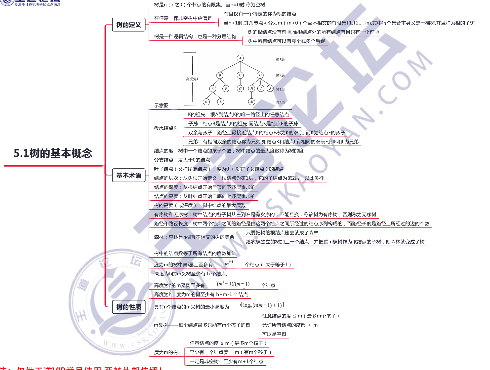
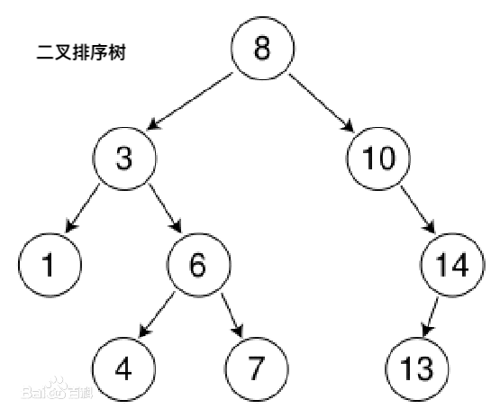
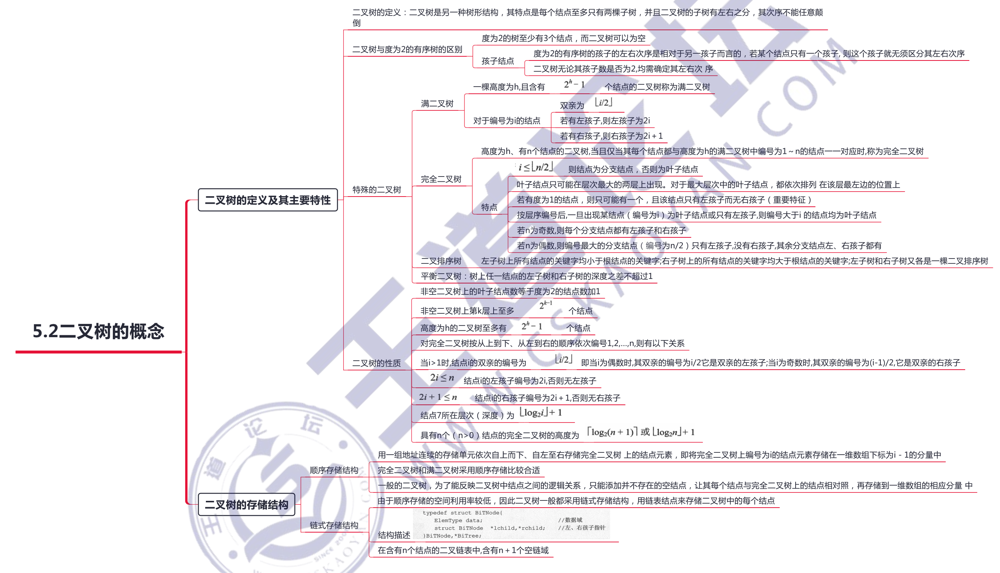
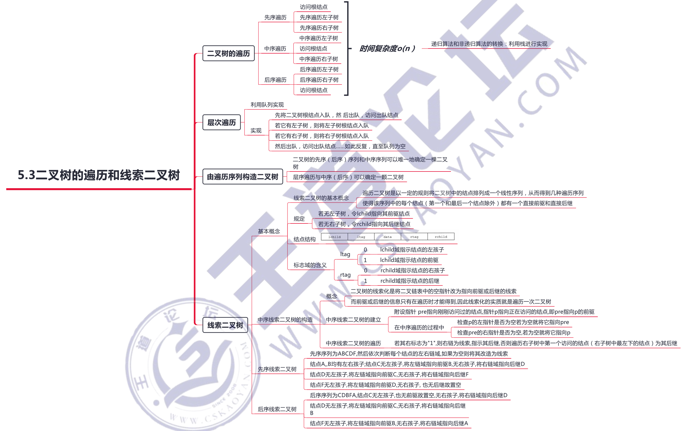
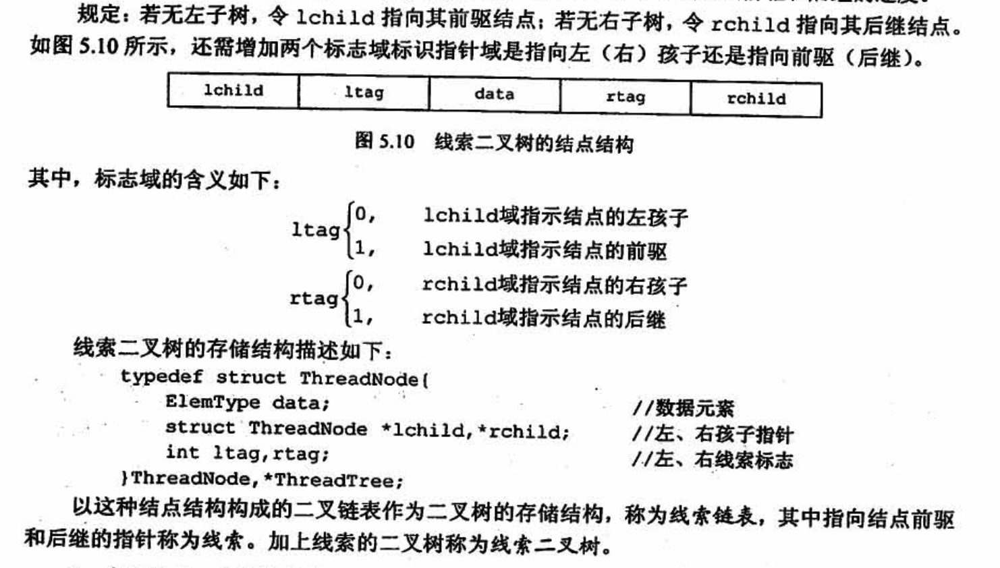
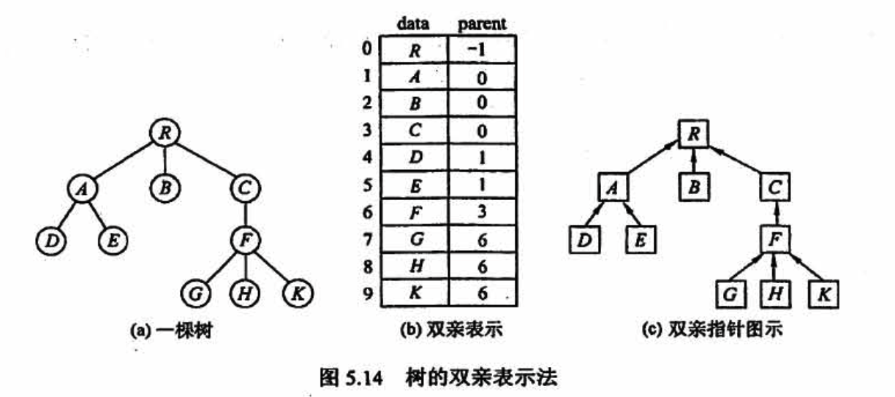
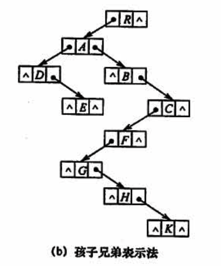

##### 树和二叉树

## 一、树的基本概念



### 树的种类

- 有序树，树中结点的各子树从左到右是有次序的，不能互换
- 无序树，结点的各子树无序的
- 二叉树，每个结点最多有两个子树
- 满二叉树，树中的每层都有最多的结点，叶子结点都在最下层
- 完全二叉树，高度为h、有n个结点的二叉树，当且仅当其每个结点都与高度为h的满二叉树中编号为1～n的结点一一对应（相当于满二叉树从右下角开始，从右往左，从下往上，进行消退）
- 二叉排序树，左子树上所有结点的关键字均小于根结点的关键字：右子树上的所有结点的关键字均大于根结点的关键字；左子树和右子树又各是一棵二叉排序树
- 平衡二叉树（AVL树），树上任一结点的左子树和右子树的深度之差不超过 1
- 线索二叉树，利用结点中的空指针存储该结点的前驱和后继





## 二、二叉树

### 1、二叉树的概念





### 2、二叉树的遍历


- 前序遍历（中左右）：5 4 1 2 6 7 8
- 中序遍历（左中右）：1 4 2 5 7 6 8
- 后序遍历（左右中）：1 2 4 7 8 6 5
- 层序遍历：5 4 6 1 2 7 8

题目：

- [144. 二叉树的前序遍历](https://leetcode.cn/problems/binary-tree-preorder-traversal/)
- [94. 二叉树的中序遍历](https://leetcode.cn/problems/binary-tree-inorder-traversal/)
- [145. 二叉树的后序遍历](https://leetcode.cn/problems/binary-tree-postorder-traversal/)
- [102. 二叉树的层序遍历](https://leetcode.cn/problems/binary-tree-level-order-traversal/)

#### 1）递归法

- 时间复杂度：O(n)，其中 n 是二叉树的节点数。每一个节点恰好被遍历一次。
- 空间复杂度：O(n)，为递归过程中栈的开销，平均情况下为 O(log n)，最坏情况下树呈现链状，为 O(n)。

**前序遍历**

```c++
class Solution {
public:
    void dfs(TreeNode *cur, vector<int> &vec) {
        if (cur == NULL) return;
        vec.push_back(cur->val);  // 中
        dfs(cur->left, vec);      // 左
        dfs(cur->right, vec);     // 右
    }
    vector<int> preorderTraversal(TreeNode *root) {
        vector<int> res;
        dfs(root, res);
        return res;
    }
};
```

**中序遍历**

```c++
class Solution {
public:
    void dfs(TreeNode *cur, vector<int> &vec) {
        if (cur == NULL) return;
        dfs(cur->left, vec);
        vec.push_back(cur->val);
        dfs(cur->right, vec);
    }

    vector<int> inorderTraversal(TreeNode *root) {
        vector<int> res;
        dfs(root, res);
        return res;
    }
};
```

**后序遍历**

```c++
class Solution {
public:
    void dfs(TreeNode *cur, vector<int> &vec) {
        if (cur == NULL) return;
        dfs(cur->left, vec);
        dfs(cur->right, vec);
        vec.push_back(cur->val);
    }

    vector<int> postorderTraversal(TreeNode *root) {
        vector<int> res;
        dfs(root, res);
        return res;
    }
};
```

#### 2）迭代法

本质上是在模拟递归

- 时间复杂度：O(n)，其中 n*n* 是二叉树的节点数。每一个节点恰好被遍历一次。
- 空间复杂度：O(n)，为迭代过程中显式栈的开销，平均情况下为 O(log n)，最坏情况下树呈现链状，为 O(n)。

**前序遍历**

首先我们应该创建一个`Stack`用来存放节点，首先我们想要打印根节点的数据，此时`Stack`里面的内容为空，所以我们优先将头结点加入`Stack`，然后打印。

之后我们应该先打印左子树，然后右子树。所以先加入`Stack`的就是右子树，然后左子树。

此时你能得到的流程如下:


```c++
class Solution {
public:
    vector<int> preorderTraversal(TreeNode* root) {
        vector<int> res;
        if (root == nullptr) {
            return res;
        }

        stack<TreeNode*> stk;
        TreeNode* node = root;
        while (!stk.empty() || node != nullptr) {
            while (node != nullptr) {
                res.emplace_back(node->val);
                stk.emplace(node);
                node = node->left;
            }
            node = stk.top();
            stk.pop();
            node = node->right;
        }
        return res;
    }
};
```

**中序遍历**

1. 同理创建一个`Stack`，然后按 左 中 右的顺序输出节点。
2. 尽可能的将这个节点的左子树压入`Stack`，此时栈顶的元素是最左侧的元素，**其目的是找到一个最小单位的子树**(也就是最左侧的一个节点)，*并且在寻找的过程中记录了来源，才能返回上层*,同时在返回上层的时候已经处理完毕左子树了。
3. 当处理完最小单位的子树时，返回到上层处理了中间节点。（如果把整个左中右的遍历都理解成子树的话，就是处理完 `左子树->中间(就是一个节点)->右子树`）
4. 如果有右节点，其也要进行中序遍历。

当整个左子树退栈的时候这个时候输出了该子树的根节点 2，之后输出中间节点 1。然后处理根节点为3右子树。


```c++
class Solution {
public:
    vector<int> inorderTraversal(TreeNode* root) {
        vector<int> res;
        stack<TreeNode*> stk;
        while (root != nullptr || !stk.empty()) {
            while (root != nullptr) {
                stk.push(root);
                root = root->left;
            }
            root = stk.top();
            stk.pop();
            res.push_back(root->val);
            root = root->right;
        }
        return res;
    }
};
```

**后序遍历**

1. 用一个指针`cur`标记当前退出的节点是什么。
2. 后序遍历的过程中在遍历完左子树跟右子树`cur`都会回到根结点。所以当前不管是从左子树还是右子树回到根结点都不应该再操作了，应该退回上层。
3. 如果是从右边再返回根结点，应该回到上层。

```c++
class Solution {
public:
    vector<int> postorderTraversal(TreeNode *root) {
        vector<int> res;
        if (root == nullptr) {
            return res;
        }

        stack<TreeNode *> stk;
        TreeNode *prev = nullptr;
        while (root != nullptr || !stk.empty()) {
            while (root != nullptr) {
                stk.emplace(root);
                root = root->left;
            }
            root = stk.top();
            stk.pop();
            if (root->right == nullptr || root->right == prev) {
                res.emplace_back(root->val);
                prev = root;
                root = nullptr;
            } else {
                stk.emplace(root);
                root = root->right;
            }
        }
        return res;
    }
};
```

#### 3）Morris 遍历算法

有一种巧妙的方法可以在线性时间内，只占用常数空间来实现后序遍历。这种方法由 J. H. Morris 在 1979 年的论文「Traversing Binary Trees Simply and Cheaply」中首次提出，因此被称为 Morris 遍历。

Morris 遍历的核心思想是利用树的大量空闲指针，实现空间开销的极限缩减。

- 时间复杂度：O(n)，其中 n 为二叉搜索树的节点个数。Morris 遍历中每个节点会被访问两次，因此总时间复杂度为 O(2n)=O(n)。
- 空间复杂度：O(1)。只操作已经存在的指针（树的空闲指针），因此只需要常数的额外空间。

`Morris`的通用解法过程。


`Morris`的整体思路就是将 *以某个根结点开始，找到它左子树的最右侧节点之后与这个根结点进行连接*

我们可以从 **图2** 看到，如果这么连接之后，**cur** 这个指针是可以完整的从一个节点顺着下一个节点遍历，将整棵树遍历完毕，直到 **7** 这个节点右侧没有指向。

```java
// Java Code
public static void preOrderMorris(TreeNode head) {
	if (head == null) {
		return;
	}
	TreeNode cur1 = head;//当前开始遍历的节点
	TreeNode cur2 = null;//记录当前结点的左子树
	while (cur1 != null) {
		cur2 = cur1.left;
		if (cur2 != null) {
			while (cur2.right != null && cur2.right != cur1) {//找到当前左子树的最右侧节点，且这个节点应该在指向根结点之前，否则整个节点又回到了根结点。
				cur2 = cur2.right;
			}
			if (cur2.right == null) {//这个时候如果最右侧这个节点的右指针没有指向根结点，创建连接然后往下一个左子树的根结点进行连接操作。
				cur2.right = cur1;
				cur1 = cur1.left;
				continue;
			} else {//当左子树的最右侧节点有指向根结点，此时说明我们已经回到了根结点并重复了之前的操作，同时在回到根结点的时候我们应该已经处理完 左子树的最右侧节点 了，把路断开。
				cur2.right = null;
			}
		} 
		cur1 = cur1.right;//一直往右边走，参考图
	}
}
```

**前序遍历**

1. 在某个根结点创建连线的时候打印。因为我们是顺着左边的根节点来创建连线，且创建的过程只有一次。
2. 打印某些自身无法创建连线的节点，也就是叶子节点。

```c++
class Solution {
public:
    vector<int> preorderTraversal(TreeNode *root) {
        vector<int> res;
        if (root == nullptr) {
            return res;
        }

        TreeNode *p1 = root, *p2 = nullptr;

        while (p1 != nullptr) {
            p2 = p1->left;
            if (p2 != nullptr) {
                while (p2->right != nullptr && p2->right != p1) {
                    p2 = p2->right;
                }
                if (p2->right == nullptr) {
                    res.emplace_back(p1->val);
                    p2->right = p1;
                    p1 = p1->left;
                    continue;
                } else {
                    p2->right = nullptr;
                }
            } else {
                res.emplace_back(p1->val);
            }
            p1 = p1->right;
        }
        return res;
    }
};
```

**中序遍历**

从最左侧开始顺着右节点打印。也就是在将cu1切换到上层节点的时候。

```c++
class Solution {
public:
    vector<int> inorderTraversal(TreeNode* root) {
        vector<int> res;
        TreeNode *predecessor = nullptr;

        while (root != nullptr) {
            if (root->left != nullptr) {
                // predecessor 节点就是当前 root 节点向左走一步，然后一直向右走至无法走为止
                predecessor = root->left;
                while (predecessor->right != nullptr && predecessor->right != root) {
                    predecessor = predecessor->right;
                }
                
                // 让 predecessor 的右指针指向 root，继续遍历左子树
                if (predecessor->right == nullptr) {
                    predecessor->right = root;
                    root = root->left;
                }
                // 说明左子树已经访问完了，我们需要断开链接
                else {
                    res.push_back(root->val);
                    predecessor->right = nullptr;
                    root = root->right;
                }
            }
            // 如果没有左孩子，则直接访问右孩子
            else {
                res.push_back(root->val);
                root = root->right;
            }
        }
        return res;
    }
};
```

**后序遍历**

后序遍历就比较复杂了哈，先看一下图


当我们到达最左侧，也就是左边连线已经创建完毕了。

打印 4
打印 5 2
打印 6
打印 7 3 1

我们将一个节点的连续右节点当成一个单链表来看待。

当我们返回上层之后，也就是将连线断开的时候，打印下层的单链表。

比如返回到　２，此时打印　４
比如返回到　１，此时打印　５　２
比如返回到　３，此时打印　６

那么我们只需要将这个单链表逆序打印就行了，下文也给出了 **单链表逆序代码**

*这里不应该打印当前层，而是下一层，否则根结点会先与右边打印。*

```c++
class Solution {
public:
    void addPath(vector<int> &vec, TreeNode *node) {
        int count = 0;
        while (node != nullptr) {
            ++count;
            vec.emplace_back(node->val);
            node = node->right;
        }
        reverse(vec.end() - count, vec.end());
    }

    vector<int> postorderTraversal(TreeNode *root) {
        vector<int> res;
        if (root == nullptr) {
            return res;
        }

        TreeNode *p1 = root, *p2 = nullptr;

        while (p1 != nullptr) {
            p2 = p1->left;
            if (p2 != nullptr) {
                while (p2->right != nullptr && p2->right != p1) {
                    p2 = p2->right;
                }
                if (p2->right == nullptr) {
                    p2->right = p1;
                    p1 = p1->left;
                    continue;
                } else {
                    p2->right = nullptr;
                    addPath(res, p1->left);
                }
            }
            p1 = p1->right;
        }
        addPath(res, root);
        return res;
    }
};
```

#### 4）层遍历

每一层放入一个 vector 写法，如：[[3],[9,20],[15,7]]

```c++
class Solution {
public:
    vector<vector<int>> levelOrder(TreeNode *root) {
        vector<vector<int>> res;
        if (!root) return res;

        queue<TreeNode *> q;
        q.push(root);
        while (!q.empty()) {
            int layerSz = q.size();
            vector<int> layer;
            for (int i = 0; i < layerSz; i++) {
                auto node = q.front();
                q.pop();
                layer.push_back(node->val);
                if (node->left) q.push(node->left);
                if (node->right) q.push(node->right);
            }
            res.push_back(layer);
        }
        return res;
    }
};
```

全部放一起，如：[3 9 20 15 7 ]

```c++
class Solution {
public:
    vector<vector<int>> levelOrder(TreeNode *root) {
        vector<int> res;
        queue<TreeNode *> q;
        q.push(root);
        while (!q.empty()) {
            auto node = q.front();
            q.pop();
            res.push_back(node->val);
            if (node->left) q.push(node->left);
            if (node->right) q.push(node->right);
        }
        for (const auto &c : res) cout << c << " ";
        return res;
    }
};
```

### 3、二叉树的构造

#### 由遍历序列构造二叉树

**由二叉树的先序序列和中序序列可以唯一地确定一棵二叉树**

在先序遍历序列中，第一个结点一定是二叉树的根结点：而在中序遍历中，根结点必然将中序序列分割成两个子序列，前一个子序列是根结点的左子树的中序序列，后一个子序列是根结点的右子树的中序序列。根据这两个子序列，在先序序列中找到对应的左子序列和右子序列。在先序序列中，左子序列的第一个结点是左子树的根结点，右子序列的第一个结点是右子树的根结点。如此递归地进行下去，便能唯一地确定这棵二叉树。

同理，**由二叉树的后序序列和中序序列也可以唯一地确定一棵二叉树**

因为后序序列的最后一个结点就如同先序序列的第一个结点，可以将中序序列分割成两个子序列，然后采用类似的方法递归地进行划分，进而得到一株二叉树。

由二叉树的**层序序列和中序序列也可以唯一地确定一棵二叉树**，实现方法留给读者思考。需要注意的是，若**只知道二叉树的先序序列和后序序列，则无法唯一确定一棵二叉树**。

**但是，如果输入中有 None 来标记没有节点了，那么就可以通过一个前序就能恢复**

#### [105. 从前序与中序遍历序列构造二叉树](https://leetcode-cn.com/problems/construct-binary-tree-from-preorder-and-inorder-traversal/)

1、题目告诉我们没有重复的元素，才可以用 inorderIdx 记录其中节点的index

2、Input: preorder = [3,9,20,15,7], inorder = [9,3,15,20,7]

 	如果输入中有 None 来标记没有节点了，那么就可以通过一个前序就能恢复

```python
class Solution:
    def buildTree(self, preorder: List[int], inorder: List[int]) -> TreeNode:
        # 先序遍历的顺序是根节点，左子树，右子树。中序遍历的顺序是左子树，根节点，右子树。
        # 所以我们只需要根据先序遍历得到根节点，然后在中序遍历中找到根节点的位置，它的左边就是左子树的节点，右边就是右子树的节点。
        # 生成左子树和右子树就可以递归的进行了。
        inorderIdx = collections.defaultdict(int)
        for i, v in enumerate(inorder):
            inorderIdx[v] = i

        def dfs(preStart, preEnd, inStart, inEnd):
            # preStart  指向前序的起点
            # preEnd    指向前序的终点
            # inStart   指向中序的起点
            # inEnd     指向中序的终点
            if preStart > preEnd or inStart > inEnd:
                return None

            root_val = preorder[preStart]
            root_in_idx = inorderIdx[root_val]
            left_size = root_in_idx - inStart

            node = TreeNode(root_val)
            node.left = dfs(preStart+1, preStart+left_size, inStart, root_in_idx-1)
            node.right = dfs(preStart+left_size+1, preEnd, root_in_idx+1, inEnd)
            # 左子树：前序起点+1            前序起点+左子树宽度 中序起点    节点中序-1
            # 右子树：前序起点+左子树宽度+1 前序终点            节点中序+1  中序终点
            # 辅助记忆
            # 前序：节点 + 前序起点+1 -> 前序起点+左子树宽度 -> 前序起点+左子树宽度+1 -> 前序终点
            # 中序：中序起点 -> 节点中序-1 + 节点 + 节点中序+1 -> 中序终点
            
            return node

        return dfs(0, len(preorder) - 1, 0, len(inorder) - 1)
```

#### [106. 从中序与后序遍历序列构造二叉树](https://leetcode-cn.com/problems/construct-binary-tree-from-inorder-and-postorder-traversal/)

与上题同理

```python
class Solution:
    def buildTree(self, inorder: List[int], postorder: List[int]) -> TreeNode:

        node_in_idx = collections.defaultdict(int)
        for i, v in enumerate(inorder):
            node_in_idx[v] = i

        def dfs(postStart, postEnd, inStart, inEnd):
            if postStart > postEnd or inStart > inEnd:
                return None
            
            node_val = postorder[postEnd]
            node_idx = node_in_idx[node_val]
            left_size = node_idx - inStart

            node = TreeNode(node_val)
            node.left = dfs(postStart, postStart+left_size-1, inStart, node_idx-1)
            node.right = dfs(postStart+left_size, postEnd-1, node_idx+1, inEnd)
            return node
        
        return dfs(0, len(postorder)-1, 0, len(inorder)-1)
```

#### [449. 序列化和反序列化二叉搜索树](https://leetcode-cn.com/problems/serialize-and-deserialize-bst/)

**二叉搜索树的中序遍历为递增的**

**如果已知搜索树的先序或者后序，排个序，就可得到中序**

方法一：此题中元素的值是有重复的，但是它是个搜索树，所以也可以用 inOrderIdx 记录节点的index（此想法不一定对）

方法二：或者**在序列化时候，将没有的节点用 None 来记录**，就可以用同样的排序（只用一个前序）恢复为树，还可以有效避免元素的值重复，强烈建议用方法二

题解：https://leetcode-cn.com/problems/serialize-and-deserialize-bst/solution/xu-lie-hua-he-fan-xu-lie-hua-er-cha-sou-0fq67/

```python
# 方法一 76 ms 19.7 MB
class Codec:

    def serialize(self, root: TreeNode) -> str:
        """Encodes a tree to a single string.
        """
        # https://oi-wiki.org/ds/bst/
        # 搜索二叉树的中序排列时从小到大的
        # 返回前序排列，解码时将前序排列排个序，就是中序排列
        def dfs(node):
            if not node:
                return
            preOrder.append(node.val)
            dfs(node.left)
            dfs(node.right)

        preOrder = []
        dfs(root)
        return ",".join(map(str, preOrder))
        
    def deserialize(self, data: str) -> TreeNode:
        """Decodes your encoded data to tree.
        """
        # 从前序排列，根据二叉搜索树特性得出中序排列
        if data == "":
            return None
        preOrder = [int(x) for x in data.split(",")]
        inOrder = sorted(preOrder)
        
        # 如果节点的数值有重复的，就不能用下面的方法记录位置了，而是在每次遍历的过程中找
        inOrderIdx = collections.defaultdict(int)
        for i, v in enumerate(inOrder):
            inOrderIdx[v] = i

        def dfs(preStart, preEnd, inStart, inEnd):
            if preStart > preEnd or inStart > inEnd:
                return None
            
            node_val = preOrder[preStart]
            # node_in_idx = inStart
            # while inOrder[node_in_idx] != node_val:
            #     node_in_idx += 1
            node_in_idx = inOrderIdx[node_val]

            left_size = node_in_idx - inStart

            node = TreeNode(node_val)
            node.left = dfs(preStart+1, preStart+left_size, inStart, node_in_idx-1)
            node.right = dfs(preStart+left_size+1, preEnd, node_in_idx+1, inEnd)
            return node

        return dfs(0, len(preOrder)-1, 0, len(inOrder)-1)
```

```python
# 方法二 72 ms 19.6 MB
class Codec:

    def serialize(self, root: TreeNode) -> str:
        """Encodes a tree to a single string.
        """
        def dfs(node):
            if not node:
                preOrder.append("None")
                return
            preOrder.append(str(node.val))
            dfs(node.left)
            dfs(node.right)
        
        preOrder = []
        dfs(root)
        return ",".join(preOrder)
        

    def deserialize(self, data: str) -> TreeNode:
        """Decodes your encoded data to tree.
        """
        if data == "":
            return None
        # 强烈建议，这里不要用 [] (580 ms 19.9 MB),要用 collections.deque (72 ms 19.6 MB)
        preOrder = collections.deque([i for i in data.split(",")])
        def dfs(preOrder):
            node_val = preOrder.popleft()
            if node_val == "None":
                return None
            node = TreeNode(int(node_val))
            node.left = dfs(preOrder)
            node.right = dfs(preOrder)
            return node
        return dfs(preOrder)
```

#### [297. 二叉树的序列化与反序列化](https://leetcode-cn.com/problems/serialize-and-deserialize-binary-tree/)

**原理：可以在输入中通过 None 来标记没有节点了，那么就可以通过一个前序（或者中序、或者后序）就能恢复**

dfs 用同样的方法攻破 104 ms 19.6 MB 时间复杂度为 O(n) 空间复杂度为 O(n)

```python
class Codec:

    def serialize(self, root):
        """Encodes a tree to a single string.
        
        :type root: TreeNode
        :rtype: str
        """
        def dfs(node):
            if not node:
                inOrder.append("None")
                return 
            inOrder.append(str(node.val))
            dfs(node.left)
            dfs(node.right)

        inOrder = collections.deque()
        dfs(root)
        return ",".join(inOrder)

    def deserialize(self, data):
        """Decodes your encoded data to tree.
        
        :type data: str
        :rtype: TreeNode
        """
        if data == "":
            return None
        
        def dfs():
            node_val = inOrder.popleft()
            if node_val == "None":
                return
            node = TreeNode(node_val)
            node.left = dfs()
            node.right = dfs()
            return node

        inOrder = collections.deque([i for i in data.split(",")])
        return dfs()
```

bfs: 100 ms 19.7 MB 时间复杂度为 O(n) 空间复杂度为 O(n)

```python
class Codec:

    def serialize(self, root):
        """Encodes a tree to a single string.
        
        :type root: TreeNode
        :rtype: str
        """
        if not root:
            return ""
        layerOrder = []
        queue = collections.deque()
        queue.append(root)

        while queue:
            node = queue.popleft()
            if node:
                queue.append(node.left)
                queue.append(node.right)
                layerOrder.append(str(node.val))
            else:
                layerOrder.append("None")
        print(",".join(layerOrder))
        return ",".join(layerOrder)
        
    def deserialize(self, data):
        """Decodes your encoded data to tree.
        
        :type data: str
        :rtype: TreeNode
        """
        if data == "":
            return None
            
        layerOrder = [i for i in data.split(",")]
        queue = collections.deque()

        root = TreeNode(layerOrder[0])
        queue.append(root)
        idx = 1
        while queue:
            node = queue.popleft()
            if layerOrder[idx] != "None":
                node.left = TreeNode(int(layerOrder[idx]))
                queue.append(node.left)
            idx += 1
            if layerOrder[idx] != "None":
                node.right = TreeNode(int(layerOrder[idx]))
                queue.append(node.right)
            idx += 1
        return root
```

### 4、线索二叉树

遍历二叉树是以一定的规则将二叉树中的结点排列成一个线性序列，从而得到几种遍历序列，**使得该序列中的每个结点(第一个和最后一个结点除外）都有一个直接前驱和直接后继**。

传统的二叉链表存储仅能体现一种父子关系，不能直接得到结点在遍历中的前驱或后继。前面提到，在含n个结点的二叉树中，有n+1个空指针。这是因为每个叶结点（n0个）有2个空指针，每个度为1的结点（n1个）有1个空指针，度为2的结点有n2个，空指针总数为 `2*n0+n1`，又因为 `n0=n2+1`，所以空指针总数为 `n0+n1+n2+1=n+1`。

由此设想利用这些空指针来存放指向其前驱或后继的指针，这样就可以像**遍历单链表那样方便地遍历二叉树**。

引入线索二叉树正是为了**加快查找结点前驱和后继的速度**。



**可利用中序、前序、后序的方式构造线索二叉树**

数据结构-136页

## 三、树和森林


### 1、树的存储

**注意：区别树的顺序存储结构与二叉树的顺序存储结构**

在树的顺序存储结构中，数组下标代表结点的编号，下标中所存的内容指示了结点之间的关系。而在二叉树的顺序存储结构中，数组下标既代表了结点的编号，又指示了二叉树中各结,点之问的关系。当然，二叉树属于树，因此**二叉树都可以用树的存储结构来存储，但树却不都能用二叉树的存储结构来存储**。

#### 1）双亲表示法

这种存储方式**采用一组连续空间来存储每个结点，同时在每个结点中增设一个伪指针，指示其双亲结点在数组中的位置**。



该存储结构利用了每个结点（根结点除外）只有唯一双亲的性质，**可以很快得到每个结点的双亲结点**，但**求结点的孩子时需要遍历整个结构**。

#### 2）孩子表示法

孩子表示法是**将每个结点的孩子结点都用单链表链接起来**形成一个线性结构，此时n个结点就有n个孩子链表（叶子结点的孩子链表为空表）。

这种存储方式寻找子女的操作非常直接，而寻找双亲的操作需要遍历n个结点中孩子链表指针域所指向的n个孩子链表。


#### 3）孩子兄弟表示法

**孩子兄弟表示法又称二叉树表示法，即以二叉链表作为树的存储结构**。孩子兄弟表示法使每个结点包括三部分内容：结点值、指向结点第一个孩子结点的指针，及指向结点下一个兄弟结点的指针（沿此域可以找到结点的所有兄弟结点）



这种存储表示法比较灵活，其最大的优点是可以方便地实现树转换为二叉树的操作，易于查找结点的孩子等，但缺点是从当前结点查找其双亲结点比较麻烦。若为每个结点增设一个 parent 域指向其父结点，则查找结点的父结点也很方便。

### 2、树、森林和二叉树的转换

数据结构-162页

### 3、树和森林的遍历

数据结构-163页

