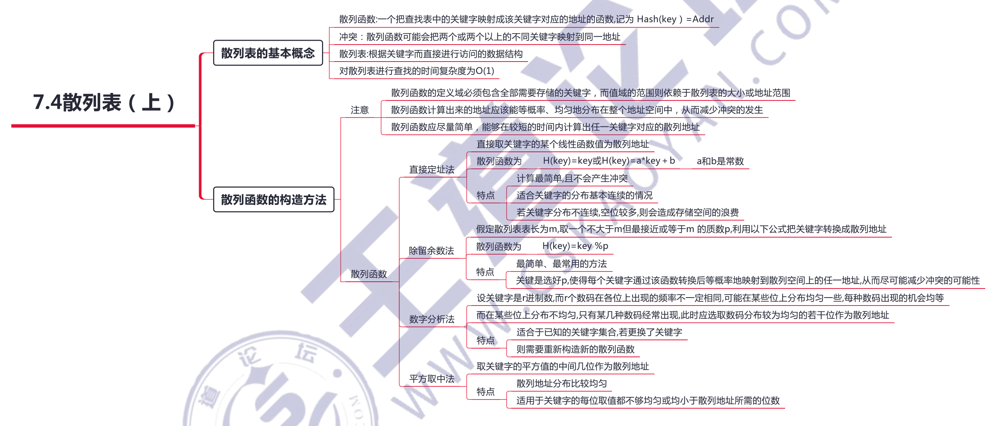
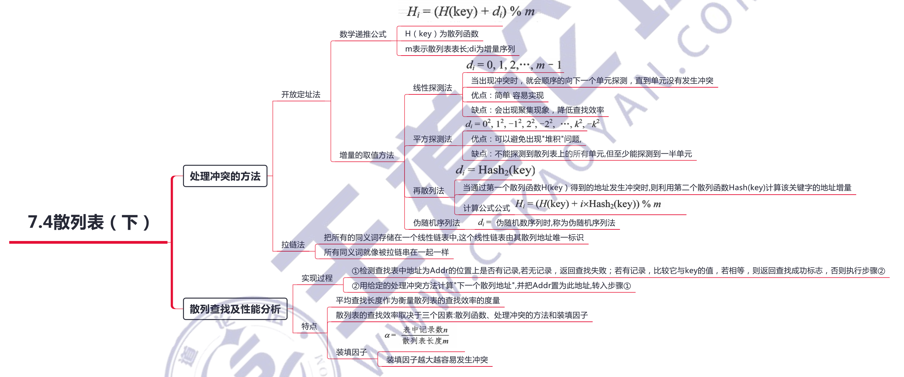
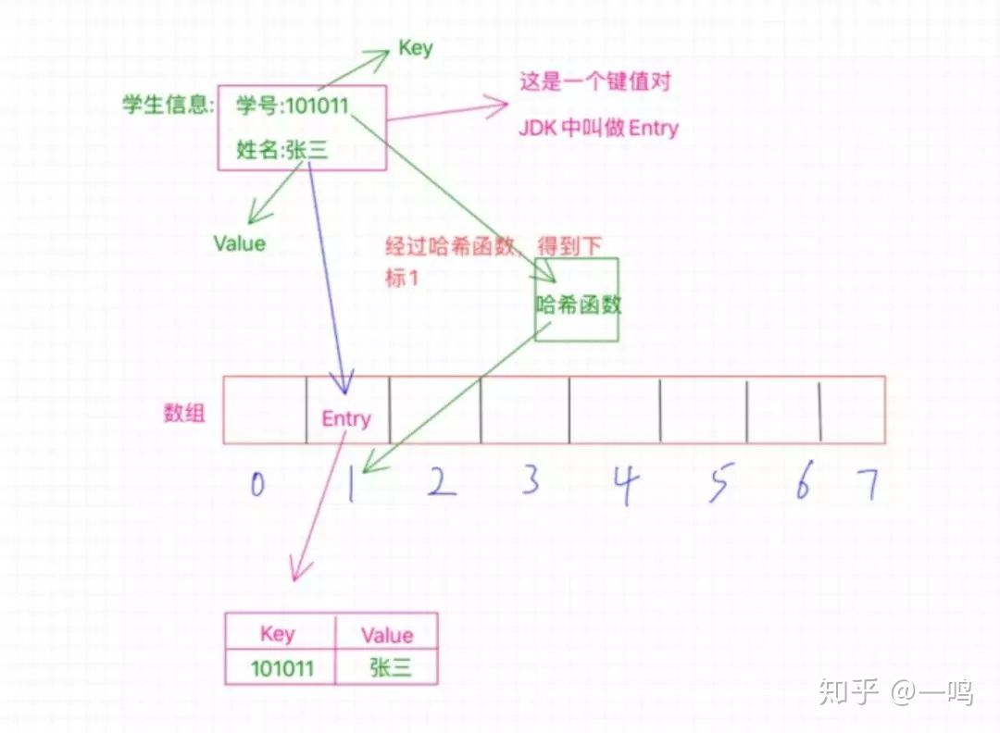
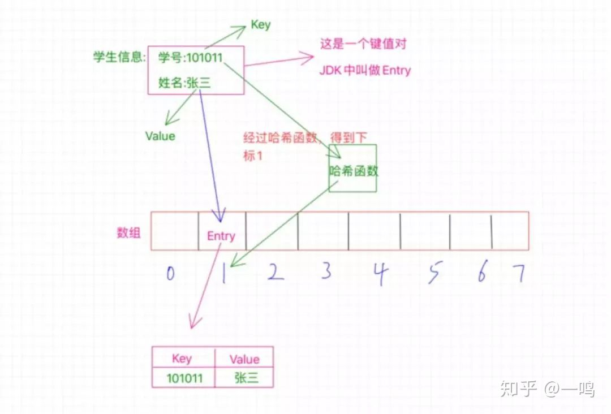
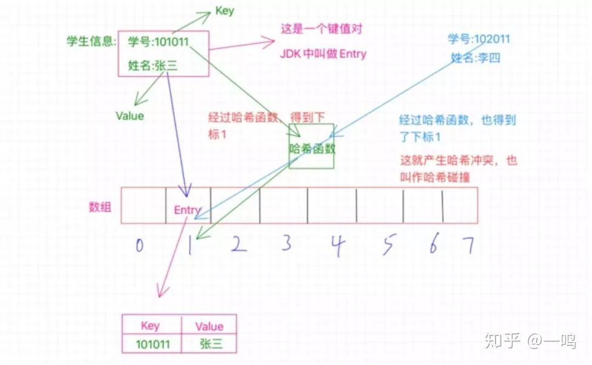
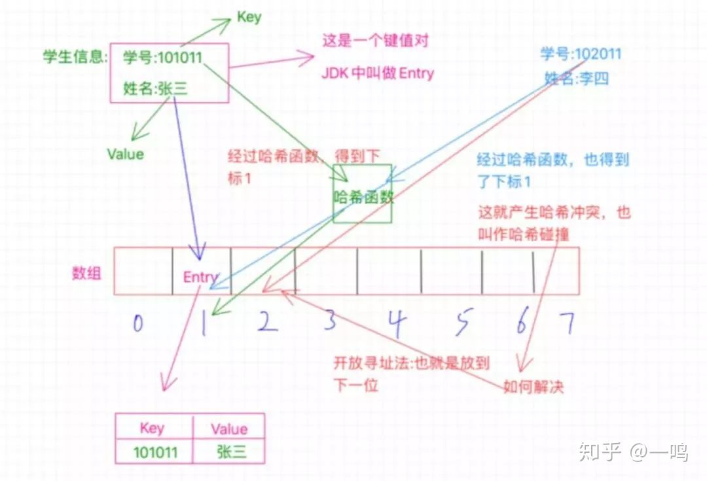
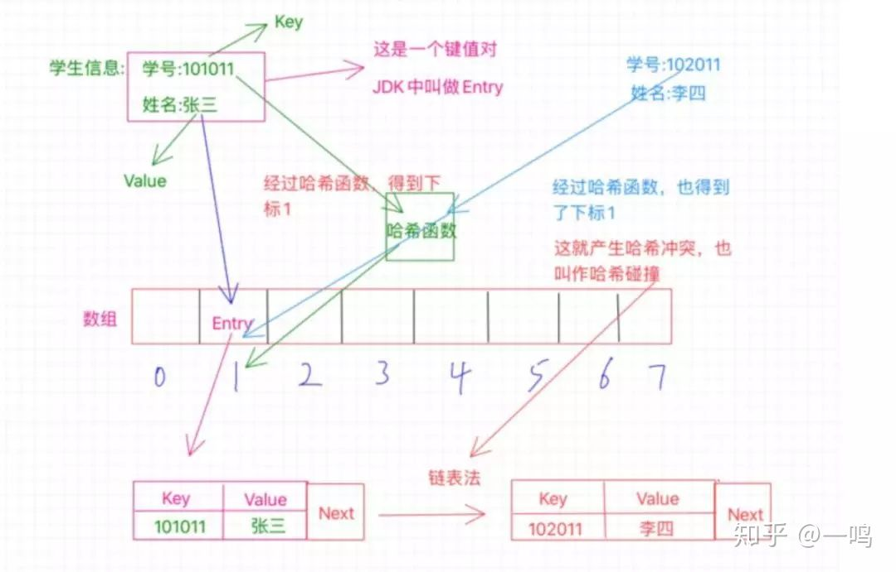
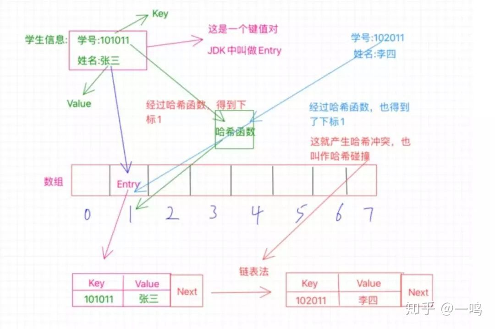

# 散列表

参考 1：[哈希表是个啥？](https://zhuanlan.zhihu.com/p/95156642)

参考 2：[哈希表（散列表）详解](http://c.biancheng.net/view/3437.html)

参考 3：[百度百科-哈希表](https://baike.baidu.com/item/%E5%93%88%E5%B8%8C%E8%A1%A8/5981869?fr=aladdin)

## 应用

- 记忆化map，使用哈希表，记录已经遍历过的值。如果剩余的值（target-cur）出现过，那就是答案
- 原地哈希，特征有含 `n` 个整数的数组 `nums` ，其中 `nums[i]` 在区间 `[1, n]` 内。用入参数组作为哈希表，f(i)=i 作为哈希函数，但是每一题的解法都不太一样
  - 如：[剑指Offer-03-[原地哈希]-数组中重复的数字](./例题-哈希表/剑指Offer-03-[原地哈希]-数组中重复的数字.md)，[41-[原地哈希]-缺失的第一个正数](./例题-哈希表/41-[原地哈希]-缺失的第一个正数.md)，[442-[原地哈希]-数组中重复的数据](./例题-哈希表/442-[原地哈希]-数组中重复的数据.md)

## 一、概念

[散列表](https://baike.baidu.com/item/散列表/10027933)（Hash table，也叫哈希表），是根据关键码值(Key value)而直接进行访问的[数据结构](https://baike.baidu.com/item/数据结构/1450)。也就是说，它通过把关键码值映射到表中一个位置来访问记录，以加快查找的速度。这个映射函数叫做[散列函数](https://baike.baidu.com/item/散列函数/2366288)，存放记录的[数组](https://baike.baidu.com/item/数组/3794097)叫做[散列表](https://baike.baidu.com/item/散列表/10027933)。

**哈希表不存储哈希值**，哈希值是键的函数，是定类数据到定序数据的映射，**哈希值本身是地址数据**，也就是说，任何一个数据-键，都用散列函数将其转换为一个地址数据-哈希值。键值是哈希值指定的哈希表地址的存储数据。

### 1、哈希表其实本质上是一个「数组」

哈希表我们可以采用两种方法

1. 数组+链表
2. 数组+二叉树

无论哪个都是必须有数组啊，都是再数组的基础上取搞其他的，而且比如第一种数组+链表的形式，本质上是出现哈希冲突的一种解决办法，使用链表存放，所以综合起来叫做数组+链表的方式来实现一个哈希表，另外数组中一般就是存放的单一的数据，而哈希表中存放的是一个键值对，这是个区别

### 2、散列函数

例如，取姓名的首字母做一个排序，那么这是不是就是通过一些特定的方法去得到一个特定的值，比如这里取人名的首字母

那么如果是放到数学中，是不是就是类似一个函数似的，**给一个值，经过某些加工得到另外一个值**

那么这个函数或者是这个方法在哈希表中就叫做散列函数，其中规定的一些操作就叫做函数法则

在构造散列函数时，必须注意以下几点：

- 散列函数的定义域必须包含全部需要存储的关键字，而值域的范围则依赖于散列表的大小或地址范围。
- 散列函数计算出来的地址应该能等概率、均匀地分布在整个地址空间中，从而减少冲突的发生
- 散列函数应尽量简单，能够在较短的时间内计算出任一关键宇对应的散列地址

#### 1）直接定址法

直接取关键字的某个线性函数值为散列地址，散列函数为
$$
H(key) = a \times key + b
$$
式中，a和6是常数。这种方法计算最简单，且不会产生冲突。它适合关键字的分布基本连续的情况，若关键字分布不连续，空位较多，则会造成存储空间的浪费。

#### 2）除留余数法

这是一种最简单、最常用的方法，假定散列表表长为m，取一个不大于m但最接近或等于 m 的质数 p，利用以下公式把关键字转换成散列地址。散列函数为
$$
H(key) = key \% p
$$
除留余数法的关键是选好 p，使得每个关键宇通过该函数转换后等概半地映射到散列空间上的任一地址，从而尽可能减少冲突的可能性

#### 3）数学分析法

设关键字是 r 进制数（如十进制数），而 r 个数码在各位上出现的频率不一定相同，可能在某些位上分布均匀一些，每种数码出现的机会均等。

而在某些位上分布不均匀，只有某几种数码经常出现，此时应选取数码分布较为均匀的若干位作为散列地址。这种方法适合于已知的关键字集合，若更换了关键宇，则需要重新构造新的散列函数。

#### 4）平方取中法

顾名思义，这种方法取关键字的平方值的中间几位作为散列地址。具体取多少位要视实际情况而定。这种方法得到的散列地址与关键字的每位都有关系，因此使得散列地址分布比较均匀，适用于关键字的每位取值都不够均匀或均小于散列地址所需的位数。

在不同的情况下，不同的散列函数具有不同的性能，因此不能笼统地说哪种散列函数最好。在实际选择中，**采用何种构造散列函数的方法取决于关键字集合的情况，但目标是尽量降低产生冲突的可能性**。

### 3、关键值key

就像这个图，1是怎么得出来得，是不是根据未加工之前得101得出来得，这个加工过程其实就是个散列函数，而丢给它的这个101就是这个关键值啊，为啥叫它关键值嘞，那是因为我们要对它做加工才能得出我们想要的1啊，你说它关不关键

因此，哈希表就是通过将「关键值key」通过「散列函数」加工处理之后得到一个值，这个值就是「数据存放位置」，我们就可以根据这个「数据存放位置」快速的找到我们想要的数据

哈希表的本质其实是个数组，数组有啥特点：下标从0开始啊，连续的，直接通过下标访问

有一个数组a，我们可以直接通过a[1]的形式来访问到数值7，所以查询效率很高。

### 4、键值对和Entry

我们知道哈希表本质上是个数组，难道就跟数组的基本使用那样，存个数值，然后通过下表读取之类的嘛？

当然不是啦，**对于哈希表，它经常存放的是一些键值对的数据**，啥是键值对啊，就是我们经常说的key-value啊，简单点说就是一个值对应另外一个值，比如a对应b，那么a就是key，b是value，哈希表存放的就是这样的键值对。

在哈希表中是通过哈希函数将一个值映射到另外一个值的，所以在哈希表中，a映射到b，a就叫做键值，而b呢？就叫做a的哈希值，也就是hash值。

学生的学号和姓名就是一个键值对，根据这个学号就能找到这个学生的姓名

那啥是Entry嘞，我们都知道键值对，在很多语言中也许都有键值对，在jdk中可不能那么俗气，不能再叫键值对了，那就叫Entry，其实是一回事

### 5、哈希函数

哈希函数就是之前说的散列函数，叫散列表时为散列函数，叫哈希表时为哈希函数

常用的哈希函数的构造方法有 6 种：直接定址法、数字分析法、平方取中法、折叠法、除留余数法和随机数法

**哈希函数是核心**

如果一个哈希函数设计的足够好的话，就会减少哈希冲突的概率，如果设计的不好，那就会经常撞衫 ，那就很影响性能了

如果哈希函数设计的比较简单粗陋，那很容易被那些不怀好意的人捣乱，比如知道了哈希函数的规则，故意制造容易冲突的key值，那哈希表就会一直撞啊撞啊

## 二、哈希表如何存数据

### 1、哈希表不存储哈希值

我们已经知道了哈希表本质是个数组，所以这里有个数组，长度是8，现在我们要做的是把这个学生信息存放到哈希表中，也就是这个数组中去，那我们需要考虑怎么去存放呢？

这里的学号是个key，我们之前也知道了，哈希表就是根据key值来通过哈希函数计算得到一个值，这个值就是用来确定这个Entry要存放在哈希表中的位置的，实际上这个值就是一个下标值，来确定放在数组的哪个位置上。

比如这里的学号是101011，那么经过哈希函数的计算之后得到了1，这个1就是告诉我们应该把这个Entry放到哪个位置，**这个1就是数组的确切位置的下标**，也就是需要放在数组中下表为1的位置，如图中所示。

我们之前已经介绍过什么是Entry了，所以这里你要知道，**数组中1的位置存放的是一个Entry，它不是一个简单的单个数值，而是一个键值对**，也就是存放了key和value，key就是学号101011，value就是张三，我们经过哈希函数计算得出的**1只是为了确定这个Entry该放在哪个位置而已**。现在我们就成功把这个Entry放到了哈希表中了

因此：

**哈希表不存储哈希值**，哈希值是键的函数，是定类数据到定序数据的映射，**哈希值本身是地址数据**，也就是说，任何一个数据-键，都用散列函数将其转换为一个地址数据-哈希值。键值是哈希值指定的哈希表地址的存储数据。

### 2、哈希冲突

这个哈希函数，是不是有一个特定的加工过程，比如可以经过某种计算把101011转换成1，那么有没有可能其他的学号经过哈希函数的计算也得出1呢？那这个时候是不是就撞衫啦

这种情况就是「哈希冲突」或者也叫「哈希碰撞」

关于哈希冲突的解决办法有好几种，两种主要的方法，一个是开放寻址法，一个是拉链法

#### 1）开放寻址法

开放寻址法其实简单来说就是，既然位置被占了，那就另外再找个位置。数学递推式：
$$
H=(H(key) +d_i) \% m
$$
式中，H(key) 为散列函数：i=0,1,2,...,k (k ≤ m-1)；m 表示散列表表长；d为增量序列

**线性探测法**

当 `di = 0,1,2,，m-1` 时，称为线性探测法。就是既然**当前位置被占用了，我们就看看该位置的后一个位置是否可用**，也就是1的位置被占用了，我们就看看2的位置，如果没有被占用，那就放到这里呗，当然，也有可能2的位置也被占用了，那咱就继续往下找，看看3的位置，一次类推，直到找到空位置。

从而造成大量元素在相邻的散列地址上“聚集”或堆积，起来，大大降低了查找效率。

**平方探测法**

当 `di = 0^2,1^2,-1^2,2^2,-2^2,...,k^2,-k^2` 时，称为平方探测法，其中 k ≤ m/2，散列表长度m必须是一个可以表示成 4k+3的素数，又称二次探测法。

平方探测法是一种处理冲突的较好方法，可以避免出现“堆积” 问题，它的缺点是不能探测到散列表上的所有单元，但至少能探测到一半单元。

**再散列法**

当 `di = Hash2(key)` 时，称为再散列法，又称双散列法。**需要使用两个散列函数**，当通过第一个散列函数 H((key)得到的地址发生冲突时，则利用第二个散列函数 Hash2(key)计算该关键字的地址增量。它的具体散列函数形式如下：
$$
H=(H(key) + i\times Hash_2(key)) \% m
$$
初始探测位置 `H0 = H(key)%m`。i 是冲突的次数，初始为 0。在再散列法中，最多经过 m-1次探测就会遍历表中所有位置，回到H0的位置。

**伪随机序列法**

当 di = 伪随机数序列时，称为伪随机序列法。

**注意**：

在开放定址的情形下，**不能随便物理删除表中的已有元素**，因为若删除元素，则会截断其他具有相同散列地址的元素的查找地址。因此，要期除一个元素时，可给它**做一个删除标记，进行逻辑删除**。但这样做的副作用是：执行多次删除后，表面上看起来散列表很满，实际上有许多位置未利用，因此需要定期维护散列表，要把删除标记的元素物理删除。

Java中的ThreadLocal就是利用了开放寻址法

开放寻址有个疑问，那就是如果一直找不到空的位置咋整啊？实际情况是位置不会被占光的，因为有一定量的位置被占了的时候就会发生扩容

#### 2）拉链法

拉链法也是比较常用的，像HashMap就是使用了这种方法

之前说的开放寻址法采用的方式是在数组上另外找个新位置，而**拉链法则不同，还是在该位置，这里采用的是链表**，什么意思呢？

就像图中所示，现在张三和李四都要放在1找个位置上，但是张三先来的，已经占了这个位置，待在了这个位置上了，那李四呢？解决办法就是链表，这时候这个1的位置存放的不单单是之前的那个Entry了，**此时的Entry还额外的保存了一个next指针**，这个指针指向数组外的另外一个位置，将李四安排在这里，然后张三那个Entry中的next指针就指向李四的这个位置，也就是保存的这个位置的内存地址，如果还有冲突，那就把又冲突的那个Entry放在一个新位置上，然后李四的Entry中的next指向它，这样就形成了一个链表。

**因此拉链法适用于经常插入和删除的情况**

例如：关键字序列为 {19, 14, 23, 01, 68,20, 84, 27,55, 11,10, 79}，散列函数 H(key)=key%13，用拉链法处理冲突，建立的表如图 7.9 所示

如果冲突过多的话，这块的链表会变得比较长，怎么处理呢？

这里举个例子吧，拿java集合类中的HashMap来说吧，如果这里的链表长度大于等于8的话，链表就会转换成树结构，当然如果长度小于等于6的话，就会还原链表。以此来解决链表过长导致的性能问题

### 3、哈希表的扩容

其实不仅仅因为位置被占光会扩容，还有一个很重要的原因就是**当哈希表被占的位置比较多的时候，出现哈希冲突的概率也就变高了**，所以很有必要进行扩容。

那么这个扩容是怎么扩的呢？这里一般会有一个增长因子的概念，也叫作负载因子，简单点说就是已经被占的位置与总位置的一个百分比，比如一共十个位置，现在已经占了七个位置，就触发了扩容机制，因为它的增长因子是0.7，也就是达到了总位置的百分之七十就需要扩容。

还拿HashMap来说，当它当前的容量占总容量的百分之七十五的时候就需要扩容了。

而且这个扩容也不是简单的把数组扩大，而是**新创建一个数组是原来的2倍，然后把原数组的所有Entry都重新Hash一遍放到新的数组**

为什么需要重新Hash一遍？

因为数组扩大了，所以一般哈希函数也会有变化，这里的Hash也就是把之前的数据通过新的哈希函数计算出新的位置来存放。

## 三、散列表查找及性能分析

### 1、查找

比如我们现在要通过学号102011来查找学生的姓名，怎么操作呢？

1. 首先通过学号利用哈希函数得出位置1
2. 然后去位置1拿数据，拿到这个Entry之后，看看这个Entry的key是不是我们的学号102011
3. 如果不是要的key，然后根据这个Entry的next知道下一给位置，再比较key，找到李四

在哈希表中进行查找的操作同哈希表的构建过程类似，其具体实现思路为：

- 对于给定的关键字 K，将其带入哈希函数中，求得与该关键字对应的数据的哈希地址
- 如果该地址中没有数据，则证明该查找表中没有存储该数据，查找失败
- 如果哈希地址中有数据，就需要做进一步的证明（排除冲突的影响），找到该数据对应的关键字同 K 进行比对，
  - 如果相等，则查找成功
  - 如果不相等，说明在构造哈希表时发生了冲突，需要根据构造表时设定的处理冲突的方法找到下一个地址，同地址中的数据进行比对，直至遇到地址中数据为 NULL（说明查找失败），或者比对成功

### 2、性能分析

从散列表的查找过程可见：

虽然散列表在关键字与记录的存储位置之间建立了直接映像，但由于“冲突” 的产生，使得**散列表的查找过程仍然是一个给定值和关键字进行比较的过程**。因此，仍需要**以平均查找长度作为衡量散列表的查找效率的度量**。

散列表的查找效率取决于三个因素：散列函数、处理冲突的方法和装填因子。

散列表的装填因子，一般记为 a，定义为一个表的装满程度，即
$$
\alpha = \frac{表中记录数n}{散列表长度m}
$$
散列表的平均查找长度依赖散列列表的装填因子a，而不直接依赖于n 或m。直观地看，a越大，表示装填的记录越“满”，发生冲突的可能性越大，反之发生冲突的可能性越小。

读者应能在给出散列表的长度、元素个数及散列函数和解决冲突的方法后，在求出散列表的基础上计算出查找成功时的平均查找长度和查找不成功的平均查找长度。

例如：关键字序列为 {19, 14, 23, 01, 68,20, 84, 27,55, 11,10, 79}，散列函数 H(key)=key%13，用拉链法处理冲突，建立的表如图 7.9 所示

| 关键字   | 19   | 14   | 23   | 01   | 68   | 20   | 84   | 27   | 55   | 11   | 10   | 79   |
| -------- | ---- | ---- | ---- | ---- | ---- | ---- | ---- | ---- | ---- | ---- | ---- | ---- |
| 比较次数 | 1    | 2    | 2    | 1    | 2    | 1    | 2    | 3    | 1    | 1    | 1    | 4    |

平均查找长度 ASL = (6 * 1 + 4 * 2 + 1 * 3 + 1 * 4) / 12 = 21 / 12 = 1.75
