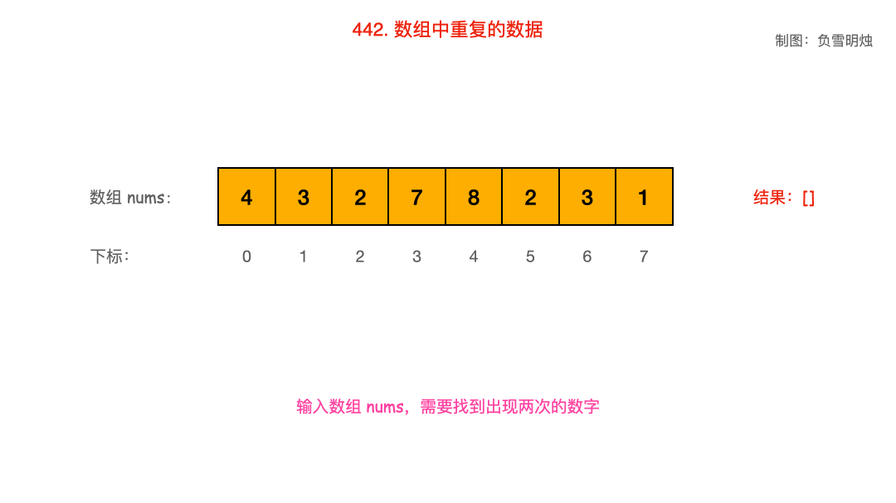

题目：[442. 数组中重复的数据](https://leetcode.cn/problems/find-all-duplicates-in-an-array/)

给你一个长度为 `n` 的整数数组 `nums` ，其中 `nums` 的所有整数都在范围 `[1, n]` 内，且每个整数出现 **一次** 或 **两次** 。请你找出所有出现 **两次** 的整数，并以数组形式返回。

你必须设计并实现一个时间复杂度为 `O(n)` 且仅使用常量额外空间的算法解决此问题。

**示例 1：**

```
输入：nums = [4,3,2,7,8,2,3,1]
输出：[2,3]
```

**示例 2：**

```
输入：nums = [1,1,2]
输出：[1]
```

**示例 3：**

```
输入：nums = [1]
输出：[]
```

**提示：**

- `n == nums.length`
- `1 <= n <= 105`
- `1 <= nums[i] <= n`
- `nums` 中的每个元素出现 **一次** 或 **两次**

## 原地修改数组

遇到这个题，你的第一思路是什么呢？

我想一定是使用 `set` 或者 `hashmap`保存已经出现过的数字、或者数字出现的次数。但这就不符合题目的空间复杂度是 O(1)

第二个思路是对数组排序，排序后相同的数字会相邻。可是排序的时间复杂度是 O(N * log(N)) 不符合题目的时间复杂度O(N)。

所以，只能祭出大杀器：「**原地修改数组**」了。

其实这个思路是沿着 `hashmap`的思路演化出来的，只要遇到过一次就学会了。

我们注意题目给出的条件：

- 数组长度是 n，每个数据的取值范围是 [1, n]

我们知道一个数组有 `下标`和 `值`两个概念，根据`下标`获取到`值`。

本题中，数组中数字的取值范围 [1, n]，正好与下标的范围 [0, n - 1] 对应。

因此，就有一个思路，对于 nums[i]，我们将下标 = nums[i] - 1 的位置的数字进行**映射**（还要能映射回去）。

映射方法通常有两种：

- 取反
- 增加偏移量

#### 方法一：取反

- 从起始位置进行遍历，每次将`下标`为 nums[i] - 1 的数字取反；
- 当遍历到`值` nums[i] 为负数，需要忽略其负号。
- 若发现`下标`为 nums[i] - 1 的数字已经是负数，说明之前出现过同样的数字 nums[i]，即找到了重复数字；

动画图解如下：



```c++
class Solution {
public:
    vector<int> findDuplicates(vector<int>& nums) {
        const int N = nums.size();
        vector<int> res;
        for (int i = 0; i < N; i++) {
            if (nums[abs(nums[i]) - 1] < 0)
                res.push_back(abs(nums[i]));
            nums[abs(nums[i]) - 1] *= -1;
        }
        return res;
    }
};
```

#### 方法二：增加偏移量

除了取反之外，我们还可以增加一个偏移量，只要映射后与原数组的范围区分开就行。

思路和取反一样，只是为了映射后与映射前的数组不混淆。

比如，本题中数字的范围是 [1, 10^5]，我们可以增加一个偏移量 10^5，即映射到了一个新的数组空间。

做法：

- 从起始位置进行遍历，每次将`下标`为 nums[i] - 1的数字 + 100000；
- 遍历到`值` nums[i] 超过 100000，需要将其 −100000 恢复原值；
- 若发现`下标`为 nums[i] - 1 的数字已经超过 100000，说明之前出现过同样的数字 nums[i]，即找到了重复数字；

```c++
class Solution {
public:
    vector<int> findDuplicates(vector<int>& nums) {
        vector<int> res;
        for (int num : nums) {
            if (nums[(num % 100000) - 1] > 100000) {
                res.push_back(num % 100000);
            }
            nums[(num % 100000) - 1] += 100000;
        }
        return res;
    }
};
```

