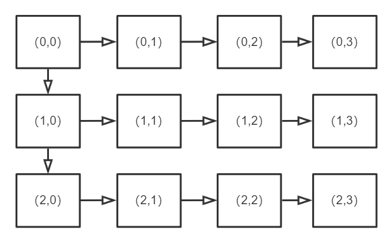

[373. 查找和最小的 K 对数字](https://leetcode-cn.com/problems/find-k-pairs-with-smallest-sums/)

给定两个以 **升序排列** 的整数数组 `nums1` 和 `nums2` , 以及一个整数 `k` 。

定义一对值 `(u,v)`，其中第一个元素来自 `nums1`，第二个元素来自 `nums2` 。

请找到和最小的 `k` 个数对 `(u1,v1)`, ` (u2,v2)` ...  `(uk,vk)` 。

```
示例 1:

输入: nums1 = [1,7,11], nums2 = [2,4,6], k = 3
输出: [1,2],[1,4],[1,6]
解释: 返回序列中的前 3 对数：
     [1,2],[1,4],[1,6],[7,2],[7,4],[11,2],[7,6],[11,4],[11,6]
     
示例 2:

输入: nums1 = [1,1,2], nums2 = [1,2,3], k = 2
输出: [1,1],[1,1]
解释: 返回序列中的前 2 对数：
     [1,1],[1,1],[1,2],[2,1],[1,2],[2,2],[1,3],[1,3],[2,3]

示例 3:

输入: nums1 = [1,2], nums2 = [3], k = 3 
输出: [1,3],[2,3]
解释: 也可能序列中所有的数对都被返回:[1,3],[2,3]
```

提示:

1 <= nums1.length, nums2.length <= 105
-109 <= nums1[i], nums2[i] <= 109
nums1 和 nums2 均为升序排列
1 <= k <= 1000

## 方法一：多路归并

[题解](https://leetcode-cn.com/problems/find-k-pairs-with-smallest-sums/solution/gong-shui-san-xie-duo-lu-gui-bing-yun-yo-pgw5/)

令 nums1 的长度为 n，nums2 的长度为 m，所有的点对数量为 n * m

其中每个 nums1[i] 参与所组成的点序列为：

[(nums1[0], nums2[0]), (nums1[0], nums2[1]), ... , (nums1[0],nums2[m−1])]
[(nums1[1], nums2[0]), (nums1[1], nums2[1]), ... , (nums1[1], nums2[m−1])]
...
[(nums1[n−1], nums2[0]), (nums1[n−1], nums2[1]), ... , (nums1[n−1], nums2[m−1])]

由于 nums1 和 nums2 均已按升序排序，因此每个 nums1[i] 参与构成的点序列也为升序排序，这引导我们使用「多路归并」来进行求解。

具体的，起始我们将这 n 个序列的首位元素（点对）以二元组 (i,j) 放入优先队列（小根堆），其中 i 为该点对中 nums1[i] 的下标，j 为该点对中 nums2[j] 的下标，这步操作的复杂度为 O(nlogn)。这里也可以得出一个小优化是：我们始终确保 nums1 为两数组中长度较少的那个，然后通过标识位来记录是否发生过交换，确保答案的点顺序的正确性。

每次从优先队列（堆）中取出堆顶元素（含义为当前未被加入到答案的所有点对中的最小值），加入答案，并将该点对所在序列的下一位（如果有）加入优先队列中。

举个 🌰，首次取出的二元组为 (0, 0)，即点对 (nums1[0], nums2[0])，取完后将序列的下一位点对 (nums1[0], nums2[1]) 以二元组 (0, 1) 形式放入优先队列。

可通过「反证法」证明，每次这样的「取当前，放入下一位」的操作，可以确保当前未被加入答案的所有点对的最小值必然在优先队列（堆）中，即前 k 个出堆的元素必然是所有点对的前 k 小的值。



### 策略

- 定义小根堆，自定义排序规则
- 起始，将这 n 个序列的首位元素以二元组 (i, j) 放入小根堆。换句话说，现将各条路的起点入堆，(i, j)代表了每条路的下标指针
- 循环取 k 个小根堆「堆顶」，然后移除。如果取的那条路还有下一个节点，将其放入小根堆里

时间复杂度：令 M 为 n、m 和 k 三者中的最小值，复杂度为 `O(M+k)∗logM)`

空间复杂度：`O(M)`

**未优化代码**

```c++
class Solution {
public:
    vector<vector<int>> kSmallestPairs(vector<int>& nums1, vector<int>& nums2, int k) {
        // 定义小根堆，自定义排序规则
        auto cmp = [&](const auto& a, const auto& b) {
            return nums1[a.first] + nums2[a.second] > nums1[b.first] + nums2[b.second];
        };
        priority_queue<pair<int, int>, vector<pair<int, int>>, decltype(cmp)> smallQ(cmp);
        
        int n = nums1.size();
        int m = nums2.size();
        // 起始我们将这 n 个序列的首位元素（点对）以二元组 (i,j) 放入小根堆
        // 现将各条路的起点入堆，(i,j)代表了每条路的下标指针
        for (int i = 0; i < min(n, k); i++) {
            smallQ.push({i, 0});
        }

        vector<vector<int>> ans;
        while (ans.size() < k and !smallQ.empty()) {
            int idx1 = smallQ.top().first;
            int idx2 = smallQ.top().second;
            smallQ.pop();
            ans.push_back({nums1[idx1], nums2[idx2]});
            if (idx2 + 1 < m) smallQ.push({idx1, idx2 + 1});
        }
        return ans;
    }
};
```

**优化代码**

```c++
class Solution {
public:
    vector<vector<int>> kSmallestPairs(vector<int>& nums1, vector<int>& nums2, int k) {
        //始终确保nums1为两数组中长度较少的那个
        bool flag = true;
        int n = nums1.size(), m = nums2.size();
        if (nums1.size() > nums2.size()) {
            swap(nums1, nums2);
            swap(n, m);
            flag = false;
        }

        // 定义小根堆，自定义排序规则
        auto cmp = [&](const auto& a, const auto& b) {
            return nums1[a.first] + nums2[a.second] > nums1[b.first] + nums2[b.second];
        };
        priority_queue<pair<int, int>, vector<pair<int, int>>, decltype(cmp)> smallQ(cmp);

        // 起始我们将这 n 个序列的首位元素（点对）以二元组 (i,j) 放入小根堆
        for (int i = 0; i < min(n, k); i++) {
            smallQ.push({i, 0});
        }

        vector<vector<int>> ans;
        while (ans.size() < k and !smallQ.empty()) {
            int idx1 = smallQ.top().first;
            int idx2 = smallQ.top().second;

            smallQ.pop();
            if (flag) {
                ans.push_back({nums1[idx1], nums2[idx2]});
            } else {
                ans.push_back({nums2[idx2], nums1[idx1]});
            }

            if (idx2 + 1 < nums2.size()) smallQ.push({idx1, idx2 + 1});
        }
        return ans;
    }
};
```

## 方法二：暴力-有序集合（超时）

- 控制有序集合的大小为 k 个
- 有序集合 由小到大排序
- 比集合中最大的要小，进入集合，然后移除最大的元素

时间复杂度：`O(nlogk)`

空间复杂度：`O(k)`

**25 / 31** 个通过测试用例

```python
from sortedcontainers import SortedList
class Solution:
    def kSmallestPairs(self, nums1: List[int], nums2: List[int], k: int) -> List[List[int]]:
        sl = SortedList(key = lambda x : x[0]+x[1]) # 由小到大
        for n1 in nums1:
            for n2 in nums2:
                if len(sl) < k:
                    sl.add([n1, n2])
                else:
                    if n1 + n2 < sl[-1][0] + sl[-1][1]:
                        sl.add([n1, n2])
                        sl.pop()
        return sl[:]
```

## 方法三：暴力-大根堆（超时）

- 控制大根堆的大小为 k 个
- 小于大根堆的堆顶，入堆，然后移除堆顶
- 最后取出大根堆中的元素

时间复杂度：`O(nlogk)`

空间复杂度：`O(k)`

**27 / 31** 个通过测试用例

```c++
class Solution {
public:
    struct cmp {
        bool operator()(pair<int, int> p1, pair<int, int> p2) {
            return p1.first + p1.second < p2.first + p2.second;
        }
    };
    vector<vector<int>> kSmallestPairs(vector<int>& nums1, vector<int>& nums2, int k) {
        priority_queue<pair<int, int>, vector<pair<int, int>>, cmp> bigQ;
        for (int n1 : nums1) {
            for (int n2 : nums2) {
                if (bigQ.size() < k) {
                    bigQ.push({n1, n2});
                } else {
                    if (n1 + n2 < bigQ.top().first + bigQ.top().second) {
                        bigQ.push({n1, n2});
                        bigQ.pop();
                    }
                }
            }
        }

        vector<vector<int>> ans;
        while (!bigQ.empty()) {
            // cout << bigQ.top().first << ", " << bigQ.top().second << endl;
            ans.push_back({bigQ.top().first, bigQ.top().second});
            bigQ.pop();
        }

        return ans;
    }
};
```

