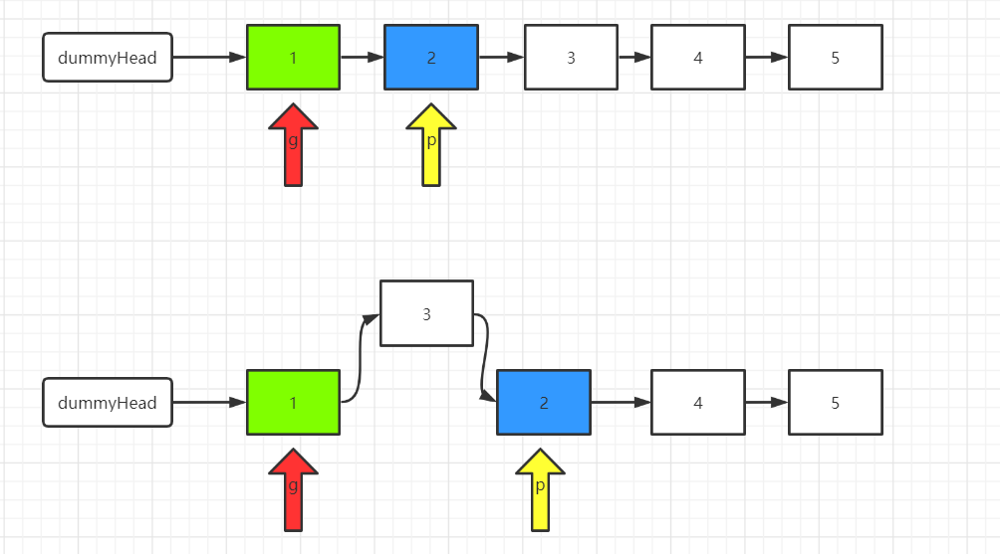
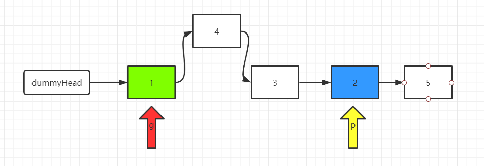

题目：[92. 反转链表 II](https://leetcode.cn/problems/reverse-linked-list-ii/)

给你单链表的头指针 `head` 和两个整数 `left` 和 `right` ，其中 `left <= right` 。请你反转从位置 `left` 到位置 `right` 的链表节点，返回 **反转后的链表** 。

**示例 1：**


```
输入：head = [1,2,3,4,5], left = 2, right = 4
输出：[1,4,3,2,5]
```

**示例 2：**

```
输入：head = [5], left = 1, right = 1
输出：[5]
```

**提示：**

- 链表中节点数目为 `n`
- `1 <= n <= 500`
- `-500 <= Node.val <= 500`
- `1 <= left <= right <= n`

**进阶：** 你可以使用一趟扫描完成反转吗？

## 头插法

1、我们定义两个指针，分别称之为 `g(guard 守卫)` 和 `p(point)`。

我们首先根据方法的参数 `m` 确定 `g` 和 `p` 的位置。将 `g` 移动到第一个要反转的节点的前面，将 `p` 移到第一个要反转的节点的位置上。我们以 `m=2`，`n=4`为例。

2、将 `p` 后面的元素删除，然后添加到 `g` 的后面。也即头插法。

3、根据 `m` 和 `n` 重复步骤（2）

4、返回 `dummyHead.next`





```c++
class Solution {
public:
    ListNode* reverseBetween(ListNode* head, int left, int right) {
        // 定义一个dummyHead, 方便处理
        ListNode* dummyHead = new ListNode(0);
        dummyHead->next = head;

        // 初始化指针
        ListNode* g = dummyHead;
        ListNode* p = dummyHead->next;

        // 将指针移到相应的位置
        for(int step = 0; step < left - 1; step++) {
            g = g->next; 
            p = p->next;
        }

        // 头插法插入节点
        for (int i = 0; i < right - left; i++) {
            ListNode* removed = p->next;
            p->next = p->next->next;

            removed->next = g->next;
            g->next = removed;
        }

        return dummyHead->next;
    }
};
```

