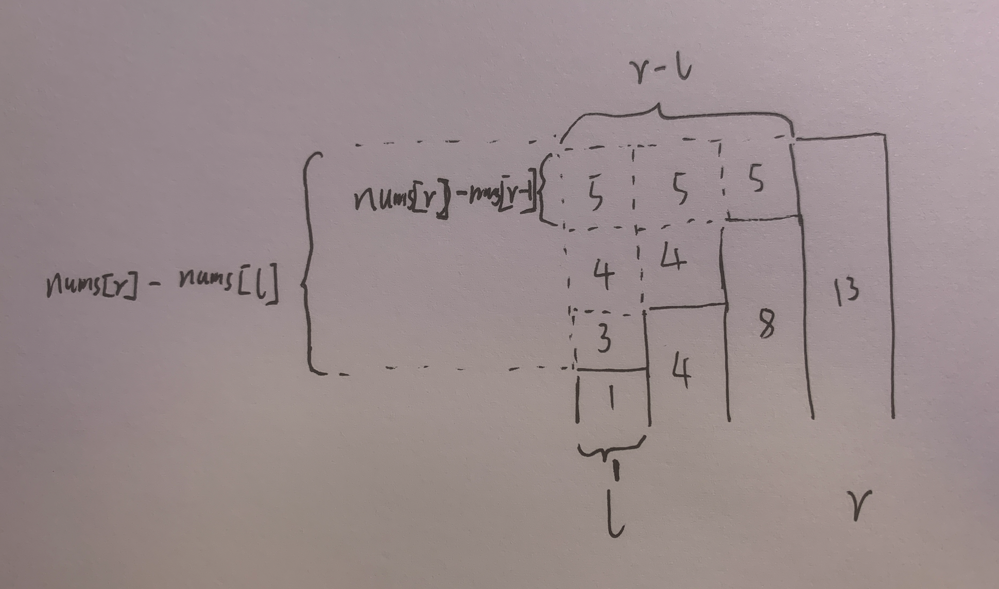

[1838. 最高频元素的频数](https://leetcode-cn.com/problems/frequency-of-the-most-frequent-element/)

元素的 **频数** 是该元素在一个数组中出现的次数。

给你一个整数数组 `nums` 和一个整数 `k` 。在一步操作中，你可以选择 `nums` 的一个下标，并将该下标对应元素的值增加 `1` 。

执行最多 `k` 次操作后，返回数组中最高频元素的 **最大可能频数** *。*

```
示例 1：

输入：nums = [1,2,4], k = 5
输出：3
解释：对第一个元素执行 3 次递增操作，对第二个元素执 2 次递增操作，此时 nums = [4,4,4] 。
4 是数组中最高频元素，频数是 3 。

示例 2：

输入：nums = [1,4,8,13], k = 5
输出：2
解释：存在多种最优解决方案：
- 对第一个元素执行 3 次递增操作，此时 nums = [4,4,8,13] 。4 是数组中最高频元素，频数是 2 。
- 对第二个元素执行 4 次递增操作，此时 nums = [1,8,8,13] 。8 是数组中最高频元素，频数是 2 。
- 对第三个元素执行 5 次递增操作，此时 nums = [1,4,13,13] 。13 是数组中最高频元素，频数是 2 。

示例 3：

输入：nums = [3,9,6], k = 2
输出：1
```

**提示：**

- `1 <= nums.length <= 105`
- `1 <= nums[i] <= 105`
- `1 <= k <= 105`

## 方法：排序+滑动窗口+前缀和思想

- 先进行数据预处理，方便滑窗
- 频数为窗口长度 right - left + 1，找最大的
- 使用 window 记录窗口内的元素 [left, right]，都变成 nums[right] 需要多少增量
- 当 window 内累积的增量大于 k 时，左边届收缩



窗口右边扩展，每次增加最上层，增加的面积为 `(r-l) * (nums[r] - nums[r-1])`

窗口左边收缩，每次减少最左列，减少的面积为 `1 * (nums[r] - nums[l])`

时间复杂度：`O(nlogn)`

空间复杂度：`O(logn)`

```c++
class Solution {
public:
    int maxFrequency(vector<int>& nums, int k) {
        sort(nums.begin(), nums.end());
        int n = nums.size();
        int left = 0;
        int right = 1;
        long long window = 0;
        int ans = 1;
        while (right < n) {
            // 右边届入窗，每次增加最上层
            window += (long long)(right - left) * (nums[right] - nums[right - 1]);
            // 左边届出窗，每次减少最左列
            while (window > k) {
                window -= 1 * (nums[right] - nums[left]);
                left++;
            }
            ans = max(ans, right - left + 1);
            right++;
        }
        return ans;
    }
};

```

