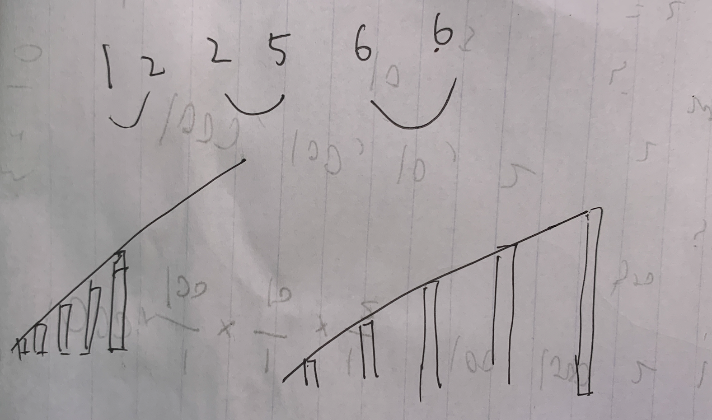

[561. 数组拆分 I](https://leetcode-cn.com/problems/array-partition-i/)

给定长度为 `2n` 的整数数组 `nums` ，你的任务是将这些数分成 `n` 对, 例如 `(a1, b1), (a2, b2), ..., (an, bn)` ,使得从 `1` 到 `n` 的 `min(ai, bi)` 总和最大。

返回该 **最大总和** 。

```
示例 1：

输入：nums = [1,4,3,2]
输出：4
解释：所有可能的分法（忽略元素顺序）为：
1. (1, 4), (2, 3) -> min(1, 4) + min(2, 3) = 1 + 2 = 3
2. (1, 3), (2, 4) -> min(1, 3) + min(2, 4) = 1 + 2 = 3
3. (1, 2), (3, 4) -> min(1, 2) + min(3, 4) = 1 + 3 = 4
所以最大总和为 4

示例 2：

输入：nums = [6,2,6,5,1,2]
输出：9
解释：最优的分法为 (2, 1), (2, 5), (6, 6). min(2, 1) + min(2, 5) + min(6, 6) = 1 + 2 + 6 = 9

```

**提示：**

- `1 <= n <= 104`
- `nums.length == 2 * n`
- `-104 <= nums[i] <= 104`

## 方法：数对贪心

一般「数对问题」都会将原数组「排序」，有的题会首尾进行结合（如1877题），而这道题是相邻结合

参考下面的图：

- 如果首尾结合，通过 min(首, 尾)，返回的是「前半部分」小的数（左边的图）
- 如果相邻结合，通过 min(左, 右)，返回的是相邻较小的数，样本会在整个空间「均匀分布」（右边的图）

显然，采用相邻结合的方法。**但这种推论不足以证明该方法的合理性**，请参照其他大佬的题解



时间复杂度：`O(nlogn)`

空间复杂度：`O(logn)`

```c++
class Solution {
public:
    int arrayPairSum(vector<int>& nums) {
        sort(nums.begin(), nums.end());
        int ans = 0;
        for (int i = 0; i < nums.size(); i += 2) {
            ans += min(nums[i], nums[i+1]);
        }
        return ans;
    }
};
```

