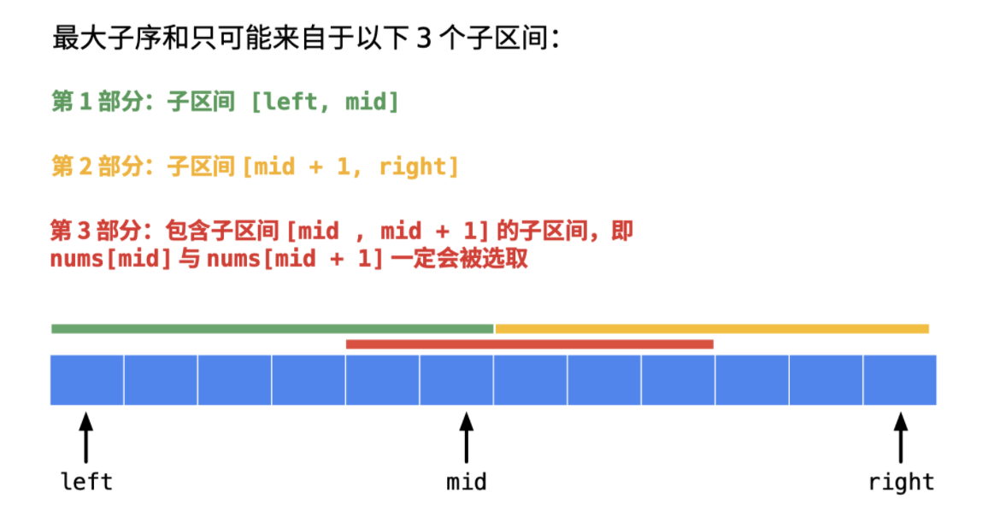

题目：[53. 最大子数组和](https://leetcode-cn.com/problems/maximum-subarray/)

给你一个整数数组 `nums` ，请你找出一个具有最大和的连续子数组（子数组最少包含一个元素），返回其最大和。

**子数组** 是数组中的一个连续部分。

```
输入：nums = [-2,1,-3,4,-1,2,1,-5,4]
输出：6
解释：连续子数组 [4,-1,2,1] 的和最大，为 6 。

输入：nums = [1]
输出：1

输入：nums = [5,4,-1,7,8]
输出：23
```

题目要我们找出和最大的连续子数组的值是多少，「连续」是关键字，连续很重要，不是子序列。

题目只要求返回结果，不要求得到最大的连续子数组是哪一个。这样的问题通常可以使用「动态规划」解决。

### 1、动态规划

掌握动态规划问题设计状态的技巧「**无后效性**」

**1. 定义状态**

设计状态思路：把不确定的因素确定下来，进而把子问题定义清楚，把子问题定义得简单。动态规划的思想通过解决了一个一个简单的问题，进而把简单的问题的解组成了复杂的问题的解。

`dp[i]`：表示以 `nums[i]` **结尾** 的 **连续** 子数组的最大和

**说明**：「结尾」和「连续」是关键字

**2. 状态转移方程**

根据状态的定义，由于 nums[i] 一定会被选取，并且以 nums[i] 结尾的连续子数组与以 nums[i - 1] 结尾的连续子数组只相差一个元素 nums[i] 。

假设数组 `nums` 的值全都严格大于 0，那么一定有 `dp[i] = dp[i - 1] + nums[i]`。

可是 `dp[i - 1]` 有可能是负数，于是分类讨论：

- 如果 dp[i - 1] > 0，那么可以把 nums[i] 直接接在 dp[i - 1] 表示的那个数组的后面，得到和更大的连续子数组；
- 如果 dp[i - 1] <= 0，那么 nums[i] 加上前面的数 dp[i - 1] 以后值不会变大。于是 dp[i] 「另起炉灶」，此时单独的一个 nums[i] 的值，就是 dp[i]。

$$
dp[i] = 
\begin{cases}
dp[i-1]+nums[i] & dp[i-1] > 0 \\ \\
nums[i] & dp[i-1] \leq 0
\end{cases}
$$

**3. 初始化**

`dp[0]` 根据定义，只有 1 个数，一定以 `nums[0]` 结尾，因此 `dp[0] = nums[0]`

**4. 输出**

这里状态的定义不是题目中的问题的定义，**不能直接将最后一个状态返回回去**；

这个问题的输出是把所有的 `dp[0]`、`dp[1]`、……、`dp[n - 1]` 都看一遍，取最大值

**5. 优化空间**

根据「状态转移方程」，`dp[i]` 的值只和 `dp[i - 1]` 有关，因此可以使用「滚动变量」的方式将代码进行优化。

**复杂度分析**

时间复杂度：`O(n)`

空间复杂度：`O(n)` 或 `O(1)`

```c++
class Solution {
public:
    int maxSubArray(vector<int>& nums) {
        int n = nums.size();
        vector<int> dp(n, 0);
        dp[0] = nums[0];
        for (int i = 1; i < n; i++) {
            if (dp[i - 1] > 0) {
                dp[i] = dp[i - 1] + nums[i];
            } else if (dp[i - 1] <= 0) {
                dp[i] = nums[i];
            }
        }
        return *max_element(dp.begin(), dp.end());
    }
};
```

```c++
class Solution {
public:
    int maxSubArray(vector<int>& nums) {
        int n = nums.size();
        int pre = nums[0];
        int ans = nums[0];
        for (int i = 1; i < n; i++) {
            if (pre > 0) {
                pre = pre + nums[i];
            } else if (pre <= 0) {
                pre = nums[i];
            }
            ans = max(ans, pre);
        }
        return ans;
    }
};
```

### 2、分治

分治法的思路是这样的，其实也是分类讨论。

连续子序列的最大和主要由这三部分子区间里元素的最大和得到：

- 第 1 部分：子区间 [left, mid]；
- 第 2 部分：子区间 [mid + 1, right]；
- 第 3 部分：包含子区间 [mid , mid + 1] 的子区间，即 nums[mid] 与 nums[mid + 1] 一定会被选取。



考虑第 3 部分跨越两个区间的连续子数组的时候，由于 nums[mid] 与 nums[mid + 1] 一定会被选取，可以从中间向两边扩散，扩散到底 选出最大值

**复杂度分析**

时间复杂度：`O(nlogn)`，这里递归的深度是对数级别的，每一层需要遍历一遍数组（或者数组的一半、四分之一）

空间复杂度：`O(logn)`

```c++
class Solution {
public:
    int getCross(int left, int right, int mid, vector<int>& nums) {
        // 一定会包含 nums[mid]，因为mid是向下取整得到的
        int leftMax = INT_MIN;
        int sum = 0;
        for (int l = mid; l >= left; l--) {
            sum += nums[l];
            if (sum > leftMax) leftMax = sum;
        }

        int rightMax = INT_MIN;
        sum = 0;
        for (int r = mid + 1; r <= right; r++) {
            sum += nums[r];
            if (sum > rightMax) rightMax = sum;
        }

        return leftMax + rightMax;
    }

    int dfs(int left, int right, vector<int>& nums) {
        if (left == right) return nums[left];
        int mid = left + (right - left) / 2;

        int leftSub = dfs(left, mid, nums);               // [left, mid]
        int rightSub = dfs(mid + 1, right, nums);         // [mid+1, right]
        int crossSub = getCross(left, right, mid, nums);  // [left, right] 两端不确定

        return max(leftSub, max(rightSub, crossSub));
    }

    int maxSubArray(vector<int>& nums) {
        return dfs(0, nums.size() - 1, nums);
    }
};
```
