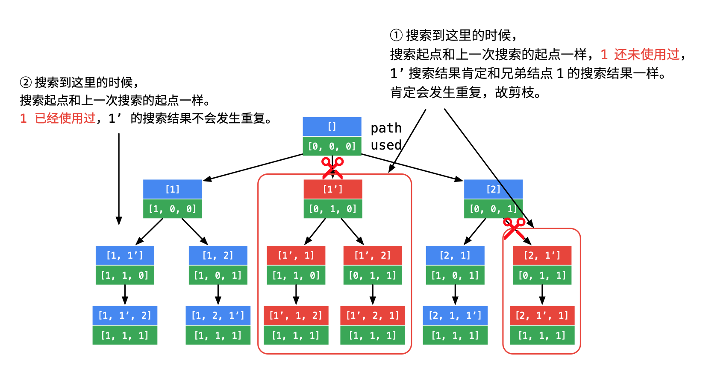

题目：[47. 全排列 II](https://leetcode.cn/problems/permutations-ii/)

给定一个可包含重复数字的序列 `nums` ，***按任意顺序*** 返回所有不重复的全排列。

**示例 1：**

```
输入：nums = [1,1,2]
输出：
[[1,1,2],
 [1,2,1],
 [2,1,1]]
```

**示例 2：**

```
输入：nums = [1,2,3]
输出：[[1,2,3],[1,3,2],[2,1,3],[2,3,1],[3,1,2],[3,2,1]]
```

**提示：**

- `1 <= nums.length <= 8`
- `-10 <= nums[i] <= 10`

---

仔细分析下，直接使用 46 题的写法，会有下面的结果

```
输入: [1,1,2]
输出: [[1,1,2],[1,2,1],[1,1,2],[1,2,1],[2,1,1],[2,1,1]]
预期结果: [[1,1,2],[1,2,1],[2,1,1]]
```

问题出在，我们虽然通过 `if (vis[i]) continue;` 在深度上确保每个位置上的数只会被选一次

但是，在同一层上，相同值的数，会被多次选择，这导致了重复的值

因此，在 46 题的解法上，增加在同一层上，相同值的数不能被多次选的约束，就可以了

> 这题警示我们，用 vis 记录已经使用过的数时，要分清是记录下标，还是记录值

```c++
class Solution {
public:
    int n;
    vector<int> nums;
    vector<bool> vis;
    vector<vector<int>> ans;

    // cnt 为 path 中的数量
    void dfs(int cnt, vector<int> &path) {
        if (cnt == n) {
            ans.push_back(path);
            return;
        }
        unordered_set<int> lay_vis;
        for (int i = 0; i < n; i++) {
            if (vis[i] == true) continue;
            if (lay_vis.count(nums[i])) continue;
            vis[i] = true;
            path.push_back(nums[i]);
            dfs(cnt+1, path);
            path.pop_back();
            vis[i] = false;
            lay_vis.insert(nums[i]);
        }
    }

    vector<vector<int>> permuteUnique(vector<int>& _nums) {
        nums = _nums;
        n = nums.size();
        vis.resize(n, false);
        
        vector<int> path;
        dfs(0, path);
        return ans;
    }
};
```


---

题解：https://leetcode.cn/problems/permutations-ii/solution/hui-su-suan-fa-python-dai-ma-java-dai-ma-by-liwe-2/

一个比较容易想到的办法是在结果集中去重。但是问题来了，这些结果集的元素是一个又一个列表，对列表去重不像用哈希表对基本元素去重那样容易。

如果要比较两个列表是否一样，一个容易想到的办法是对列表分别排序，然后逐个比对。既然要排序，我们就可以 **在搜索之前就对候选数组排序**，一旦发现某个分支搜索下去可能搜索到重复的元素就停止搜索，这样结果集中不会包含重复列表。

画出树形结构如下：重点想象深度优先遍历在这棵树上执行的过程，哪些地方遍历下去一定会产生重复，这些地方的状态的特点是什么？

对比图中标注 ① 和 ② 的地方。相同点是：这一次搜索的起点和上一次搜索的起点一样。不同点是：

- 标注 ① 的地方上一次搜索的相同的数刚刚被撤销；
- 标注 ② 的地方上一次搜索的相同的数刚刚被使用




产生重复结点的地方，正是图中标注了「剪刀」，且被绿色框框住的地方。

大家也可以把第 2 个 `1` 加上 `'` ，即 `[1, 1', 2]` 去想象这个搜索的过程。只要遇到起点一样，就有可能产生重复。这里还有一个很细节的地方：

- 在图中 ② 处，搜索的数也和上一次一样，但是上一次的 `1` 还在使用中；
- **在图中 ① 处，搜索的数也和上一次一样，但是上一次的 `1` 刚刚被撤销，正是因为刚被撤销，下面的搜索中还会使用到，因此会产生重复，剪掉的就应该是这样的分支**。

代码实现方面，在第 46 题的基础上，要加上这样一段代码：

```c++
if (i > 0 && nums[i] == nums[i - 1] && !vis[i - 1]) continue;
```

这段代码就能检测到标注为 ① 的两个结点，跳过它们。注意：这里 used[i - 1] 不加 !，测评也能通过。有兴趣的朋友可以想一想这是为什么。建议大家做这样几个对比实验：

- 干脆就不写 !used[i - 1] 结果是什么样？
- 写 used[i - 1] 结果是什么，代码又是怎样执行的。这里给出的结论是：!used[i - 1] 这样的剪枝更彻底。附录会分析原因。

```c++
class Solution {
public:
    int n;
    vector<int> nums;
    vector<bool> vis;
    vector<vector<int>> ans;

    // cnt 为 path 中的数量
    void dfs(int cnt, vector<int>& path) {
        if (cnt == n) {
            ans.push_back(path);
            return;
        }
        for (int i = 0; i < n; i++) {
            // 深度上，同个位置的数不能重复选择，但是不同位置相同值的数可以
            if (vis[i] == true) continue;
            // 只有 i > 0 && nums[i] == nums[i - 1] 
            // 表示同一层，相同值的数不能重复选，但也会导致深度上不同位置相同值的数被剪枝
            // 因此需要再添加个约束条件 !vis[i - 1]
            // 表示只有同一层，相同值的数不能重复选
            if (i > 0 && nums[i] == nums[i - 1] && !vis[i - 1]) continue;  

            vis[i] = true;
            path.push_back(nums[i]);
            dfs(cnt + 1, path);
            path.pop_back();
            vis[i] = false;
        }
    }

    vector<vector<int>> permuteUnique(vector<int>& _nums) {
        nums = _nums;
        n = nums.size();
        sort(nums.begin(), nums.end());
        vis.resize(n, false);

        vector<int> path;
        dfs(0, path);
        return ans;
    }
};
```

