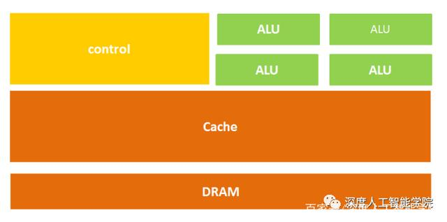
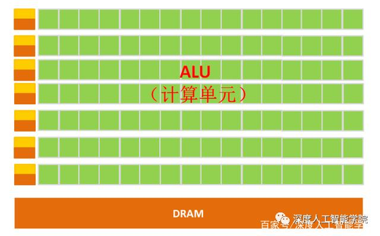
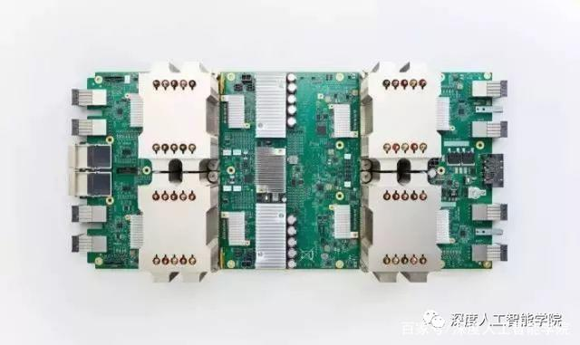
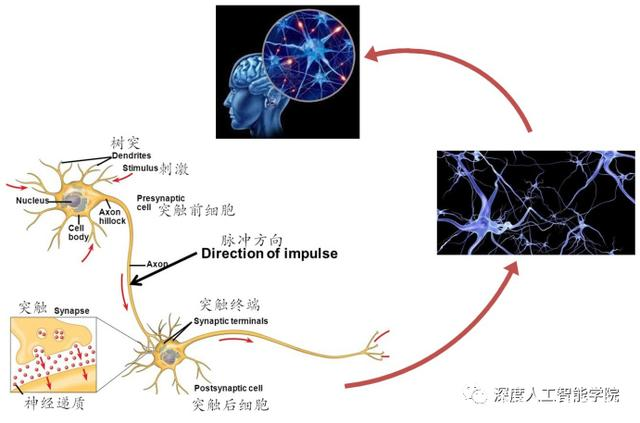
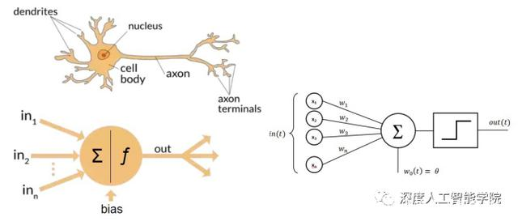

# 扫盲 CPU、GPU、DPU、TPU、NPU……

来源：[CPU、GPU、DPU、TPU、NPU……傻傻分不清楚？实力扫盲——安排！](https://baijiahao.baidu.com/s?id=1706639922409916892&wfr=spider&for=pc)

- CPU：Central Processing Unit, 中央处理器；计算单元、控制单元和存储单元组成，适合通用计算，逻辑控制，大规模并行计算能力上极受限制
- GPU：Graphics Processing Unit, 图像处理器；有数量众多的计算单元和超长的流水线，特别适合处理大量的类型统一的数据，适用于大规模并行计算的领域，也比较通用
- TPU全称：Tensor Processing Unit, 张量处理器；定制化芯片，专用于张量计算，有大规模片上内存，低精度 (8-bit) 计算
- NPU全称：Neural network Processing Unit, 神经网络处理器；突破了冯·诺伊曼结构，神经网络中存储和处理是一体化的，都是通过突触权重来体现，功耗低性能高

## 1、CPU

**CPU( Central Processing Unit, 中央处理器)**一般是指的设备的**“大脑”**，是整体布局、发布执行命令、控制行动的**总指挥**。

**CPU主要包括运算器（ALU, Arithmetic and Logic Unit）和控制单元（CU, Control Unit），除此之外还包括若干寄存器、高速缓存器和它们之间通讯的数据、控制及状态的总线**。CPU遵循的是冯诺依曼架构，即存储程序、顺序执行。一条指令在CPU中执行的过程是：读取到指令后，通过指令总线送到控制器中进行译码，并发出相应的操作控制信号。然后运算器按照操作指令对数据进行计算，并通过数据总线将得到的数据存入数据缓存器。因此，CPU需要大量的空间去放置存储单元和控制逻辑，相比之下计算能力只占据了很小的一部分，在大规模并行计算能力上极受限制，而更擅长于逻辑控制。

简单一点来说CPU主要就是三部分：**计算单元、控制单元和存储单元**，其架构如下图所示：

从字面上我们也很容易理解，上面的**计算单元**主要执行计算机的算术运算、移位等操作以及地址运算和转换；而**存储单元**主要用于保存计算机在运算中产生的数据以及指令等；**控制单元**则对计算机发出的指令进行译码，并且还要发出为完成每条指令所要执行的各个操作的控制信号。

所以在CPU中执行一条指令的过程基本是这样的：指令被读取到后，通过控制器（黄色区域）进行译码被送到总线的指令，并会发出相应的操作控制信号；然后通过运算器（绿色区域）按照操作指令对输入的数据进行计算，并通过数据总线将得到的数据存入数据缓存器（大块橙色区域）。过程如下图所示：

这个过程看起来是不是有点儿复杂？没关系，这张图可以不用记住，我们只需要知道，CPU遵循的是冯诺依曼架构，其核心就是：存储计算程序，按照顺序执行。

讲到这里，有没有看出问题，没错——在上面的这个结构图中，**负责计算的绿色区域占的面积似乎太小了，而橙色区域的缓存Cache和黄色区域的控制单元占据了大量空间**。

高中化学有句老生常谈的话叫：**结构决定性质**，放在这里也非常适用。

因为CPU的架构中需要大量的空间去放置**存储单元（橙色部分）**和**控制单元（黄色部分）**，相比之下**计算单元（绿色部分）**只占据了很小的一部分，所以它在大规模并行计算能力上极受限制，而更擅长于逻辑控制。

另外，因为遵循冯诺依曼架构（存储程序，顺序执行），CPU就像是个一板一眼的管家，人们吩咐它的事情它总是一步一步来做，当做完一件事情才会去做另一件事情，从不会同时做几件事情。但是随着社会的发展，大数据和人工智能时代的来临，人们对更大规模与更快处理速度的需求急速增加，这位管家渐渐变得有些力不从心。

于是，大家就想，我们能不能把多个处理器都放在同一块芯片上，让它们一起来做事，相当于有了多位管家，这样效率不就提高了吗？

没错，就是这样的，我们使用的GPU便由此而诞生了。

## 2、GPU

我们在正式了解GPU之前，还是先来了解一下上文中提到的一个概念——**并行计算**

并行计算(Parallel Computing)是指同时使用多种计算资源解决计算问题的过程，是提高计算机系统计算速度和数据处理能力的一种有效手段。它的基本思想是用多个处理器来共同求解同一个问题，即将被求解的问题分解成若干个部分，各部分均由一个独立的处理机来并行计算完成。

并行计算可分为**时间上的并行**和**空间上的并行**

时间上的并行是指流水线技术

空间上的并行是指多个处理机并发的执行计算，即通过网络将两个以上的处理机连接起来，达到同时计算同一个任务的不同部分，或者单个处理机无法解决的大型问题。

为了解决CPU在大规模并行运算中遇到的困难，GPU应运而生，**GPU全称为Graphics Processing Unit**，中文为**图形处理器**，就如它的名字一样，图形处理器，GPU最初是用在个人电脑、工作站、游戏机和一些移动设备（如平板电脑、智能手机等）上运行绘图运算工作的微处理器。

**GPU采用数量众多的计算单元和超长的流水线，善于处理图像领域的运算加速。但GPU无法单独工作，必须由CPU进行控制调用才能工作**。CPU可单独作用，处理复杂的逻辑运算和不同的数据类型，但当需要大量的处理类型统一的数据时，则可调用GPU进行并行计算。近年来，人工智能的兴起主要依赖于大数据的发展、算法模型的完善和硬件计算能力的提升。其中硬件的发展则归功于GPU的出现。

为什么GPU特别擅长处理图像数据呢？这是因为图像上的每一个像素点都有被处理的需要，而且每个像素点处理的过程和方式都十分相似，也就成了GPU的天然温床。

GPU简单架构如下图所示：

**从架构图我们就能很明显的看出，GPU的构成相对简单，有数量众多的计算单元和超长的流水线，特别适合处理大量的类型统一的数据**

**但GPU无法单独工作，必须由CPU进行控制调用才能工作**。CPU可单独作用，处理复杂的逻辑运算和不同的数据类型，但当需要大量的处理类型统一的数据时，则可调用GPU进行并行计算。

> 注：GPU中有很多的运算器ALU和很少的缓存cache，缓存的目的不是保存后面需要访问的数据的，这点和CPU不同，而是为线程thread提高服务的。如果有很多线程需要访问同一个相同的数据，缓存会合并这些访问，然后再去访问dram。

再把CPU和GPU两者放在一张图上看下对比，就非常一目了然了。

GPU的工作大部分都计算量大，但没什么技术含量，而且要重复很多很多次。

借用知乎上某大神的说法，就像你有个工作需要计算几亿次一百以内加减乘除一样，最好的办法就是雇上几十个小学生一起算，一人算一部分，反正这些计算也没什么技术含量，纯粹体力活而已；而CPU就像老教授，积分微分都会算，就是工资高，一个老教授能顶二十个小学生，你要是富士康你雇哪个？

GPU就是用很多简单的计算单元去完成大量的计算任务，纯粹的人海战术。这种策略基于一个前提，就是小学生A和小学生B的工作没有什么依赖性，是互相独立的。

**但有一点需要强调，虽然GPU是为了图像处理而生的，但是我们通过前面的介绍可以发现，它在结构上并没有专门为图像服务的部件**，只是对CPU的结构进行了优化与调整，所以现在GPU不仅可以在图像处理领域大显身手，它还被用来科学计算、密码破解、数值分析，海量数据处理（排序，Map-Reduce等），金融分析等**需要大规模并行计算的领域**。

所以GPU也可以认为是一种较通用的芯片。

## 3、TPU

按照上文所述，CPU和GPU都是较为通用的芯片，但是有句老话说得好：**万能工具的效率永远比不上专用工具**。

随着人们的计算需求越来越专业化，人们希望有芯片可以更加符合自己的专业需求，这时，便产生了ASIC（专用集成电路）的概念。

ASIC是指依产品需求不同而定制化的特殊规格集成电路，由特定使用者要求和特定电子系统的需要而设计、制造。当然这概念不用记，简单来说就是**定制化芯片**。

**因为ASIC很“专一”，只做一件事，所以它就会比CPU、GPU等能做很多件事的芯片在某件事上做的更好，实现更高的处理速度和更低的能耗。但相应的，ASIC的生产成本也非常高**。

而**TPU（Tensor Processing Unit, 张量处理器）**就是**谷歌**专门为加速深层神经网络运算能力而研发的一款芯片，**其实也是一款ASIC**。

> [张量（tensor）](https://baike.baidu.com/item/%E5%BC%A0%E9%87%8F/380114?fr=aladdin)概念是矢量概念的推广，矢量是一阶张量。张量是一个可用来表示在一些矢量、标量和其他张量之间的线性关系的多线性函数。

人工智能旨在为机器赋予人的智能，机器学习是实现人工智能的强有力方法。所谓机器学习，即研究如何让计算机自动学习的学科。TPU就是这样一款专用于机器学习的芯片，它是Google于2016年5月提出的一个针对Tensorflow平台的可编程AI加速器，其内部的指令集在Tensorflow程序变化或者更新算法时也可以运行。TPU可以提供高吞吐量的低精度计算，用于模型的前向运算而不是模型训练，且能效（TOPS/w）更高。在Google内部，CPU,GPU,TPU均获得了一定的应用，相比GPU，TPU更加类似于DSP，尽管计算能力略有逊色，但是其功耗大大降低，而且计算速度非常的快。然而，TPU,GPU的应用都要受到CPU的控制。

图：谷歌第二代TPU:

谷歌提供的很多服务，包括谷歌图像搜索、谷歌照片、谷歌云视觉API、谷歌翻译等产品和服务都需要用到深度神经网络。基于谷歌自身庞大的体量，开发一种专门的芯片开始具备规模化应用（大量分摊研发成本）的可能。

如此看来，TPU登上历史舞台也顺理成章了。

原来很多的机器学习以及图像处理算法大部分都跑在GPU与FPGA（半定制化芯片）上面，但这两种芯片都还是一种通用性芯片，所以在效能与功耗上还是不能更紧密的适配机器学习算法，而且Google一直坚信伟大的软件将在伟大的硬件的帮助下更加大放异彩，所以Google便想，我们可不可以做出一款专用机机器学习算法的专用芯片，TPU便诞生了。

据称，**TPU与同期的CPU和GPU相比，可以提供15-30倍的性能提升，以及30-80倍的效率（性能/瓦特）提升。**初代的TPU只能做推理，要依靠Google云来实时收集数据并产生结果，而训练过程还需要额外的资源；而第二代TPU既可以用于训练神经网络，又可以用于推理。

看到这里你可能会问了，为什么TPU会在性能上这么牛逼呢？TPU是怎么做到如此之快呢？

1. 深度学习的定制化研发：TPU 是谷歌专门为加速深层神经网络运算能力而研发的一款芯片，其实也是一款 ASIC（专用集成电路）。
2. 大规模片上内存：TPU 在芯片上使用了高达 24MB 的局部内存，6MB 的累加器内存以及用于与主控处理器进行对接的内存。
3. 低精度 (8-bit) 计算：TPU 的高性能还来源于对于低运算精度的容忍，TPU 采用了 8-bit 的低精度运算，也就是说每一步操作 TPU 将会需要更少的晶体管。

嗯，谷歌写了好几篇论文和博文来说明这一原因，所以仅在这里抛砖引玉一下。

图：TPU 各模块的框图:

图：TPU芯片布局图:

如上图所示，TPU在芯片上使用了高达24MB的局部内存，6MB的累加器内存以及用于与主控处理器进行对接的内存，总共占芯片面积的37%（图中蓝色部分）。

**这表示谷歌充分意识到了片外内存访问是GPU能效比低的罪魁祸首，因此不惜成本的在芯片上放了巨大的内存。**相比之下，英伟达同时期的K80只有8MB的片上内存，因此需要不断地去访问片外DRAM。

另外，**TPU的高性能还来源于对于低运算精度的容忍。**研究结果表明，低精度运算带来的算法准确率损失很小，但是在硬件实现上却可以带来巨大的便利，包括功耗更低、速度更快、占芯片面积更小的运算单元、更小的内存带宽需求等...TPU采用了8比特的低精度运算。

其它更多的信息可以去翻翻谷歌的论文。

到目前为止，TPU其实已经干了很多事情了，例如机器学习人工智能系统RankBrain，它是用来帮助Google处理搜索结果并为用户提供更加相关搜索结果的；还有街景Street View，用来提高地图与导航的准确性的；当然还有下围棋的计算机程序AlphaGo！

## 4、NPU

所谓**NPU（Neural network Processing Unit）**， 即**神经网络处理器**。神经网络处理器（NPU）采用“数据驱动并行计算”的架构，特别擅长处理视频、图像类的海量多媒体数据。NPU处理器专门为物联网人工智能而设计，用于**加速神经网络的运算**，解决传统芯片在神经网络运算时效率低下的问题。

在GX8010中，CPU和MCU各有一个NPU，MCU中的NPU相对较小，习惯上称为SNPU。NPU处理器包括了乘加、激活函数、二维数据运算、解压缩等模块。乘加模块用于计算矩阵乘加、卷积、点乘等功能，NPU内部有64个MAC，SNPU有32个。

激活函数模块采用最高12阶参数拟合的方式实现神经网络中的激活函数，NPU内部有6个MAC，SNPU有3个。二维数据运算模块用于实现对一个平面的运算，如降采样、平面数据拷贝等，NPU内部有1个MAC，SNPU有1个。解压缩模块用于对权重数据的解压。为了解决物联网设备中内存带宽小的特点，在NPU编译器中会对神经网络中的权重进行压缩，在几乎不影响精度的情况下，可以实现6-10倍的压缩效果。

既然叫神经网络处理器，顾名思义，这家伙是想用电路模拟人类的神经元和突触结构啊！

怎么模仿？那就得先来看看人类的神经结构——生物的神经网络由若干人工神经元结点互联而成，神经元之间通过突触两两连接，突触记录了神经元之间的联系。

如果想用电路模仿人类的神经元，就得把每个神经元抽象为一个激励函数，该函数的输入由与其相连的神经元的输出以及连接神经元的突触共同决定。

为了表达特定的知识，使用者通常需要（通过某些特定的算法）调整人工神经网络中突触的取值、网络的拓扑结构等。该过程称为“学习”。

在学习之后，人工神经网络可通过习得的知识来解决特定的问题。

这时不知道大家有没有发现问题——原来，由于深度学习的基本操作是神经元和突触的处理，而传统的处理器指令集（包括x86和ARM等）是为了进行通用计算发展起来的，其基本操作为算术操作（加减乘除）和逻辑操作（与或非），往往需要数百甚至上千条指令才能完成一个神经元的处理，深度学习的处理效率不高。

**这时就必须另辟蹊径——突破经典的冯·诺伊曼结构**！

**神经网络中存储和处理是一体化的，都是通过突触权重来体现**。 而冯·诺伊曼结构中，存储和处理是分离的，分别由存储器和运算器来实现，二者之间存在巨大的差异。当用现有的基于冯·诺伊曼结构的经典计算机（如X86处理器和英伟达GPU）来跑神经网络应用时，就不可避免地受到存储和处理分离式结构的制约，因而影响效率。这也就是专门针对人工智能的专业芯片能够对传统芯片有一定先天优势的原因之一。

2016年6 月 20 日，中星微数字多媒体芯片技术 国家重点实验室在北京宣布，已研发成功了中国首款嵌入式神经网络处理器（NPU）芯片，成为全球首颗具备深度学习人工智能的嵌入式视频采集压缩编码系统级芯片，并取名“星光智能一号”。

NPU的典型代表还有国内的寒武纪芯片和IBM的TrueNorth。以中国的寒武纪为例，DianNaoYu指令直接面对大规模神经元和突触的处理，一条指令即可完成一组神经元的处理，并对神经元和突触数据在芯片上的传输提供了一系列专门的支持。

用数字来说话，CPU、GPU与NPU相比，会有百倍以上的性能或能耗比差距——以寒武纪团队过去和Inria联合发表的DianNao论文为例——DianNao为单核处理器，主频为0.98GHz，峰值性能达每秒4520亿次神经网络基本运算，65nm工艺下功耗为0.485W，面积3.02平方毫米mm。

华为mate10中所用的麒麟970芯片，就集成了寒武纪的NPU，NPU是麒麟970处理器的最大特征，专业来说，它相当于是设立了一个专门的AI硬件处理单元—NPU，主要用来处理海量的AI数据。NPU是麒麟970芯片中，搭载的一颗用于神经元计算的独立处理单元，英文名 Neural Network Processing Unit，简称 NPU，中文含义为“神经元网络”，它的功能主要是「A new brain in your mobile」，简单地说，借助这个玩意儿，你的手机或许会变得更聪明一些。

简单地说，由于神经元分布是网状结构，因此能够实现发散式的信息处理及存储，使得处理与存储的效率大大提高，并有助于机器学习(啊，我的手机都开始认真学习了)，没错和我们平时所说的「发散性思维」有些像。

由于神经网络算法及机器学习需要涉及海量的信息处理，而当下的 CPU / GPU 都无法达到如此高效的处理能力，所以需要有一个独立的处理芯片来做这个事，麒麟 970 芯片中的这个 NPU 便是这样的一个角色。

华为mate10的手机有了NPU，才可以实现所谓的照片优化功能，以及保证手机用了很长时间后还能不卡（当然也得真正用了才能知道有没有宣传的这么好）。

另外，以往我们的手机无法知道一张图片里，除了我们的脸之外，还有些什么，而如今借助 NPU 这类芯片，手机能够知道你在哪里拍了什么照片，照片中有什么著名的建筑或者哪条街，同时猫啊狗啊也能帮你分析出来，甚至为他们设一个照片专辑。

当然，经过长期与大量的学习后，手机便能在你拍摄的过程中实时分析拍摄场景，并分别针对不同的场景进行相机参数的设置，从而实现「随手拍出好照片」

还可以通过了解用户经常会在哪些地方做什么事情，来分析用户的使用习惯，目的是在经过一段时间的学习之后，自动为用户在某些场景实现某些功能。此外，还能分析出机主的用户画像，并针对性地做系统资源优化(如电量、性能、运存等)，让手机真正达到越用越贴心。

PS，中星微电子的“星光智能一号”虽说对外号称是NPU，但其实只是DSP，仅支持网络正向运算，无法支持神经网络训练。

在我们了解了以上这些知识的基础上，我们再来理解BPU和DPU就更容易了。

## 5、BPU

**Brain Processing Unit (大脑处理器)。**地平线机器人（Horizon Robotics）以 BPU 来命名自家的 AI 芯片。

地平线是一家成立于 2015 年的 start-up，总部在北京，目标是“嵌入式人工智能全球领导者”。地平线的芯片未来会直接应用于自己的主要产品中，包括：智能驾驶、智能生活和智能城市。地平线机器人的公司名容易让人误解，以为是做“机器人”的，其实不然。地平线做的不是“机器”的部分，是在做“人”的部分，是在做人工智能的“大脑”，所以，其处理器命名为 BPU。相比于国内外其他 AI 芯片 start-up 公司，第一代是高斯架构，第二代是伯努利架构，第三代是贝叶斯架构。目前地平线已经设计出了第一代高斯架构，并与英特尔在2017年CES展会上联合推出了ADAS系统（高级驾驶辅助系统）。BPU主要是用来支撑深度神经网络,比在CPU上用软件实现更为高效。然而，BPU一旦生产，不可再编程，且必须在CPU控制下使用。BPU 已经被地平线申请了注册商标，其他公司就别打 BPU 的主意了。

**Biological Processing Unit**。一个口号“21 世纪是生物学的世纪”忽悠了无数的有志青年跳入了生物领域的大坑。其实，这句话需要这么理解，生物学的进展会推动 21 世纪其他学科的发展。比如，对人脑神经系统的研究成果就会推动 AI 领域的发展，SNN 结构就是对人脑神经元的模拟。不管怎么说，随着时间的推移，坑总会被填平的。不知道生物处理器在什么时间会有质的发展。

**Bio-Recognition Processing Unit**。生物特征识别现在已经不是纸上谈兵的事情了。指纹识别已经是近来智能手机的标配，电影里的黑科技虹膜识别也上了手机，声纹识别可以支付了 ... 不过，除了指纹识别有专门的 ASIC 芯片外，其他生物识别还基本都是 sensor 加通用 cpu/dsp 的方案。不管怎样，这些芯片都没占用 BPU 或 BRPU 这个宝贵位置。

## 6、DPU

**Deep-Learning Processing Unit（深度学习处理器）**。DPU 并不是哪家公司的专属术语。在学术圈，Deep Learning Processing Unit（或 processor）被经常提及。例如 ISSCC 2017 新增的一个 session 的主题就是 Deep Learning Processor。以 DPU 为目标的公司如下。

Deephi Tech（深鉴） 深鉴是一家位于北京的 start-up，初创团队有很深的清华背景。深鉴将其开发的基于 FPGA 的神经网络处理器称为 DPU。到目前为止，深鉴公开发布了两款 DPU：亚里士多德架构和笛卡尔架构，分别针对 CNN 以及 DNN/RNN。虽然深鉴号称是做基于 FPGA 的处理器开发，但是从公开渠道可以看到的招聘信息以及非公开的业内交流来看，其做芯片已成事实。

TensTorrent 一家位于 Toronto 的 start-up，研发专为深度学习和智能硬件而设计的高性能处理器，技术人员来自 NVDIA 和 AMD。

**Deep Learning Unit。深度学习单元**。Fujitsu（富士通）最近高调宣布了自家的 AI 芯片，命名为 DLU。名字虽然没什么创意，但是可以看到 DLU 已经被富士通标了“TM”，虽然 TM 也没啥用。在其公布的信息里可以看到，DLU 的 ISA 是重新设计的，DLU 的架构中包含众多小的 DPU（Deep Learning Processing Unit）和几个大的 master core（控制多个 DPU 和 memory 访问）。每个 DPU 中又包含了 16 个 DPE（Deep-Learning Processing Element），共 128 个执行单元来执行 SIMD 指令。富士通预计 2018 财年内推出 DLU。

**Deep Learning Accelerator。深度学习加速器**。NVIDA 宣布将这个 DLA 开源，给业界带来了不小的波澜。大家都在猜测开源 DLA 会给其他 AI 公司带来什么。参考这篇吧"从 Nvidia 开源深度学习加速器说起"

**Dataflow Processing Unit。数据流处理器**。创立于 2010 年的 wave computing 公司将其开发的深度学习加速处理器称为 Dataflow Processing Unit(DPU)，应用于数据中心。Wave 的 DPU 内集成 1024 个 cluster。每个 Cluster 对应一个独立的全定制版图，每个 Cluster 内包含 8 个算术单元和 16 个 PE。其中，PE 用异步逻辑设计实现，没有时钟信号，由数据流驱动，这就是其称为 Dataflow Processor 的缘由。使用 TSMC 16nm FinFET 工艺，DPU die 面积大概 400mm^2，内部单口 sram 至少 24MB，功耗约为 200W，等效频率可达 10GHz，性能可达 181TOPS。前面写过一篇他家 DPU 的分析，见传输门 AI 芯片|浅析 Yann LeCun 提到的两款 Dataflow Chip。

**Digital Signal Processor。数字信号处理器**。芯片行业的人对 DSP 都不陌生，设计 DSP 的公司也很多，TI，Qualcomm，CEVA，Tensilica，ADI，Freescale 等等，都是大公司，此处不多做介绍。相比于 CPU，DSP 通过增加指令并行度来提高数字计算的性能，如 SIMD、VLIW、SuperScalar 等技术。面对 AI 领域新的计算方式（例如 CNN、DNN 等）的挑战，DSP 公司也在马不停蹄地改造自己的 DSP，推出支持神经网络计算的芯片系列。在后面 VPU 的部分，会介绍一下针对 Vision 应用的 DSP。和 CPU 一样，DSP 的技术很长时间以来都掌握在外国公司手里，国内也不乏兢兢业业在这方向努力的科研院所，如清华大学微电子所的 Lily DSP（VLIW 架构，有独立的编译器），以及国防科大的 YHFT-QDSP 和矩阵 2000。但是，也有臭名昭著的“汉芯”。

国际上，Wave Computing最早提出DPU。在国内，DPU最早是由深鉴科技提出，是基于Xilinx可重构特性的FPGA芯片，设计专用深度学习处理单元，且可以抽象出定制化的指令集和编译器，从而实现快速的开发与产品迭代。