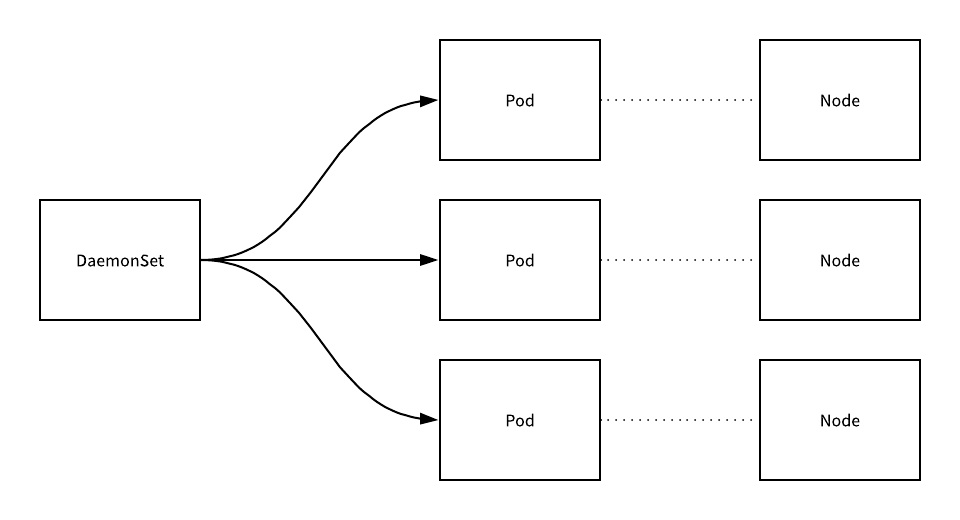

# 详解 Kubernetes DaemonSet 的实现原理

来源：[详解 Kubernetes DaemonSet 的实现原理](https://draveness.me/kubernetes-daemonset/)

[Deployment](https://draveness.me/kubernetes-deployment) 是 Kubernetes 中用于处理无状态服务的资源，而 [StatefulSet](https://draveness.me/kubernetes-statefulset) 是用于支持有状态服务的资源，这两种不同的资源从状态的角度对服务进行了划分，而 DaemonSet 从不同的维度解决了集群中的问题 — 如何**同时在集群中的所有节点上提供基础服务和守护进程**。

我们在这里将介绍 DaemonSet 如何进行状态的同步、Pod 与节点（Node）之间的调度方式和滚动更新的过程以及实现原理。

## 一、概述

DaemonSet 可以保证集群中所有的或者部分的节点都能够运行同一份 Pod 副本，每当有新的节点被加入到集群时，Pod 就会在目标的节点上启动，如果节点被从集群中剔除，节点上的 Pod 也会被垃圾收集器清除；DaemonSet 的作用就像是计算机中的守护进程，它能够运行集群存储、日志收集和监控等『守护进程』，这些服务一般是集群中必备的基础服务。

Google Cloud 的 Kubernetes 集群就会在所有的节点上启动 fluentd 和 Prometheus 来收集节点上的日志和监控数据，想要创建用于日志收集的守护进程其实非常简单，我们可以使用如下所示的代码：

```yaml
apiVersion: apps/v1
kind: DaemonSet
metadata:
  name: fluentd-elasticsearch
  namespace: kube-system
spec:
  selector:
    matchLabels:
      name: fluentd-elasticsearch
  template:
    metadata:
      labels:
        name: fluentd-elasticsearch
    spec:
      containers:
      - name: fluentd-elasticsearch
        image: k8s.gcr.io/fluentd-elasticsearch:1.20
        volumeMounts:
        - name: varlog
          mountPath: /var/log
        - name: varlibdockercontainers
          mountPath: /var/lib/docker/containers
          readOnly: true
      volumes:
      - name: varlog
        hostPath:
          path: /var/log
      - name: varlibdockercontainers
        hostPath:
          path: /var/lib/docker/containers
```

当我们使用 `kubectl apply -f` 创建上述的 DaemonSet 时，它会在 Kubernetes 集群的 `kube-system` 命名空间中创建 DaemonSet 资源并在所有的节点上创建新的 Pod：

```shell
$ kubectl get daemonsets.apps fluentd-elasticsearch --namespace kube-system
NAME                    DESIRED   CURRENT   READY   UP-TO-DATE   AVAILABLE   NODE SELECTOR   AGE
fluentd-elasticsearch   1         1         1       1            1           <none>          19h

$ kubectl get pods --namespace kube-system --label name=fluentd-elasticsearch
NAME                          READY   STATUS    RESTARTS   AGE
fluentd-elasticsearch-kvtwj   1/1     Running   0          19h
```

由于集群中只存在一个 Pod，所以 Kubernetes 只会在该节点上创建一个 Pod，如果我们向当前的集群中增加新的节点时，Kubernetes 就会创建在新节点上创建新的副本，总的来说，我们能够得到以下的拓扑结构：



集群中的 Pod 和 Node 一一对应，而 DaemonSet 会管理全部机器上的 Pod 副本，负责对它们进行更新和删除。

## 二、实现原理

所有的 DaemonSet 都是由控制器负责管理的，与其他的资源一样，用于管理 DaemonSet 的控制器是 `DaemonSetsController`，该控制器会监听 DaemonSet、ControllerRevision、Pod 和 Node 资源的变动。


大多数的触发事件最终都会将一个待处理的 DaemonSet 资源入栈，下游 `DaemonSetsController` 持有的多个工作协程就会从队列里面取出资源进行消费和同步。

### 1、同步

`DaemonSetsController` 同步 DaemonSet 资源使用的方法就是 `syncDaemonSet`，这个方法从队列中拿到 DaemonSet 的名字时，会先从集群中获取最新的 DaemonSet 对象并通过 `constructHistory` 方法查找当前 DaemonSet 全部的历史版本：

```go
func (dsc *DaemonSetsController) syncDaemonSet(key string) error {
	namespace, name, _ := cache.SplitMetaNamespaceKey(key)
	ds, _ := dsc.dsLister.DaemonSets(namespace).Get(name)
	dsKey, _ := controller.KeyFunc(ds)

	cur, old, _ := dsc.constructHistory(ds)
	hash := cur.Labels[apps.DefaultDaemonSetUniqueLabelKey]

	dsc.manage(ds, hash)

	switch ds.Spec.UpdateStrategy.Type {
	case apps.OnDeleteDaemonSetStrategyType:
	case apps.RollingUpdateDaemonSetStrategyType:
		dsc.rollingUpdate(ds, hash)
	}

	dsc.cleanupHistory(ds, old)

	return dsc.updateDaemonSetStatus(ds, hash, true)
}
```

然后调用的 `manage` 方法会负责管理 DaemonSet 在节点上 Pod 的调度和运行，`rollingUpdate` 会负责 DaemonSet 的滚动更新；前者会先找出找出需要运行 Pod 和不需要运行 Pod 的节点，并调用 `syncNodes` 对这些需要创建和删除的 Pod 进行同步：

```go
func (dsc *DaemonSetsController) syncNodes(ds *apps.DaemonSet, podsToDelete, nodesNeedingDaemonPods []string, hash string) error {
	dsKey, _ := controller.KeyFunc(ds)
	generation, err := util.GetTemplateGeneration(ds)
	template := util.CreatePodTemplate(ds.Spec.Template, generation, hash)

	createDiff := len(nodesNeedingDaemonPods)
	createWait := sync.WaitGroup{}
	createWait.Add(createDiff)
	for i := 0; i < createDiff; i++ {
		go func(ix int) {
			defer createWait.Done()

			podTemplate := template.DeepCopy()
			if utilfeature.DefaultFeatureGate.Enabled(features.ScheduleDaemonSetPods) {
				podTemplate.Spec.Affinity = util.ReplaceDaemonSetPodNodeNameNodeAffinity(podTemplate.Spec.Affinity, nodesNeedingDaemonPods[ix])
				dsc.podControl.CreatePodsWithControllerRef(ds.Namespace, podTemplate, ds, metav1.NewControllerRef(ds, controllerKind))
			} else {
				podTemplate.Spec.SchedulerName = "kubernetes.io/daemonset-controller"
				dsc.podControl.CreatePodsOnNode(nodesNeedingDaemonPods[ix], ds.Namespace, podTemplate, ds, metav1.NewControllerRef(ds, controllerKind))
			}

		}(i)
	}
	createWait.Wait()
```

获取了 DaemonSet 中的模板之之后，就会开始并行地为节点创建 Pod 副本，并发创建的过程使用了 for 循环、Goroutine 和 `WaitGroup` 保证程序运行的正确，然而这里使用了特性开关来对调度新 Pod 的方式进行了控制，我们会在接下来的调度一节介绍 DaemonSet 调度方式的变迁和具体的执行过程。

当 Kubernetes 创建了需要创建的 Pod 之后，就需要删除所有节点上不必要的 Pod 了，这里使用同样地方式并发地对 Pod 进行删除：

```go
	deleteDiff := len(podsToDelete)
	deleteWait := sync.WaitGroup{}
	deleteWait.Add(deleteDiff)
	for i := 0; i < deleteDiff; i++ {
		go func(ix int) {
			defer deleteWait.Done()
			dsc.podControl.DeletePod(ds.Namespace, podsToDelete[ix], ds)
		}(i)
	}
	deleteWait.Wait()

	return nil
}
```

到了这里我们就完成了节点上 Pod 的调度和运行，为一些节点创建 Pod 副本的同时删除另一部分节点上的副本，`manage` 方法执行完成之后就会调用 `rollingUpdate` 方法对 DaemonSet 的节点进行滚动更新并对控制器版本进行清理并更新 DaemonSet 的状态，文章后面的部分会介绍滚动更新的过程和实现。

### 2、调度

在早期的 Kubernetes 版本中，所有 DaemonSet Pod 的创建都是由 `DaemonSetsController` 负责的，而其他的资源都是由 kube-scheduler 进行调度，这就导致了如下的一些问题：

1. `DaemonSetsController` 没有办法在节点资源变更时收到通知 ([#46935](https://github.com/kubernetes/kubernetes/issues/46935), [#58868](https://github.com/kubernetes/kubernetes/issues/58868))；
2. `DaemonSetsController` 没有办法遵循 Pod 的亲和性和反亲和性设置 ([#29276](https://github.com/kubernetes/kubernetes/issues/29276))；
3. `DaemonSetsController` 可能需要二次实现 Pod 调度的重要逻辑，造成了重复的代码逻辑 ([#42028](https://github.com/kubernetes/kubernetes/issues/42028))；
4. 多个组件负责调度会导致 Debug 和抢占等功能的实现非常困难；

设计文档 [Schedule DaemonSet Pods by default scheduler, not DaemonSet controller](https://github.com/kubernetes/community/blob/master/contributors/design-proposals/scheduling/schedule-DS-pod-by-scheduler.md) 中包含了使用 `DaemonSetsController` 调度时遇到的问题以及新设计给出的解决方案。

如果我们选择使用过去的调度方式，`DeamonSetsController` 就会负责在节点上创建 Pod，通过这种方式创建的 Pod 的 `schedulerName` 都会被设置成 `kubernetes.io/daemonset-controller`，但是在默认情况下这个字段一般为 `default-scheduler`，也就是使用 Kubernetes 默认的调度器 kube-scheduler 进行调度：

```go
func (dsc *DaemonSetsController) syncNodes(ds *apps.DaemonSet, podsToDelete, nodesNeedingDaemonPods []string, hash string) error {
    // ...
	for i := 0; i < createDiff; i++ {
		go func(ix int) {
			podTemplate := template.DeepCopy()
			if utilfeature.DefaultFeatureGate.Enabled(features.ScheduleDaemonSetPods) {
                // ...
			} else {
				podTemplate.Spec.SchedulerName = "kubernetes.io/daemonset-controller"
				dsc.podControl.CreatePodsOnNode(nodesNeedingDaemonPods[ix], ds.Namespace, podTemplate, ds, metav1.NewControllerRef(ds, controllerKind))
			}

		}(i)
	}
    
    // ...
}
```

`DaemonSetsController` 在调度 Pod 时都会使用 `CreatePodsOnNode` 方法，这个方法的实现非常简单，它会先对 Pod 模板进行验证，随后调用 `createPods`方法通过 Kubernetes 提供的 API 创建新的副本：

```go
func (r RealPodControl) CreatePodsWithControllerRef(namespace string, template *v1.PodTemplateSpec, controllerObject runtime.Object, controllerRef *metav1.OwnerReference) error {
	if err := validateControllerRef(controllerRef); err != nil {
		return err
	}
	return r.createPods("", namespace, template, controllerObject, controllerRef)
}
```

`DaemonSetsController` 通过节点选择器和调度器的谓词对节点进行过滤，`createPods` 会直接为当前的 Pod 设置 `spec.NodeName` 属性，最后得到的 Pod 就会被目标节点上的 kubelet 创建。

除了这种使用 `DaemonSetsController` 管理和调度 DaemonSet 的方法之外，我们还可以使用 Kubernetes 默认的方式 kube-scheduler 创建新的 Pod 副本：

```go
func (dsc *DaemonSetsController) syncNodes(ds *apps.DaemonSet, podsToDelete, nodesNeedingDaemonPods []string, hash string) error {
    // ...
	for i := 0; i < createDiff; i++ {
		go func(ix int) {
			podTemplate := template.DeepCopy()
			if utilfeature.DefaultFeatureGate.Enabled(features.ScheduleDaemonSetPods) {
				podTemplate.Spec.Affinity = util.ReplaceDaemonSetPodNodeNameNodeAffinity(podTemplate.Spec.Affinity, nodesNeedingDaemonPods[ix])
				dsc.podControl.CreatePodsWithControllerRef(ds.Namespace, podTemplate, ds, metav1.NewControllerRef(ds, controllerKind))
			} else {
                // ...
			}

		}(i)
	}
    
    // ...
}
```

这种情况会使用 NodeAffinity 特性来避免发生在 `DaemonSetsController` 中的调度：

1. `DaemonSetsController` 会在 `podsShouldBeOnNode` 方法中根据节点选择器过滤所有的节点；
2. 对于每一个节点，控制器都会创建一个遵循以下节点亲和的 Pod；

```yaml
nodeAffinity:
  requiredDuringSchedulingIgnoredDuringExecution:
  - nodeSelectorTerms:
      matchExpressions:
      - key: kubernetes.io/hostname
        operator: in
        values:
        - dest_hostname
```

3. 当节点进行同步时，DaemonSetsController 会根据节点亲和的设置来验证节点和 Pod 的关系；
4. 如果调度的谓词失败了，DaemonSet 持有的 Pod 就会保持在 Pending 的状态，所以可以通过修改 Pod 的优先级和抢占保证集群在高负载下也能正常运行 DaemonSet 的副本；

Pod 的优先级和抢占功能在 Kubernetes 1.8 版本引入，1.11 时转变成 beta 版本，在目前最新的 1.13 中依然是 beta 版本，感兴趣的读者可以阅读 [Pod Priority and Preemption](https://kubernetes.io/docs/concepts/configuration/pod-priority-preemption/) 文档了解相关的内容。

### 3、滚动更新

`DaemonSetsController` 对滚动更新的实现其实比较简单，它其实就是根据 DaemonSet 规格中的配置，删除集群中的 Pod 并保证同时不可用的副本数不会超过 `spec.updateStrategy.rollingUpdate.maxUnavailable`，这个参数也是 DaemonSet 滚动更新可以配置的唯一参数：

```go
func (dsc *DaemonSetsController) rollingUpdate(ds *apps.DaemonSet, hash string) error {
	nodeToDaemonPods, err := dsc.getNodesToDaemonPods(ds)

	_, oldPods := dsc.getAllDaemonSetPods(ds, nodeToDaemonPods, hash)
	maxUnavailable, numUnavailable, err := dsc.getUnavailableNumbers(ds, nodeToDaemonPods)
	oldAvailablePods, oldUnavailablePods := util.SplitByAvailablePods(ds.Spec.MinReadySeconds, oldPods)

	var oldPodsToDelete []string
	for _, pod := range oldUnavailablePods {
		if pod.DeletionTimestamp != nil {
			continue
		}
		oldPodsToDelete = append(oldPodsToDelete, pod.Name)
	}

	for _, pod := range oldAvailablePods {
		if numUnavailable >= maxUnavailable {
			break
		}
		oldPodsToDelete = append(oldPodsToDelete, pod.Name)
		numUnavailable++
	}
	return dsc.syncNodes(ds, oldPodsToDelete, []string{}, hash)
}
```

删除 Pod 的顺序其实也非常简单并且符合直觉，上述代码会将不可用的 Pod 先加入到待删除的数组中，随后将历史版本的可用 Pod 加入待删除数组 `oldPodsToDelete`，最后调用 `syncNodes` 完成对副本的删除。

### 4、删除

与 [Deployment](https://draveness.me/kubernetes-deployment)、[ReplicaSet](https://draveness.me/kubernetes-replicaset) 和 [StatefulSet](https://draveness.me/kubernetes-statefulset) 一样，DaemonSet 的删除也会导致它持有的 Pod 的删除，如果我们使用如下的命令删除该对象，我们能观察到如下的现象：

```bash
$ kubectl delete daemonsets.apps fluentd-elasticsearch --namespace kube-system
daemonset.apps "fluentd-elasticsearch" deleted

$ kubectl get pods --watch --namespace kube-system
fluentd-elasticsearch-wvffx   1/1   Terminating   0     14s
```

这部分的工作就都是由 Kubernetes 中的垃圾收集器完成的，读者可以阅读 [垃圾收集器](https://draveness.me/kubernetes-garbage-collector) 一文了解集群中的不同对象是如何进行关联的以及在删除单一对象时如何触发级联删除的原理。

## 总结

DaemonSet 其实就是 Kubernetes 中的守护进程，它会在每一个节点上创建能够提供服务的副本，很多云服务商都会使用 DaemonSet 在所有的节点上内置一些用于提供日志收集、统计分析和安全策略的服务。

在研究 DaemonSet 的调度策略的过程中，我们其实能够通过一些历史的 issue 和 PR 了解到 DaemonSet 调度策略改动的原因，也能让我们对于 Kubernetes 的演进过程和设计决策有一个比较清楚的认识。

## Referenece

- [DaemonSet · Kubernetes](https://kubernetes.io/docs/concepts/workloads/controllers/daemonset/)
- [Perform a Rolling Update on a DaemonSet](https://kubernetes.io/docs/tasks/manage-daemon/update-daemon-set/)
- [Perform a Rollback on a DaemonSet](https://kubernetes.io/docs/tasks/manage-daemon/rollback-daemon-set/)
- [Schedule DaemonSet Pods by default scheduler, not DaemonSet controller](https://github.com/kubernetes/community/blob/master/contributors/design-proposals/scheduling/schedule-DS-pod-by-scheduler.md)
- [DaemonsetController can’t feel it when node has more resources, e.g. other Pod exits](https://github.com/kubernetes/kubernetes/issues/46935)
- [DaemonsetController can’t feel it when node recovered from outofdisk state](https://github.com/kubernetes/kubernetes/issues/45628)
- [DaemonSet pods should be scheduled by default scheduler, not DaemonSet controller](https://github.com/kubernetes/kubernetes/issues/42002)
- [NodeController should add NoSchedule taints and we should get rid of getNodeConditionPredicate()](https://github.com/kubernetes/kubernetes/issues/42001)
- [DaemonSet should respect Pod Affinity and Pod AntiAffinity](https://github.com/kubernetes/kubernetes/issues/29276)
- [Make DaemonSet respect critical pods annotation when scheduling](https://github.com/kubernetes/kubernetes/pull/42028)